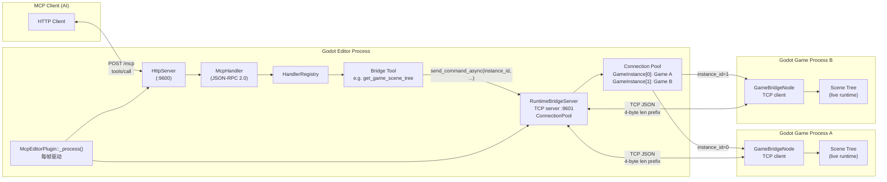
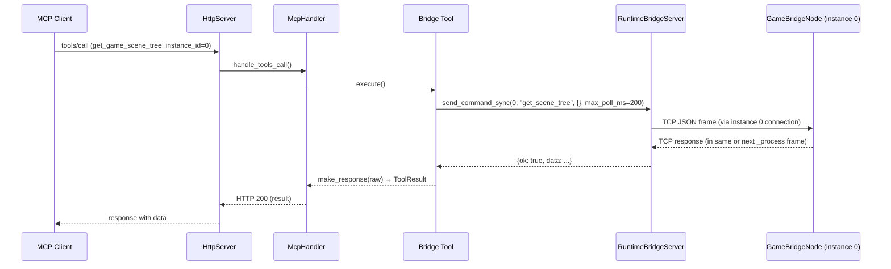
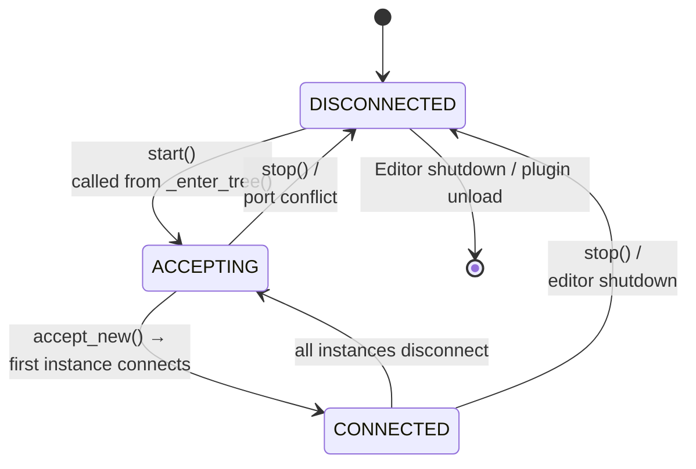
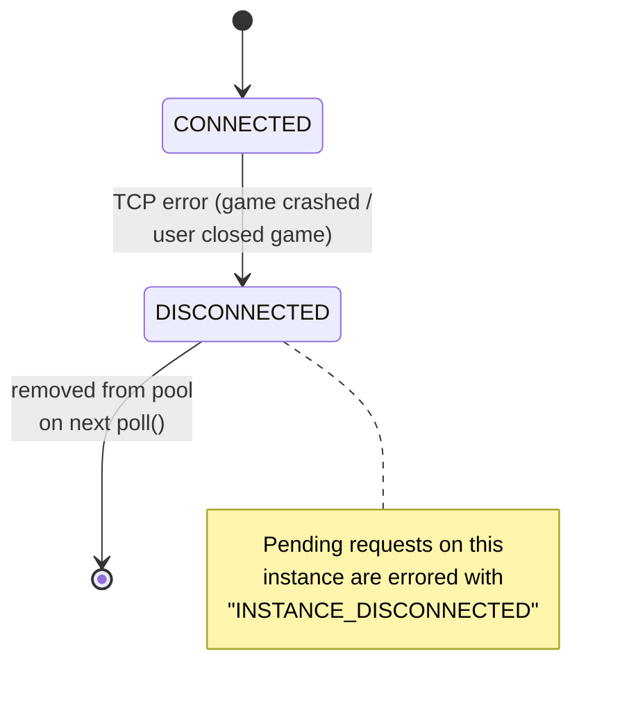

# 运行时通信

> **⚠️** 本文档已更新。`RuntimeBridgeServer`（异步 TCP 服务器，多实例）已完全实现。

> GodotMCP 如何在编辑器进程与运行中的游戏实例之间建立桥接，使 AI 客户端能够实时查询和控制运行中的游戏场景。

## 问题

Godot 运行两类进程。**编辑器**承载了带有 MCP HTTP 服务器的 GDExtension 插件（`McpEditorPlugin`）。当用户按下 F5 时，Godot 会生成一个或多个**游戏进程**——运行项目场景的独立操作系统进程。

这些进程之间没有共享内存、全局状态或内置 RPC 机制。游戏进程拥有实际的运行时状态（变换、物理、脚本），但 MCP 客户端只与编辑器通信。任何需要游戏状态数据的工具调用——如读取节点位置、调用脚本方法、截取屏幕截图——都必须跨越这个进程边界。

## 当前状态（已实现）

| 方面 | 当前实现 |
|--------|----------------------|
| **方向** | 编辑器 = TCP 服务器（`RuntimeBridgeServer`），游戏 = TCP 客户端（`GameBridgeNode`） |
| **多实例** | 多游戏实例，按 `instance_id` 自动路由 |
| **阻塞** | `send_command_sync()`，每帧 ≤200ms 预算，无忙等待 |
| **响应** | 通过 `_process()` 轮询，通过 `enqueue_event()` 发送 SSE |
| **并发请求** | 每实例多个并发，全局挂起映射表 |
| **编辑器冻结** | 无丢帧——所有 I/O 均为非阻塞 |

## 架构

### 为什么方向是反转的？

编辑器作为 **TCP 服务器**（`RuntimeBridgeServer`），游戏作为 **TCP 客户端**（`GameBridgeNode`）。这与原始设计（编辑器=客户端，游戏=服务器）相反，目的是支持**多玩家测试**：当你启动多个游戏实例时，每个游戏会自动连接到编辑器上的单个端口。这消除了端口冲突并实现了真正的多实例支持。

### 架构图

编辑器端运行一个 **TCP 服务器**（`RuntimeBridgeServer`）；每个游戏实例运行一个 **TCP 客户端**（`GameBridgeNode`）。通信仅在 localhost 上进行，端口 9601，使用带帧头的 JSON 消息。



## 连接池：RuntimeBridgeServer

`RuntimeBridgeServer` 封装了一个 `TcpServer`（Godot 的服务端 TCP 类），并维护一个已连接游戏的连接池：

| 组件 | 角色 |
|-----------|------|
| `TcpServer` | 监听 `127.0.0.1:9601`，每 `_process()` 帧接受新连接 |
| `GameInstance` | 每连接的私有数据结构：`StreamPeerTCP`、`instance_id`（自动递增）、挂起请求映射表、读取缓冲区 |
| `ConnectionPool` | 拥有所有 `GameInstance` 条目；提供 `get(instance_id)`、`broadcast(cmd)`、`remove(instance_id)` |
| `pending_` 映射表 | 全局 `HashMap<int64_t, PendingRequest>`——不按实例区分 |

`_process()` 帧驱动一切：

```
_process(delta):
  ├─ http_server_.poll()
  ├─ pending dialog check
  ├─ confirm timeout check
  └─ bridge_server_.poll()  # 接受新连接 + 轮询所有实例
```

### GameInstance 数据结构

```cpp
struct GameInstance {
    int id;                         // instance_id，接受连接时自动递增
    Ref<StreamPeerTCP> connection;  // TCP 套接字

    enum ReadState { READ_HEADER, READ_BODY };
    ReadState read_state_ = READ_HEADER;
    int64_t msg_length_ = 0;
    int64_t body_received_ = 0;
    PackedByteArray read_buf_;
    int64_t read_offset_ = 0;
};
```

每个 `GameInstance` 在首次 TCP 接受连接时被分配一个唯一的 `instance_id`（单调递增的 `int64_t`）。该 ID 是所有桥接工具调用的路由键。

## 线路协议

**未更改。** 消息使用 **4 字节大端长度前缀**，后跟 UTF-8 JSON 主体。这是一个简单的、自定帧的协议，能够正确处理 TCP 分段边界——接收方始终知道何时收到完整消息。

```
[4 字节：大端 uint32 body_length]
[body_length 字节：UTF-8 JSON]
```

- 长度范围：1 至 65,536 字节
- 缓冲区安全上限：每实例 1 MB（超出将重置读取器）
- 大端序，与主机字节序无关（可移植）

### 请求（编辑器 → 游戏）

```json
{"cmd":"get_scene_tree","params":{"max_depth":5},"id":42}
```

### 响应（游戏 → 编辑器）

```json
{"ok":true,"data":{"name":"root","type":"Node","children":[...]},"id":42}
```

`id` 字段将请求与响应配对，允许每实例有多个并发命令。

## 异步帧驱动轮询

重构采用**帧驱动**模型，所有 TCP I/O 都在 `_process()` 时间片中完成，零等待：



**关键机制**：桥接工具使用 `send_command_sync()` 进行同步发送+短时轮询（默认 200ms 预算）。在 `_process()` 帧驱动下，TCP 响应通常在同一帧或下一帧到达。超时未收到响应时返回空 Dictionary，由客户端自行重试。

## 帧驱动轮询

整个桥接由 `McpEditorPlugin::_process()` 驱动，该方法在每个编辑器帧运行（60 FPS 时约 16ms）。`RuntimeBridgeServer::poll()` 在内部处理一切：

```
_process(delta):
  ├─ http_server_.poll()              # 处理 MCP HTTP 请求
  ├─ pending dialog check
  ├─ confirm timeout check
  └─ bridge_server_.poll()            # 接受新连接 + 轮询所有实例
```

`RuntimeBridgeServer::poll()` 内部：

```
poll():
  ├─ accept_new_connections()         # TcpServer 接受循环
  ├─ for each GameInstance instance:
  │    ├─ connection->poll()          # Godot TCP 事件泵
  │    ├─ accumulate_read_data()       # 非阻塞读取
  │    └─ process_complete_messages()  # 解析帧，匹配 ID
  ├─ process_timeouts(now)            # 清理过期挂起请求
  └─ check_watcher()                  # BridgeWatcher 用于 wait_for_bridge
```

这种模式**在构造上就是零阻塞的**：没有 `OS::delay_msec()`、没有忙等待、没有丢帧。

## 多实例路由

每个针对游戏实例的桥接工具现在都接受一个 `instance_id` 参数：

| 工具 | instance_id | 行为 |
|------|-------------|----------|
| `get_game_scene_tree` | 必需 | 转储指定实例的场景树 |
| `get_game_node_property` | 必需 | 读取指定实例的属性 |
| `set_game_node_property` | 必需 | 写入指定实例的属性 |
| `call_method_in_game` | 必需 | 在指定实例上调用方法 |
| `capture_game_screenshot` | 必需 | 截取指定实例的视口截图 |
| `simulate_game_input` | 必需 | 向指定实例注入输入 |
| `pause_project` | 否（使用旧 RuntimeBridge） | 暂停/恢复游戏进程（经桥接通信） |

### 新元工具：list_game_instances

返回所有当前已连接的游戏实例：

```json
// 请求
{"jsonrpc":"2.0","method":"tools/call","params":{"name":"list_game_instances"}}

// 响应
{
  "jsonrpc": "2.0",
  "result": {
    "instances": [
      {"id": 1, "connected_at": 1234567, "uptime_msec": 1234},
      {"id": 2, "connected_at": 1234590, "uptime_msec": 567}
    ]
  }
}
```

返回实例的 `id`、`connected_at`（连接时间戳）和 `uptime_msec`（毫秒在线时长）。无 `name`/`address`/`identify` 握手。

### 实例 ID 路由模式

在 `RuntimeBridgeServer` 内部，`send_command_async(instance_id, cmd, params)` 在连接池中查找该实例，并将带帧头的 JSON 写入该实例的套接字。如果未找到该 instance_id，工具立即返回 `"INSTANCE_NOT_FOUND"` 错误（不延迟到 SSE）。

```cpp
// 伪代码
ToolResult execute_impl(ToolContext &ctx) override {
    auto instance_id = ctx.args["instance_id"].operator int64_t();
    auto pending_id = ctx.new_pending_id();
    auto err = ctx.runtime_bridge->send_command_async(
        instance_id, "get_scene_tree", params, pending_id
    );
    if (err != OK) {
        return ToolResult::err("INSTANCE_NOT_FOUND", 
            "No game instance with id " + String::num_int64(instance_id));
    }
    return ToolResult::pending(pending_id, instance_id);
}
```

## 运行时命令

`GameBridgeNode` 处理 7 个命令，每个映射到一个 MCP 桥接工具。**命令未更改**——无论连接方向如何，游戏端代码都相同：

| 命令 | 工具 | 功能 |
|---------|------|----------|
| `get_scene_tree` | `get_game_scene_tree` | 递归场景树转储（可配置 `max_depth`） |
| `get_property` | `get_game_node_property` | 按路径读取单个节点属性 |
| `set_property` | `set_game_node_property` | 写入节点属性（破坏性操作） |
| `call_method` | `call_method_in_game` | 在任意节点上调用任意方法并传递参数 |
| `screenshot` | `capture_game_screenshot` | 截取视口 → PNG/JPEG → base64 |
| `simulate_input` | `simulate_game_input` | 注入键盘/鼠标/动作/按钮事件 |
| `set_pause` | `pause_project` | 暂停/恢复游戏 |

另有两个元工具：

| 工具 | 功能 |
|------|----------|
| `wait_for_bridge` | 非阻塞轮询，等待至少一个桥接实例达到 `CONNECTED` 状态 |
| `list_game_instances` | 返回所有已连接的游戏实例及其 ID |

## 桥接生命周期

`RuntimeBridgeServer` 有自己的状态机，与各个游戏实例解耦：



服务器在 `_enter_tree()` 中启动一次（不在帧驱动轮询中启动），在 `_exit_tree()` 中停止。当游戏进程启动且其 `GameBridgeNode` 连接到 `127.0.0.1:9601` 时，连接被接受。`_process()` 中的 `bridge_server_.poll()` 调用负责接受新连接并轮询所有已连接实例。

### 连接断开

单个实例可以在服务器保持运行的情况下断开连接：



## WaitForBridge 模式

`wait_for_bridge` 工具是必需的，因为在启动游戏（`run_project` / `run_current_scene`）与桥接的 TCP 连接到达连接池之间存在一个**竞态窗口**。

该实现使用**帧驱动的观察器**——`RuntimeBridgeServer` 内部的一个轻量级结构体，每帧检查是否有任何已连接实例：

```
WaitForBridgeTool::execute_impl():
  ├─ Any instance connected? → return {connected: true, instances: [...]}
  ├─ Start watcher: bridge->start_watcher(handler, jsonrpc_id, timeout)
  └─ Return empty → defer to SSE

RuntimeBridgeServer::poll() [watcher check]:
  ├─ pool_.size() > 0?
  │   → enqueue_event({"result": {"message": "Bridge connected",
  │                                  "instances": [{"instance_id": 0}]}})
  ├─ deadline exceeded?
  │   → enqueue_event({"error": {"code": "TIMEOUT", ...}})
  └─ (still waiting)
```

客户端在 `run_project` 之后调用 `wait_for_bridge`，收到一个即时空响应，然后等待至少一个游戏实例已连接的 SSE 通知。

## 安全考量

| 关注点 | 缓解措施 |
|---------|-----------|
| **端口暴露** | 桥接仅在 `127.0.0.1:9601` 上监听——无外部网络访问 |
| **无认证** | 桥接协议无认证；仅限 localhost 缓解此风险 |
| **命令注入** | JSON 被严格解析；`GameBridgeNode` 拒绝未知命令 |
| **任意方法调用** | `call_method` 可以调用任意 `Node` 方法——相当于 GDScript 中的 `$"NodePath".method()`。用户已通过运行此扩展表示同意 |
| **游戏崩溃** | TCP 断开连接在每实例 1-2 帧内被检测到；挂起的请求以 `INSTANCE_DISCONNECTED` 错误返回 |
| **拒绝服务** | 每实例 1 MB 缓冲区限制；超长消息重置读取器 |
| **实例伪造** | 每实例无认证；所有 localhost 进程均受信任 |
| **悬空连接** | 编辑器关闭时调用 `stop_server()`；操作系统在进程退出时关闭孤儿 TCP 套接字 |

运行时桥接**不是一个安全边界**。它是 AI 客户端到达游戏进程的一个便捷通道。任何拥有 localhost 访问权限（`:9601`）的人都可以发送命令，但这种访问权限已由编辑器端的 MCP 服务器（`:9600`）隐含赋予。

## 总结

| 概念 | 实现 |
|---------|---------------|
| **方向** | 编辑器（服务器）`RuntimeBridgeServer` ← 游戏（客户端）`GameBridgeNode` |
| **多实例** | 多游戏实例，按 `instance_id` 自动路由 |
| **端口管理** | 编辑器在固定端口 9601 上监听 |
| **阻塞** | 零阻塞——所有 I/O 在 `_process()` 中完成 |
| **响应投递** | 通过 `enqueue_event()` 发送 SSE |
| **并发请求** | 每实例多个并发 |
| **超时处理** | 按实例的帧驱动 `process_timeouts()` |
| **WaitForBridge** | 检查连接池大小的帧驱动观察器 |
| **GameBridgeNode** | TCP 客户端，线路协议未更改 |
| **实例发现** | 通过 `list_game_instances` 元工具显式发现 |
| **编辑器冻结** | 无丢帧 |

异步重构仅更改**编辑器端**（`RuntimeBridge` → `RuntimeBridgeServer`）和**处理器集成**（`McpHandler` / 桥接工具）。游戏端的 `GameBridgeNode` 从 TCP 服务器翻转为 TCP 客户端，但线路格式和命令集保持不变，除了连接方向更改外，保证了与现有游戏构建的向后兼容性。
