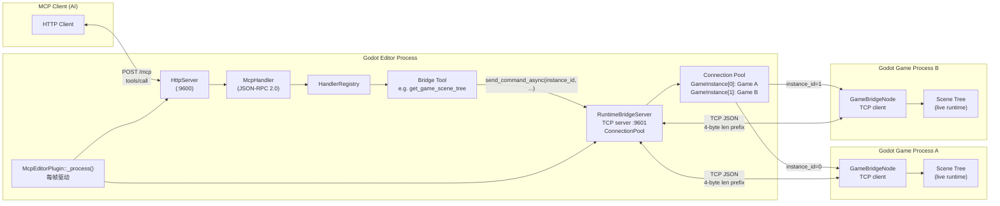
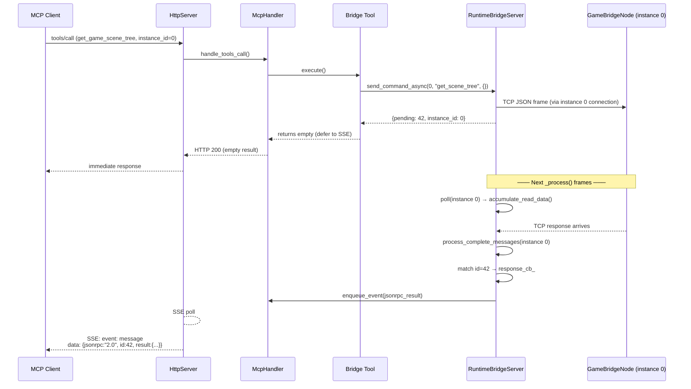
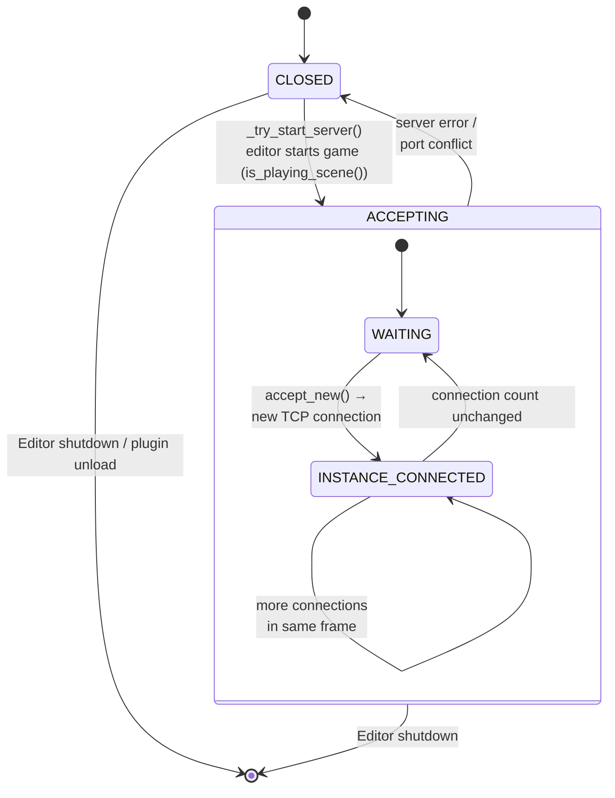
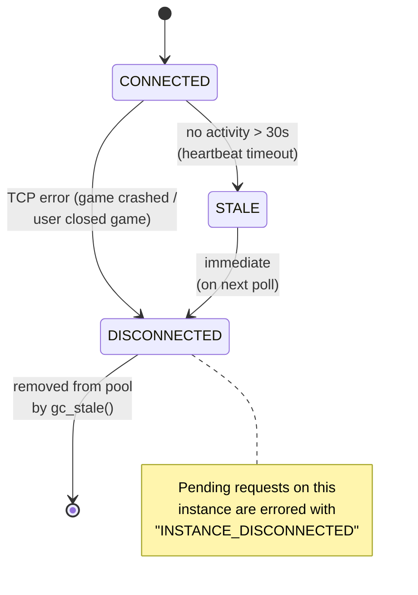

# Runtime Communication

> How GodotMCP bridges the editor process and running game instances, enabling AI clients to query and control live game scenes in real time — now with **multi-instance support**.

## The Problem

Godot runs two kinds of processes. The **editor** hosts the GDExtension plugin (`McpEditorPlugin`) with the MCP HTTP server. When the user presses F5, Godot spawns one or more **game processes** — separate OS processes running the project's scenes.

These processes share no memory, no global state, and no built-in RPC mechanism. The game process has the actual runtime state (transforms, physics, scripts), but the MCP client only talks to the editor. Any tool invocation that needs game-state data — reading a node's position, calling a script method, taking a screenshot — must cross this process boundary.

### Why Flip the Direction?

The original design had the editor as a **TCP client** connecting to the game's **TCP server**. This broke down for **multiplayer testing**: when you launch multiple game instances (remote debug, dedicated server + clients), each game needs its own port, requiring port discovery. Worse, the editor actively polls for the game's presence, creating tight coupling.

The flipped design has the **editor as a TCP server**, games as **TCP clients**. Games connect autonomously, the editor just listens. This eliminates port conflicts and enables true multi-instance support.

## Architecture

The editor side runs a **TCP server** (`RuntimeBridgeServer`); each game instance runs a **TCP client** (`GameBridgeNode`). Communication is localhost-only, port 9601, using framed JSON messages.



## Connection Pool: RuntimeBridgeServer

`RuntimeBridgeServer` wraps a `TcpServer` (Godot's server-side TCP class) and maintains a pool of connected games:

| Component | Role |
|-----------|------|
| `TcpServer` | Listens on `127.0.0.1:9601`, accepts new connections every `_process()` frame |
| `GameInstance` | Per-connection struct: `StreamPeerTCP`, `instance_id` (auto-increment), pending request map, read buffer |
| `ConnectionPool` | Owns all `GameInstance` entries; provides `get(instance_id)`, `broadcast(cmd)`, `remove(instance_id)` |
| `pending_` map | Scoped per-instance: maps request IDs → response callbacks |

The `_process()` frame iterates all instances, calling `poll()` on each:

```
_process(delta):
  ├─ http_server_.poll()
  ├─ runtime_bridge_.accept_new()    # TcpServer.is_connection_available() → create GameInstance
  └─ runtime_bridge_.poll_all()      # For each GameInstance: poll, read, parse, fire callbacks
```

### GameInstance Struct

```cpp
struct GameInstance {
    int64_t instance_id;            // Auto-incremented on accept
    String instance_name;           // From "identify" handshake (optional)
    Ref<StreamPeerTCP> connection;  // The TCP socket
    Vector<uint8_t> read_buf;      // Accumulated raw bytes
    HashMap<int64_t, ResponseCallback> pending; // In-flight requests
    double last_activity;          // For heartbeat / timeout
    InstanceStatus status;         // CONNECTED, STALE, DISCONNECTED
};
```

Each `GameInstance` gets a unique `instance_id` (monotonically increasing `int64_t`), assigned on first TCP accept. This ID is the routing key for all bridge tool calls.

## Wire Protocol

**Unchanged.** Messages use a **4-byte big-endian length prefix** followed by a UTF-8 JSON body. This is a simple, self-framing protocol that handles TCP segment boundaries correctly — the receiver can always know when a complete message has arrived.

```
[4 bytes: big-endian uint32 body_length]
[body_length bytes: UTF-8 JSON]
```

- Length range: 1 to 65,536 bytes
- Buffer safety limit: 1 MB per instance (overflow resets the reader)
- Big-endian regardless of host byte order (portable)

### Request (Editor → Game)

```json
{"cmd":"get_scene_tree","params":{"max_depth":5},"id":42}
```

### Response (Game → Editor)

```json
{"ok":true,"data":{"name":"root","type":"Node","children":[...]},"id":42}
```

The `id` field pairs requests with responses, allowing multiple in-flight commands per instance.

## Async Frame-Driven Polling

The refactor moves to a **frame-driven** model where all TCP I/O happens in `_process()` slices, zero-wait:



**Key mechanism**: the handler detects a `{pending: id, instance_id: N}` return from the tool and defers the JSON-RPC response. When `RuntimeBridgeServer::poll_instance()` eventually receives the matching TCP response on that instance, it fires a callback that enqueues a JSON-RPC result notification.

## Frame-Driven Polling

The entire bridge is driven by `McpEditorPlugin::_process()`, which runs every editor frame (~16ms at 60 FPS):

```
_process(delta):
  ├─ http_server_.poll()              # Handle MCP HTTP requests
  ├─ runtime_bridge_.accept_new()     # Accept new game connections
  ├─ runtime_bridge_.poll_all()       # Poll all connected instances
  └─ runtime_bridge_.gc_stale()       # Clean disconnected/expired instances
```

Within `RuntimeBridgeServer::poll_all()`:

```
poll_all():
  └─ for each GameInstance instance:
       ├─ instance.connection->poll()            # Godot TCP event pump
       ├─ accumulate_read_data()                 # Non-blocking read
       ├─ process_complete_messages(instance)    # Parse frames, match IDs
       └─ process_timeouts(instance)             # Clean stale pending
```

This pattern is **zero-blocking by construction**: no `OS::delay_msec()`, no busy-wait, no frame drops.

## Multi-Instance Routing

Every bridge tool that targets a game instance now accepts an `instance_id` parameter:

| Tool | instance_id | Behavior |
|------|-------------|----------|
| `get_game_scene_tree` | Required | Dumps tree of the specified instance |
| `get_game_node_property` | Required | Reads property from the specified instance |
| `set_game_node_property` | Required | Writes property on the specified instance |
| `call_method_in_game` | Required | Calls method on the specified instance |
| `capture_game_screenshot` | Required | Screenshots the specified instance's viewport |
| `simulate_game_input` | Required | Injects input into the specified instance |
| `pause_project` | Required | Pauses/unpauses specified instance |

### New Meta-Tool: list_game_instances

Returns all currently connected game instances:

```json
// Request
{"jsonrpc":"2.0","method":"tools/call","params":{"name":"list_game_instances"}}

// Response
{
  "jsonrpc": "2.0",
  "result": {
    "instances": [
      {"instance_id": 0, "name": "", "connected_since": 1234.56, "address": "127.0.0.1:54321"},
      {"instance_id": 1, "name": "DedicatedServer", "connected_since": 1235.01, "address": "127.0.0.1:54322"}
    ]
  }
}
```

The `name` field is populated by an optional `identify` handshake: the game sends `{"cmd":"identify","params":{"name":"DedicatedServer"},"id":0}` on connect. If not sent, the name is empty.

### Instance ID Routing Pattern

Inside `RuntimeBridgeServer`, `send_command_async(instance_id, cmd, params)` looks up the instance in the connection pool and writes the framed JSON to that instance's socket. If the instance_id is not found, the tool returns a `"INSTANCE_NOT_FOUND"` error immediately (no deferral to SSE).

```cpp
// Pseudocode
ToolResult execute_impl(ToolContext &ctx) override {
    auto instance_id = ctx.args["instance_id"].operator int64_t();
    auto pending_id = ctx.new_pending_id();
    auto err = ctx.runtime_bridge->send_command_async(
        instance_id, "get_scene_tree", params, pending_id
    );
    if (err != OK) {
        return ToolResult::err("INSTANCE_NOT_FOUND", 
            "No game instance with id " + String::num_int64(instance_id));
    }
    return ToolResult::pending(pending_id, instance_id);
}
```

## Runtime Commands

`GameBridgeNode` handles 7 commands, each mapping to an MCP bridge tool. **Commands are unchanged** — the game-side code is identical regardless of connection direction:

| Command | Tool | Function |
|---------|------|----------|
| `get_scene_tree` | `get_game_scene_tree` | Recursive scene tree dump (configurable `max_depth`) |
| `get_property` | `get_game_node_property` | Read a single node property by path |
| `set_property` | `set_game_node_property` | Write a node property (destructive) |
| `call_method` | `call_method_in_game` | Call any method on any node with arguments |
| `screenshot` | `capture_game_screenshot` | Capture viewport → PNG/JPEG → base64 |
| `simulate_input` | `simulate_game_input` | Inject key/mouse/action/button events |
| `set_pause` | `pause_project` | Pause/unpause the game |

Plus two meta-tools:

| Tool | Function |
|------|----------|
| `wait_for_bridge` | Non-blocking poll that waits for at least one bridge instance to reach `CONNECTED` state |
| `list_game_instances` | Returns all connected game instances with IDs |

## Bridge Lifecycle

The `RuntimeBridgeServer` has its own state machine, decoupled from individual game instances:



`_try_start_server()` in `McpEditorPlugin::_process()` runs every frame:

1. If the server is `CLOSED` but `is_playing_scene()` is true, call `runtime_bridge_.start_server()` which creates the `TcpServer` and moves to `ACCEPTING`
2. If the server is `ACCEPTING`, call `runtime_bridge_.accept_new()` to check for new connections
3. If `is_playing_scene()` transitions to false, call `runtime_bridge_.stop_server()` which drops all instances and closes the listener

When a game process starts, its `GameBridgeNode` (now a TCP client) connects to `127.0.0.1:9601`. The editor's `accept_new()` detects the new connection, creates a `GameInstance` with the next `instance_id`, and adds it to the pool.

### Connection Loss

Individual instances can disconnect while the server stays up:



`gc_stale()` runs once per second and removes all `DISCONNECTED` instances from the pool.

## The WaitForBridge Pattern

The `wait_for_bridge` tool is needed because there is a **race window** between starting a game (`run_project` / `run_current_scene`) and the bridge's TCP connection reaching the pool.

### Target (Async)

The new design uses a **frame-driven watcher** — a lightweight struct inside `RuntimeBridgeServer` that checks for any connected instance each frame:

```
WaitForBridgeTool::execute_impl():
  ├─ Any instance connected? → return {connected: true, instances: [...]}
  ├─ Start watcher: bridge->start_watcher(handler, jsonrpc_id, timeout)
  └─ Return empty → defer to SSE

RuntimeBridgeServer::poll() [watcher check]:
  ├─ pool_.size() > 0?
  │   → enqueue_event({"result": {"message": "Bridge connected",
  │                                  "instances": [{"instance_id": 0}]}})
  ├─ deadline exceeded?
  │   → enqueue_event({"error": {"code": "TIMEOUT", ...}})
  └─ (still waiting)
```

The client calls `wait_for_bridge` after `run_project`, receives an immediate empty response, and then waits for the SSE notification that at least one game instance has connected.

## Security Considerations

| Concern | Mitigation |
|---------|-----------|
| **Port exposure** | Bridge listens on `127.0.0.1:9601` only — no external network access |
| **No auth** | No authentication on the bridge protocol; localhost-only mitigates this |
| **Command injection** | JSON is parsed strictly; unknown commands are rejected by `GameBridgeNode` |
| **Arbitrary method calls** | `call_method` can invoke any `Node` method — equivalent to `$"NodePath".method()` in GDScript. The user has already opted in by running the extension |
| **Game crash** | TCP disconnect is detected within 1-2 frames per instance; pending requests errored with `INSTANCE_DISCONNECTED` |
| **DoS** | 1 MB buffer limit per instance; oversized messages reset the reader |
| **Instance spoofing** | No authentication per-instance; all localhost processes are trusted |
| **Dangling connections** | Editor shutdown calls `stop_server()`; OS closes orphan TCP sockets on process exit |

The runtime bridge is **not a security boundary**. It is a convenience channel for the AI client to reach game processes. Anyone with localhost access (`:9601`) can send commands, but that access is already implied by the editor-side MCP server on `:9600`.

## Summary

| Concept | Current | Target (Async + Multi-Instance) |
|---------|---------|--------------------------------|
| **Direction** | Editor (client) → Game (server) | Editor (server) ← Game (client) |
| **Multi-instance** | One game at a time, port conflicts | Multiple games, auto-routed by `instance_id` |
| **Port management** | Each game needs a unique port | Editor listens on fixed port 9601 |
| **Blocking** | `send_command()` busy-waits up to 5000ms | Zero blocking — all I/O in `_process()` |
| **Response delivery** | Inline, from blocking read | SSE via `enqueue_event()` |
| **Concurrent requests** | Serial (one at a time) | Multiple in-flight per instance |
| **Timeout handling** | Inside blocking loop | Frame-driven `process_timeouts()` per instance |
| **WaitForBridge** | `OS::delay_msec()` loop | Frame-driven watcher checking pool size |
| **GameBridgeNode changes** | N/A | **Minimal** — TCPServer → TCPClient, protocol unchanged |
| **Instance discovery** | Implicit (one game only) | Explicit via `list_game_instances` meta-tool |
| **Editor freeze** | Visible stutter on every bridge call | No frame drops |

The async refactor changes only the **editor side** (`RuntimeBridge` → `RuntimeBridgeServer`) and the **handler integration** (`McpHandler` / bridge tools). The game-side `GameBridgeNode` flips from TCP server to TCP client, but the wire format and command set remain unchanged, guaranteeing backward compatibility with existing game builds apart from the connection direction change.
