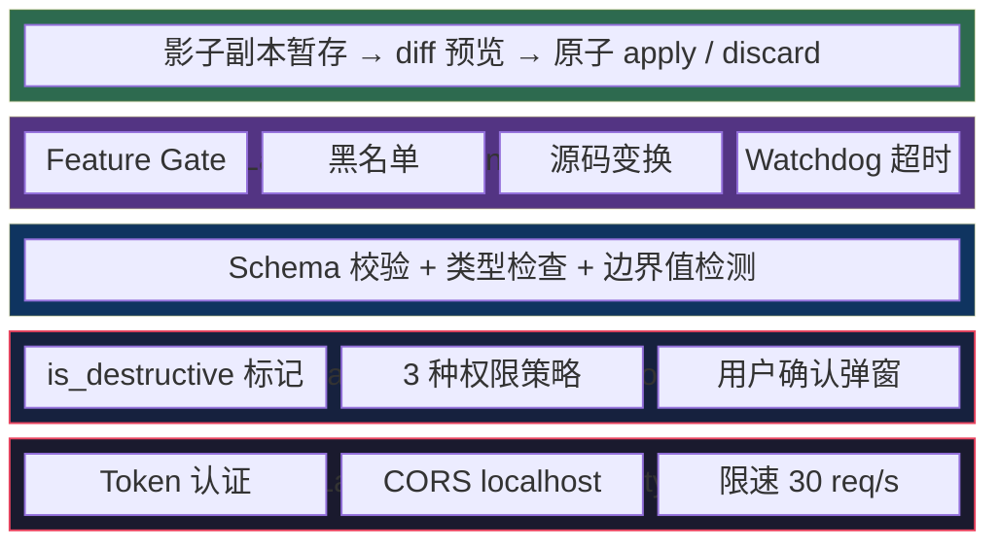
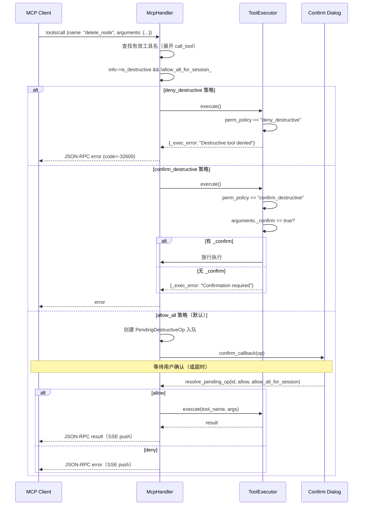
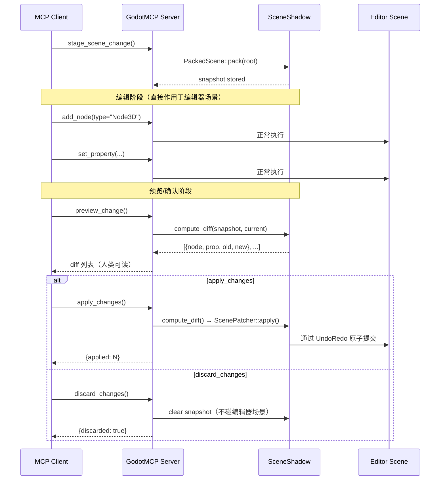
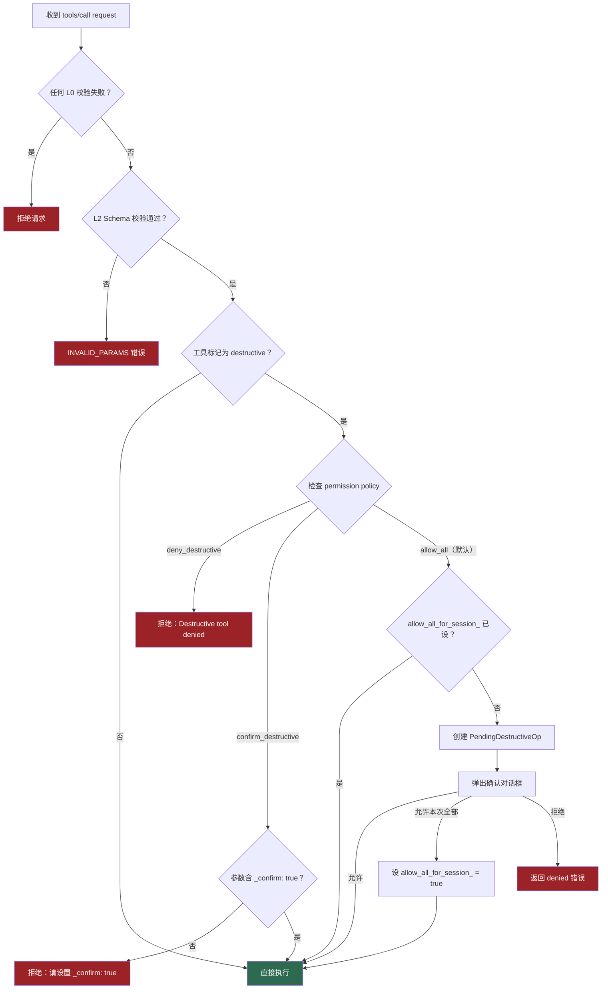

# 安全模型概念

> GodotMCP 将 Godot 编辑器暴露给 AI 客户端。安全模型围绕**纵深防御**设计：
> 五层独立的安全机制，每层捕获上一层遗漏的威胁。
> 目标是平衡 **AI 自主性**与**编辑器完整性**——让 AI 能做有用的事，但不能造成不可逆损害。

---

## 五层安全架构



| 层 | 覆盖威胁 | 状态 | 绕过难度 |
|----|---------|------|:--------:|
| L0 | 网络嗅探、CSRF、DoS | 已实现 | 低 |
| L1 | 非预期破坏性操作 | 已实现 | 中 |
| L2 | 畸形输入、类型注入 | 已实现 | 低 |
| L3 | 任意代码执行 | Phase 2 设计 | 高 |
| L4 | 直接场景修改（不可逆） | Phase 4 设计 | 最高 |

每个阶段添加一层，不修改已有层的逻辑。向后兼容是硬约束。

---

## Layer 0: 网络安全

最外层防线，防止未经授权的网络请求到达工具系统。

### Token 认证

通过环境变量 `GODOT_MCP_AUTH_TOKEN` 启用。请求需在 `Authorization: Bearer <token>` 头中携带。

```cpp
// http_server.cpp:270-286 — 常量时间比较，防 timing side-channel
auth_token_ = OS::get_singleton()->get_environment("GODOT_MCP_AUTH_TOKEN");
```

比较算法逐字节遍历两个字符串的最大长度，不提前退出——无论前缀是否匹配，耗时恒定。

### CORS 限制

默认绑定 `127.0.0.1:9600`，仅接受 localhost 来源：

| Origin | 行为 |
|--------|------|
| `localhost` / `127.0.0.1` / `::1` | 通过 |
| `null`（file:// 等） | 通过 |
| 其他 | CORS 头含空 origin → 浏览器拒绝 |

### 速率限制

令牌桶算法：30 token/s，每请求消耗 1 token。超限返回 429。

---

## Layer 1: 工具分类

核心思想：每个工具声明自己的**破坏性**，系统据此决定是否拦截。

### `is_destructive` 标记

在 X-macro 注册时用第二个参数声明：

```cpp
GODOT_MCP_TOOL(DeleteNodeTool, true)     // 破坏性
GODOT_MCP_TOOL(AddNodeTool, false)        // 非破坏性
```

标记为 `true` 的工具包括：删除节点/文件、覆盖脚本、导出项目、修改设置、执行 GDScript 等。`false` 的工具包括：读操作、创建操作、元工具、文档查询等。当前 153 个工具中约 10% 为破坏性。

标记编译期固定，不可运行时篡改。

### 权限策略

通过环境变量 `GODOT_MCP_PERMISSION` 选择：

| 策略 | 对非破坏工具 | 对破坏工具 |
|------|------------|-----------|
| `allow_all`（默认） | 放行 | 放行（走确认流程） |
| `deny_destructive` | 放行 | 返回 403 错误 |
| `confirm_destructive` | 放行 | 要求参数中传 `_confirm: true` |

### 破坏操作确认流程



### 会话级免确认

`resolve_pending_op` 的 `allow_all_for_session` 参数：一旦用户在一轮中选"全部允许"，后续所有破坏操作跳过确认。

### 超时兜底

确认请求如果 30 秒内无响应，自动拒绝（返回 TIME OUT 错误），防挂起。

---

## Layer 2: 输入校验

`ITool::execute()` 调用前执行，确保参数符合声明。

### Schema 校验

每个工具通过 `build_input_schema()` 声明 JSON Schema：

```cpp
SchemaBuilder sb("object");
sb.prop("script", "string", "GDScript source code to execute");
sb.prop("timeout_ms", "integer", "Max execution time", (int64_t)5000);
return sb.build();
```

验证规则：
- 必填参数缺失 → 拒绝
- 类型不匹配（string 传了 number）→ 拒绝
- 枚举值越界 → 拒绝
- 最大 body 长度 1MB → 超限截断

### 类型安全提取

工具内部通过 `args_string` / `args_int` / `args_bool` 等带默认值的类型安全提取器取值（`cmd_utils/args_get_typed.hpp`），防止 Variant 类型不匹配导致的未定义行为。

---

## Layer 3: EditorScript 文件执行

`run_editor_script` 工具（Phase 2）让 AI 通过 **Godot 内置 `EditorScript` 机制**执行任意编辑器逻辑。它不做自定义沙箱——安全由以下层次保证：

| 层级 | 保证机制 |
|:----:|----------|
| **编译时** | GDScript 编译器在 `write_script` 写入文件时已检查语法 |
| **授权时** | `write_script` 是显式写入动作，用户已在文件系统层面授权 |
| **运行时** | Godot 引擎管理 `@tool` 脚本的权限模型 |
| **审计时** | 临时文件在 `res://_mcp/` 下，完整可追溯 |

### 替代方案对比

此前考虑的自建 `execute_gdscript` 沙箱方案被废弃，原因：

| 维度 | execute_gdscript（废弃） | run_editor_script（当前） |
|------|-------------------------|--------------------------|
| 代码输入 | 字符串参数（不可追溯） | `.gd` 文件（git 可见） |
| 语法检查 | 运行时 `reload()` | GDScript 编译器保存时 |
| 安全边界 | 自建黑名单 + watchdog + 超时 | **Godot 引擎原生** |
| 实现复杂度 | ~300 行 C++ | ~30 行 C++ |
| 可调试 | 不可调试 | 可设断点、可单步 |

### 执行流程

```
AI 生成 GDScript
  → write_script("res://_mcp/eval_001.gd", code)    # 工具链第一步
    → run_editor_script("res://_mcp/eval_001.gd")    # Godot 加载 + 执行
      → read_script(...)                               # 读取 stdout（可选）
        → delete_script(...)                           # 清理临时文件
```

---

## Layer 4: 非破坏编辑

Phase 4 的 Shadow Scene 系统从根本上改变了风险评估：编辑不再直接作用于场景，而是暂存在影子副本中。

### 工作流



### 安全属性

| 属性 | 机制 |
|------|------|
| **可预览** | `preview_change` 返回完整的 property-changes + node-changes 列表 |
| **可审查** | 每个 diff 包含 old/new 值，AI 不可隐藏变更 |
| **原子提交** | 所有 diff 打包为单个 UndoRedo action，一次 undo 回退全部 |
| **零副作用丢弃** | `discard_changes` 仅清内存快照，不碰场景树 |
| **场景切换安全** | `_process()` 自动检测场景切换并清 shadow，不会误操作旧场景 |

### 与 L1 的关系

Shadow Scene 工具自身也有 `is_destructive` 标记：

| 工具 | 破坏性 | 理由 |
|------|--------|------|
| `stage_scene_change` | 否 | 只读快照 |
| `preview_change` | 否 | 只读 diff |
| `apply_changes` | **是** | 修改场景 |
| `discard_changes` | 否 | 仅清内存 |

这意味着 `apply_changes` 仍然受 L1 破坏操作确认流程保护——两层叠加。

---

## 权限策略决策树



---

## 安全 vs 效用的权衡

| 场景 | 无安全层 | 有安全层 |
|------|---------|---------|
| AI 说"删除场景根节点" | 立即执行 | 弹出确认 → 用户审视 → 放行或拒绝 |
| AI 说"执行任意 GDScript" | 直接跑 | 默认为开，必须用户手动启用 |
| AI 说"调整 20 个节点的位置" | 逐个不可逆修改 | 暂存 → 预览 diff → 一次性 apply/undo |
| 网络嗅探 `:9600` | 可任意调用工具 | Token 认证 + localhost 绑定 |
| 畸形参数导致崩溃 | `get_node(null)` 崩溃 | Schema 校验提前拦截 |

### 为何不默认 deny_destructive

`allow_all` 是默认策略（配合确认弹窗），因为：

1. **GodotMCP 的核心价值**是 AI 能实际做事——删节点、改脚本、创资源是日常操作
2. **确认弹窗**在交互式客户端（Claude Code 等）中提供足够的安全护网
3. **开发者可以降级**到 `deny_destructive` 或 `confirm_destructive`，适应 CI/自动化场景

---

## 总结

| 层 | 核心机制 | 覆盖的威胁 | 用户可见性 |
|:--:|---------|-----------|:---------:|
| L0 | Token + CORS + Rate Limit | 未授权访问、CSRF、DoS | 不可见（设 token 后有头校验） |
| L1 | `is_destructive` + 3 种策略 | 非预期破坏 | 可见（弹窗/错误） |
| L2 | Schema 校验 + 类型安全提取 | 畸形输入、类型注入 | 不可见（自动拦截） |
| L3 | Feature gate + 黑名单 + Watchdog | 任意代码执行逃逸 | 可见（错误码） |
| L4 | Shadow scene diff-apply | 不可逆场景编辑 | 可见（完整工作流） |

纵深防御不等于偏执——每层都有明确的设计理由。L0 防网络攻击，L1 防误操作，L2 防输入错误，L3 防脚本逃逸，L4 防不可逆编辑。任何一层失效，下一层仍在。没有"完全信任"的绕过路径——即使 `allow_all` + 确认放行，L2 校验和 L4 预览仍然生效。
