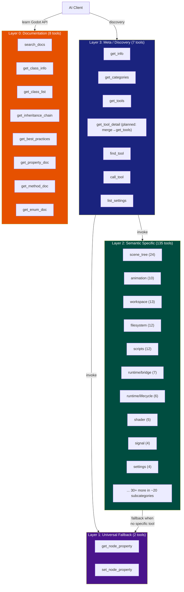
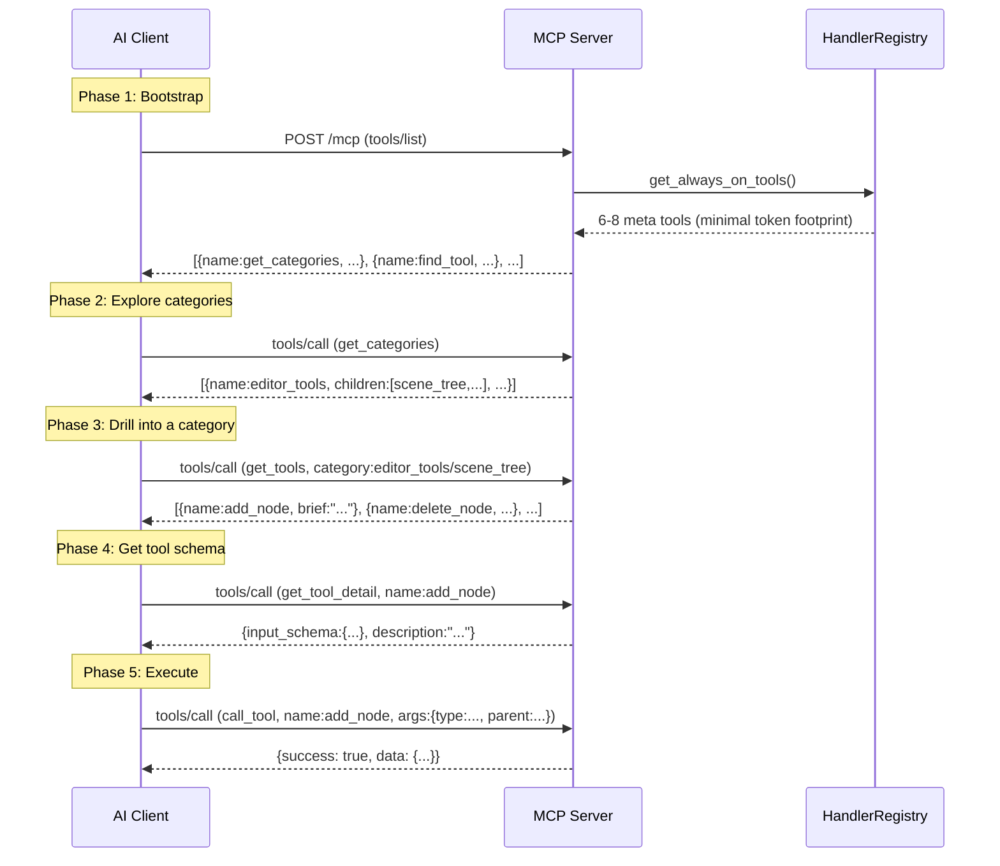
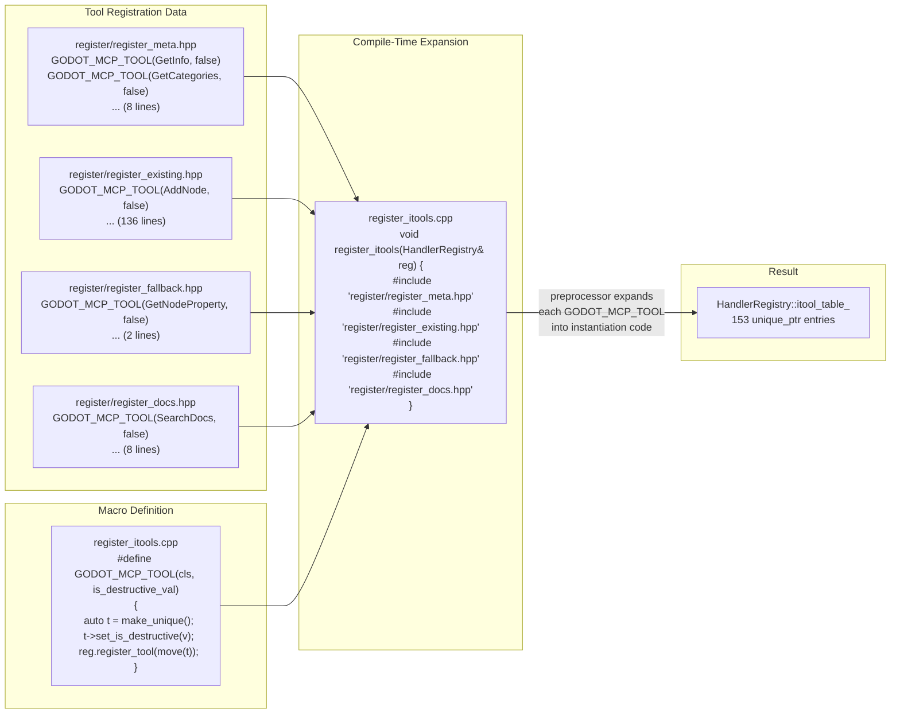
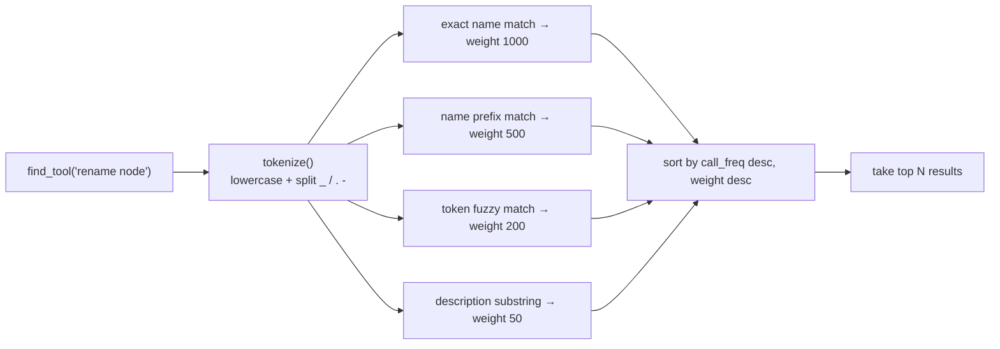

# GodotMCP Tool System Architecture

> A conceptual overview of how 153 MCP tools are organized, registered, discovered, and executed in the GodotMCP GDExtension plugin.

## 1. The Problem: What Makes a Tool System Hard?

A Godot editor MCP server must expose programmatic access to the engine from AI clients. This creates a unique set of pressures:

| Pressure | Manifestation |
|----------|---------------|
| **Scale** | 150+ distinct operations across scene tree, animation, filesystem, scripts, settings, debugging, and runtime |
| **Discoverability** | AI clients cannot read C++ headers — they need runtime service discovery to learn what tools exist |
| **Completeness** | Not every possible operation can be hand-coded — generic fallbacks must cover the long tail |
| **Safety** | Destructive operations (delete, override, write) need guardrails without blocking legitimate use |
| **Extensibility** | GDScript and C# plugin authors must add custom tools without modifying C++ code |
| **Protocol Constraints** | MCP 2026-07-28 Streamable HTTP has no concept of "tool categories" — the server must layer its own |

The tool system solves these through four architectural decisions:

- **Four layers of specificity** — most-used operations get their own tool, rare ones share a generic one
- **Progressive disclosure** — AI clients discover tools in stages, not a flat 150-item list
- **X-macro compile-time registration** — no codegen scripts, no runtime reflection
- **Dual registration path** — built-in C++ tools and SDK (GDScript/C#) tools share the same dispatch table

---

## 2. The Four-Layer Architecture

The 153 tools are not a flat list. They form a specificity hierarchy — each layer answers a different need.



### Layer 3: Meta — Tool Discovery (7 tools)

The entry point. These tools are the only ones visible to a naive MCP client through `tools/list`. They form a mini-discovery API — intentionally compact to minimize token overhead.

| Tool | Purpose |
|------|---------|
| `get_categories` | Return the tool category tree (editor_tools, node_tools, runtime_tools, meta_tools) |
| `get_tools` | List all tools in a given category (planned: merge `get_tool_detail` into this) |
| `get_tool_detail` | Full schema and description for one tool (planned: fold into `get_tools`) |
| `find_tool` | Full-text search across all tools |
| `call_tool` | Execute any tool by name (used when the AI knows what it wants) |
| `get_info` | Server version, tool counts, engine version (planned: merge `generate_client_config`) |
| `list_settings` | ProjectSettings relevant to the MCP plugin |
| (generate_client_config) | Client config generation is available via the bottom panel (`McpDock` UI) and `client_config_registry.hpp`, not a standalone meta tool |

**Planned optimization**: merge `get_tool_detail` into `get_tools(detail=true)` and fold client config generation into `get_info(include_configs=true)`, reducing meta-tool count from 7 to 5. This further trims the `tools/list` response overhead by ~28%.

### Layer 2: Semantic — Purpose-Built Tools (135 tools)

Each tool maps to one high-value operation. They are organized into subcategories by domain:

- **scene_tree (24)**: add/move/duplicate/delete/reparent nodes, instancing, clipboard
- **animation (10)**: animation player controls, animation tree blending, keyframes
- **workspace (13)**: switching 2D/3D/script views, debugger, console, performance monitors
- **filesystem (12)**: import, rename, move, delete resources, scan filesystem
- **scripts (12)**: create, open, attach, detach scripts, code symbols
- **runtime bridge (7)**: query game scene tree, read/write runtime properties, input simulation
- **runtime lifecycle (6)**: play/stop/pause/restart game, toggle debug tools
- Plus: signal, group, inputmap, navigation, collision, tilemap, 3d, audio, shader, control, plugin, export, settings, scaffold, visualizer

The principle: **if an operation is common enough to name, it deserves its own tool**. "Add a node" is a semantic tool. "Set any property" is not.

### Layer 1: Fallback — Universal Property Access (2 tools)

`get_node_property` and `set_node_property` work on **any** node property by path + property name. They cover the long tail — properties too obscure or too numerous for semantic tools. Every semantic tool delegates to these internally when it needs generic property access.

### Layer 0: Documentation — Godot API Knowledge (8 tools)

These tools query Godot's runtime ClassDB to retrieve class documentation, inheritance chains, method signatures, property types, and enum values. An AI client uses these to **learn what Godot APIs are available** before deciding which tool to call.

### Layering is conceptual, not structural

There is no "layer violation" check at compile time. A semantic tool can call a fallback tool internally. A meta tool can invoke documentation queries. The layering describes **how an AI client would reason about the toolset**, not how the C++ code is organized.

---

## 3. Progressive Disclosure

The classic MCP `tools/list` endpoint can only return a flat list. Returning 153 tools at once overwhelms both the LLM context window and the client's ability to navigate.

Progressive disclosure solves this through a **two-tier visibility system**:



### The `is_meta()` gate

Every tool has an `is_meta()` virtual method. Meta tools return `true` — they appear in `tools/list` unconditionally. Non-meta tools (135 semantic + 2 fallback + 8 doc) return `false` — they are invisible to a raw `tools/list` call.

Discovery follows a deliberate chain:

```
tools/list (6-8 meta tools, ~3KB)
  → get_categories() explores category tree
    → get_tools("category") lists tools in a branch
      → get_tool_detail("name") reads schema
        → call_tool("name", args) executes
        → find_tool("query") searches across all tools
```

This prevents context flooding while keeping the full toolset reachable within exactly 4 round-trips. Compare to a full listing (50KB+ per conversation turn) — the savings compound across every LLM interaction.

---

## 4. Registration: X-Macro Compile-Time Registration

Instead of a codegen script (which would require Python at build time and a separate scanning step), GodotMCP uses the **X-macro pattern** — a C preprocessor technique that generates repetitive code from a data file.

### How it works



Key conceptual points:

1. **The registration files are not C++ source files** — they are data files that happen to be valid C++ only because a macro is in scope. Each line is a single macro invocation with no surrounding code.

2. **The preprocessor does the work** — `#include` inside a function body expands the file content inline. Each `GODOT_MCP_TOOL(ClassName, false)` becomes ~5 lines of instantiation code. No external scanner, no build step, no Python dependency.

3. **Tool metadata comes from virtual methods** — the macro only passes the class name and a destructiveness flag. Everything else (`name()`, `category()`, `brief()`, `description()`, `is_meta()`, `needs_scene()`, etc.) comes from ITool virtual methods. This keeps the macro signature minimal and makes metadata changes a recompile away.

4. **Adding a new tool** requires exactly three changes: create the `.hpp` (tool class), add one line to a register file, add one `#include` in `register_itools.cpp`. No codegen, no YAML, no configuration file.

---

## 5. Dual Registration: Built-in + SDK

The system supports two tool authoring paths that converge at the same dispatch table:

```mermaid
flowchart TB
    subgraph BuiltIn["Built-in Path (C++, compile-time)"]
        HPP["Author: .hpp implementing ITool"]
        REGMACRO["Register: GODOT_MCP_TOOL(MyTool, false)"]
        INSTANCE["make_unique<MyTool>() → unique_ptr<ITool>"]
    end

    subgraph SDK["SDK Path (GDScript/C#, runtime)"]
        GDSCRIPT["Author: class extends McpToolDefinition"]
        REGAPI["Runtime: McpToolRegistry.tool_definitions.push_back(this)"]
        ADAPTER["Wrapper: IToolAdapter converts Callable → ITool"]
    end

    subgraph Registry["HandlerRegistry (single table)"]
        TABLE["itool_table_<br/>std::map<String, unique_ptr<ITool>>"]
    end

    subgraph Dispatch["Dispatch"]
        EXECUTE["HandlerRegistry::execute(name, args)"]
    end

    HPP --> REGMACRO
    REGMACRO --> INSTANCE
    INSTANCE -->|register_tool(tool, is_custom=false)| TABLE

    GDSCRIPT --> REGAPI
    REGAPI --> ADAPTER
    ADAPTER -->|register_tool(tool, is_custom=true)| TABLE

    TABLE -->|lookup by name| EXECUTE
```

| Dimension | Built-in Path | SDK Path |
|-----------|---------------|----------|
| Author language | C++ (GDExtension) | GDScript or C# |
| Registration time | Compile-time (preprocessor) | Runtime (_ready() or _enter_tree()) |
| Overhead | Zero — compiled into the binary | Wrapping via `IToolAdapter` |
| Name prefix | None | Automatic `custom_` prefix |
| Lifecycle | Permanent (cannot unregister) | Dynamic (can unregister on tool disable) |
| Performance | Direct virtual dispatch | Callable invocation (slightly slower) |

### Why two paths?

- **Core tools** (scene tree, filesystem, etc.) need the performance and type safety of C++
- **SDK tools** let game plugin authors add domain-specific tools (e.g., "deploy level to server") without forking the project
- Both paths coexist in the same `itool_table_`, so the search engine, category tree, and permission system work identically

---

## 6. Discovery: Search Engine and Category Tree

### Category Auto-Discovery

Every tool declares a `category()` string with slash-separated segments, e.g. `editor_tools/scene_tree`. The `HandlerRegistry::get_categories()` method walks all registered tools and builds a tree:

```
root
├── meta_tools (6-8 direct, 6-8 total)
├── editor_tools (~72 direct, ~94 total)
│   ├── scene_tree (24 tools)
│   ├── animation (10)
│   ├── scripts (12)
│   ├── filesystem (12)
│   ├── workspace (~13)
│   ├── docs (8)
│   ├── settings (4)
│   ├── control (4)
│   ├── signal (4)
│   ├── inputmap (4)
│   └── ... (~10 more subcategories)
├── node_tools (~6 direct, ~6 total)
└── runtime_tools (~7 direct, ~13 total)
    ├── bridge (7)
    └── lifecycle (6)
```

The tree is **zero-maintenance**: the first segment before `/` becomes the top-level category. Labels are auto-generated (`editor_tools` → `"Editor tools"`, `3d_scene` → `"3d scene"`). An `is_meta()` tool can override the auto-label by providing a `category_description()`.

### Search Engine

When an AI client needs to find a tool by intent (e.g., "find the tool to rename a node"), it uses `find_tool(query)`:



Call frequency (`record_tool_call()`) acts as a popularity signal — frequently used tools rank higher within the same weight tier. This means the search engine **adapts to usage patterns** over a session.

---

## 7. Key Constraints and Design Tradeoffs

### Registration: Compile-time vs Runtime

| Approach | Tradeoff |
|----------|----------|
| **X-macro (chosen)** | No Python dependency, type-safe, fastest dispatch. But requires a recompile to add tools, and registration files are not valid C++ outside macro context |
| Codegen (previous) | No recompile needed. But fragile (UTF-8 BOM breaks scanning), slow (separate Python step), and cannot catch C++ errors at generation time |
| Runtime reflection | Most flexible but requires ClassDB registration for every tool, slower dispatch, more boilerplate |

### Progressive Disclosure vs Full Listing

Progressive disclosure is a **deliberate architectural advantage**, not a compromise. Research and real-world client behavior confirm this:

| Dimension | Full Listing | Progressive Disclosure (current) |
|-----------|-------------|----------------------------------|
| **tools/list token cost** | 153 full schemas ~50KB | 8 meta-tool names ~3KB |
| **LLM context pressure** | All schemas loaded every turn | On-demand, only what's needed |
| **Client caching bugs** | Claude Code has 1h cache TTL (`#45`), broken pagination (`#24785`) — full lists go stale | Meta-tools always work; discovered tools fetched fresh per-query |
| **MCP spec alignment** | Permitted but wasteful | Pagination + caching are first-class protocol features |
| **Community direction** | SEP-1576, Discussion #1923 propose progressive disclosure as token-bloat solution | Already implemented — GodotMCP is ahead of formal proposals |

**Key finding from production MCP clients**: Claude Code has known bugs where `tools/list` results are cached for 1 hour (`anthropics/claude-ai-mcp#45`) and `notifications/tools/list_changed` is ignored (`anthropics/claude-code#4118`). A full 153-tool listing would go stale silently. The meta-tool approach is **inherently more robust** — discovery queries always bypass client caching layers because each call is a distinct `tools/call` invocation.

The MCP community is actively proposing what GodotMCP already has: Discussion `#1923` suggests `tools/list_summary` (minimal metadata) + `tools/get` (full schema on demand), estimating **88% token savings**. GodotMCP's meta-tool chain (`get_categories` → `get_tools` → `get_tool_detail`) is a production implementation of this same pattern.

### Single Thread vs Async

All tools execute synchronously on Godot's main thread, driven by `_process()`. This avoids GDExtension threading pitfalls but means a slow tool blocks the editor frame. Consequence: bridge operations must be non-blocking (async via polling), and long-running operations (workflow engine, shadow scene diff) are designed to split work across frames.

### Built-in vs SDK

| | Tradeoff |
|--|----------|
| **Built-in C++** | Full performance, compile-time type safety, permanent availability. But requires forking and recompiling to extend |
| **SDK** | Dynamic, any GDScript/C# developer can contribute tools. But slower dispatch via Callable, no compile-time guarantees, and `custom_` prefix adds friction |

### Information Architecture: Semantic vs Fallback

The boundary between Layer 2 (semantic) and Layer 1 (fallback) is intentionally fuzzy. A tool should be semantic when the operation has:
- A well-defined name that an AI would search for
- Multiple parameters with domain-specific defaults
- Safety or undo considerations

It should remain fallback when:
- The operation is generic ("read any property")
- There is no meaningful schema beyond node_path + property_name
- The long tail would require hundreds of near-identical semantic tools

---

## 8. Summary

The GodotMCP tool system is organized along four conceptual axes:

| Axis | Mechanism | Purpose |
|------|-----------|---------|
| **Specificity** | 4 layers (meta → semantic → fallback → docs) | Match tool granularity to operation frequency |
| **Visibility** | `is_meta()` + progressive disclosure | Prevent context flooding while keeping full toolset reachable |
| **Registration** | X-macro compile-time + SDK runtime dual path | Serve both core C++ developers and plugin authors |
| **Discovery** | Category auto-tree + weighted full-text search | Let AI clients find the right tool by browsing or searching |

These four mechanisms work together to solve the core problem: **how to expose 150+ engine operations to an AI client through a protocol that knows nothing about tool organization**.
