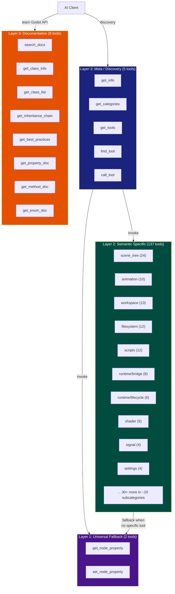
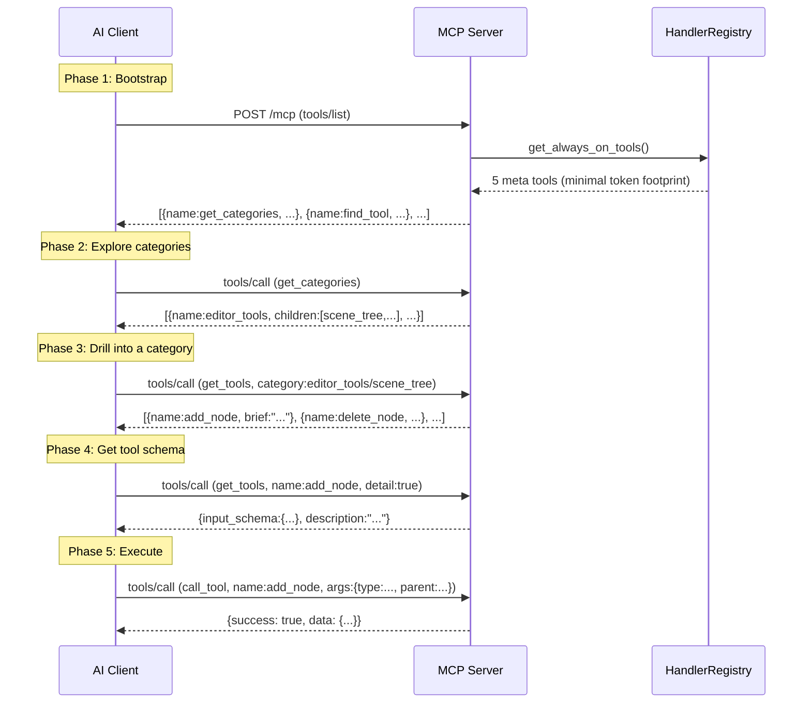
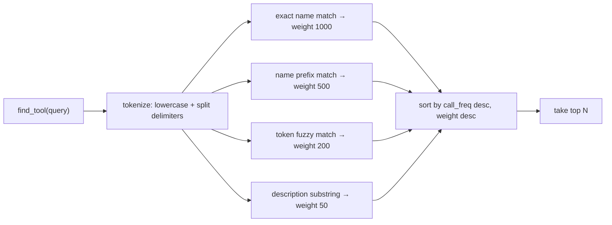

# GodotMCP 工具体系架构

> 关于 152 个 MCP 工具如何在 GodotMCP GDExtension 插件中组织、注册、发现和执行的概念概述。

## 1. 问题：什么让工具体系变得困难？

Godot 编辑器 MCP 服务器必须向 AI 客户端暴露对引擎的程序化访问。这产生了一系列独特的压力：

| 压力 | 表现 |
|----------|---------------|
| **规模** | 跨越场景树、动画、文件系统、脚本、设置、调试和运行时的 150+ 种不同操作 |
| **可发现性** | AI 客户端无法读取 C++ 头文件——它们需要运行时服务发现来了解存在哪些工具 |
| **完备性** | 不可能手工编码所有可能的操作——通用兜底工具必须覆盖长尾需求 |
| **安全性** | 破坏性操作（删除、覆盖、写入）需要防护栏，同时不阻止合法使用 |
| **可扩展性** | GDScript 和 C# 插件作者必须能够添加自定义工具，而无需修改 C++ 代码 |
| **协议约束** | MCP 2026-07-28 Streamable HTTP 没有"工具分类"的概念——服务器必须自行分层 |

工具体系通过四项架构决策来解决这些问题：

- **四个特异性层级**——最常用的操作拥有自己的工具，不常用的操作共享通用工具
- **渐进式披露**——AI 客户端分阶段发现工具，而非一次获取 150 项的扁平列表
- **X-macro 编译时注册**——无需代码生成脚本，无需运行时反射
- **双重注册路径**——内置 C++ 工具和 SDK（GDScript/C#）工具共享同一个调度表

---

## 2. 四层架构

152 个工具并非扁平列表。它们构成了一个特异性层级结构——每一层满足不同的需求。



### 第 3 层：元工具 — 工具发现（5 个工具）

入口点。这些工具是原始 MCP 客户端通过 `tools/list` 唯一能看到的工具。它们构成了一组小型发现 API——有意保持紧凑以最小化 token 开销。`generate_client_config` 不是一个独立工具；它通过 `get_info(include_configs=true)` 提供。

| 工具 | 用途 |
|------|---------|
| `get_categories` | 返回工具分类树（editor_tools, node_tools, runtime_tools, meta_tools） |
| `get_tools` | 列出某分类下的工具，或调用时传入 `name="..."` + `detail=true` 返回完整 schema |
| `find_tool` | 跨所有工具的全文搜索 |
| `call_tool` | 按名称执行任意工具（当 AI 知道它想要什么时使用） |
| `get_info` | 服务器版本、工具数量、引擎版本（支持 `include_configs=true`） |

**已合并**：`get_tool_detail` 已合并到 `get_tools(name="...", detail=true)`。元工具数量为 5。客户端配置生成通过 `get_info(include_configs=true)` 提供。`list_settings` 的 `is_meta()=false`，仅通过分类发现可见。

### 第 2 层：语义工具 — 专用工具（137 个工具）

每个工具对应一个高价值操作。它们按领域组织成子分类：

- **scene_tree（24）**：添加/移动/复制/删除/重新父级节点、实例化、剪贴板
- **animation（10）**：动画播放器控制、动画树混合、关键帧
- **workspace（13）**：切换 2D/3D/脚本视图、调试器、控制台、性能监视器
- **filesystem（12）**：导入、重命名、移动、删除资源、扫描文件系统
- **scripts（12）**：创建、打开、附加、分离脚本、代码符号
- **runtime bridge（8）**：查询游戏场景树、读写运行时属性、输入模拟
- **runtime lifecycle（6）**：播放/停止/暂停/重启游戏、切换调试工具
- 此外还有：信号、分组、输入映射、导航、碰撞、瓦片地图、3D、音频、着色器、控件、插件、导出、设置、脚手架、可视化工具

原则：**如果一个操作足够常见以至于可以命名，它就值得拥有自己的工具**。"添加一个节点"是一个语义工具。"设置任意属性"则不是。

### 第 1 层：兜底工具 — 通用属性访问（2 个工具）

`get_node_property` 和 `set_node_property` 通过路径 + 属性名称在**任意**节点属性上工作。它们覆盖了长尾需求——那些过于晦涩或数量过多以至于不适合语义工具的属性。每个语义工具在需要通用属性访问时内部都会委托给它们。

### 第 0 层：文档工具 — Godot API 知识（8 个工具）

这些工具查询 Godot 的运行时 ClassDB 以获取类文档、继承链、方法签名、属性类型和枚举值。AI 客户端在决定调用哪个工具之前，使用这些工具来**了解哪些 Godot API 可用**。

### 分层是概念性的，不是结构性的

编译时没有"分层违规"检查。语义工具可以在内部调用兜底工具。元工具可以发起文档查询。分层描述的是 **AI 客户端如何推理工具集**，而非 C++ 代码的组织方式。

---

## 3. 渐进式披露

经典的 MCP `tools/list` 端点只能返回扁平列表。一次返回 152 个工具会同时压垮 LLM 上下文窗口和客户端的导航能力。

渐进式披露通过一个**双层可见性系统**解决了这个问题：



### `is_meta()` 门控

每个工具都有一个 `is_meta()` 虚方法。元工具返回 `true`——它们无条件出现在 `tools/list` 中。非元工具（137 个语义 + 2 个兜底 + 8 个文档）返回 `false`——它们对原始的 `tools/list` 调用不可见。

发现遵循一个精心设计的链条：

```
tools/list (5 个元工具, ~3KB)
  → get_categories() 探索分类树
    → get_tools("category") 列出某分支中的工具
      → get_tools("name", detail=true) 读取 schema
        → call_tool("name", args) 执行
        → find_tool("query") 跨所有工具搜索
```

这防止了上下文泛滥，同时确保完整的工具集在恰好 4 次往返内可达。与完整的清单（每次对话轮次 50KB+）相比——节省的开销在每次 LLM 交互中持续累积。

---

## 4. 注册：X-Macro 编译时注册

GodotMCP 不使用代码生成脚本（这需要构建时运行 Python 以及一个单独的扫描步骤），而是使用 **X-macro 模式**——一种 C 预处理器技术，从数据文件生成重复代码。

### 工作原理


关键概念要点：

1. **注册文件不是 C++ 源文件**——它们是数据文件，仅仅因为宏在作用域内而恰好是有效的 C++。每一行是一个单独的宏调用，没有周围代码。

2. **预处理器完成工作**——函数体内的 `#include` 将文件内容内联展开。每个 `GODOT_MCP_TOOL(ClassName, false)` 变为大约 5 行实例化代码。无需外部扫描器，无需构建步骤，无需 Python 依赖。

3. **工具元数据来自虚方法**——宏只传递类名和破坏性标志。其他所有内容（`name()`、`category()`、`brief()`、`description()`、`is_meta()`、`needs_scene()` 等）来自 ITool 虚方法。这使得宏签名保持最小，并且元数据的变更只需重新编译。

4. **添加一个新工具**只需要三处更改：创建 `.hpp`（工具类），在注册文件中添加一行，在 `register_itools.cpp` 中添加一个 `#include`。无需代码生成，无需 YAML，无需配置文件。

---

## 5. 双重注册：内置路径 + SDK 路径

系统支持两条汇聚于同一调度表的工具编写路径：

```mermaid
flowchart TB
    subgraph BuiltIn["Built-in Path (C++, compile-time)"]
        HPP["Author: .hpp implementing ITool"]
        REGMACRO["Register: GODOT_MCP_TOOL(MyTool, false)"]
        INSTANCE["make_unique<MyTool>() → unique_ptr<ITool>"]
    end

    subgraph SDK["SDK Path (GDScript/C#, runtime)"]
        GDSCRIPT["Author: class extends McpToolDefinition"]
        REGAPI["Runtime: McpToolRegistry.tool_definitions.push_back(this)"]
        ADAPTER["Wrapper: IToolAdapter converts Callable → ITool"]
    end

    subgraph Registry["HandlerRegistry (single table)"]
        TABLE["itool_table_<br/>std::map<String, unique_ptr<ITool>>"]
    end

    subgraph Dispatch["Dispatch"]
        EXECUTE["HandlerRegistry::execute(name, args)"]
    end

    HPP --> REGMACRO
    REGMACRO --> INSTANCE
    INSTANCE -->|register_tool(tool, is_custom=false)| TABLE

    GDSCRIPT --> REGAPI
    REGAPI --> ADAPTER
    ADAPTER -->|register_tool(tool, is_custom=true)| TABLE

    TABLE -->|lookup by name| EXECUTE
```

| 维度 | 内置路径 | SDK 路径 |
|-----------|---------------|----------|
| 编写语言 | C++（GDExtension） | GDScript 或 C# |
| 注册时间 | 编译时（预处理器） | 运行时（_ready() 或 _enter_tree()） |
| 开销 | 零——编译到二进制中 | 通过 `IToolAdapter` 包装 |
| 名称前缀 | 无 | 自动 `custom_` 前缀 |
| 生命周期 | 永久（无法注销） | 动态（工具禁用时可注销） |
| 性能 | 直接虚方法分发 | Callable 调用（略慢） |

### 为什么需要两条路径？

- **核心工具**（场景树、文件系统等）需要 C++ 的性能和类型安全
- **SDK 工具**让游戏插件作者无需分叉项目即可添加领域特定工具（例如"将关卡部署到服务器"）
- 两条路径共存于同一个 `itool_table_` 中，因此搜索引擎、分类树和权限系统的行为完全一致

---

## 6. 发现：搜索引擎与分类树

### 分类自动发现

每个工具声明一个以斜杠分隔的 `category()` 字符串，例如 `editor_tools/scene_tree`。`HandlerRegistry::get_categories()` 方法遍历所有已注册的工具并构建一棵树：

```
root
├── meta_tools (5 个直接, 5 个总计)
├── editor_tools (~72 个直接, ~94 个总计)
│   ├── scene_tree (24 个工具)
│   ├── animation (10)
│   ├── scripts (12)
│   ├── filesystem (12)
│   ├── workspace (~13)
│   ├── docs (8)
│   ├── settings (4) — 包含 list_settings (is_meta=false)
│   ├── control (4)
│   ├── signal (4)
│   ├── inputmap (4)
│   └── ...（约 10 个以上子分类）
├── node_tools (~6 个直接, ~6 个总计)
└── runtime_tools (~8 个直接, ~14 个总计)
    ├── bridge (8)
    └── lifecycle (6)
```

这棵树是**零维护的**：`/` 之前的第一个分段成为顶层分类。标签自动生成（`editor_tools` → `"Editor tools"`，`3d_scene` → `"3d scene"`）。`is_meta()` 工具可以通过提供 `category_description()` 覆盖自动标签。

### 搜索引擎

当 AI 客户端需要按意图查找工具时（例如"找到重命名节点的工具"），它使用 `find_tool(query)`：



调用频率（`record_tool_call()`）作为流行度信号——在相同权重层级内，频繁使用的工具排名更高。这意味着搜索引擎在会话过程中**会适应使用模式**。

---

## 7. 关键约束与设计权衡

### 注册：编译时 vs 运行时

| 方案 | 权衡 |
|----------|----------|
| **X-macro（已选）** | 无 Python 依赖，类型安全，最快的分发。但添加工具需要重新编译，且注册文件在宏上下文之外不是有效的 C++ |
| 代码生成（先前） | 无需重新编译。但脆弱（UTF-8 BOM 会破坏扫描），缓慢（需要单独的 Python 步骤），且无法在生成时捕获 C++ 错误 |
| 运行时反射 | 最灵活，但每个工具都需要 ClassDB 注册，分发更慢，样板代码更多 |

### 渐进式披露 vs 完整清单

渐进式披露是一个**有意为之的架构优势**，而非妥协。研究和真实世界客户端行为确认了这一点：

| 维度 | 完整清单 | 渐进式披露（当前） |
|-----------|-------------|----------------------------------|
| **tools/list token 开销** | 152 个完整 schema 约 50KB | 5 个元工具名称约 3KB |
| **LLM 上下文压力** | 每次对话轮次加载所有 schema | 按需加载，仅加载所需内容 |
| **客户端缓存 bug** | Claude Code 有 1 小时缓存 TTL（#45），分页损坏（#24785）——完整列表会静默过期 | 元工具始终可用；发现的工具每次查询时新鲜获取 |
| **MCP 规范匹配度** | 允许但浪费 | 分页 + 缓存是头等协议特性 |
| **社区方向** | SEP-1576, Discussion #1923 提出渐进式披露作为 token 膨胀的解决方案 | 已实现——GodotMCP 领先于正式提案 |

**来自生产 MCP 客户端的关键发现**：Claude Code 存在已知 bug，`tools/list` 结果被缓存 1 小时（`anthropics/claude-ai-mcp#45`），并且 `notifications/tools/list_changed` 被忽略（`anthropics/claude-code#4118`）。完整的 152 工具列表会静默过期。元工具方法**本质上更健壮**——发现查询总是绕过客户端缓存层，因为每次调用都是一个独立的 `tools/call` 调用。

MCP 社区正在积极提案 GodotMCP 已经具备的功能：Discussion `#1923` 建议 `tools/list_summary`（最小元数据）+ `tools/get`（按需获取完整 schema），估计可节省 **88% 的 token**。GodotMCP 的元工具链（`get_categories` → `get_tools` → `get_tools(detail=true)`）是同一模式的生产实现。

### 单线程 vs 异步

所有工具在 Godot 的主线程上同步执行，由 `_process()` 驱动。这避免了 GDExtension 的线程陷阱，但意味着慢速工具会阻塞编辑器的帧。后果是：桥接操作必须是非阻塞的（通过轮询异步），长时间运行的操作（工作流引擎、影子场景 diff）被设计为跨帧分割工作。

### 内置路径 vs SDK 路径

| | 权衡 |
|--|----------|
| **内置 C++** | 完全性能，编译时类型安全，永久可用。但需要分叉和重新编译才能扩展 |
| **SDK** | 动态，任何 GDScript/C# 开发者都可以贡献工具。但通过 Callable 分发更慢，没有编译时保证，且 `custom_` 前缀增加了摩擦 |

### 信息架构：语义工具 vs 兜底工具

第 2 层（语义）和第 1 层（兜底）之间的界限故意保持模糊。当一个操作满足以下条件时，它应该是语义工具：
- 有一个 AI 会搜索的明确名称
- 有多个参数和领域特定的默认值
- 有安全性或撤销方面的考虑

当以下情况时，它应该保持为兜底工具：
- 操作是通用的（"读取任意属性"）
- 除了 node_path + property_name 之外没有有意义的 schema
- 长尾需求需要数百个几乎相同的语义工具

---

## 8. 总结

GodotMCP 工具体系沿四个概念轴组织：

| 轴 | 机制 | 目的 |
|------|-----------|---------|
| **特异性** | 4 层（元工具 → 语义工具 → 兜底工具 → 文档工具） | 将工具粒度与操作频率匹配 |
| **可见性** | `is_meta()` + 渐进式披露 | 防止上下文泛滥，同时保持完整工具集可达 |
| **注册** | X-macro 编译时 + SDK 运行时双路径 | 同时服务核心 C++ 开发者和插件作者 |
| **发现** | 分类自动树 + 加权全文搜索 | 让 AI 客户端通过浏览或搜索找到合适的工具 |

这四种机制共同解决了核心问题：**如何通过一个对工具组织一无所知的协议，向 AI 客户端暴露 150+ 个引擎操作**。
