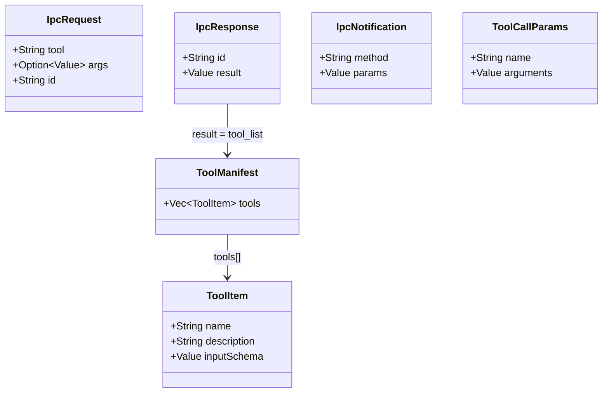

# `crates/core` — 共享协议类型

> 被 `crates/server` 和 `crates/gdext` 同时引用。不包含任何 Godot 或 MCP 运行时依赖。

## 文件

### `protocol.rs`

- `IpcRequest { tool: String, args: Option<Value>, id: String }` — 从 server 发送到 gdext 的工具调用请求
- `IpcResponse { id: String, result: Value }` — 从 gdext 返回的响应
- `IpcNotification { method: String, params: Value }` — 从 gdext 发送到 server 的通知（如 `mcp_log_message`）
- `ToolCallParams { name: String, arguments: Value }` — 标准的 MCP tool call 格式

### `tool_manifest.rs`

- `ToolManifest { tools: Vec<ToolItem> }` — 完整的工具列表响应
- `ToolItem { name, description, input_schema }` — 单个工具的 Schema 描述

### 为什么需要 `core` crate

这两侧通过 WebSocket 通信，使用 serde JSON 序列化/反序列化。共享类型确保两端格式严格一致。
