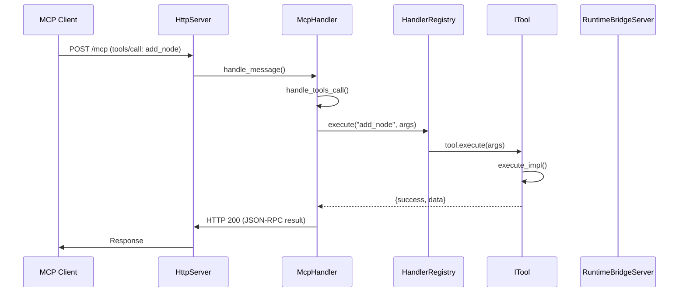
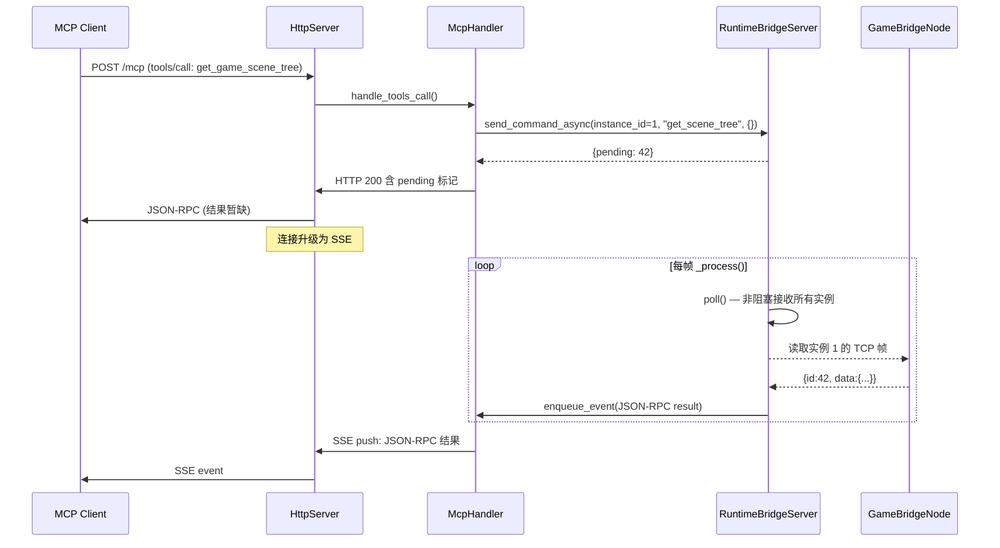
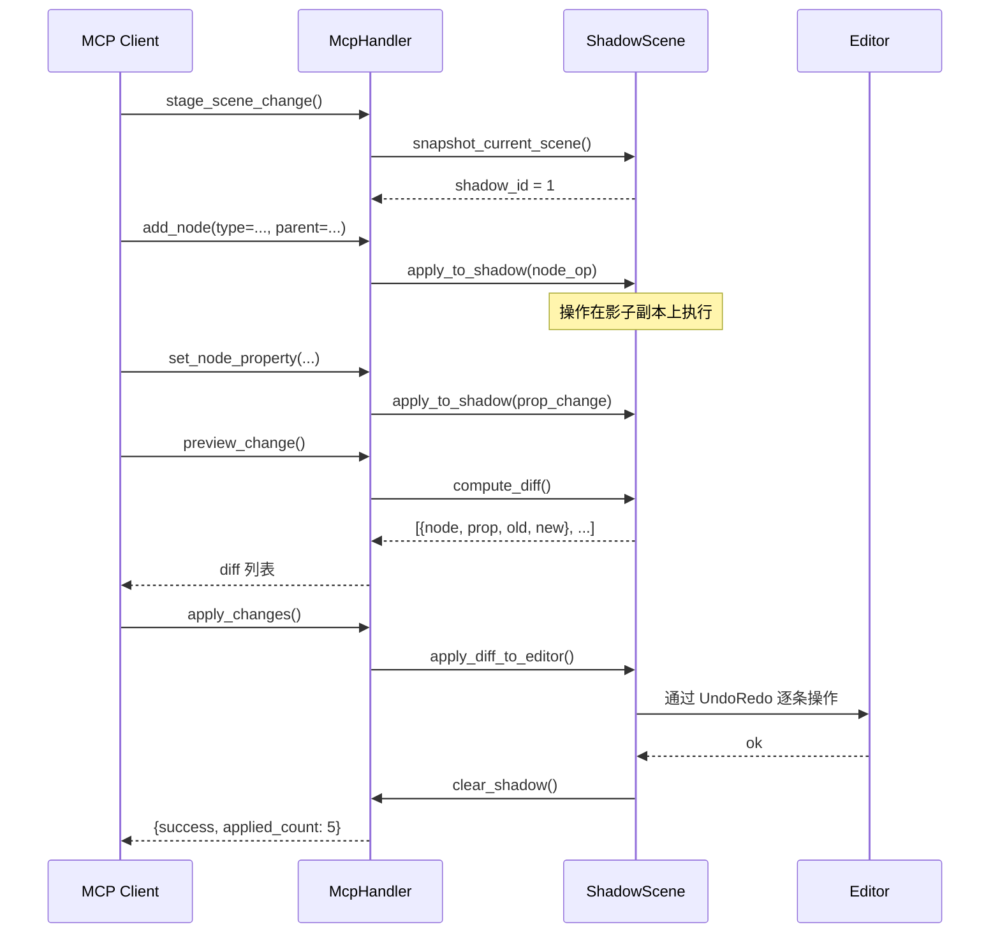

# GodotMCP 系统架构设计文档

> 版本: 1.0 · 2026-06-20  
> 对应迭代: Phase 1-4（`feature/foundation-fixes` → `feature/moat-ecosystem`）  
> 团队规模: 3-5 人 · 预计工期: ~11-14 周

---

## 1. 架构概览

### 1.1 当前架构快照

```
┌──────────────────────────────────────────────────────────────┐
│                    Godot Editor Process                        │
│  ┌─────────────────────────────────────────────────────────┐  │
│  │              McpEditorPlugin (EditorPlugin)               │  │
│  │  ┌──────────┐  ┌────────────┐  ┌────────────────────┐   │  │
│  │  │ McpHandler│  │ HttpServer  │  │ HandlerRegistry   │   │  │
│  │  │ (MCP协议) │◄─│ (端口9600) │─►│ (工具注册表)      │   │  │
│  │  └─────┬─────┘  └────────────┘  └────────┬───────────┘   │  │
│  │        │                                  │               │  │
│  │  ┌─────▼─────────────────────────────┐    │               │  │
│  │  │    ToolExecutor                    │    │               │  │
│  │  │  ┌─────┐ ┌──────┐ ┌─────────┐    │    │               │  │
│  │  │  │ITool│ │ITool │ │ITool    │    │    │               │  │
│  │  │  │x137 │ │x8   │ │x2       │    │    │               │  │
│  │  │  └─────┘ └──────┘ └─────────┘    │    │               │  │
│  │  └───────────────────────────────────┘    │               │  │
│  │                                            │               │  │
│  │  ┌─────────────────────────────────────────▼──────────┐   │  │
│  │  │              RuntimeBridgeServer (TCP Server :9601)         │   │  │
│  │  │          (当前: 同步阻塞 ← Phase 1 改造目标)        │   │  │
│  │  └──────────────────────┬──────────────────────────────┘   │  │
│  └─────────────────────────┼──────────────────────────────────┘  │
│                            │ TCP JSON                            │
│  ┌─────────────────────────▼──────────────────────────────────┐  │
│  │              GameBridgeNode (游戏进程)                      │  │
│  │              7 个命令: get_scene_tree / get_property /     │  │
│  │              set_property / call_method / screenshot /      │  │
│  │              simulate_input / set_pause                    │  │
│  └────────────────────────────────────────────────────────────┘  │
└──────────────────────────────────────────────────────────────────┘
```

### 1.2 四阶段演进后的目标架构

```
┌──────────────────────────────────────────────────────────────────┐
│                    Godot Editor Process                           │
│  ┌─────────────────────────────────────────────────────────────┐  │
│  │              McpEditorPlugin (EditorPlugin)                   │  │
│  │                                                               │  │
│  │  ┌──────────────┐  ┌────────────────┐  ┌─────────────────┐  │  │
│  │  │ MCP Protocol  │  │  HTTP Server   │  │ Tool Registry   │  │  │
│  │  │ - tools/list  │◄─│  (端口9600)    │─►│ - 工具分类树    │  │  │
│  │  │   渐进式披露  │  │  - SSE 推送    │  │ - 搜索引擎      │  │  │
│  │  │ - SSE 通知    │  │  - 多实例路由  │  │ - 分类树        │  │  │
│  │  │ - Image类型   │  └────────────────┘  │ - 搜索引擎      │  │  │
│  │  └───────┬───────┘                      └────────┬────────┘  │  │
│  │          │                                       │           │  │
│  │  ┌───────▼───────────────────────────────────────▼────────┐  │  │
│  │  │                  Tool Executor (扩展)                    │  │  │
│  │  │  ┌──────┐  ┌──────┐  ┌──────────┐  ┌───────────────┐  │  │  │
│  │  │  │ITool │  │ITool │  │Workflow │  │ Pipeline  │  │  │  │
│  │  │  │x152  │  │xN    │  │(YAML)  │  │ Runner    │  │  │  │
│  │  │  └──────┘  └──────┘  └────────┘  └───────────┘  │  │  │
│  │  │  ┌──────────┐  ┌────────────┐                     │  │  │
│  │  │  │Shadow    │  │ Scene      │                          │  │  │
│  │  │  │Scene Diff│  │ Replay     │                          │  │  │
│  │  │  └──────────┘  └────────────┘                          │  │  │
│  │  └────────────────────────────────────────────────────────┘  │  │
│  │                                                               │  │
│  │  ┌─────────────────────────────────────────────────────────┐  │  │
│  │  │        RuntimeBridgeServer (异步 + 多实例 + SSE 推送)            │  │  │
│  │  │  send_command_async() → poll() → enqueue_event()        │  │  │
│  │  │  支持: EditorScript 执行（通过 run_editor_script）        │  │  │
│  │  │  扩展: 多实例路由 (端口/进程级隔离)                     │  │  │
│  │  └──────────────────────┬──────────────────────────────────┘  │  │
│  └─────────────────────────────────────────────────────────────┘  │
│                            │ TCP JSON                              │
│  ┌─────────────────────────▼────────────────────────────────────┐  │
│  │              GameBridgeNode (游戏进程, 无需改动)              │  │
│  └──────────────────────────────────────────────────────────────┘  │
└──────────────────────────────────────────────────────────────────┘
```

---

## 2. 模块职责与接口

### 2.1 模块全景

| 模块 | 路径 | 职责 | 阶段 |
|------|------|------|:----:|
| **MCP Protocol** | `server/mcp/mcp_handler` | MCP 协议消息路由、JSON-RPC 编解码、SSE 事件管理 | 已有 |
| **HTTP Server** | `server/ipc/http_server` | HTTP 请求接收、路由分发、SSE 流管理、CORS | 已有 |
| **Handler Registry** | `server/registry/handler_registry` | 工具注册/查询/搜索/分类树 | 已有 |
| **Tool Executor** | `server/mcp/tool_executor` | 工具调用执行、前置检查、权限策略 | 已有 |
| **Runtime Bridge** | `runtime/bridge` | 编辑器↔游戏进程 TCP 通信 | 已有→改造 |
| **Pipeline Runner** | `pipeline/`（从 `testing/` 提取） | 三层继承：PipelineRunnerBase 纯执行 → TestRunner（快照+断言）/ WorkflowRunner（vars+工作流） | Phase 3 |
| **Shadow Scene** | `scene_diff/` (新建) | 场景快照/diff/apply/回滚 | Phase 4 |
| **Scene Replay** | `replay/` (新建) | 操作录制/回放/测试导出 | Phase 4 |
| **SDK Layer** | `extensions/src/sdk/` | `McpToolDefinition` / `McpToolRegistry` 自定义工具 API（运行时） | 已有 |
| **Editor Plugin** | `editor_plugin.cpp` | Godot 编辑器生命周期管理 | 已有 |

### 2.2 核心接口契约

#### ITool 接口（已有，Phase 3 扩展）

```cpp
class ITool {
public:
    virtual String name() const = 0;
    virtual String brief() const = 0;
    virtual String category() const = 0;
    virtual bool is_meta() const;
    virtual bool is_destructive() const;
    virtual bool supports_undo() const;

    // Phase 3 新增:
    virtual String tool_group() const;       // "animation" | "ui" | "filesystem" | ...

    Dictionary execute(const Dictionary &args);
protected:
    virtual Dictionary execute_impl(const ToolContext &ctx) = 0;
};
```

#### HandlerRegistry 接口（Phase 1 扩展）

```cpp
class HandlerRegistry {
public:
    // 已有:
    Array get_always_on_tools() const;
    Array get_tools_in_category(const String &category) const;
    Array get_categories() const;
    Array search_tools(...) const;
    Dictionary execute(const String &name, const Dictionary &args);

    // Phase 1 新增:
    void set_on_tools_changed(std::function<void()>);  // 变更通知回调

    // Phase 3 新增:
    Array get_tools_by_group(const String &group) const;  // 按组查询
};
```

#### RuntimeBridgeServer 接口（Phase 1 重构 + 多实例）

```cpp
class RuntimeBridgeServer {
public:
    enum Status { DISCONNECTED, ACCEPTING, CONNECTED };

    void poll();                                   // 已存在，增强
    void start(int port);                          // 开始监听（TcpServer）
    void stop();                                   // 停止监听，断开所有实例

    // Phase 1 新接口:
    Dictionary send_command_async(int instance_id, const String &cmd, const Dictionary &params);
    // 返回 {pending: request_id}，不阻塞。按 instance_id 路由到对应游戏实例

    Array get_connected_instances() const;          // 列出所有已连接的游戏实例
    int instance_count() const;

    void set_event_callback(std::function<void(const Dictionary&)> cb);
    // poll() 完成后调用此回调，回调内部调用 enqueue_event()

private:
    struct GameInstance {
        int id;                      // 唯一标识
        Ref<StreamPeerTCP> connection;
        // 异步读取状态（每实例独立，互不干扰）
        ReadState read_state_ = READ_HEADER;
        PackedByteArray read_buf_;
        int64_t read_offset_ = 0;
    };
    Ref<TcpServer> server_;
    HashMap<int, GameInstance> instances_;
    HashMap<int64_t, PendingRequest> pending_;
};
```

---

## 3. 关键技术选型

### 3.1 异步通信模式

```
模式: 半同步/半异步 (Half-Sync/Half-Async)
同步层: ITool::execute() — 工具业务逻辑保持同步（主线程）
异步层: RuntimeBridgeServer::poll() — TCP 收发在 _process() 帧内非阻塞轮询

不采用: 独立线程（GDExtension 线程安全风险）
不采用: 回调/信号（Godot 主线程信号可能在非主线程触发）
采用: 帧驱动轮询 + SSE 事件队列（已验证的现有模式）
```

**理由**：
- GDExtension 的线程模型极度脆弱（`ClassDB` 大部分非线程安全）
- 独立线程 + 锁的方案已被 Godot AI 和 UE-MCP 采用，但我们的架构选择是**无锁纯主线程**
- SSE 事件队列已在 destructive op 延迟响应中验证：`enqueue_event()` → `consume_event()` → SSE flush
- 桥接响应延迟 ≤ 1 帧（~16ms @ 60fps），远超同步方案（100ms-5000ms 冻结）

### 3.2 TCP 帧协议

```
格式: [4字节 Big-Endian 长度][JSON UTF-8 负载]
现状: GameBridgeNode 侧已使用此格式 (game_bridge.cpp)
桥接侧: read_response() 内局部累加 → Phase 1 改为桥接侧成员变量累加
复用: GameBridgeNode::read_clients() 的跨帧累加器模式
```

### 3.3 YAML 工作流引擎

```
解析器: 复用现有 ryml (rapidyaml) 依赖
模式: 解释执行（非编译），无外部 DSL
安全: 步骤超时 + 最大步骤数限制 + 只读文件系统访问
```

### 3.4 Shadow Scene 机制

```
技术: PackedScene 序列化快照 + 属性级 diff
快照时机: 显式调用 stage_scene_change 时
diff 算法: 逐节点路径 → 逐属性 → 类型感知比较（Vector/Color/Transform 等）
apply 机制: 通过 UndoRedo 逐条执行差异，确保可撤销
```


---

## 4. 数据流

### 4.1 正常工具调用（Phase 1 后）



### 4.2 运行时桥接调用（Phase 1 异步化后）



### 4.3 Shadow Scene 编辑流程



---

## 5. 安全模型

### 5.1 权限分层

```
Layer 0: MCP 协议层 — Token 认证（已有）
Layer 1: 破坏性操作拦截 — is_destructive 标记（已有）
Layer 2: 策略引擎 — allow_all / deny_destructive / confirm_destructive（已有）
Layer 3: 脚本沙箱层 — 通过 EditorScript + 文件写权限间接控制（Phase 2）
Layer 4: 操作暂存 — shadow scene 非破坏编辑（Phase 4 新增）
```

### 5.2 EditorScript 执行安全说明

`run_editor_script` 本身不做沙箱——它只是加载并执行一个 `.gd` 文件。安全由以下机制保证：
- GDScript 编译器在写入时已检查语法
- `@tool` 脚本的权限模型由 Godot 引擎管理
- 用户通过 `write_script` 写入文件是一个显式授权步骤
- 临时文件在 `res://_mcp/` 下，可审计可清理

---

## 6. 阶段演进架构映射

### Phase 1: `feature/foundation-fixes`

```
影响模块:
  server/registry/handler_registry   — 缓存优化 + 搜索索引增强
  server/mcp/mcp_handler             — 渐进式披露不变, 
                                         notify_tools_list_changed() 实装
  built_in/tools/meta/               — 元工具精简 7→5
  runtime/bridge                     — RuntimeBridge → RuntimeBridgeServer,
                                         TcpServer + 多实例连接池,
                                         send_command_async 按 instance_id 路由,
                                         poll() 集成所有实例的异步接收
  新建: 无

架构变化:
  [同步桥接] → [异步帧驱动 + SSE 推送]

零破坏性: 渐进式披露保持不变, 元工具精简 7→5 不改变 tools/list 行为
```

### Phase 2: `feature/capability-catchup`

```
影响模块:
  新建: tools/editor_tools/scripts/run_editor_script.hpp
  修改: runtime_tools/bridge/call_method_in_game.hpp
  修改: tools/runtime_tools/bridge/capture_game_screenshot.hpp
  修改: server/mcp/mcp_handler.hpp/.cpp   — 新增 8 个 Resources handler
  修改: server/mcp/prompt_provider.cpp     — 增强 3 个 Prompt + 新增 4 个

架构变化:
  [无逃生口] → [write_script + run_editor_script 组合]
  [JSON base64 截图] → [MCP image content 类型]
  [3 Resources] → [11 Resources]           — 只读操作转为 Resources
  [5 静态 Prompts] → [9 动态 Prompts]     — 运行时数据注入 + 工作流

零破坏性: Image content 保留 data 字段向后兼容; 旧工具路径仍可用
```

### Phase 3: `feature/workflow-advance`

```
影响模块:
  新建: tools/meta/execute_workflow.hpp（复用 PipelineRunner）
  修改: testing/pipeline_context.hpp — 增加 ${vars.*} 支持
  修改: built_in/tool_base.hpp — 新增 tool_group() 虚方法
  修改: server/registry/handler_registry — 新增 get_tools_by_group()
  修改: runtime/bridge — 多实例路由

架构变化:
  [单步原子] → [YAML 多步工作流]
  [平铺工具] → [按组分类]
  [单实例] → [多实例路由]
```

### Phase 4: `feature/moat-ecosystem`

```
影响模块:
  新建: scene_diff/ (scene_snapshot.hpp, scene_diff.hpp, scene_patch.hpp)
  新建: replay/ (operation_recorder.hpp, operation_replay.hpp)
  新建: built_in/tools/editor_tools/scene/stage_change.hpp, preview_change.hpp, 
        apply_changes.hpp, discard_changes.hpp

架构变化:
  [直接编辑] → [影子副本 + diff + 预览 + 暂存]
  [无操作历史] → [录制 + 回放 + 测试导出]
```

---

## 7. 配置与部署

### 7.1 新增 ProjectSettings

```
godot_mcp/shadow_scene_enabled: bool = false       # 非破坏编辑模式开关
godot_mcp/workflow_max_steps: int = 50             # 工作流最大步骤数
godot_mcp/workflow_timeout_ms: int = 30000         # 工作流总体超时
godot_mcp/run_editor_script_timeout_ms: int = 5000 # run_editor_script 超时
```

### 7.2 构建系统扩展

```
# Phase 4 SDK 构建
uv run python main.py build --with-addon-tools   # 自动发现第三方工具
uv run python main.py build --sdk-only           # 仅构建 SDK 模块，不打包插件

# 第三方工具包结构
addons/
  my_mcp_tools/
    mcp_tools/
      my_tool.hpp          # X-macro 工具实现
      CMakeLists.txt       # 工具包构建配置
    plugin.cfg             # Godot 插件描述（可选）
```

---

## 8. 设计决策记录

| ID | 决策 | 替代方案 | 理由 |
|----|------|---------|------|
| AR-001 | 桥接异步化用帧轮询而非线程 | 独立线程 + 锁 | GDExtension 线程不安全, 保持无锁架构 |
| AR-002 | tools/list 保持仅返回元工具 | 全量返回 | 渐进式披露是核心优势，AI 通过元工具发现链可覆盖全部 152 工具，token 效率更高 |
| AR-003 | Shadow Scene 用 PackedScene 快照 | 实时双缓冲 | Godot 双缓冲场景开销过大; PackedScene 按需快照 |
| AR-004 | YAML 工作流用解释执行 | 编译为 Godot 脚本 | 解释执行安全性(无编译执行), 零外部依赖 |
| AR-005 | SDK 用 CMake 模块发现 | Godot 场景文件注册 | 编译时类型安全, 与现有构建系统无缝集成 |
| AR-006 | 截图保留 data 向后兼容 | 直接替换 | 无损迁移, 旧客户端不受影响 |
| AR-007 | 工具组用字符串而非 enum | C++ enum | 字符串可扩展, 第三方工具可定义自有组 |

---

## 9. 性能目标

| 指标 | 当前值 | 目标值 | 测量方法 |
|------|:-----:|:------:|----------|
| 桥接调用编辑器冻结 | ~5000ms | **0ms** | `_process()` delta 检测 |
| YAML 工作流 10 步执行 | N/A | < 200ms 总耗时 | 内部计时 |
| Shadow Scene diff 100 节点 | N/A | < 50ms | 计时 |
| 截图返回延迟 | ~500ms | < 200ms | 端到端测量 |
| 多实例切换延迟 | N/A | < 100ms | 计时 |
| Resources 响应 (任意) | ~1-2ms | < 1ms | 内部计时 |
| `explain_node` ClassDB 查询 | N/A | < 5ms | 内部计时 |

---

## 10. 测试策略

| 层级 | 覆盖范围 | 工具 | 阶段 |
|------|---------|------|:----:|
| 单元测试 | handler_registry 核心逻辑 | (建议新增) C++ TestEngine | Phase 1 |
| 集成测试 | 工具调用 + 桥接通信 | YAML TestEngine (已有) | 各阶段 |
| 兼容性测试 | 标准 MCP 客户端 | 实际启动 Claude Code/Cursor | Phase 1 |
| 性能测试 | 桥接延迟/tools/list 体量 | 自定义 benchmark | Phase 1+ |
| 安全测试 | EditorScript 文件执行验证 | 组合工具链路测试 | Phase 2 |
| 回放测试 | 录制→回放一致性 | YAML TestEngine | Phase 4 |
