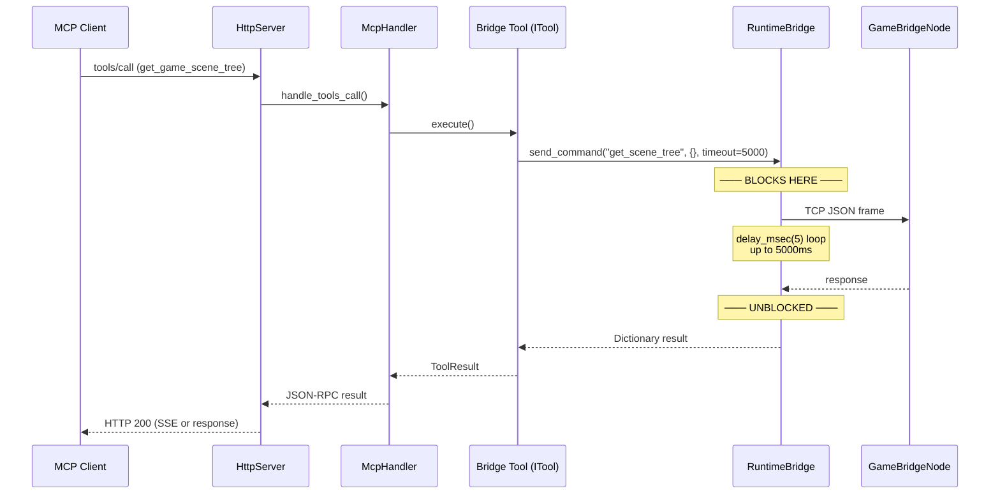
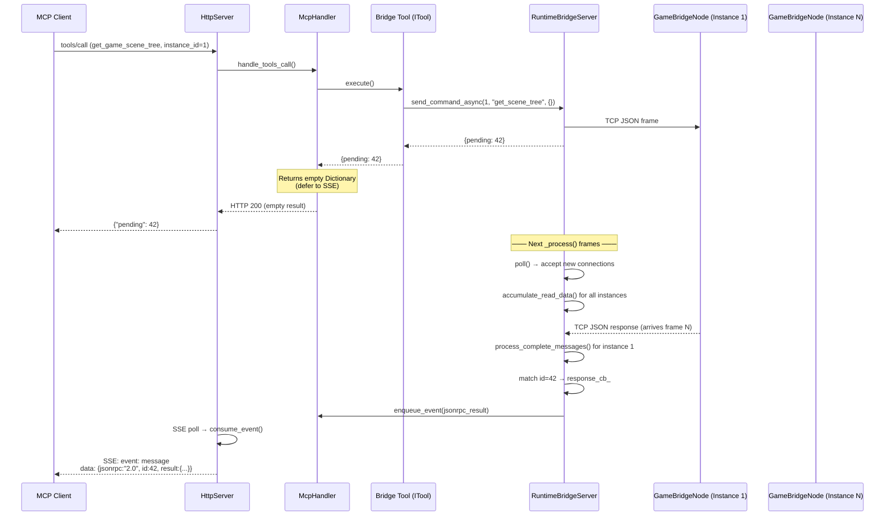
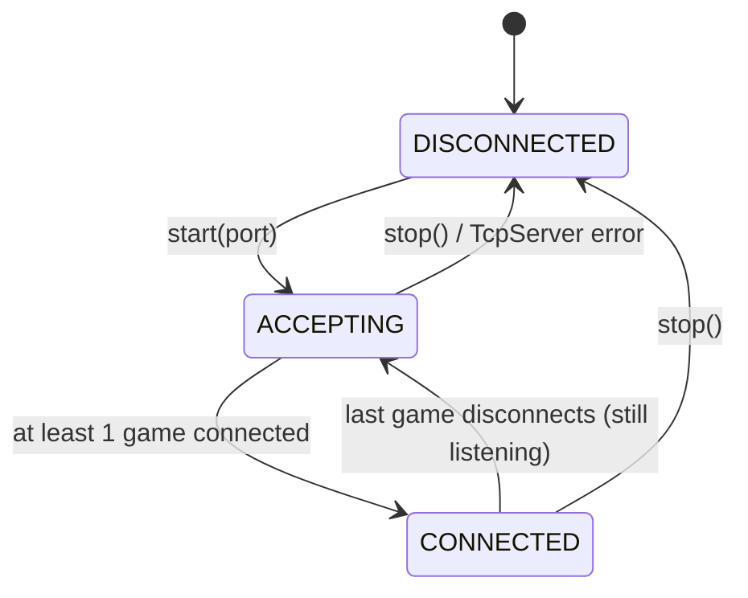
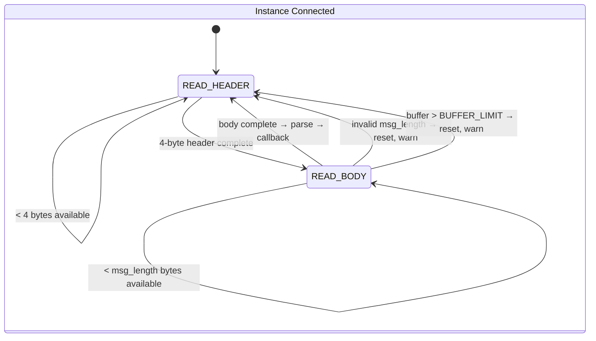

# LLD：运行时桥接服务器异步重构

> **模块**: `RuntimeBridgeServer` · **文件**: `extensions/src/runtime/bridge.hpp` / `bridge.cpp`  
> **设计者**: 高级 C++ GDExtension 工程师
> **状态**: 草案 v2 · **目标**: 编辑器零帧阻塞 + 多实例游戏路由

---

## 1. 模块概览

| 字段 | 值 |
|-------|-------|
| 模块名 | `RuntimeBridgeServer` |
| 源码位置 | `extensions/src/runtime/bridge_server.hpp`, `bridge_server.cpp` |
| 当前设计缺陷 | `send_command()` → `read_response()` 使用**忙等待循环**（`OS::delay_msec(5)`），阻塞 Godot 编辑器主线程长达 `timeout_ms`（默认 100ms，`capture_game_screenshot` 最长 5000ms）。同时仅支持**一个游戏进程**——无多实例支持。 |
| 受影响工具（7） | `get_game_scene_tree`, `get_game_node_property`, `set_game_node_property`, `call_method_in_game`, `capture_game_screenshot`, `simulate_game_input`, `wait_for_bridge` |
| 设计目标 | 运行时桥接通信期间**零阻塞**。所有桥接 I/O 在 `_process()` 帧切片内完成。响应通过 SSE 送达。支持 **N 个并发游戏实例**以进行多人测试。 |
| 关键约束 | 对 `GameBridgeNode`（游戏进程侧）做**最小改动**——从 TCP 服务器翻转为 TCP 客户端，线路协议和帧格式保持不变。 |

### 1.1 当前架构问题



### 1.2 目标架构（异步服务器）



---

## 2. 类设计

### 2.1 头文件（`bridge_server.hpp`）——完整提议接口

```cpp
#pragma once

#include <functional>
#include <godot_cpp/classes/ref.hpp>
#include <godot_cpp/classes/stream_peer_tcp.hpp>
#include <godot_cpp/classes/tcp_server.hpp>
#include <godot_cpp/templates/hash_map.hpp>
#include <godot_cpp/variant/dictionary.hpp>
#include <godot_cpp/variant/packed_byte_array.hpp>
#include <godot_cpp/variant/string.hpp>

namespace godot_mcp {

constexpr int DEFAULT_TIMEOUT_MS = 100;
constexpr int64_t MAX_MESSAGE_SIZE = 65536;
constexpr int64_t BUFFER_LIMIT = 1024 * 1024; // 1 MB

class RuntimeBridgeServer {
public:
    enum Status { DISCONNECTED, ACCEPTING, CONNECTED };

    RuntimeBridgeServer();
    ~RuntimeBridgeServer();

    // --- Lifecycle ---
    void poll();           // Accept new connections + async read on all instances
    void start(int port);  // Begin listening on TCP server
    void stop();           // Stop server, disconnect all instances
    bool is_connected() const { return status_ == CONNECTED || status_ == ACCEPTING; }
    bool has_instances() const { return !instances_.is_empty(); }
    Status status() const { return status_; }

    // --- Async command interface ---
    // Sends command to a specific game instance, returns {pending: request_id}.
    // Complete response arrives via ResponseCallback → enqueue_event().
    godot::Dictionary send_command_async(int instance_id,
                                          const godot::String &cmd,
                                          const godot::Dictionary &params);

    // --- Instance queries ---
    godot::Array get_connected_instances() const;
    int instance_count() const { return static_cast<int>(instances_.size()); }

    // --- Callback (set by McpEditorPlugin) ---
    using ResponseCallback = std::function<void(const godot::Dictionary&)>;
    void set_response_callback(ResponseCallback cb) { response_cb_ = std::move(cb); }

    void set_port(int port) { port_ = port; }
    int port() const { return port_; }

private:
    // ── Per-game-instance state ──
    struct GameInstance {
        int id;                               // Unique instance ID (assigned by server)
        godot::Ref<godot::StreamPeerTCP> connection;
        uint64_t connected_at;                // Ticks at connection time

        // Async read state (per-instance, como antes)
        enum ReadState { READ_HEADER, READ_BODY };
        ReadState read_state_ = READ_HEADER;
        int64_t msg_length_ = 0;
        int64_t body_received_ = 0;
        godot::PackedByteArray read_buf_;
        int64_t read_offset_ = 0;
    };

    // ── Pending request tracking ──
    struct PendingRequest {
        int64_t id;
        int instance_id;                       // Which game instance this request targets
        uint64_t deadline_msec;                // 0 = no timeout
        bool completed = false;
        godot::Dictionary response;
    };

    // ── Internal helpers ──
    void accept_new_connections();
    int add_instance(const godot::Ref<godot::StreamPeerTCP> &conn);
    void remove_instance(int instance_id);

    void send_only(int instance_id,
                   const godot::String &cmd,
                   const godot::Dictionary &params,
                   int64_t id);
    void accumulate_read_data(int instance_id, GameInstance &inst);
    void process_complete_messages(int instance_id, GameInstance &inst);
    void process_timeouts(uint64_t now);
    void error_all_pending(const godot::String &code, const godot::String &msg);
    void error_instance_pending(int instance_id,
                                const godot::String &code,
                                const godot::String &msg);
    void reset_read_state(GameInstance &inst);

    // ── Member state ──
    Status status_ = DISCONNECTED;
    godot::Ref<godot::TcpServer> server_;
    godot::HashMap<int, GameInstance> instances_;
    godot::HashMap<int64_t, PendingRequest> pending_;
    int next_instance_id_ = 1;
    int port_ = 9601;
    int64_t next_request_id_ = 1;
    uint64_t listening_since_ = 0;
    ResponseCallback response_cb_;
};

} // namespace godot_mcp
```

### 2.2 与 v1 的差异

| 方面 | v1（`RuntimeBridge`） | v2（`RuntimeBridgeServer`） |
|--------|---------------------|---------------------------|
| 角色 | TCP 客户端 → 连接游戏 | TCP 服务器 ← 游戏连接过来 |
| 核心成员 | `Ref<StreamPeerTCP> tcp_` | `Ref<TcpServer> server_` + `HashMap<int, GameInstance>` |
| 状态机 | `DISCONNECTED → CONNECTING → CONNECTED` | `DISCONNECTED → ACCEPTING → CONNECTED` |
| 连接模型 | 单个游戏进程 | N 个并发游戏实例 |
| 读取状态 | 单一 `read_state_`、`read_buf_` | 每个实例在 `GameInstance` 中 |
| 发送目标 | 隐含（唯一连接） | 显式 `instance_id` 参数 |
| `send_command()` | 阻塞（旧版） | **已移除**——所有调用方使用异步 |
| `send_command_async()` | 无 `instance_id` | `(int instance_id, String cmd, Dict params)` |
| `connect()` | 建立出站连接 | **已移除**——服务器监听，游戏连接 |
| `disconnect()` | 单次拆除 | `stop()`——关闭服务器 + 所有实例 |
| `GameInstance` | 不适用 | 新增：跟踪每个连接的状态 |
| `accept_new_connections()` | 不适用 | 新增：`TcpServer::is_connection_available()` 循环 |
| `error_instance_pending()` | 不适用 | 新增：限定到单个实例 |
| `get_connected_instances()` | 不适用 | 新增：返回 `Dictionary` 的 `Array` |

---

## 3. 状态机

### 3.1 服务器状态机



**关键区分**: `ACCEPTING` 表示 `TcpServer` 正在监听但尚无游戏连接。`CONNECTED` 表示至少有一个游戏实例活跃。当有实例存在但为向后兼容报告 `is_connected() == true` 时，服务器仍处于 `ACCEPTING` 状态。

### 3.2 每个实例的读取子状态机（在每个 `GameInstance` 内部）



---

## 4. 核心算法

### 4.1 `send_command_async()` 流程

```
send_command_async(instance_id, cmd, params)
│
├─ IF !instances_.has(instance_id)
│   └─ RETURN {ok: false, error: "Game instance not found"}
│
├─ id = next_request_id_++
│
├─ Build JSON frame:
│   msg = {cmd, params, id}
│   json_bytes = JSON::stringify(msg).to_utf8_buffer()
│   frame = [4-byte big-endian len | json_bytes]
│
├─ send_only(instance_id, cmd, params, id)
│   ├─ tcp = instances_[instance_id].connection
│   ├─ err = tcp->put_data(frame)
│   ├─ IF err != OK
│   │   ├─ remove_instance(instance_id)
│   │   └─ RETURN {ok: false, error: "Instance connection broken"}
│   └─ (success)
│
├─ pending_[id] = PendingRequest{id, instance_id, deadline_msec = now + DEFAULT_TIMEOUT_MS}
│
└─ RETURN {pending: id}
```

### 4.2 `poll()` 流程（每帧由 `McpEditorPlugin::_process()` 调用）

```
poll()
│
├─ IF status_ == DISCONNECTED → RETURN
│
├─ // Step 1: Accept new connections
├─ accept_new_connections()
│
├─ IF status_ == ACCEPTING && instances_.size() > 0
│   └─ status_ = CONNECTED
│
├─ // Step 2: Poll each instance
├─ FOR EACH (id, inst) in instances_
│   ├─ inst.connection->poll()
│   ├─ IF connection status == ERROR || NONE
│   │   ├─ error_instance_pending(id, "CONNECTION_LOST", "Instance disconnected")
│   │   ├─ remove_instance(id)
│   │   └─ CONTINUE
│   │
│   ├─ accumulate_read_data(id, inst)
│   ├─ process_complete_messages(id, inst)
│   └─ (next instance)
│
├─ // Step 3: Handle state transition when last instance leaves
├─ IF status_ == CONNECTED && instances_.is_empty()
│   └─ status_ = ACCEPTING
│
├─ // Step 4: Timeout cleanup
├─ process_timeouts(now)
│
└─ RETURN
```

### 4.3 `accept_new_connections()`——服务器接受循环

```
accept_new_connections()
│
├─ IF server_.is_null() → RETURN
│
├─ WHILE server_->is_connection_available()
│   ├─ conn = server_->take_connection()
│   ├─ IF conn.is_null() → break
│   │
│   ├─ id = next_instance_id_++
│   ├─ instances_[id] = GameInstance{
│   │     id,
│   │     connection = conn,
│   │     connected_at = Time::get_singleton()->get_ticks_msec()
│   │   }
│   │
│   ├─ log_info("Game instance {id} connected (total: {count})")
│   │
│   └─ // Invoke watcher if any (see §6)
│       IF watcher_active_ && instances_.size() == 1
│           resolve_watcher()
│
└─ (done)
```

### 4.4 `accumulate_read_data()`——每个实例的非阻塞 TCP 读取

```
accumulate_read_data(instance_id, inst)
│
├─ avail = inst.connection->get_available_bytes()
├─ IF avail <= 0 → RETURN
│
├─ chunk = inst.connection->get_partial_data(avail)
├─ IF chunk[0] != OK → RETURN
│
├─ inst.read_buf_.append_array(chunk[1])
│
├─ IF inst.read_buf_.size() > BUFFER_LIMIT
│   ├─ log_warn("Instance {id} buffer overflow, resetting")
│   ├─ reset_read_state(inst)
│   └─ RETURN
│
└─ (data appended, process_complete_messages will handle it)
```

### 4.5 `process_complete_messages()`——每个实例的帧解析与分发

```
process_complete_messages(instance_id, inst)
│
├─ WHILE inst.read_offset_ + 4 <= inst.read_buf_.size()
│   │
│   ├─ IF inst.read_state_ == READ_HEADER
│   │   ├─ Read 4-byte big-endian: inst.msg_length_
│   │   ├─ IF msg_length_ <= 0 || msg_length_ > MAX_MESSAGE_SIZE
│   │   │   ├─ log_warn("Instance {id}: invalid message length")
│   │   │   ├─ reset_read_state(inst)
│   │   │   └─ CONTINUE
│   │   ├─ inst.read_state_ = READ_BODY
│   │   ├─ inst.read_offset_ += 4
│   │   ├─ inst.body_received_ = 0
│   │   └─ (fall through)
│   │
│   ├─ remaining = inst.read_buf_.size() - inst.read_offset_
│   ├─ IF remaining < inst.msg_length_
│   │   └─ BREAK (wait for more data next frame)
│   │
│   ├─ // Complete message body
│   ├─ body = inst.read_buf_.subarray(inst.read_offset_,
│   │                                   inst.read_offset_ + inst.msg_length_)
│   ├─ inst.read_offset_ += inst.msg_length_
│   ├─ inst.read_state_ = READ_HEADER
│   │
│   ├─ // Parse JSON
│   ├─ text = body.utf8().get_data()
│   ├─ json = JSON::parse_string(text)
│   ├─ IF parse fails → log_warn, CONTINUE
│   │
│   ├─ IF json is not Dictionary → CONTINUE
│   │
│   ├─ response_id = json["id"]
│   ├─ IF pending_.has(response_id)
│   │   ├─ pending_[response_id].response = json
│   │   ├─ pending_[response_id].completed = true
│   │   ├─ IF response_cb_
│   │   │   └─ response_cb_(json)  // Enqueues SSE event
│   │   └─ pending_.erase(response_id)
│   │
│   └─ ELSE
│       └─ log_warn("Instance {id}: response ID not in pending map")
│
├─ // Trim processed bytes
├─ IF inst.read_offset_ > 0
│   ├─ IF inst.read_offset_ >= inst.read_buf_.size()
│   │   ├─ inst.read_buf_.clear()
│   │   └─ inst.read_offset_ = 0
│   ├─ ELSE
│   │   ├─ inst.read_buf_ = inst.read_buf_.subarray(inst.read_offset_,
│   │   │                                               inst.read_buf_.size())
│   │   └─ inst.read_offset_ = 0
│   └─ (done)
```

### 4.6 `process_timeouts()`——过期请求清理

```
process_timeouts(now)
│
├─ FOR EACH entry in pending_
│   ├─ IF entry.deadline_msec > 0 && now > entry.deadline_msec
│   │   ├─ IF response_cb_
│   │   │   └─ response_cb_({
│   │   │       "id": entry.id,
│   │   │       "instance_id": entry.instance_id,
│   │   │       "error": {"code": "TIMEOUT",
│   │   │                  "message": "Bridge request timed out"}
│   │   │   })
│   │   └─ Mark entry for removal
│   └─ (still valid)
│
└─ Clean removed entries from pending_ map
```

### 4.7 `get_connected_instances()`——实例列表

```
get_connected_instances()
│
├─ result = Array()
├─ FOR EACH (id, inst) in instances_
│   ├─ entry = Dictionary()
│   ├─ entry["id"] = id
│   ├─ entry["connected_at"] = inst.connected_at
│   ├─ entry["uptime_msec"] = now - inst.connected_at
│   ├─ result.push_back(entry)
│   └─ (next)
│
└─ RETURN result
```

---

## 5. McpHandler 集成

### 5.1 `handle_tools_call()`——待处理检测

在 `mcp_handler.cpp:handle_tools_call()` 中，在 `tool_executor_.execute()` 返回后添加以下检查：

```cpp
// ── Pending bridge request detection ──
if (exec_result.has("pending") &&
    exec_result["pending"].get_type() == Variant::INT) {
    return Dictionary();
}
```

这镜像了现有的破坏性操作推迟模式，其中空的 `Dictionary()` 返回值表示"稍后通过 `enqueue_event()` 发送响应"。

### 5.2 `RuntimeBridgeServer::set_response_callback()`——连线

在 `editor_plugin.cpp:_enter_tree()` 中，配置 `bridge_server_` 之后：

```cpp
bridge_server_.set_response_callback(
    [this, mcp_handler = &mcp_handler_](const Dictionary &response) {
        Dictionary jsonrpc;
        jsonrpc["jsonrpc"] = "2.0";
        jsonrpc["id"] = response["id"];

        if (response.has("error")) {
            Dictionary error;
            Variant err_val = response["error"];
            if (err_val.get_type() == Variant::DICTIONARY) {
                error = Dictionary(err_val);
            } else {
                error["code"] = "BRIDGE_ERROR";
                error["message"] = String(err_val);
            }
            Dictionary err;
            err["code"] = -32603;
            err["message"] = error.get("message", "Bridge command failed");
            jsonrpc["error"] = err;
        } else {
            Dictionary formatted = RuntimeBridgeServer::make_response(response);
            jsonrpc["result"] = formatted;
        }

        mcp_handler->enqueue_event(jsonrpc);
    }
);
```

### 5.3 桥接工具迁移——模式

每个桥接工具从以下形式变更：

```cpp
// BEFORE (synchronous, single instance):
Dictionary execute_impl(const ToolContext &ctx) override {
    RuntimeBridge *bridge = registry_->get_runtime_bridge();
    int timeout = args_int(ctx.args, "timeout_ms", 5000);
    return RuntimeBridge::make_response(
        bridge->send_command("screenshot", params, timeout));
}
```

变为：

```cpp
// AFTER (async, multi-instance):
Dictionary execute_impl(const ToolContext &ctx) override {
    RuntimeBridgeServer *bridge = registry_->get_runtime_bridge_server();
    if (!bridge || !bridge->has_instances()) {
        return ToolResult::err("GAME_NOT_RUNNING", "No game instances connected");
    }
    int instance_id = args_int(ctx.args, "instance_id",
                               bridge->get_default_instance_id());
    if (!bridge->has_instance(instance_id)) {
        return ToolResult::err("INSTANCE_NOT_FOUND",
                               "Game instance {instance_id} not found");
    }
    Dictionary result = bridge->send_command_async(instance_id, "screenshot", params);
    return ToolResult::ok(result);
}
```

### 5.4 `get_default_instance_id()` 辅助函数

当 `instance_id` 省略时，路由到第一个连接的实例：

```cpp
int RuntimeBridgeServer::get_default_instance_id() const {
    if (instances_.is_empty()) return -1;
    // Return the first instance (oldest connection by default)
    int oldest_id = -1;
    uint64_t oldest_time = UINT64_MAX;
    for (const auto &kv : instances_) {
        if (kv.value.connected_at < oldest_time) {
            oldest_time = kv.value.connected_at;
            oldest_id = kv.key;
        }
    }
    return oldest_id;
}
```

### 5.5 新工具：`list_game_instances`

| 方面 | 值 |
|--------|-------|
| 名称 | `list_game_instances` |
| 分类 | `runtime_tools` |
| 描述 | 列出所有已连接的游戏实例及元数据 |
| 输入 | 无 |
| 输出 | `{id, connected_at, uptime_msec}` 的数组 |

```cpp
Dictionary execute_impl(const ToolContext &ctx) override {
    RuntimeBridgeServer *bridge = registry_->get_runtime_bridge_server();
    if (!bridge) {
        return ToolResult::err("BRIDGE_UNAVAILABLE", "Runtime bridge not available");
    }
    Array instances = bridge->get_connected_instances();
    Dictionary data;
    data["instances"] = instances;
    data["count"] = bridge->instance_count();
    return ToolResult::ok(data);
}
```

### 5.6 受影响工具迁移表

| 工具 | 当前超时 | 变更 |
|------|----------------|---------|
| `get_game_scene_tree` | 100ms | 添加 `instance_id` 参数，切换到 `send_command_async()` |
| `get_game_node_property` | 100ms | 同上 |
| `set_game_node_property` | 100ms | 同上 |
| `call_method_in_game` | 100ms | 同上 |
| `capture_game_screenshot` | 5000ms | 同上——**最大的用户体验提升** |
| `simulate_game_input` | 100ms | 同上 |
| `wait_for_bridge` | 8000ms | 转换为帧驱动的观察器 |

---

## 6. WaitForBridgeTool——帧驱动观察器

### 6.1 新设计

`WaitForBridgeTool` 变为由 `RuntimeBridgeServer::poll()` 管理的**帧驱动观察器**：

```cpp
// RuntimeBridgeServer new members:
struct BridgeWatcher {
    bool active = false;
    int64_t jsonrpc_id = 0;
    uint64_t deadline_msec = 0;
    McpHandler *handler = nullptr;
};
BridgeWatcher watcher_;
```

**在 `RuntimeBridgeServer::poll()` 中**（接受循环之后）：

```cpp
// Check bridge watcher — resolved when first game instance appears
if (watcher_.active && has_instances()) {
    watcher_.active = false;
    Dictionary result;
    result["message"] = "Bridge connected";
    result["instances"] = get_connected_instances();
    Dictionary jsonrpc;
    jsonrpc["jsonrpc"] = "2.0";
    jsonrpc["id"] = watcher_.jsonrpc_id;
    jsonrpc["result"] = result;
    watcher_.handler->enqueue_event(jsonrpc);
}

// Bridge watcher timeout
if (watcher_.active &&
    Time::get_singleton()->get_ticks_msec() > watcher_.deadline_msec) {
    watcher_.active = false;
    Dictionary jsonrpc;
    jsonrpc["jsonrpc"] = "2.0";
    jsonrpc["id"] = watcher_.jsonrpc_id;
    Dictionary err;
    err["code"] = -32603;
    err["message"] = "No game instance connected within timeout";
    jsonrpc["error"] = err;
    watcher_.handler->enqueue_event(jsonrpc);
}
```

**在 `WaitForBridgeTool::execute_impl()` 中**：

```cpp
Dictionary execute_impl(const ToolContext &ctx) override {
    RuntimeBridgeServer *bridge = registry_->get_runtime_bridge_server();
    if (!bridge) {
        return ToolResult::err("BRIDGE_UNAVAILABLE", "Runtime bridge not available");
    }
    if (bridge->has_instances()) {
        Dictionary data;
        data["message"] = "Bridge already connected";
        data["instances"] = bridge->get_connected_instances();
        return ToolResult::ok(data);
    }

    McpHandler *mcp = registry_->get_mcp_handler();
    if (!mcp) return ToolResult::err("HANDLER_UNAVAILABLE", "MCP handler unavailable");

    int timeout = args_int(ctx.args, "timeout_ms", 8000);
    bridge->start_watcher(mcp, ctx.jsonrpc_id, timeout);
    return Dictionary();  // defer to SSE
}
```

### 6.2 关键约束

`WaitForBridgeTool::execute_impl()` **绝不能调用 `OS::delay_msec()`**。零忙等待循环。

---

## 7. TCP 部分帧安全性

### 7.1 经验证的模式重用

`GameBridgeNode::read_clients()` 方法（`game_bridge.cpp:160-218`）已经实现了健壮的跨帧 TCP 读取器。新的 `RuntimeBridgeServer` 完全镜像此模式，现在为每个实例：

| 模式 | GameBridgeNode（已验证） | RuntimeBridgeServer（新增） |
|---------|------------------------|---------------------------|
| 跨帧累积 | `read_buf_` 作为成员 | `GameInstance` 中每个实例的 `read_buf_` |
| 部分 4 字节头 | 由 `while + offset + 4 > size` 处理 | 通过 `READ_HEADER` 状态同上 |
| 部分体 | 由 `offset + 4 + len > size` 处理 | 通过 `remaining < msg_length_` 同上 |
| 消息验证 | `MAX_MESSAGE_SIZE` 守卫 | 同上 |
| 缓冲区溢出 | `BUFFER_LIMIT`（1MB）刷新 | 同上，每个实例 |
| 修剪已处理字节 | `copy_n` 尾部字节 | 通过 `subarray` 同上 |

### 7.2 为何这有效

TCP 流是**面向字节、有序、可靠**的。所有消息以 4 字节大端长度前缀定帧。TCP 段可能以任意边界到达——正是 `GameBridgeNode` 已经处理的场景。通过对每个实例复制相同算法，我们保证无消息丢失、无部分解释、每个连接内存有界。

### 7.3 与 v1（RuntimeBridge）的关键差异

| 方面 | v1（RuntimeBridge 客户端） | v2（RuntimeBridgeServer） |
|--------|--------------------------|--------------------------|
| TCP 角色 | 客户端（出站连接） | 服务器（入站接受） |
| 连接数 | 1 | N |
| 读取状态 | 单一全局 | `GameInstance` 中每个实例 |
| 缓冲区压力 | 总计 1 MB | 每个实例 × N 各 1 MB |

---

## 8. 错误处理

### 8.1 错误场景

| 场景 | 检测 | 处理 | 错误码 |
|----------|-----------|----------|------------|
| TcpServer 监听失败 | `server_->listen() != OK` | `stop()`，记录错误，设置 `DISCONNECTED` | `LISTEN_FAILED` |
| 实例 TCP 在请求中断开 | `poll()` 看到 `STATUS_ERROR` / `STATUS_NONE` | `error_instance_pending(id, "CONNECTION_LOST")` → `remove_instance()` | `CONNECTION_LOST` |
| 响应超时 | `process_timeouts()` 发现 `now > deadline_msec` | 入队 JSON-RPC 错误，从 `pending_` 中移除 | `TIMEOUT` |
| 无效消息长度 | `msg_length_ <= 0 or > MAX_MESSAGE_SIZE` | `reset_read_state()`，记录警告 | （静默恢复） |
| 缓冲区 > BUFFER_LIMIT（1MB） | `append_array` 之后 | `reset_read_state()`，记录警告 | （静默恢复） |
| ID 不匹配 | 响应 ID 不在 `pending_` 中 | 记录警告，忽略消息 | （静默） |
| `put_data()` 发送失败 | `tcp->put_data(frame) != OK` | `remove_instance()`，`error_instance_pending("SEND_FAILED")` | `SEND_FAILED` |
| 体中的无效 JSON | `JSON::parse_string()` 失败 | 记录警告，跳过帧 | （静默） |
| 体不是 Dictionary | 解析类型 != DICTIONARY | 记录警告，跳过帧 | （静默） |
| **实例未找到**（多实例） | `instances_.has(id)` 为 false | 返回立即错误 | `INSTANCE_NOT_FOUND` |
| **所有实例断开** | `instances_` 变空 | `status_` 恢复为 `ACCEPTING`，`error_all_pending("ALL_DISCONNECTED")` | `ALL_DISCONNECTED` |

### 8.2 新增：`error_instance_pending()` 实现

```cpp
void RuntimeBridgeServer::error_instance_pending(int instance_id,
                                                  const String &code,
                                                  const String &msg) {
    if (!response_cb_) {
        // Remove only pending requests for this instance
        Vector<int64_t> dead;
        for (const auto &kv : pending_) {
            if (kv.value.instance_id == instance_id)
                dead.push_back(kv.key);
        }
        for (int64_t id : dead) pending_.erase(id);
        return;
    }

    Vector<int64_t> dead;
    for (const auto &kv : pending_) {
        if (kv.value.instance_id == instance_id)
            dead.push_back(kv.key);
    }
    for (int64_t id : dead) {
        Dictionary error_response;
        error_response["id"] = id;
        error_response["instance_id"] = instance_id;
        Dictionary error;
        error["code"] = code;
        error["message"] = msg;
        error_response["error"] = error;
        response_cb_(error_response);
        pending_.erase(id);
    }
}
```

### 8.3 `error_all_pending()`（已修改——在错误中添加 `instance_id`）

```cpp
void RuntimeBridgeServer::error_all_pending(const String &code, const String &msg) {
    if (!response_cb_) {
        pending_.clear();
        return;
    }

    Vector<int64_t> dead;
    for (const auto &kv : pending_) dead.push_back(kv.key);
    for (int64_t id : dead) {
        Dictionary error_response;
        error_response["id"] = id;
        error_response["instance_id"] = pending_[id].instance_id;
        Dictionary error;
        error["code"] = code;
        error["message"] = msg;
        error_response["error"] = error;
        response_cb_(error_response);
        pending_.erase(id);
    }
}
```

---

## 9. 数据流图

```mermaid
flowchart TD
    subgraph "MCP Client (AI)"
        A["tools/call<br/>get_game_scene_tree<br/>instance_id=1"]
        B["SSE: event: message<br/>{id:42, result:{...}}"]
    end

    subgraph "Godot Editor (Main Thread)"
        C["HttpServer::poll()"]
        D["McpHandler::handle_tools_call()"]
        E["ToolExecutor::execute()"]
        F["Bridge Tool<br/>execute_impl()"]
        G["RuntimeBridgeServer::send_command_async(1, ...)"]
        H["RuntimeBridgeServer::poll()"]
        I["RuntimeBridgeServer::<br/>accept_new_connections()"]
        J["RuntimeBridgeServer::<br/>accumulate_read_data(inst)"]
        K["RuntimeBridgeServer::<br/>process_complete_messages(inst)"]
        L["RuntimeBridgeServer::<br/>process_timeouts()"]
        M["McpHandler::enqueue_event()"]
        N["McpEditorPlugin::_process()"]
    end

    subgraph "Game Instance 1"
        O1["GameBridgeNode"]
        P1["TCP response"]
    end

    subgraph "Game Instance N"
        ON["GameBridgeNode"]
        PN["TCP response"]
    end

    A -->|HTTP POST| C
    C --> D
    D --> E
    E --> F
    F -->|send_command_async| G
    G -->|TCP write to inst 1| O1
    G -->|return {pending:42}| F
    F -->|return {pending:42}| E
    E -->|exec_result| D
    D -->|HTTP 200 empty| C
    C -->|SSE: OK| A

    N -->|every frame| H
    H --> I
    I -->|new connections| O1
    I -->|new connections| ON

    O1 -->|TCP response| J
    ON -->|TCP response| J

    J --> K
    K -->|match id=42| M
    H --> L
    L -->|timeout error| M
    M -->|global_event_queue_| C
    C -->|SSE event| B
```

---

## 10. 测试计划

### 10.1 单元测试（通过 `TestEngine` + `/run-tests`）

| 测试 ID | 描述 | 预期结果 |
|---------|-------------|-----------------|
| `UT-BRIDGE-01` | 部分头时 `accumulate_read_data()` | 状态机保持在 `READ_HEADER` |
| `UT-BRIDGE-02` | 部分体时 `accumulate_read_data()` | 转换到 `READ_BODY`，body_received_ < msg_length_ |
| `UT-BRIDGE-03` | 有效帧时 `process_complete_messages()` | 回调被调用，pending_ 条目被移除 |
| `UT-BRIDGE-04` | 无效长度（0） | 重置状态，记录警告 |
| `UT-BRIDGE-05` | 超长长度（>65536） | 重置状态，记录警告 |
| `UT-BRIDGE-06` | 无效 JSON 体 | 记录警告，跳过帧 |
| `UT-BRIDGE-07` | 过期请求时 `process_timeouts()` | 带 `TIMEOUT` 错误的回调 |
| `UT-BRIDGE-08` | 有效请求时 `process_timeouts()` | 无回调，条目保留 |
| `UT-BRIDGE-09` | 断开时 `error_all_pending()` | N 个错误回调，pending_ 为空 |
| `UT-BRIDGE-10` | 未知 instance_id 时 `send_command_async()` | 返回 `INSTANCE_NOT_FOUND` |
| `UT-BRIDGE-11` | 0 个实例时 `get_connected_instances()` | 空数组 |
| `UT-BRIDGE-12` | 3 个实例时 `get_connected_instances()` | 包含 3 个正确 ID 的数组 |

### 10.2 多实例单元测试

| 测试 ID | 描述 | 预期结果 |
|---------|-------------|-----------------|
| `UT-MI-01` | 2 个实例连接，仅向实例 1 发送 | 实例 2 不接收，实例 1 收到消息 |
| `UT-MI-02` | 对实例 1 的请求待处理时实例 2 断开 | 实例 1 请求不受影响，实例 2 请求报错 |
| `UT-MI-03` | 实例 2 空闲时向实例 1 发送 `send_command_async()` | 正确路由，无串扰 |
| `UT-MI-04` | 实例 1 缓冲区溢出 | 实例 1 状态重置，实例 2 不受影响 |
| `UT-MI-05` | 5 个实例同时连接 | 全部接受，ID 唯一，均可读取 |
| `UT-MI-06` | 从已存在实例读取时接受新连接 | 现有读取状态保留，新实例添加 |

### 10.3 集成测试

| 测试 ID | 描述 | 预期结果 |
|---------|-------------|-----------------|
| `IT-BRIDGE-01` | `capture_game_screenshot` 零阻塞 | 无帧掉落 > 16ms 可归因于桥接 |
| `IT-BRIDGE-02` | `get_game_scene_tree` 异步交付 | 立即返回 `{pending: id}`，2 帧内 SSE |
| `IT-BRIDGE-03` | 向同一实例并发 3 个桥接调用 | 全部 3 个 SSE 响应以正确 ID 到达 |
| `IT-BRIDGE-04` | 待处理期间桥接断开 | 5000ms 内 SSE 错误 `CONNECTION_LOST` |
| `IT-BRIDGE-05` | `wait_for_bridge` 非阻塞 | 在原 `delay_msec` 之前返回 |
| `IT-BRIDGE-06` | 2 个游戏实例连接，路由到各自 | 两者均正确响应，无串扰 |
| `IT-BRIDGE-07` | 实例 1 死亡，继续与实例 2 通信 | 实例 2 不受影响 |
| `IT-BRIDGE-08` | 3 个实例时 `list_game_instances` | 返回包含 3 个条目的数组及准确元数据 |

### 10.4 边界情况测试

| 测试 ID | 描述 | 预期结果 |
|---------|-------------|-----------------|
| `EC-BRIDGE-01` | 在 ACCEPTING 状态（无实例）时发送命令 | 立即报错，无阻塞 |
| `EC-BRIDGE-02` | 已超时请求的响应到达 | 记录警告，忽略 |
| `EC-BRIDGE-03` | 相同 ID 的两个响应（重复） | 第一个触发回调，第二个警告 |
| `EC-BRIDGE-04` | TCP 响应分割为 3+ 段 | 全部累积，回调触发一次 |
| `EC-BRIDGE-05` | 缓冲区增长接近 1MB 限制 | 警告，重置，无崩溃 |
| `EC-BRIDGE-06` | 1000 次快速 `send_command_async()` 调用 | 所有 ID 唯一，无泄漏，pending_ 有界 |
| `EC-BRIDGE-07` | 实例连接后立即断开 | 干净移除，无悬挂状态 |
| `EC-BRIDGE-08` | 10 个实例同时全部断开 | `error_all_pending()` 为剩余请求触发 |

### 10.5 回归测试

| 测试 ID | 描述 |
|---------|-------------|
| `RG-BRIDGE-01` | 所有现有 25 个 YAML 测试文件通过（添加了 instance_id） |
| `RG-BRIDGE-02` | 单游戏工作流与 v1 行为相同 |
| `RG-BRIDGE-03` | 编辑器启动顺序不变（服务器启动，游戏连接） |
| `RG-BRIDGE-04` | 编辑器关闭干净（无悬挂 TCP，无待处理回调段错误） |

---

## 11. 迁移计划

### 第一阶段：RuntimeBridgeServer 实现（bridge_server.hpp + bridge_server.cpp）

1. 创建包含新类的 `bridge_server.hpp` / `bridge_server.cpp`
2. 实现 `GameInstance` 结构体、带 `instance_id` 的 `PendingRequest`
3. 实现 `start()`、`stop()`、`accept_new_connections()`
4. 实现每个实例的 `accumulate_read_data()`、`process_complete_messages()`
5. 实现 `send_command_async()`、`send_only()`、`process_timeouts()`
6. 实现 `error_instance_pending()`、`error_all_pending()`
7. 实现 `get_connected_instances()`、`get_default_instance_id()`
8. 验证编译：`uv run python main.py build`

### 第二阶段：GameBridgeNode 翻转（game_bridge.cpp）

1. **最小变更**：`GameBridgeNode` 从 TCP 服务器（`TcpServer` + 接受循环）切换为 TCP 客户端
2. 游戏进程现在调用 `connect_to_host(editor_ip, 9601)` 而非 `new TcpServer()`
3. 线路协议（4 字节长度前缀 + JSON）**不变**
4. 读取循环（`read_clients()`）**不变**——它已经在 `Ref<StreamPeerTCP>` 上工作
5. 验证编译

### 第三阶段：McpHandler + 工具迁移

1. 在 `mcp_handler.cpp:handle_tools_call()` 中添加待处理检测
2. 在 `editor_plugin.cpp:_enter_tree()` 中连接 `RuntimeBridgeServer::set_response_callback()`
3. 迁移 6 个桥接工具：添加 `instance_id` 参数，切换到 `send_command_async()`
4. 通过 X-macro 添加 `list_game_instances` 工具
5. 将 `WaitForBridgeTool` 迁移到帧驱动观察器
6. 更新 `McpToolRegistry` 引用：`get_runtime_bridge()` → `get_runtime_bridge_server()`
7. 验证编译 + 运行集成测试

### 第四阶段：清理

1. 删除旧的 `bridge.hpp` / `bridge.cpp` / `bridge.cpp.gen.cpp`（如存在）
2. 更新所有 `#include` 路径
3. 更新 `AGENTS.md` 和 `.repo_wiki/` 引用
4. 运行完整测试套件

### 回滚计划

如果第三阶段发现回归：
1. 在树中同时保留 `RuntimeBridge`（旧版）和 `RuntimeBridgeServer`
2. 添加编译时标志 `GODOTMCP_USE_LEGACY_BRIDGE` 作为门控
3. 通过该标志将桥接工具恢复为旧版调用
4. `RuntimeBridge`（客户端模式）继续像以前一样工作

---

## 12. 验收标准

| # | 标准 | 验证方法 |
|---|-----------|---------------------|
| 1 | `capture_game_screenshot`（原超时=5000ms）不冻结编辑器 | 记录 `_process()` 增量——无 > 16ms 增量可归因于桥接 |
| 2 | `get_game_scene_tree` 在 2 帧内通过 SSE 返回 | 检测 `process_complete_messages()` 时间戳与 SSE 交付 |
| 3 | 对同一实例的三个并发桥接调用全部解析 | 集成测试 `IT-BRIDGE-03` 通过 |
| 4 | 待处理期间桥接断开 → 5000ms 内 SSE 错误 | 集成测试 `IT-BRIDGE-04` 通过 |
| 5 | `WaitForBridgeTool` 不调用 `delay_msec()` | 代码审查 + 在工具中 grep `delay_msec` |
| 6 | **多实例**：两个游戏连接，独立路由 | 集成测试 `IT-BRIDGE-06`、`IT-BRIDGE-07` 通过 |
| 7 | **多实例**：5 个并发连接全部接受 | `UT-MI-05` 通过 |
| 8 | **多实例**：`list_game_instances` 返回正确元数据 | 集成测试 `IT-BRIDGE-08` 通过 |
| 9 | **多实例**：一个实例故障不影响其他 | `UT-MI-04`、`IT-BRIDGE-07` 通过 |
| 10 | `GameBridgeNode` 改动最小（仅 TCP 服务器→客户端翻转） | `git diff` 显示 `game_bridge.cpp` 改动 < 50 行 |
| 11 | 所有现有 25 个 YAML 测试文件通过（添加了 `instance_id`） | `uv run python main.py test` 通过 |

---

## 附录 A：JSON-RPC 2.0 消息格式

### 请求（编辑器 → 游戏实例）
```
TCP bytes: [0x00,0x00,0x00,0x3A][{"cmd":"get_scene_tree","params":{"max_depth":5},"id":42}]
```

### 响应（游戏实例 → 编辑器）
```
TCP bytes: [0x00,0x00,0x01,0x24][{"ok":true,"data":{"name":"root","type":"Node",...},"id":42}]
```

### 待处理令牌（立即返回给 MCP 客户端）
```json
{
    "jsonrpc": "2.0",
    "id": "mcp-request-1",
    "result": {
        "content": [
            {
                "type": "text",
                "text": "{\"pending\": 42, \"success\": true, \"data\": {}}"
            }
        ],
        "isError": false
    }
}
```

### SSE 交付（桥接响应到达时）
```json
{
    "jsonrpc": "2.0",
    "id": "mcp-request-1",
    "result": {
        "content": [
            {
                "type": "text",
                "text": "{\"success\": true, \"data\": {\"name\": \"root\", \"children\": [...]}}"
            }
        ],
        "isError": false
    }
}
```

### 超时错误（通过 SSE）
```json
{
    "jsonrpc": "2.0",
    "id": "mcp-request-1",
    "error": {
        "code": -32603,
        "message": "Bridge request timed out"
    }
}
```

### 连接丢失错误（通过 SSE）
```json
{
    "jsonrpc": "2.0",
    "id": "mcp-request-1",
    "error": {
        "code": -32603,
        "message": "Game instance 1 disconnected"
    }
}
```

### 实例未找到错误
```json
{
    "jsonrpc": "2.0",
    "id": "mcp-request-1",
    "error": {
        "code": -32603,
        "message": "Game instance 5 not found"
    }
}
```

## 附录 B：字节级线路格式验证

TCP 线路格式与 v1 **相同**。`GameBridgeNode`（发送方）和 `RuntimeBridgeServer`（接收方）一致遵循：

```
[4 bytes: big-endian uint32 body_length]
[body_length bytes: UTF-8 JSON]
```

| 偏移 | 大小 | 字段 | 描述 |
|--------|------|-------|-------------|
| 0 | 4 | 体长度 | 大端 uint32。必须在 1..65536 范围内 |
| 4 | N | JSON 体 | UTF-8 编码 JSON。必须解析为 Dictionary |

**字节序检查**：通过位移操作的大端编码（bridge-server.cpp），从原始版本保留。

**验证门控**（每个实例应用）：
- 长度必须 > 0 且 <= `MAX_MESSAGE_SIZE`（65536）
- 每个实例的缓冲区不得超过 `BUFFER_LIMIT`（1 MB）
- JSON 体必须解析为 Variant::DICTIONARY
