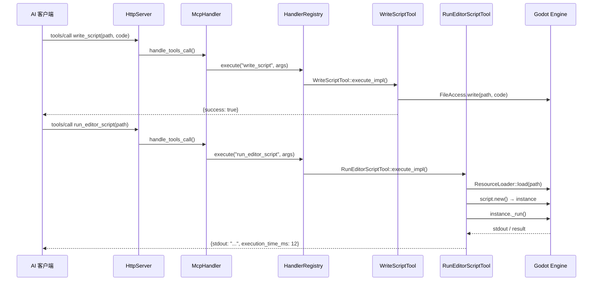

# LLD: `run_editor_script` — EditorScript 执行工具

> **状态:** 草案 · **版本:** 2.0 · **日期:** 2026-06-20  
> **设计目标:** 利用 Godot 内置 `EditorScript` 机制，让 AI 通过组合已有脚本工具 + 一个极薄执行包装来实现任意编辑器逻辑

---

## 1. 设计原则

### 1.1 为什么不走 `execute_gdscript`（字符串执行）

| 方案 | 问题 |
|------|------|
| 字符串编译执行（`GDScript::set_source_code` + `reload`） | 需要自建沙箱（黑名单、watchdog、超时、源码变换），维护成本高 |
| 沙箱 bypass 风险 | 这类功能是安全研究的常见目标，黑名单总有遗漏 |
| 不可调试 | 字符串参数不可设断点、不可单步 |

### 1.2 替代方案：EditorScript

Godot 4.6 内置 `EditorScript` 类，专为"在编辑器中运行一次性脚本"设计：

```gdscript
@tool
extends EditorScript

func _run():
    print("Hello from editor!")
    var scene = get_scene()
    for child in scene.get_children():
        print(child.name)
```

特性：
- **编译器检查语法** — 不是字符串执行，编译错误即时反馈
- **有文件可追溯** — `.gd` 文件在项目里，git 可见
- **可调试** — 可以在 Godot 脚本编辑器中设断点
- **零安全基础设施** — Godot 的 `@tool` 权限模型就是安全边界
- **`EditorInterface` 全权限** — 可以操作场景、文件系统、项目设置等

### 1.3 与现有脚本工具的组合

我们已有成熟的脚本工具链，`run_editor_script` 是最后一块拼图：

```
write_script("res://_mcp/eval_001.gd", code)   # 已有 — 写入 EditorScript 文件
  → run_editor_script("res://_mcp/eval_001.gd")  # 新增 — 加载执行
    → read_script("res://_mcp/eval_001.gd")        # 已有 — 读取 stdout/结果
      → delete_script("res://_mcp/eval_001.gd")    # 已有 — 清理临时文件
```

---

## 2. 工具接口

```cpp
// extensions/src/built_in/tools/editor_tools/scripts/run_editor_script.hpp
class RunEditorScriptTool : public ITool {
public:
    String name() const override { return "run_editor_script"; }
    String brief() const override { return "Execute an EditorScript (.gd) file in the editor context"; }
    String category() const override { return "editor_tools/scripts"; }
    bool is_destructive() const override { return true; }
    bool supports_undo() const override { return false; }

    Dictionary build_input_schema() const override {
        SchemaBuilder sb("object");
        sb.required_string("path", "Path to .gd script file (must extend EditorScript)");
        sb.optional_int("timeout_ms", "Max execution time", 5000, 100, 30000);
        return sb.build();
    }

protected:
    Dictionary execute_impl(const ToolContext &ctx) override;
};
```

## 3. 执行引擎

### 3.1 核心逻辑

```cpp
Dictionary RunEditorScriptTool::execute_impl(const ToolContext &ctx) {
    String path = ctx.args["path"];

    // 1. 加载脚本资源
    Ref<Script> script = ResourceLoader::load(path, "Script");
    if (script.is_null()) {
        return ToolResult::err("LOAD_FAILED", "Failed to load script: " + path);
    }

    // 2. 验证继承链
    if (!script->is_valid()) {
        return ToolResult::err("INVALID_SCRIPT", "Script is not valid (compile error?)");
    }

    // 3. 实例化
    Variant instance = script->new_();
    if (instance.get_type() != Variant::OBJECT) {
        return ToolResult::err("INSTANTIATE_FAILED",
            "Script must be a valid GDScript that can be instantiated");
    }

    // 4. 检查是否为 EditorScript（通过 has_method 或 instanceof 检查）
    Object *obj = instance;
    if (!obj->has_method("_run")) {
        return ToolResult::err("NOT_EDITOR_SCRIPT", 
            "Script must implement _run() (extend EditorScript)");
    }

    // 5. 执行 _run()，收集输出
    Dictionary result;
    {
        uint64_t start = Time::get_singleton()->get_ticks_msec();
        
        // 捕获 stdout（通过 OutputPanel 或 Logger API）
        capture_stdout_begin();
        obj->call("_run");
        String output = capture_stdout_end();
        
        uint64_t elapsed = Time::get_singleton()->get_ticks_msec() - start;
        
        result["stdout"] = output;
        result["execution_time_ms"] = (int64_t)elapsed;
    }

    return ToolResult::ok(result);
}
```

### 3.2 流程



## 4. EditorScript 模板（AI 生成参考）

AI 生成脚本时应遵循以下模板：

```gdscript
@tool
extends EditorScript

func _run():
    # AI 生成的业务逻辑
    var root = get_scene()
    if root == null:
        print("No scene open")
        return
    
    # 示例：遍历节点
    for child in root.get_children():
        if child is Sprite2D:
            child.position = Vector2(100, 100)
            print("Moved: " + child.name)
    
    # 通过 EditorInterface 访问编辑器
    var ei = EditorInterface.get_singleton()
    ei.mark_scene_as_unsaved()
```

可用 API：
- `get_scene()` — 当前编辑场景的根节点（等价于 `EditorInterface.get_edited_scene_root()`）
- `get_editor_interface()` — 完整编辑器接口
- `Engine`、`ProjectSettings`、`ResourceLoader` 等全局单例

### 与 McpToolDefinition 的关系

`McpToolDefinition` (SDK 自定义工具基类) 继承自 `EditorScript`，因此 `run_editor_script` 也可以执行 `McpToolDefinition` 子类脚本。区别在于：

| 维度 | `extends EditorScript` | `extends McpToolDefinition` |
|------|----------------------|----------------------------|
| 入口 | `_run()`（无参数/返回值） | `execute(args)`（有参数/返回值） |
| MCP 注册 | 不可注册 | `register_tool()` → 成为 MCP 工具 |
| `run_editor_script` | ✅ 兼容 | ✅ 兼容 |
| 用户场景 | 临时一次性操作 | 持久化可复用的 MCP 工具 |

## 5. 安全模型

与 `execute_gdscript` 的天壤之别：

| 维度 | execute_gdscript（旧方案） | run_editor_script（新方案） |
|------|--------------------------|---------------------------|
| 代码输入 | 字符串参数 | `.gd` 文件路径 |
| 语法检查 | 运行时编译 | 编译时（Godot 脚本编辑器） |
| 安全边界 | 自建沙箱（黑名单+watchdog+超时） | **Godot 的 `@tool` 权限模型** |
| 黑名单维护 | 持续维护（总有遗漏） | **零维护** |
| 可调试 | 不可调试 | **可设断点、可单步** |
| 可追溯 | 字符串在 MCP 日志里 | **.gd 文件在项目里，git 可见** |
| 实现复杂度 | ~300 行 C++ + 安全变换逻辑 | **~30 行 C++** |

**不需要额外的安全基础设施**，因为：
1. GDScript 编译器在保存文件时已做语法检查
2. `@tool` 脚本的权限模型由 Godot 引擎管理
3. 用户主动写入文件（`write_script`）已经是一个显式授权步骤
4. 临时文件在 `_mcp/` 目录下，可审计、可清理

## 6. stdout 捕获

Godot 4.5+ 的 Logger API 支持捕获 `print()` 输出：

```cpp
void RunEditorScriptTool::capture_stdout_begin() {
    // 通过 EditorInterface 的 OutputPanel API
    // 或 Godot 4.5+ 的 Logger.add_sink() 机制
    // 记录当前控制台行数，执行后读取增量
}

String RunEditorScriptTool::capture_stdout_end() {
    // 从 OutputPanel 读取自 capture_begin 后的新增行
    // 或从 Logger sink 获取缓冲内容
}
```

## 7. 注册

```cpp
// register/register_existing.hpp 加一行：
GODOT_MCP_TOOL(RunEditorScriptTool, true)

// register_itools.cpp 加一行 #include：
#include "built_in/tools/editor_tools/scripts/run_editor_script.hpp"
```

## 8. 测试计划

| ID | 名称 | 步骤 | 预期 |
|:--:|------|------|------|
| UT1 | 加载有效脚本 | `write_script(tmp.gd)` + `run_editor_script(tmp.gd)` | stdout 包含预期输出 |
| UT2 | 文件不存在 | `run_editor_script("res://nonexistent.gd")` | `LOAD_FAILED` 错误 |
| UT3 | 非 EditorScript 脚本 | 写入普通工具脚本不含 `_run` | `NOT_EDITOR_SCRIPT` 错误 |
| UT4 | 编译错误 | 写入语法错误的 `.gd` | `INVALID_SCRIPT` 错误 |
| UT5 | 场景操作 | 写入场景遍历脚本 | 场景节点被修改 |
| UT6 | 超时 | `timeout_ms=100` 写入死循环 | `TIMEOUT` 错误或编辑器检测到挂起 |
| IT1 | 全链路 | `write_script` → `run_editor_script` → `read_script` | 完整流程通 |
| IT2 | 清理 | `write_script` → `run_editor_script` → `delete_script` | 临时文件被删除 |

## 9. 竞品参考

| 竞品 | 工具 | 方式 | 备注 |
|------|------|------|------|
| alexmeckes/godot-mcp | `godot_editor_execute_gdscript` | EditorScript | 明确写 "via EditorScript" |
| LeanderM99/GodotMCP | `editor_execute_gdscript` | EditorScript | C# EditorPlugin 实现 |
| ricky-yosh/godot-mcp-server | `godot_run_script` | EditorScript | Glama 文档标注 |
| FunplayAI/funplay-godot-mcp | `execute_code` | 自定义执行 | GDScript-based |

我们的方案优势：**不需要破坏现有工具链**，`write_script` + `run_editor_script` + `read_script` 三个工具组合覆盖全部场景，且每个工具都有独立职责。

## 10. 验收标准

1. `write_script("res://_mcp/test.gd", "@tool\nextends EditorScript\nfunc _run():\n\tprint(\"ok\")")` → `run_editor_script("res://_mcp/test.gd")` → 返回包含 "ok" 的 stdout
2. 不存在的路径 → `LOAD_FAILED` 错误
3. 不含 `_run()` 的脚本 → `NOT_EDITOR_SCRIPT` 错误
4. 语法错误的脚本 → `INVALID_SCRIPT` 错误
5. 脚本中对场景的修改通过编辑器正常反映
6. 所有已有 YAML 测试通过

---

## 附录：改动量估算

| 文件 | 操作 | 行数 |
|------|------|:----:|
| `run_editor_script.hpp` | 新建 | ~40 |
| `run_editor_script.cpp` | 新建（可选，逻辑简单可全在 hpp） | ~60 |
| `register/register_existing.hpp` | 加一行 | +1 |
| `register_itools.cpp` | 加一行 `#include` | +1 |
| **合计** | | **~102** |
