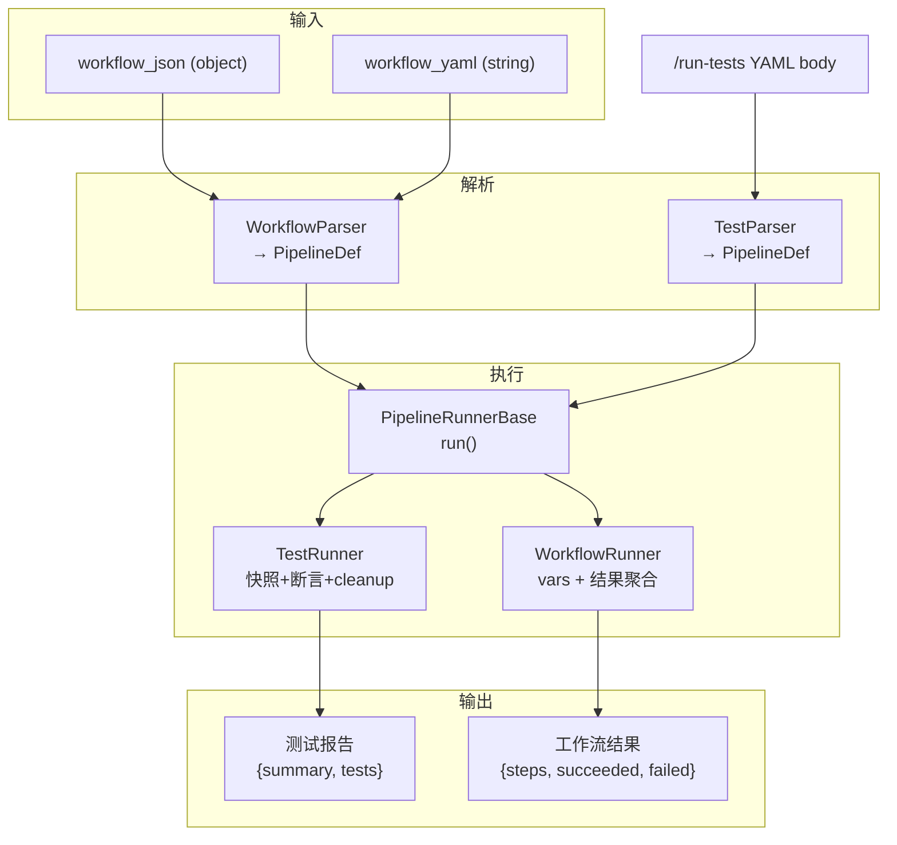

# LLD: YAML/JSON 多步工作流引擎

> **版本:** 3.0 · **日期:** 2026-06-20  
> **核心思路:** `PipelineRunner` 拆分为三层继承体系，`TestRunner` 和 `WorkflowRunner` 共享同一纯执行基类  
> **总改动量:** ~180 行新增 + 文件移动

---

## 1. 架构

### 1.1 三层继承体系

```
PipelineRunnerBase（纯执行核心）
  ↙                    ↘
TestRunner              WorkflowRunner
(测试: 快照/清理/断言)    (工作流: vars/无清理)
```

| 层 | 类 | 职责 | 测试相关 | 工作流相关 |
|---|-----|------|---------|-----------|
| 基类 | `PipelineRunnerBase` | 纯按顺序执行步骤，不碰文件系统 | ❌ | ❌ |
| 派生 | `TestRunner` | 快照 + 断言 + 磁盘校验 + cleanup | ✅ | ❌ |
| 派生 | `WorkflowRunner` | 设 vars → 执行 → 返回步骤结果 | ❌ | ✅ |

### 1.2 双解析器

```
TestParser (yaml → PipelineDef)
  接受: expect, disk_verify, headless, allow_failure

WorkflowParser (json/yaml → PipelineDef)
  接受: vars, timeout, max_steps
  拒绝: expect, disk_verify（语义错误）
```

两者输出同一个 `PipelineDef`，共享 `pipeline_types.hpp`。

### 1.3 execute_workflow 输入：JSON + YAML 二选一

| 参数 | 类型 | 用途 | 适用场景 |
|------|------|------|---------|
| `workflow_json` | object (Dict) | MCP 参数原生嵌套 | AI 直接构造，零序列化开销 |
| `workflow_yaml` | string | YAML 文本 | 从项目文件读取/对话粘贴 |

两者在 `WorkflowParser` 内部统一为 `PipelineDef`。



---

## 2. 类设计

### 2.1 PipelineRunnerBase（纯执行核心）

```cpp
// pipeline/pipeline_runner_base.hpp
class PipelineRunnerBase {
public:
    PipelineRunnerBase(HandlerRegistry *registry);

    struct StepRecord {
        String tool;
        String step_id;
        String status;       // "passed" | "failed" | "skipped"
        Dictionary result;   // 工具返回值
        String error;
        int64_t duration_us;
        int attempts;
    };

    struct RunResult {
        int total = 0, passed = 0, failed = 0, skipped = 0;
        Vector<StepRecord> steps;
        String pipeline_error;
    };

    // 纯执行——不碰快照、不碰断言、不碰文件系统
    RunResult run(const PipelineDef &pipeline, PipelineContext &ctx);

protected:
    // 虚方法，派生类可重写以注入额外逻辑（如断言）
    virtual Dictionary execute_step(const StepDef &step,
                                     PipelineContext &ctx);

    void execute_chain(const Vector<ChainStep> &chain,
                       const char *chain_name,
                       FailPolicy default_on_failure,
                       CallStats &stats);

    static Vector<size_t> topological_sort(const Vector<StepDef> &steps);

    HandlerRegistry *registry_;
    CallStats stats_;
};
```

基类的 `run()` 只做：
1. 解析依赖 → 拓扑排序
2. 串行执行 stages
3. 每步：展开模板 → 检查 when → 检查 dependencies → 调 `execute_step()`（虚）→ 记录结果
4. 返回 `RunResult`

**没有** `take_snapshot()`、`cleanup()`、`backup_project_godot()`、`restore_settings()`、`run_assertions()`、`run_disk_verification()`。

### 2.2 TestRunner（继承基类）

```cpp
// testing/test_runner.hpp
class TestRunner : public PipelineRunnerBase {
public:
    Dictionary run_test(const PipelineDef &pipeline);
    // 包装基类 run() + 快照 + 断言 + cleanup

protected:
    Dictionary execute_step(const StepDef &step,
                            PipelineContext &ctx) override;
    // 调基类执行后，再跑 run_assertions() + run_disk_verification()
};
```

`run_test()` 的完整流程：

```
1. backup_project_godot()
2. take_snapshot(before)
3. 调 base.run(pipeline, ctx)
4. restore_settings()
5. restore_project_godot()
6. take_snapshot(after)
7. cleanup(tracked, before, after)
8. 组装测试报告 {summary, tests}
```

### 2.3 WorkflowRunner（薄包装）

```cpp
// workflow_runner.hpp
class WorkflowRunner : public PipelineRunnerBase {
public:
    Dictionary run_workflow(const PipelineDef &pipeline,
                            const Dictionary &vars);
};
```

```cpp
Dictionary WorkflowRunner::run_workflow(
    const PipelineDef &pipeline, const Dictionary &vars) {

    PipelineContext ctx;
    ctx.set_workflow_vars(vars);

    auto result = run(pipeline, ctx);

    // 加工为工作流友好格式
    Dictionary output;
    output["total_steps"] = result.total;
    output["succeeded"] = result.passed;
    output["failed"] = result.failed;
    output["duration_ms"] = ...;  // 从 start_time 算

    Array steps_result;
    for (const auto &sr : result.steps) {
        Dictionary entry;
        entry["id"] = sr.step_id;
        entry["tool"] = sr.tool;
        entry["status"] = sr.status;
        entry["result"] = sr.result;
        if (!sr.error.is_empty())
            entry["error"] = sr.error;
        steps_result.push_back(entry);
    }
    output["steps"] = steps_result;

    return ToolResult::ok(output);
}
```

**约 30 行。**

### 2.4 TestParser

```cpp
// pipeline/test_parser.hpp
class TestParser {
    static ParseResult parse(const Dictionary &input);
    // 从 YAML 解析的 Dictionary 提取:
    //   name, description, headless
    //   pipeline.before_all, pipeline.after_all
    //   stages[].before_each, stages[].after_each
    //   steps[].expect, steps[].disk_verify, steps[].allow_failure
    //   on_failure, retry, depends_on, when
    //
    // 校验:
    //   - 环检测（已有）
    //   - step ID 唯一性（已有）
    //   - expect 格式校验
    //   - disk_verify 路径是否存在
};
```

### 2.5 WorkflowParser

```cpp
// pipeline/workflow_parser.hpp
class WorkflowParser {
    static ParseResult parse(const Dictionary &input);
    // 从 JSON/YAML 解析的 Dictionary 提取:
    //   stages[].steps[].tool, args
    //   vars → 存入顶层字段供 PipelineContext 使用
    //   timeout → 全局超时
    //   max_steps → 步骤数上限
    //   on_failure, retry, depends_on, when（同测试）
    //
    // 拒绝（parse error）:
    //   - expect, disk_verify, allow_failure（工作流不该写这些）
    //   - headless（工作流总是在有头模式执行？或者不考虑）
    //
    // 扩展时间格式:
    //   timeout: "30s" → 30000ms
    //   timeout: "5000ms" → 5000ms
    //   timeout: "1m" → 60000ms
};
```

---

## 3. 输入格式

### 3.1 JSON 输入（AI 直接构造）

```json
{
  "stages": [
    {
      "id": "setup",
      "steps": [
        {"tool": "new_scene", "args": {"root_type": "Node3D", "root_name": "Main"}},
        {"tool": "add_node", "args": {
          "parent_path": "/root/Main",
          "type": "Camera3D",
          "name": "Camera"
        }}
      ]
    },
    {
      "id": "verify",
      "steps": [
        {"tool": "get_scene_tree", "args": {}}
      ]
    }
  ],
  "vars": {
    "scene_name": "MyScene"
  },
  "timeout": "30s"
}
```

### 3.2 YAML 输入（从文件/对话读取）

```yaml
stages:
  - id: setup
    steps:
      - tool: new_scene
        args: {root_type: "Node3D", root_name: "Main"}
      - tool: add_node
        args: {parent_path: "/root/Main", type: "Camera3D", name: "Camera"}
vars:
  scene_name: "MyScene"
timeout: "30s"
```

注意工作流 YAML 比测试 YAML 少了 `pipeline:` 嵌套层级和 `expect` / `disk_verify` 字段。

### 3.3 ExecuteWorkflowTool

```cpp
class ExecuteWorkflowTool : public ITool {
    String name() const override { return "execute_workflow"; }
    String category() const override { return "meta_tools"; }
    bool is_meta() const override { return true; }

    Dictionary build_input_schema() const override {
        SchemaBuilder sb("object");
        sb.optional_object("workflow_json", "Workflow definition as JSON object");
        sb.optional_string("workflow_yaml", "Workflow definition as YAML string");
        sb.optional_bool("dry_run", "Validate without executing", false);
        return sb.build();
    }

    Dictionary execute_impl(const ToolContext &ctx) override {
        Dictionary input;
        if (ctx.args.has("workflow_json")) {
            input = ctx.args["workflow_json"];
        } else if (ctx.args.has("workflow_yaml")) {
            input = parse_yaml(ctx.args["workflow_yaml"]);
        } else {
            return ToolResult::err("MISSING_INPUT",
                "Provide either workflow_json or workflow_yaml");
        }

        auto parsed = WorkflowParser::parse(input);
        if (auto *err = std::get_if<ParseError>(&parsed)) {
            return ToolResult::err("PARSE_ERROR", err->message);
        }

        if (ctx.args.get("dry_run", false)) {
            return ToolResult::ok({{"valid", true}});
        }

        auto pipeline = std::get<shared_ptr<PipelineDef>>(parsed);
        Dictionary vars = input.get("vars", Dictionary());

        WorkflowRunner runner(registry_);
        return runner.run_workflow(*pipeline, vars);
    }
};
```

---

## 4. 文件结构变更

```
extensions/src/pipeline/               ← 新建共享目录
├── pipeline_types.hpp                 ← 从 testing/ 移入
├── pipeline_context.hpp/.cpp          ← 移入 + 加 workflow_vars_
├── pipeline_runner_base.hpp/.cpp      ← 新建（从 runner 提取纯执行核心）
├── pipeline_parser.hpp/.cpp           ← 从 testing/ 移入，泛化
├── workflow_parser.hpp/.cpp           ← 新建（工作流专用）
├── test_parser.hpp/.cpp               ← 新建（测试专用字段）
├── workflow_runner.hpp                ← 新建（~30 行包装）
├── yaml_parser.hpp                    ← 从 testing/ 移入
└── type_utils.hpp                     ← 从 testing/ 移入

extensions/src/testing/                ← 缩减
├── test_engine.hpp/.cpp               ← 使用 TestRunner
├── test_runner.hpp/.cpp               ← 新建（继承 PipelineRunnerBase）
├── test_assertions.hpp                ← 不变
└── godot_file_verifier.hpp            ← 不变

extensions/src/built_in/tools/meta/
└── execute_workflow.hpp               ← 新建 ITool（使用 WorkflowRunner）
```

---

## 5. 改动量估算

| 文件 | 操作 | 行数 |
|------|------|:----:|
| `pipeline/`（6 文件） | 从 `testing/` 移入 | ~0（移动） |
| `pipeline/pipeline_runner_base.hpp/.cpp` | 从 `pipeline_runner` 提取纯执行核心 | ~150 |
| `pipeline/pipeline_context.hpp` | 加 `workflow_vars_` + `set_workflow_vars()` | ~10 |
| `pipeline/workflow_parser.hpp/.cpp` | 新建 | ~60 |
| `pipeline/test_parser.hpp/.cpp` | 新建 | ~40 |
| `pipeline/workflow_runner.hpp` | 新建 | ~30 |
| `testing/test_runner.hpp/.cpp` | 新建（继承基类，含快照/清理） | ~80 |
| `testing/test_engine.hpp/.cpp` | 改为使用 TestRunner | ~5 |
| `meta/execute_workflow.hpp` | 新建 ITool | ~60 |
| `register/register_meta.hpp` | 加一行 | +1 |
| `register_itools.cpp` | 加一行 `#include` | +1 |
| `extensions/CMakeLists.txt` | 更新源文件路径 | ~3 |
| **合计** | | **~440（含移动）** |

---

## 6. 测试计划

| ID | 名称 | 步骤 | 预期 |
|:--:|------|------|------|
| UT1 | JSON 3 步工作流 | `workflow_json` 含 3 步 | 三步正确执行，`succeeded: 3` |
| UT2 | YAML 工作流 | `workflow_yaml` 同内容 | 结果与 JSON 版本一致 |
| UT3 | vars 变量 | `${vars.name}` 替换为实际值 | 工具参数正确展开 |
| UT4 | 步骤间引用 | `${steps.create.result.data.path}` | 正确引用上一步返回值 |
| UT5 | timeout | `timeout: 100ms` 超时 | 工作流中止，返回 TIMEOUT |
| UT6 | dry_run | `dry_run=true` | 不执行任何工具，返回 valid |
| UT7 | 无效 JSON | 缺少 stages | `PARSE_ERROR` |
| UT8 | 测试引擎不受影响 | 25 个已有 YAML 测试 | 全部通过 |

---

## 7. 验收标准

1. 3 步 JSON 工作流完整执行，返回步骤结果
2. 同内容的 YAML 工作流结果一致
3. `${vars.name}` 正确展开
4. `${steps.*.result.*}` 正确引用
5. `timeout` 超时正确中止
6. `dry_run` 零副作用
7. `TestRunner` 运行全部 25 个 YAML 测试，结果与改造前一致
8. 测试的快照清理行为不变（执行后新文件被删除）
