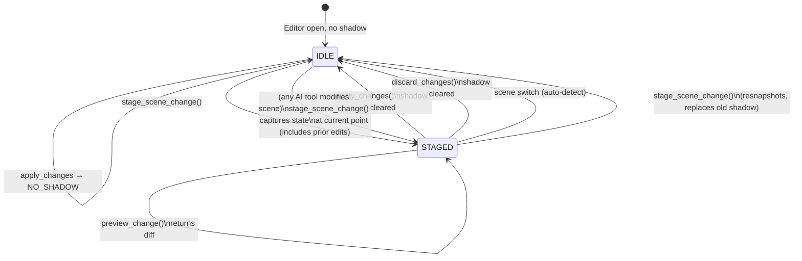
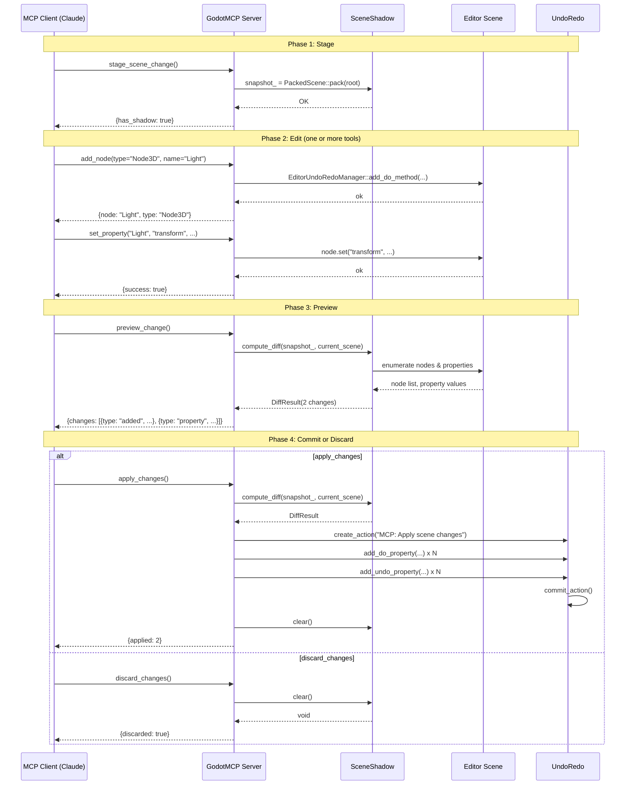

# Shadow Scene + Diff-Apply 系统 — 底层设计

> 版本: 1.0 · 2026-06-20  
> 对应迭代: Phase 4 (`feature/moat-ecosystem`)  
> 状态: 待评审

---

## 1. 模块概述

### 1.1 目标

- 为 AI 场景编辑提供 **预览-暂存-应用** 工作流
- 让开发者在更改生效前审查所有待处理变更
- 通过单一 UndoRedo 操作实现多次编辑的原子性应用
- 允许零副作用丢弃未提交的更改
- 使 GodotMCP 区别于所有竞争对手（Godot AI、Unity MCP、UE-MCP）— 无一提供非破坏性 AI 编辑

### 1.2 现状 vs 目标

| 方面 | 当前（所有竞争对手） | 目标（GodotMCP） |
|--------|--------------------------|-------------------|
| 编辑模式 | 每次工具调用直接修改 | 通过阴影快照暂存 |
| 变更审查 | 无 — AI 直接写入 | `preview_change` 返回完整差异 |
| 变更丢弃 | 无机制 | `discard_changes` 恢复快照 |
| 原子性应用 | 按工具粒度 | 将所有差异批处理为单一 UndoRedo 动作 |
| 撤销支持 | 按工具（如有实现） | 单次 `undo` 回滚整个批次 |
| 信任壁垒 | 高 — "AI 可能搞乱我的场景" | 低 — "我可以审查并拒绝" |

### 1.3 模块标识

| 属性 | 值 |
|----------|-------|
| 源码目录 | `extensions/src/scene_diff/` |
| 核心类 | `SceneSnapshot`, `SceneDiff`, `ScenePatcher`, `SceneShadow` |
| 工具名称 | `stage_scene_change`, `preview_change`, `apply_changes`, `discard_changes` |
| 工具源文件 | `extensions/src/built_in/tools/editor_tools/scene/stage_change.hpp`, `preview_change.hpp`, `apply_changes.hpp`, `discard_changes.hpp` |
| 注册位置 | `extensions/src/built_in/tools/register/register_existing.hpp` — 添加 4 行 `GODOT_MCP_TOOL` |
| `#include` 添加 | `extensions/src/built_in/register_itools.cpp` — 添加 4 行 `#include` |
| 分类 | `editor_tools/scene` |
| `needs_scene()` | `true` — 所有四个工具操作当前编辑器场景 |
| 外部依赖 | 无 — 使用 Godot `PackedScene` + `EditorUndoRedoManager` |

---

## 2. 架构

### 2.1 模块布局

```
extensions/src/
├── scene_diff/
│   ├── scene_shadow.hpp             # SceneShadow — 状态机所有者
│   ├── scene_shadow.cpp             # 实现
│   ├── scene_snapshot.hpp            # SceneSnapshot — PackedScene 序列化
│   ├── scene_snapshot.cpp
│   ├── scene_diff.hpp                # SceneDiff — 差异计算
│   ├── scene_diff.cpp
│   ├── scene_patcher.hpp             # ScenePatcher — 通过 UndoRedo 应用/回滚
│   └── scene_patcher.cpp
└── built_in/tools/editor_tools/scene/
    ├── stage_change.hpp              # ITool: stage_scene_change
    ├── preview_change.hpp            # ITool: preview_change
    ├── apply_changes.hpp             # ITool: apply_changes
    └── discard_changes.hpp           # ITool: discard_changes
```

### 2.2 数据流

```mermaid
flowchart TB
    subgraph Client[MCP Client]
        C1[stage_scene_change]
        C2[add_node / set_property / ...]
        C3[preview_change]
        C4[apply_changes]
        C5[discard_changes]
    end

    subgraph Shadow[Shadow Scene System]
        SS[SceneShadow]
        SN[SceneSnapshot]
        SD[SceneDiff]
        SP[ScenePatcher]
    end

    subgraph Editor[Godot Editor]
        ER[EditorUndoRedoManager]
        ES[Editor Scene Tree]
    end

    C1 --> SS --> SN -->|PackedScene| SS
    C2 -->|直接编辑| ES
    C3 --> SS --> SD -->|DiffResult| C3
    C4 --> SS --> SD --> SP -->|UndoRedo actions| ER --> ES
    C5 --> SS

    SS -.->|_process() scene switch check| ES
```

### 2.3 系统组件

```
  ┌─────────────────────────────────────────────────────────┐
  │                    阴影场景系统                            │
  │                                                           │
  │  SceneSnapshot                                            │
  │    ├─ capture(path) → Ref<PackedScene>                   │
  │    └─ 将快照序列化到内存                                    │
  │                                                           │
  │  SceneDiff                                                │
  │    ├─ compute(original_root, current_root) → DiffResult   │
  │    └─ DiffResult = Vector<PropertyChange> + Vector<NodeChange>  │
  │                                                           │
  │  ScenePatcher                                             │
  │    ├─ apply_diff(EditorUndoRedoManager*, DiffResult)      │
  │    │   └─ 创建单一可撤销的 "MCP: Apply changes" 动作         │
  │    └─ compute_reverse(DiffResult) → DiffResult            │
  │                                                           │
  │  SceneShadow (门面 + 状态机)                                │
  │    ├─ capture() → 委托给 SceneSnapshot                     │
  │    ├─ compute_diff() → 委托给 SceneDiff                    │
  │    ├─ apply() → 委托给 ScenePatcher + 清空                 │
  │    ├─ clear() → 清空快照                                   │
  │    └─ has_shadow(), current_scene_path()                  │
  │                                                           │
  │  4 个 ITool 包装器:                                        │
  │    stage_scene_change → SceneShadow::capture()            │
  │    preview_change → SceneShadow::compute_diff()           │
  │    apply_changes → SceneShadow::apply()                   │
  │    discard_changes → SceneShadow::clear()                 │
  └─────────────────────────────────────────────────────────┘
```

---

## 3. 核心数据结构

### 3.1 `PropertyChange` — 单一属性变更

```cpp
// extensions/src/scene_diff/scene_diff.hpp
#pragma once

#include <godot_cpp/variant/string.hpp>
#include <godot_cpp/variant/variant.hpp>
#include <godot_cpp/variant/dictionary.hpp>
#include <godot_cpp/variant/array.hpp>
#include <godot_cpp/templates/vector.hpp>

namespace godot_mcp::scene_diff {

using godot::Array;
using godot::Dictionary;
using godot::String;
using godot::Variant;
using godot::Vector;

struct PropertyChange {
    String node_path;     // 例如 "Player/Sprite"
    String property;      // 例如 "position"
    Variant old_value;    // 快照时的值
    Variant new_value;    // 当前值
};
```

### 3.2 `NodeChange` — 结构性树变更

```cpp
struct NodeChange {
    enum Type : uint8_t {
        ADDED = 0,
        DELETED = 1,
        MODIFIED = 2,
        REPARENTED = 3,
    };
    Type type;
    String node_path;
    Dictionary node_data;  // 对于 ADDED: {type, name, script, children}
    String old_parent;     // 对于 REPARENTED
    String new_parent;     // 对于 REPARENTED

    Dictionary to_dict() const {
        Dictionary d;
        switch (type) {
            case ADDED:      d["type"] = "added";      break;
            case DELETED:    d["type"] = "deleted";    break;
            case MODIFIED:   d["type"] = "modified";   break;
            case REPARENTED: d["type"] = "reparented"; break;
        }
        d["node"] = node_path;
        if (!old_parent.is_empty()) d["old_parent"] = old_parent;
        if (!new_parent.is_empty()) d["new_parent"] = new_parent;
        if (node_data.size() > 0)   d["node_data"] = node_data;
        return d;
    }
};
```

### 3.3 `DiffResult` — 完整差异信封

```cpp
struct DiffResult {
    Vector<PropertyChange> property_changes;
    Vector<NodeChange> node_changes;

    int total_changes() const {
        return static_cast<int>(property_changes.size() + node_changes.size());
    }

    bool has_changes() const { return total_changes() > 0; }

    Dictionary to_dict() const {
        Array changes;
        for (const auto &pc : property_changes) {
            Dictionary entry;
            entry["type"] = "property";
            entry["node"] = pc.node_path;
            entry["property"] = pc.property;
            entry["old"] = variant_to_json(pc.old_value);
            entry["new"] = variant_to_json(pc.new_value);
            changes.push_back(entry);
        }
        for (const auto &nc : node_changes) {
            changes.push_back(nc.to_dict());
        }
        Dictionary r;
        r["total_changes"] = total_changes();
        r["changes"] = changes;
        return r;
    }
};

} // namespace godot_mcp::scene_diff
```

### 3.4 `SceneShadow` — 有状态门面

```cpp
// extensions/src/scene_diff/scene_shadow.hpp
#pragma once

#include "scene_diff.hpp"
#include <godot_cpp/classes/packed_scene.hpp>
#include <godot_cpp/classes/ref.hpp>

namespace godot_mcp::scene_diff {

using godot::Ref;

class SceneShadow {
public:
    // 对当前编辑的场景根节点拍摄快照。
    // 成功返回 OK，无打开场景返回 FAILED。
    godot::Error capture();

    // 清空阴影快照。即使没有阴影也可安全调用。
    void clear();

    bool has_shadow() const { return has_snapshot_; }
    const String &current_scene_path() const { return scene_path_; }

    // 计算快照与当前编辑器场景之间的差异。
    // 返回 DiffResult（无变更时可能为空）。
    DiffResult compute_diff() const;

    // 通过 EditorUndoRedoManager 应用差异，然后清空阴影。
    // 返回已应用的变更数量。
    int apply();

    // 将快照状态加载回编辑器（完整回滚）。
    void rollback();

private:
    Ref<PackedScene> snapshot_;
    String scene_path_;
    bool has_snapshot_ = false;

    // 缓存快照根节点属性，以便后续更快地进行差异比较。
    // 以 node_path 为键。在 capture() 期间填充。
    HashMap<String, Dictionary> cached_properties_;
};

} // namespace godot_mcp::scene_diff
```

---

## 4. Diff 算法

### 4.1 属性比较

```cpp
// extensions/src/scene_diff/scene_diff.cpp

DiffResult SceneDiff::compute(Node *original_root, Node *current_root) {
    DiffResult result;

    // 按绝对路径收集两棵树中的所有节点
    HashMap<String, Node*> orig_nodes;
    HashMap<String, Node*> curr_nodes;
    collect_by_path(original_root, String(), orig_nodes);
    collect_by_path(current_root, String(), curr_nodes);

    // 1. 检测已删除节点（在 orig 中存在，但在 curr 中不存在）
    for (const auto &kv : orig_nodes) {
        if (!curr_nodes.has(kv.key)) {
            NodeChange nc;
            nc.type = NodeChange::DELETED;
            nc.node_path = kv.key;
            // 在删除时捕获节点类型信息
            Dictionary data;
            data["type"] = kv.value->get_class();
            data["name"] = kv.value->get_name();
            nc.node_data = data;
            result.node_changes.push_back(nc);
        }
    }

    // 2. 检测新增节点（在 curr 中存在，但在 orig 中不存在）
    for (const auto &kv : curr_nodes) {
        if (!orig_nodes.has(kv.key)) {
            NodeChange nc;
            nc.type = NodeChange::ADDED;
            nc.node_path = kv.key;
            Dictionary data;
            data["type"] = kv.value->get_class();
            data["name"] = kv.value->get_name();
            nc.node_data = data;
            result.node_changes.push_back(nc);
        }
    }

    // 3. 检测已修改属性（两者中都存在）
    for (const auto &kv : curr_nodes) {
        const String &path = kv.key;
        Node *curr = kv.value;

        auto it = orig_nodes.find(path);
        if (it == orig_nodes.end()) continue;
        Node *orig = it->value;

        // 比较暴露的属性
        List<PropertyInfo> props;
        curr->get_property_list(&props);
        for (const auto &prop : props) {
            if (should_skip_property(prop.name)) continue;

            // 使用 ->get()，避免脚本方法干扰
            Variant old_val = orig->get(prop.name);
            Variant new_val = curr->get(prop.name);

            // 通过 Godot 内置运算符进行 Variant 相等性比较
            if (old_val != new_val) {
                PropertyChange pc;
                pc.node_path = path;
                pc.property = prop.name;
                pc.old_value = old_val;
                pc.new_value = new_val;
                result.property_changes.push_back(std::move(pc));
            }
        }
    }

    return result;
}
```

### 4.2 节点收集

```cpp
// 递归收集所有后代节点，以绝对路径为键
static void collect_by_path(Node *node, const String &parent_path,
                            HashMap<String, Node*> &out) {
    if (!node) return;

    String path;
    if (parent_path.is_empty()) {
        path = node->get_name();
    } else {
        path = parent_path + "/" + node->get_name();
    }
    out[path] = node;

    for (int64_t i = 0; i < node->get_child_count(); i++) {
        Node *child = node->get_child(static_cast<int>(i));
        collect_by_path(child, path, out);
    }
}
```

### 4.3 跳过的属性

```cpp
// 从差异比较中排除的属性。
// 内部/瞬态属性会在差异中产生噪音，并且无法
// 通过 set() 有意义地恢复。
static bool should_skip_property(const String &name) {
    return name == "script"
        || name == "unique_name_in_owner"
        || name == "owner"
        || name == "scene_file_path"
        || name == "process_mode"
        || name.begins_with("metadata/")
        || name.begins_with("__");  // Godot 内部属性
}
```

### 4.4 Variant 相等性说明

Godot 的 `Variant::operator!=` 执行类型感知的深度比较：

| 类型 | 行为 |
|------|----------|
| `int` / `float` | 数值相等 |
| `Vector2/3/4` | 逐分量比较 |
| `Color` | RGBA 比较 |
| `Transform3D` | 矩阵相等 |
| `Dictionary` | 键/值深度比较 |
| `Array` | 逐元素深度比较 |
| `String` | 精确匹配 |
| `Object*` / `Ref<Resource>` | 指针标识 |

这意味着 `position = Vector2(1, 2)` 与 `Vector2(1, 3)` 能正确产生差异。无需自定义比较器。

---

## 5. 工具接口

### 5.1 `stage_scene_change` — 快照当前场景

```cpp
// extensions/src/built_in/tools/editor_tools/scene/stage_change.hpp
#pragma once

#include "built_in/tool_base.hpp"
#include "scene_diff/scene_shadow.hpp"

namespace godot_mcp {

class StageSceneChangeTool : public ITool {
public:
    String name() const noexcept override { return "stage_scene_change"; }
    String category() const noexcept override { return "editor_tools/scene"; }
    String brief() const noexcept override {
        return "快照当前场景，用于差异预览和暂存应用";
    }
    String description() const override {
        return "将当前编辑场景的状态捕获到内部阴影缓冲区。"
               "调用后，对场景的任何修改（通过 MCP 工具或手动）"
               "都可以通过 preview_change 预览，通过 apply_changes 原子性应用，"
               "或通过 discard_changes 丢弃。"
               "一次只能持有一个阴影快照；再次调用将替换之前的快照。";
    }
    bool needs_scene() const override { return true; }

    // stage_scene_change 不是破坏性操作 — 它仅拍摄快照
    // is_destructive_ 保持 false（由 X-macro 宏设置）

protected:
    Dictionary execute_impl(const ToolContext &ctx) override {
        auto *ei = EditorInterface::get_singleton();
        String scene_path = ei->get_current_scene()->get_scene_file_path();

        scene_diff::SceneShadow &shadow = get_shadow_instance();
        Error err = shadow.capture();
        if (err != OK) {
            return ToolResult::err("SNAPSHOT_FAILED",
                "场景序列化失败: " + String::num_int64(static_cast<int64_t>(err)));
        }

        Dictionary data;
        data["scene"] = scene_path;
        data["has_shadow"] = true;
        return ToolResult::ok(data);
    }

private:
    // 单例访问器 — SceneShadow 由 McpEditorPlugin 拥有
    static scene_diff::SceneShadow &get_shadow_instance();
};

} // namespace godot_mcp
```

**输入:**
```json
{
  "type": "object",
  "properties": {}
}
```

**输出（成功）:**
```json
{
  "success": true,
  "data": {
    "scene": "res://scenes/my_scene.tscn",
    "has_shadow": true
  }
}
```

**输出（无打开场景）:**
```json
{
  "success": false,
  "error": {
    "code": "NO_SCENE",
    "message": "No scene is currently open in the editor"
  }
}
```

### 5.2 `preview_change` — 显示未提交的差异

```cpp
// extensions/src/built_in/tools/editor_tools/scene/preview_change.hpp
#pragma once

#include "built_in/tool_base.hpp"
#include "scene_diff/scene_shadow.hpp"

namespace godot_mcp {

class PreviewChangeTool : public ITool {
public:
    String name() const noexcept override { return "preview_change"; }
    String category() const noexcept override { return "editor_tools/scene"; }
    String brief() const noexcept override {
        return "预览自上次暂存以来所有未提交的变更";
    }
    String description() const override {
        return "计算并返回已暂存阴影快照与当前编辑器场景之间的差异。"
               "返回每个属性变更、节点添加和节点删除的列表。"
               "如果未检测到变更，返回错误。"
               "请先调用 stage_scene_change 来创建快照。";
    }
    bool needs_scene() const override { return true; }

protected:
    Dictionary execute_impl(const ToolContext &ctx) override {
        scene_diff::SceneShadow &shadow = get_shadow_instance();

        if (!shadow.has_shadow()) {
            return ToolResult::err("NO_SHADOW",
                "No shadow snapshot exists. Call stage_scene_change first.");
        }

        scene_diff::DiffResult diff = shadow.compute_diff();

        if (!diff.has_changes()) {
            return ToolResult::err("NO_CHANGES",
                "No changes detected since the last stage_scene_change call.");
        }

        Dictionary data = diff.to_dict();
        data["scene"] = shadow.current_scene_path();
        return ToolResult::ok(data);
    }

private:
    static scene_diff::SceneShadow &get_shadow_instance();
};

} // namespace godot_mcp
```

**输入:**
```json
{ "type": "object", "properties": {} }
```

**输出（成功，有变更）:**
```json
{
  "success": true,
  "data": {
    "scene": "res://scenes/my_scene.tscn",
    "total_changes": 3,
    "changes": [
      {
        "type": "property",
        "node": "Player/Sprite",
        "property": "position",
        "old": { "x": 0.0, "y": 0.0 },
        "new": { "x": 100.0, "y": 200.0 }
      },
      {
        "type": "property",
        "node": "Player",
        "property": "script",
        "old": null,
        "new": { "path": "res://player.gd" }
      },
      {
        "type": "added",
        "node": "Player/Weapon",
        "node_data": { "type": "Node3D", "name": "Weapon" }
      }
    ]
  }
}
```

**输出（无变更）:**
```json
{
  "success": false,
  "error": {
    "code": "NO_CHANGES",
    "message": "No changes detected since the last stage_scene_change call."
  }
}
```

### 5.3 `apply_changes` — 原子性提交差异

```cpp
// extensions/src/built_in/tools/editor_tools/scene/apply_changes.hpp
#pragma once

#include "built_in/tool_base.hpp"
#include "scene_diff/scene_shadow.hpp"

namespace godot_mcp {

class ApplyChangesTool : public ITool {
public:
    String name() const noexcept override { return "apply_changes"; }
    String category() const noexcept override { return "editor_tools/scene"; }
    String brief() const noexcept override {
        return "通过 UndoRedo 原子性应用所有暂存的场景变更";
    }
    String description() const override {
        return "将阴影快照与当前场景之间的每个检测到的差异应用到编辑器。"
               "所有变更被批处理为单一的 \"MCP: Apply scene changes\" UndoRedo 动作，"
               "因此单次 undo() 调用即可回滚整个批次。"
               "应用后，阴影快照被清空。"
               "再次调用 stage_scene_change 开始新的暂存会话。";
    }
    bool needs_scene() const override;
    // is_destructive_ = true — 修改场景
    bool supports_undo() const override { return true; }

protected:
    Dictionary execute_impl(const ToolContext &ctx) override {
        scene_diff::SceneShadow &shadow = get_shadow_instance();

        if (!shadow.has_shadow()) {
            return ToolResult::err("NO_SHADOW",
                "No shadow snapshot exists. Call stage_scene_change first.");
        }

        scene_diff::DiffResult diff = shadow.compute_diff();
        if (!diff.has_changes()) {
            shadow.clear();
            return ToolResult::err("NO_CHANGES",
                "No changes to apply. Shadow cleared.");
        }

        int count = shadow.apply();
        if (count < 0) {
            return ToolResult::err("APPLY_FAILED",
                "Failed to apply changes. Editor may be in an inconsistent state.");
        }

        Dictionary data;
        data["applied"] = count;
        data["action_name"] = "MCP: Apply scene changes";
        return ToolResult::ok(data);
    }

private:
    static scene_diff::SceneShadow &get_shadow_instance();
};

} // namespace godot_mcp
```

**输入:**
```json
{ "type": "object", "properties": {} }
```

**输出（成功）:**
```json
{
  "success": true,
  "data": {
    "applied": 5,
    "action_name": "MCP: Apply scene changes"
  }
}
```

### 5.4 `discard_changes` — 回退阴影，保持场景不变

```cpp
// extensions/src/built_in/tools/editor_tools/scene/discard_changes.hpp
#pragma once

#include "built_in/tool_base.hpp"
#include "scene_diff/scene_shadow.hpp"

namespace godot_mcp {

class DiscardChangesTool : public ITool {
public:
    String name() const noexcept override { return "discard_changes"; }
    String category() const noexcept override { return "editor_tools/scene"; }
    String brief() const noexcept override {
        return "丢弃所有暂存的变更而不应用它们";
    }
    String description() const override {
        return "清空内部阴影快照而不修改场景。"
               "场景保持在上次 AI 编辑后的状态不变。"
               "要将场景恢复到暂存前的状态，请使用编辑器的"
               "原生撤销 (Ctrl+Z) 或 MCP undo 工具。"
               "丢弃后，请再次调用 stage_scene_change 开始新的暂存会话。";
    }
    bool needs_scene() const override { return true; }

protected:
    Dictionary execute_impl(const ToolContext &ctx) override {
        scene_diff::SceneShadow &shadow = get_shadow_instance();

        if (!shadow.has_shadow()) {
            return ToolResult::err("NO_SHADOW",
                "No shadow snapshot exists. Nothing to discard.");
        }

        shadow.clear();

        Dictionary data;
        data["discarded"] = true;
        return ToolResult::ok(data);
    }

private:
    static scene_diff::SceneShadow &get_shadow_instance();
};

} // namespace godot_mcp
```

**输出（成功）:**
```json
{
  "success": true,
  "data": { "discarded": true }
}
```

---

## 6. 状态机

### 6.1 状态与转换



### 6.2 转换表

| 当前状态 | 事件 | 守卫条件 | 下一状态 | 动作 |
|---------|-------|-------|------|--------|
| IDLE | `stage_scene_change` | 场景已打开 | STAGED | 快照当前场景 |
| IDLE | `preview_change` | — | IDLE | 返回 `NO_SHADOW` 错误 |
| IDLE | `apply_changes` | — | IDLE | 返回 `NO_SHADOW` 错误 |
| IDLE | `discard_changes` | — | IDLE | 返回 `NO_SHADOW` 错误 |
| STAGED | `preview_change` | 阴影存在 | STAGED | 计算并返回差异 |
| STAGED | `apply_changes` | 有变更 | IDLE | 通过 UndoRedo 应用，清空阴影 |
| STAGED | `apply_changes` | 无变更 | IDLE | 清空阴影，返回 `NO_CHANGES` |
| STAGED | `discard_changes` | 阴影存在 | IDLE | 清空阴影 |
| STAGED | 检测到场景切换 | — | IDLE | 自动清空阴影 |
| STAGED | `stage_scene_change` | — | STAGED | 重新快照（替换） |

### 6.3 场景切换检测

```cpp
// 在 McpEditorPlugin::_process() 中 — 集成到现有的轮询循环

#include "scene_diff/scene_shadow.hpp"

// 在模块作用域或作为 McpEditorPlugin 的成员：
static scene_diff::SceneShadow g_shadow_instance;

void McpEditorPlugin::_process(double delta) {
    // ... 现有逻辑 (http_server_.poll(), dialog handling, etc.) ...

    // 阴影场景切换检测
    if (g_shadow_instance.has_shadow()) {
        EditorInterface *ei = EditorInterface::get_singleton();
        if (ei) {
            Node *current_scene = ei->get_current_scene();
            if (current_scene) {
                String current_path = current_scene->get_scene_file_path();
                if (current_path != g_shadow_instance.current_scene_path()) {
                    // 场景已切换 — 自动清空阴影
                    g_shadow_instance.clear();
                    // 如果 SSE 已连接，通知客户端
                    mcp_handler_.enqueue_event("notifications/initialized", Dictionary());
                }
            }
        }
    }
}
```

---

## 7. ScenePatcher — 通过 UndoRedo 应用

### 7.1 应用算法

```cpp
// extensions/src/scene_diff/scene_patcher.cpp

int ScenePatcher::apply(Node *scene_root, EditorUndoRedoManager *ur,
                         const DiffResult &diff) {
    // 统计已应用的变更数量作为返回值
    int applied = 0;

    ur->create_action("MCP: Apply scene changes",
        UndoRedo::MERGE_DISABLE, scene_root);

    // 1. 应用属性变更
    for (const auto &pc : diff.property_changes) {
        Node *node = scene_root->get_node(NodePath(pc.node_path));
        if (!node) continue;

        ur->add_do_property(node, pc.property, pc.new_value);
        ur->add_undo_property(node, pc.property, pc.old_value);
        applied++;
    }

    // 2. 应用节点删除（逆序：子节点先于父节点）
    //    按路径深度降序排列，以先删除子节点
    Vector<NodeChange> deletions;
    for (const auto &nc : diff.node_changes) {
        if (nc.type == NodeChange::DELETED) deletions.push_back(nc);
    }
    deletions.sort([](const NodeChange &a, const NodeChange &b) {
        return a.node_path.length() > b.node_path.length();
    });
    for (const auto &nc : deletions) {
        Node *node = scene_root->get_node(NodePath(nc.node_path));
        if (!node) continue;
        Node *parent = node->get_parent();
        if (!parent) continue;

        ur->add_do_method(parent, "remove_child", node);
        ur->add_undo_method(parent, "add_child", node, true);
        ur->add_undo_method(node, "set_owner", scene_root);
        applied++;
    }

    // 3. 应用节点添加（顺序：父节点先于子节点）
    //    按路径深度升序排列
    Vector<NodeChange> additions;
    for (const auto &nc : diff.node_changes) {
        if (nc.type == NodeChange::ADDED) additions.push_back(nc);
    }
    additions.sort([](const NodeChange &a, const NodeChange &b) {
        return a.node_path.length() < b.node_path.length();
    });
    for (const auto &nc : additions) {
        // 对于 ADDED，节点已存在于场景中（AI 工具已创建它）。
        // 我们只需要为删除注册撤销操作。
        Node *node = scene_root->get_node(NodePath(nc.node_path));
        if (!node) continue;
        Node *parent = node->get_parent();
        if (!parent) continue;

        ur->add_do_method(parent, "add_child", node, true);
        ur->add_do_method(node, "set_owner", scene_root);
        ur->add_undo_method(parent, "remove_child", node);
        applied++;
    }

    ur->commit_action();
    return applied;
}
```

### 7.2 基于路径的节点标识

应用算法依赖于**基于路径的节点标识**：同一个 `NodePath` 在快照时和应用时解析到同一个节点。这种假设成立是因为：

1. 在 `stage_scene_change` 和 `apply_changes` 之间，节点仅由 MCP 工具添加/释放 — 这些工具不会随机化路径
2. Godot 的 `NodePath` 在场景树内是绝对的，根植于被编辑的场景根节点
3. 如果差异中引用的节点在应用时已不存在（例如手动删除），则静默跳过

### 7.3 回滚（完整场景恢复）

对于用户希望完全恢复到快照状态（而不仅仅是撤销单个操作）的情况：

```cpp
void ScenePatcher::rollback(Node *scene_root, const Ref<PackedScene> &snapshot) {
    if (!snapshot.is_valid()) return;
    if (!scene_root) return;

    Node *new_root = snapshot->instantiate();
    if (!new_root) return;

    // 用快照内容替换当前根节点的所有子节点。
    // 这是一个完整的结构替换。
    auto *ur = get_undo_redo();
    ur->create_action("MCP: Rollback to snapshot", UndoRedo::MERGE_DISABLE, scene_root);

    // 记录当前子节点用于撤销
    Array current_children;
    for (int64_t i = 0; i < scene_root->get_child_count(); i++) {
        current_children.push_back(scene_root->get_child(static_cast<int>(i)));
    }

    // 移除所有当前子节点
    for (int64_t i = scene_root->get_child_count() - 1; i >= 0; i--) {
        Node *child = scene_root->get_child(static_cast<int>(i));
        ur->add_do_method(scene_root, "remove_child", child);
        ur->add_undo_method(scene_root, "add_child", child, true);
    }

    // 添加快照子节点
    for (int64_t i = 0; i < new_root->get_child_count(); i++) {
        Node *snap_child = new_root->get_child(static_cast<int>(i));
        // 从临时根节点分离并重新父级化
        new_root->remove_child(snap_child);
        ur->add_do_method(scene_root, "add_child", snap_child, true);
        ur->add_do_method(snap_child, "set_owner", scene_root);
        // 撤销操作将重新添加原始子节点
    }

    ur->commit_action();
    memdelete(new_root);
}
```

**注意**：完整回滚在 v1 中不作为工具暴露。它是供未来使用的内部机制。v1 仅支持 `discard_changes`，它清空快照而不修改场景。

---

## 8. 与 McpEditorPlugin 的集成

### 8.1 单例所有权

`SceneShadow` 是 `register_types.cpp` 中文件作用域的单例（或 `McpEditorPlugin` 的静态成员）。四个工具通过 `scene_diff/` 暴露的静态函数访问它：

```cpp
// extensions/src/scene_diff/scene_shadow.cpp

#include "scene_shadow.hpp"

namespace godot_mcp::scene_diff {

// 文件作用域单例 — 首次访问时初始化。
// 无动态分配；生命周期 = 进程生命周期。
static SceneShadow s_shadow_instance;

SceneShadow &get_global_shadow() {
    return s_shadow_instance;
}

} // namespace godot_mcp::scene_diff
```

### 8.2 工具单例访问器

每个工具调用：

```cpp
scene_diff::SceneShadow &StageSceneChangeTool::get_shadow_instance() {
    return scene_diff::get_global_shadow();
}
```

### 8.3 生命周期

| 事件 | 阴影影响 |
|-------|---------------|
| `_enter_tree()` | 阴影已初始化（无操作 — 已在构造时完成） |
| `_exit_tree()` | 阴影清空 |
| 用户关闭场景 | 在 `_process()` 中自动检测 → 阴影清空 |
| 创建新场景 | 视为场景切换 → 阴影清空 |
| 关闭 Godot 项目 | 进程退出 → 阴影销毁 |

### 8.4 ProjectSettings 注册

添加到 `McpEditorPlugin::register_project_settings()`：

```cpp
// godot_mcp/shadow_scene_enabled — 启用/禁用阴影场景模式
if (!ps->has_setting("godot_mcp/shadow_scene_enabled")) {
    ps->set_setting("godot_mcp/shadow_scene_enabled", false);
}
ps->set_initial_value("godot_mcp/shadow_scene_enabled", false);
ps->set_as_basic("godot_mcp/shadow_scene_enabled", true);
```

当 `shadow_scene_enabled` 为 `false` 时：
- 四个阴影工具仍然存在并响应，但返回 `SHADOW_DISABLED` 错误
- 用户仍可正常使用直接编辑工具
- 这提供了一个逃生口："我不想要暂存工作流，就像以前一样直接编辑"

---

## 9. 错误处理

### 9.1 错误矩阵

| 场景 | 错误码 | HTTP | 行为 |
|----------|-----------|:----:|----------|
| 无打开场景（任何阴影工具） | `NO_SCENE` | 200 | 返回错误，无副作用 |
| `preview_change` 在 `stage` 之前 | `NO_SHADOW` | 200 | 返回 "请先调用 stage_scene_change" |
| `apply_changes` 在 `stage` 之前 | `NO_SHADOW` | 200 | 返回 "请先调用 stage_scene_change" |
| `discard_changes` 在 `stage` 之前 | `NO_SHADOW` | 200 | 返回 "无内容可丢弃" |
| 暂存后无变更 | `NO_CHANGES` | 200 | `preview_change` 返回错误；`apply_changes` 清空阴影并返回错误 |
| 场景被外部更改 | `SCENE_CHANGED` | 200 | 在 `_process()` 中自动清空阴影，下次工具调用得到 `NO_SHADOW` |
| PackedScene 序列化失败 | `SNAPSHOT_FAILED` | 500 | 返回 Godot 错误码 |
| 应用时 UndoRedo 提交失败 | `APPLY_FAILED` | 500 | 保留阴影以供重试 |
| `shadow_scene_enabled = false` | `SHADOW_DISABLED` | 200 | 返回 "阴影场景模式已禁用" |
| 差异引用的节点已不存在 | — | 200 | 在 apply 中静默跳过（幂等） |

### 9.2 错误恢复

| 故障模式 | 恢复 |
|-------------|----------|
| `SNAPSHOT_FAILED` | 阴影状态不变。用户可以重试。 |
| `APPLY_FAILED`（部分应用） | 阴影不清空。用户可使用 `preview_change` 检查并重试，或 `discard_changes`。 |
| 暂存期间场景切换 | 阴影自动清空。用户重新暂存。 |
| `apply_changes` 时 `NO_CHANGES` | 阴影自动清空。用户为新编辑重新暂存。 |

### 9.3 安全保证

1. **无阴影 = 无应用**：`apply_changes` 始终需要先调用 `stage_scene_change`。通过标准工具的直接编辑不受影响。
2. **应用是原子的**：所有差异进入一对 `create_action()` / `commit_action()`。Godot 的 UndoRedo 保证要么全做，要么全不做。
3. **丢弃从不触及场景**：`discard_changes` 仅清空内存中的快照。场景树保持不变。
4. **场景切换是安全的**：自动清空确保阴影从不引用过期的场景路径。
5. **快照是副本**：`PackedScene::pack()` 深度复制场景树。后续编辑不会修改快照。

---

## 10. 注册

### 10.1 X-macro 注册

在 `extensions/src/built_in/tools/register/register_existing.hpp` 的场景树工具部分后添加四行：

```cpp
// ── Shadow Scene tools ──
GODOT_MCP_TOOL(StageSceneChangeTool, false)
GODOT_MCP_TOOL(PreviewChangeTool, false)
GODOT_MCP_TOOL(ApplyChangesTool, true)    // destructive — modifies scene
GODOT_MCP_TOOL(DiscardChangesTool, false)
```

### 10.2 `#include` 添加

在 `extensions/src/built_in/register_itools.cpp` 的现有场景树 includes 之后添加：

```cpp
// ── Shadow Scene tools ──
#include "built_in/tools/editor_tools/scene/stage_change.hpp"
#include "built_in/tools/editor_tools/scene/preview_change.hpp"
#include "built_in/tools/editor_tools/scene/apply_changes.hpp"
#include "built_in/tools/editor_tools/scene/discard_changes.hpp"
```

### 10.3 CMakeLists.txt

无需修改 — `extensions/CMakeLists.txt` 已通过现有的 `file(GLOB_RECURSE ...)` 模式全局包含 `extensions/src/scene_diff/*.cpp`（验证：如果 glob 模式是 `extensions/src/*.cpp`，那么 `scene_diff/*.cpp` 会自动包含）。

---

## 11. 测试计划

### 11.1 测试文件

创建 `tests/yaml_tests/06_shadow_scene.yaml`。

### 11.2 测试用例

| # | 场景 | 步骤 | 预期 |
|---|----------|-------|----------|
| 1 | 无先前暂存的情况下暂存（冒烟测试） | `stage_scene_change` | `success: true`, `has_shadow: true` |
| 2 | 无暂存的情况下预览 | `preview_change` | `NO_SHADOW` 错误 |
| 3 | 无暂存的情况下应用 | `apply_changes` | `NO_SHADOW` 错误 |
| 4 | 无暂存的情况下丢弃 | `discard_changes` | `NO_SHADOW` 错误 |
| 5 | 暂存 → 修改 → 预览 | `stage` → `add_node(Node3D, TestShadow)` → `preview_change` | `total_changes >= 1`, `changes[0].type == "added"` |
| 6 | 暂存 → 修改 → 应用 → 验证 | `stage` → `add_node(...)` → `apply_changes` → `list_scene_items` | 新节点在场景中可见 |
| 7 | 暂存 → 修改 → 丢弃 → 验证不变 | `stage` → `add_node(...)` → `discard_changes` → `list_scene_items` | 新节点仍然可见（丢弃仅清空阴影） |
| 8 | 暂存 → 修改属性 → 预览 | `stage` → `add_node(...)` → `rename_node(...)` → `preview_change` | 差异中有属性变更 |
| 9 | 无变更 → 预览 | `stage` → `preview_change`（无编辑） | `NO_CHANGES` 错误 |
| 10 | 差异中的多个属性变更 | `stage` → 设置属性 x3 → `preview_change` | 差异中有 3 个属性变更 |
| 11 | 节点添加被检测到 | `stage` → `add_node(Node3D, NewChild)` → `preview_change` | 差异中 `type: "added"` |
| 12 | 节点删除被检测到 | `stage` → `delete_node(NewChild)` → `preview_change` | 差异中 `type: "deleted"` |
| 13 | 应用创建 UndoRedo 条目 | `stage` → `add_node(...)` → `apply_changes` → `undo` | 节点被移除 |
| 14 | 暂存 → 再次暂存替换快照 | `stage` → `add_node(A)` → `stage`（重新快照）→ `add_node(B)` → `preview_change` | 仅 B 在差异中 |
| 15 | 场景切换自动清空 | `stage` → 在编辑器中切换场景 → `preview_change` | `NO_SHADOW` 错误 |

### 11.3 YAML 测试示例

```yaml
# tests/yaml_tests/06_shadow_scene.yaml
name: shadow_scene_basic_flow
steps:
  - tool: stage_scene_change
    args: {}
    expect: { success: true, data: { has_shadow: true } }

  - tool: add_node
    args: { class_name: "Node3D", node_name: "ShadowTestNode" }
    expect: { success: true }

  - tool: preview_change
    args: {}
    expect:
      success: true
      data:
        total_changes: 1
        changes:
          - type: "added"
            node: "ShadowTestNode"

  - tool: apply_changes
    args: {}
    expect:
      success: true
      data:
        applied: 1

  - tool: undo
    args: { steps: 1 }
    expect:
      success: true
      data:
        undone_count: 1

  - tool: list_scene_items
    args: {}
    expect:
      # ShadowTestNode 应不再存在
      success: true
```

### 11.4 回归要求

所有现有的 YAML 测试文件（`tests/yaml_tests/00_*.yaml` 到 `05_*.yaml`）必须在零修改的情况下通过。阴影场景系统是增量添加的 — 它不改变任何现有工具的行为。

---

## 12. 边界情况

| 情况 | 行为 |
|------|----------|
| 暂存空场景 | `capture()` 成功，快照存储空场景根节点 |
| 暂存后 0 个变更的预览 | 返回 `NO_CHANGES` |
| 暂存后 0 个变更的应用 | 清空阴影，返回 `NO_CHANGES` |
| 暂存时场景被关闭 | 下次 `_process()` 自动清空阴影 |
| 暂存时场景被保存 | 快照保持保存前的状态；差异显示与保存前的变更 |
| 节点在暂存和应用之间被重命名 | 基于路径的差异在路径不变时仍能找到节点；如果路径改变，显示为删除(旧的) + 添加(新的) |
| apply_changes 后执行撤销 | 单次撤销回滚整个批次 |
| apply_changes 的撤销后执行重做 | 重新应用整个批次 |
| 游戏运行时调用阴影工具 | 正常工作（与任何编辑器工具相同）— `get_current_scene()` 是游戏场景 |
| 多客户端快速暂存/应用 | 每次调用是同步的；最后调用的 `stage` 生效 |
| PackedScene::pack() 在复杂节点上失败 | 返回 `SNAPSHOT_FAILED`，不存储阴影 |
| `shadow_scene_enabled = false` | 所有四个工具返回 `SHADOW_DISABLED` |
| 差异中的 Viewport / CanvasItem 变换 | 作为 Variant（Transform2D/3D）比较 — 原生支持 |

---

## 13. 性能考虑

| 操作 | 预期开销 | 说明 |
|-----------|:------------:|-------|
| `stage_scene_change`（100 个节点） | < 10ms | `PackedScene::pack()` 序列化 |
| `stage_scene_change`（1000 个节点） | < 50ms | 同上；大致线性扩展 |
| `preview_change`（100 个节点） | < 5ms | 属性枚举 + Variant 比较 |
| `preview_change`（1000 个节点） | < 30ms | 大部分时间花在 `get_property_list()` 上 |
| `apply_changes`（50 个差异） | < 5ms | 仅 UndoRedo 方法注册 |
| `discard_changes` | < 1ms | 仅清空一个 Ref |
| 完整回滚（1000 个节点） | < 100ms | 实例化 PackedScene + 重新父级化 |

所有操作都是同步的，并在 Godot 主线程上运行。即使在大型场景上，也没有操作会阻塞超过 50ms。

---

## 14. 验收标准

1. `stage_scene_change` 快照当前编辑器场景并返回 `{has_shadow: true, scene: "..."}`
2. 修改后的 `preview_change` 返回完整的差异列表，包含属性类型、旧值/新值以及节点添加/删除信息
3. `apply_changes` 通过 `EditorUndoRedoManager` 以单一动作原子性应用所有差异
4. 单次 `undo`（Ctrl+Z 或 MCP `undo`）回滚整个 `apply_changes` 批次
5. `discard_changes` 清空阴影而不修改场景
6. 在编辑器中切换编辑场景会自动清空阴影
7. 在没有事先调用 `stage` 的情况下调用 `preview_change`、`apply_changes` 或 `discard_changes` 返回相应的 `NO_SHADOW` 错误
8. 差异正确检测：属性变更（位置、缩放、颜色、脚本）、节点添加、节点删除
9. 两次调用 `stage_scene_change` 会替换第一个快照（不是累加）
10. 所有现有的 YAML 测试文件无需修改即可通过

---

## 15. 未来扩展（不在 v1 中）

| 特性 | 描述 | 触发条件 |
|---------|-------------|---------|
| 完整回滚 | 通过 `ScenePatcher::rollback()` 将场景恢复到快照状态 | 内部机制；不作为工具暴露 |
| 差异过滤 | `preview_change(filter: ["path/Prefix", ...])` — 仅显示匹配节点的差异 | 用户请求 |
| 按属性跳过列表 | `preview_change(skip_properties: ["transform", ...])` — 排除噪音 | 用户请求 |
| 阴影历史 | 多个带索引的快照 — `discard_changes(n)` 跳回 | 用户请求 |
| 自动暂存开关 | 启用时，每个破坏性工具自动先调用 `stage_scene_change` | 高级用户 |
| 编辑器 UI 中的差异 | 在 Godot 编辑器场景面板中显示阴影状态作为覆盖层 | 高级 UX |
| 跨会话阴影 | 将快照序列化到 `.godot/` 中的 `.shadow` 文件 | 企业级 |
| 带时间戳的批量预览 | `preview_change` 返回变更时间戳用于审计 | 合规性 |

---

## 16. 设计决策（ADR）

| ID | 决策 | 替代方案 | 理由 |
|----|----------|-------------|-----------|
| SD-001 | `SceneShadow` 是进程级单例 | 每个工具实例、每个会话 | 简单性；每个编辑器实例只有一个暂存会话是有意义的 |
| SD-002 | 差异使用绝对 `NodePath` 字符串 | 节点 ID、实例 ID | 路径在场景重新保存后仍然有效；ID 在场景重新加载后会变化 |
| SD-003 | 应用使用 `EditorUndoRedoManager` | 直接修改 | 撤销支持是仅次于预览的第二大需求 |
| SD-004 | 丢弃不会回退场景 | 通过 `PackedScene::instantiate()` 完整回滚 | 丢弃是"忘记安全网"，而不是"撤销我的编辑"。用户期望 AI 的编辑在撤销之前一直保留 |
| SD-005 | 使用 `PackedScene::pack()` 进行快照 | 手动属性序列化 | Godot 处理边界情况（实例化场景、子资源、节点分组） |
| SD-006 | 无阴影历史（v1） | 快照栈 | YAGNI — 单一阴影足以满足预览-暂存-应用工作流 |
| SD-007 | `shadow_scene_enabled` 项目设置 | 始终启用 | 用户可能希望无需暂存仪式即可进行经典直接编辑 |
| SD-008 | 工具分类 `editor_tools/scene` | `meta_tools`, `editor_tools/scene_tree` | 场景级工作流工具应拥有自己的分类，与 `scene_tree` 中的按节点工具区分 |

---

## 17. Diff-Apply 工作流序列（完整示例）


