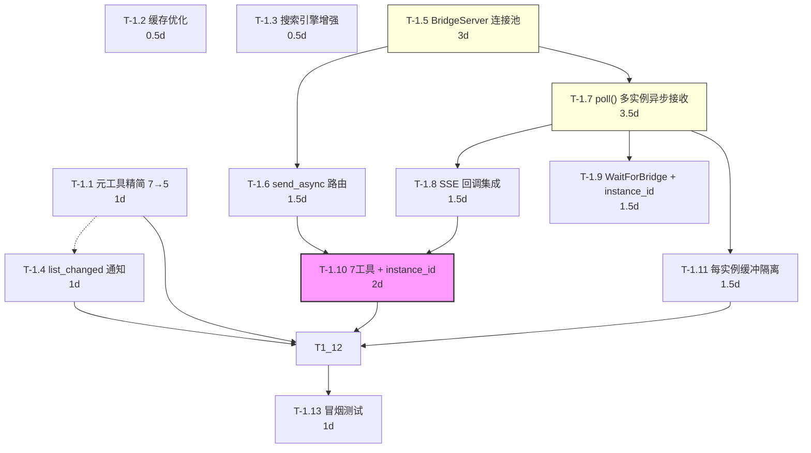
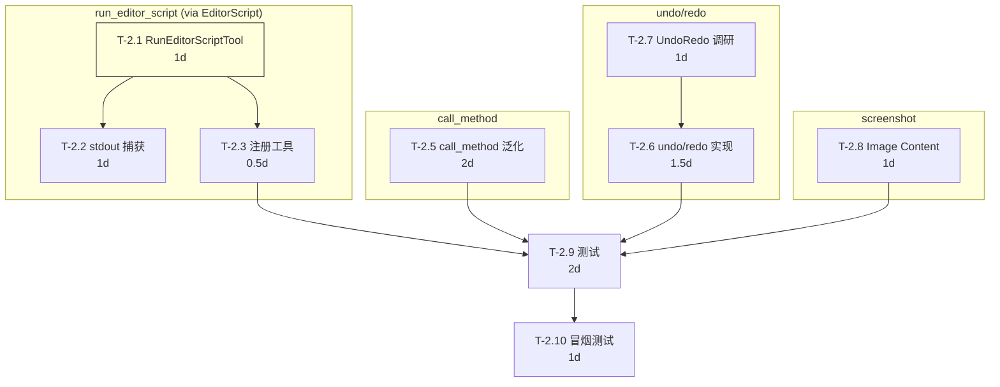
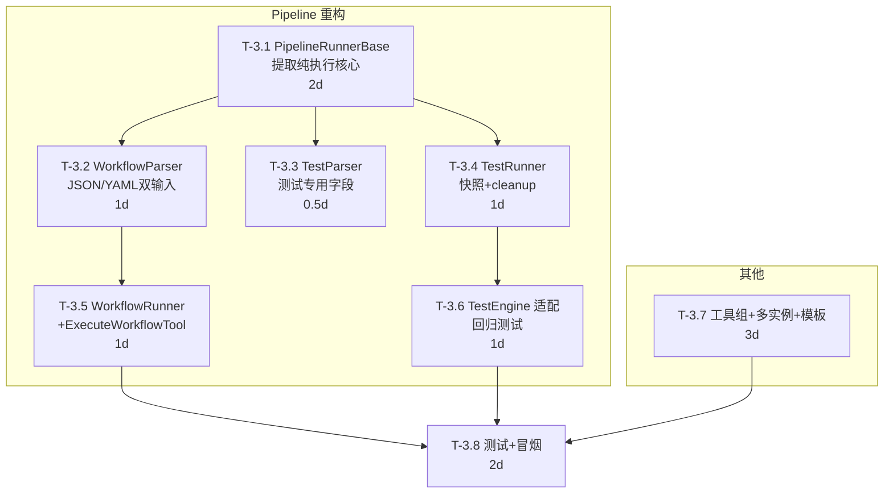
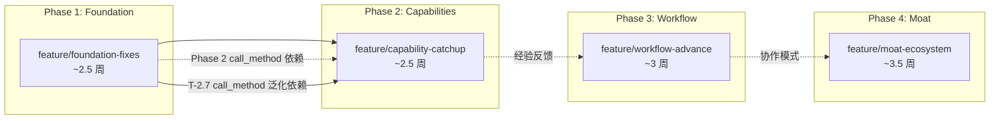

# DAG 任务分解与并行开发方案

> 版本: 1.0 · 2026-06-20  
> 团队规模: 3-5 人 · 评估总工期: ~14-16 周  
> 设计基准: `00-architecture.md` + LLD 文档 01-06

---

## 1. 方法说明

### 1.1 任务分解规则

- **工序（Task）**: 粒度 1-3 人日，可独立估工、测试、交付
- **工序间关系**: `A → B` 表示 B 依赖 A（A 完成后 B 才可开始）
- **平行簇（Batch）**: 无依赖关系的工序可同批并行
- **关键路径（Critical Path）**: 决定最短总工期的最长依赖链
- **缓冲（Buffer）**: 每个 Phase 末分配 20% 时间缓冲，应对预估偏差

### 1.2 符号约定

```
📘 T-1.1  — 工序编号 (Phase.Task)
🔵 预估   — 人日 (工程人天)
🔴 依赖   — 前置工序
✅ 产出   — 交付物
```

---

## 2. Phase 1 DAG: `feature/foundation-fixes`

### 2.1 工序列表

| ID | 工序名 | 预估 | 依赖 | 产出 |
|:--:|--------|:---:|:----:|------|
| **T-1.1** | 元工具精简：合并 `get_tool_detail` → `get_tools`、将客户端配置纳入 `get_info` 可选返回字段 | 1 人日 | — | 7→5 元工具，减少首次 overhead |
| **T-1.2** | 分类树 + schema 缓存优化 | 0.5 人日 | — | `handler_registry.cpp` → 缓存命中时零计算 |
| **T-1.3** | 搜索引擎增强：搜索索引 tokenize 移至注册时 + 频率衰减 | 0.5 人日 | — | `handler_registry.cpp` → 搜索 < 2ms |
| **T-1.4** | 实现 `notify_tools_list_changed()` 并接入回调链 | 1 人日 | T-1.3 | `editor_plugin.cpp` → 注册回调；SDK 注册/注销触发通知 |
| **T-1.5** | BridgeServer 基础架构 — `TcpServer` + `GameInstance` 连接池 | 3 人日 | — | `runtime/bridge_server.hpp` → `RuntimeBridgeServer`, 连接池, 状态机 |
| **T-1.6** | `send_command_async()` 实现（按 instance_id 路由 + 纯发送不等待） | 1.5 人日 | T-1.5 | `runtime/bridge_server.cpp` → `send_command_async(instance_id, cmd, params)` |
| **T-1.7** | `poll()` 集成异步接收（多实例独立累加器） | 3.5 人日 | T-1.5 | `runtime/bridge_server.cpp` → 每实例 `accumulate_read_data()` + `process_complete_messages()` |
| **T-1.8** | SSE 回调集成 — `RuntimeBridgeServer` → `McpHandler::enqueue_event()` | 1.5 人日 | T-1.7 | `runtime/bridge_server.cpp` + `mcp_handler.cpp` → 异步响应交付 |
| **T-1.9** | `WaitForBridgeTool` 非阻塞改造（支持 instance_id 参数） | 1.5 人日 | T-1.7 | `wait_for_bridge.hpp` → 帧驱动 watcher，等待指定实例连接 |
| **T-1.10** | 7 个桥接工具适配: 加 `instance_id` 参数 + 调 `send_command_async()` | 2 人日 | T-1.6 | 6 个工具 + `list_game_instances` 元工具 |
| **T-1.11** | TCP 分帧安全 + 每实例缓冲隔离 + 错误恢复 | 1.5 人日 | T-1.7 | 每实例 1MB 缓冲上限、单实例崩溃不影响其他、无效帧恢复 |
| **T-1.12** | Phase 1 YAML 测试更新 | 2 人日 | T-1.2, T-1.10 | `tests/yaml_tests/` → `00_meta.yaml` 更新, 新增桥接异步测试 |
| **T-1.13** | Phase 1 冒烟测试 + 回退检查 | 1 人日 | T-1.12 | 完整测试流水线通过 |

### 2.2 DAG 图



### 2.3 关键路径分析

```
T-1.5 (3d) → T-1.7 (3.5d) → T-1.8 (1.5d) → T-1.10 (2d) → T-1.12 (2d) → T-1.13 (1d)
= 13 个工作日 ≈ 2.6 周
```

### 2.4 平行簇分配（4 人）

| Batch | 工序 | 人员 | 天数 |
|:-----:|------|:----:|:----:|
| B1 | T-1.1 + T-1.2 + T-1.5 | P1, P2, P3 | 3d |
| B2 | T-1.3 + T-1.4 + T-1.6 + T-1.7 | P1, P2, P3, P4 | 3.5d |
| B3 | T-1.8 + T-1.11 + T-1.9 | P1, P2, P3 | 1.5d |
| B4 | T-1.10 + T-1.12 | P1, P2 | 2d |
| B5 | T-1.13 | P1 | 1d |

**理论最短工期**: 11 天（含缓冲 13 天 ≈ 3 周）

---

## 3. Phase 2 DAG: `feature/capability-catchup`

### 3.1 工序列表

| ID | 工序名 | 预估 | 依赖 | 产出 |
|:--:|--------|:---:|:----:|------|
| **T-2.1** | `RunEditorScriptTool` 类声明 + schema + 执行实现 | 1 人日 | — | `run_editor_script.hpp` → load + new + call _run() |
| **T-2.2** | stdout 捕获（OutputPanel 增量读取） | 1 人日 | T-2.1 | `run_editor_script.cpp` → capture_stdout |
| **T-2.3** | 注册工具 + X-macro 一行 | 0.5 人日 | T-2.1 | `register_existing.hpp` + `register_itools.cpp` |
| **T-2.4** | （已移除 — execute_gdscript 方案废弃） | — | — | — |
| **T-2.5** | `call_method` 泛化重构 | 2 人日 | Phase 1 | `call_method_in_game.hpp` → 参数扩展 + 类型覆盖 |
| **T-2.6** | `undo`/`redo` 工具实现 | 1.5 人日 | — | `undo.hpp` + `redo.hpp` |
| **T-2.7** | `EditorUndoRedoManager` 集成调研 | 1 人日 | — | 确认 API 可用性、history_id 发现策略 |
| **T-2.8** | 截图 MCP Image Content 类型改造 | 1 人日 | — | `capture_game_screenshot.hpp` + `capture_viewport.hpp` 返回格式变更 |
| **T-2.9** | Phase 2 YAML 测试 | 2 人日 | T-2.3, T-2.5, T-2.6, T-2.8 | `run_editor_script` 测试 + undo/redo 测试 + 截图测试 |
| **T-2.10** | Phase 2 冒烟测试 | 1 人日 | T-2.9 | 完整测试流水线通过 |

### 3.2 DAG 图



### 3.3 关键路径

```
T-2.1 (1d) → T-2.2 (1d) → T-2.3 (0.5d) → T-2.9 (2d) → T-2.10 (1d)
= 5.5 个工作日 ≈ 1 周
```

### 3.4 平行簇分配（4 人）

| Batch | 工序 | 人员 | 天数 |
|:-----:|------|:----:|:----:|
| B1 | T-2.1 + T-2.7 + T-2.8 + T-2.5 | P1, P2, P3, P4 | 2d |
| B2 | T-2.2 + T-2.3 + T-2.6 + T-2.9 (调研后可开工) | P1, P2, P3, P4 | 1.5d |
| B3 | T-2.9 | P1, P2 | 2d |
| B4 | T-2.10 | P1 | 1d |

**理论最短工期**: 6.5 天（含缓冲 8 天 ≈ 1.5 周）

---

## 4. Phase 3 DAG: `feature/workflow-advance`

### 4.1 工序列表

| ID | 工序名 | 预估 | 依赖 | 产出 |
|:--:|--------|:---:|:----:|------|
| **T-3.1** | `pipeline/` 目录提取 + `PipelineRunnerBase` 提取纯执行核心 | 2 人日 | — | 从 `testing/` 移入共享文件，新建基类，拆离快照/断言 |
| **T-3.2** | `WorkflowParser`（JSON/YAML 双输入 + vars + timeout） | 1 人日 | T-3.1 | `workflow_parser.hpp/.cpp` |
| **T-3.3** | `TestParser`（测试专用字段：expect/disk_verify） | 0.5 人日 | T-3.1 | `test_parser.hpp/.cpp` |
| **T-3.4** | `TestRunner`（继承基类 + 快照 + cleanup） | 1 人日 | T-3.1 | `testing/test_runner.hpp/.cpp` |
| **T-3.5** | `WorkflowRunner` + `ExecuteWorkflowTool` | 1 人日 | T-3.2 | `workflow_runner.hpp` + `meta/execute_workflow.hpp` |
| **T-3.6** | TestEngine 改用 TestRunner + 回归测试 | 1 人日 | T-3.4 | `test_engine.hpp/.cpp` 更新，跑 25 个 YAML 测试 |
| **T-3.7** | 工具组元数据 + 多实例增强 + 项目模板 | 3 人日 | — | tool_group、多实例、scaffold |
| **T-3.8** | Phase 3 YAML 测试 + 冒烟 | 2 人日 | T-3.5, T-3.6, T-3.7 | 工作流 + 分组 + 多实例 + 模板 |

### 4.2 DAG 图



### 4.3 关键路径

```
T-3.1 (2d) → T-3.2 (1d) → T-3.5 (1d) → T-3.8 (2d)
= 6 个工作日 ≈ 1.2 周
```

### 4.4 平行簇分配（4 人）

| Batch | 工序 | 人员 | 天数 |
|:-----:|------|:----:|:----:|
| B1 | T-3.1 + T-3.7 | P1, P2 | 3d |
| B2 | T-3.2 + T-3.3 + T-3.4 | P1, P2, P3 | 1.5d |
| B3 | T-3.5 + T-3.6 | P1, P2 | 1.5d |
| B4 | T-3.8 | P1, P2 | 2d |

**理论最短工期**: 8 天（含缓冲 10 天 ≈ 2 周）

---

## 5. Phase 4 DAG: `feature/moat-ecosystem`

### 5.1 工序列表

| ID | 工序名 | 预估 | 依赖 | 产出 |
|:--:|--------|:---:|:----:|------|
| **T-4.1** | `SceneShadow` 类实现（PackedScene 快照/清除/查询） | 2 人日 | — | `scene_diff/scene_shadow.hpp` |
| **T-4.2** | `SceneDiff` 算法（属性级 diff + 节点增删检测） | 3 人日 | T-4.1 | `scene_diff/scene_diff.hpp` → `compute()` |
| **T-4.3** | `ScenePatcher`（UndoRedo apply + rollback） | 2 人日 | T-4.2 | `scene_diff/scene_patcher.hpp` |
| **T-4.4** | 4 个 Shadow 工具接口 + 注册 | 1.5 人日 | T-4.3 | `stage_scene_change`, `preview_change`, `apply_changes`, `discard_changes` |
| **T-4.5** | 场景切换自动清 shadow | 0.5 人日 | T-4.1 | `editor_plugin.cpp` `_process()` 整合 |
| **T-4.6** | `OperationRecorder` — HandlerRegistry 调用钩子 | 2 人日 | — | `replay/operation_recorder.hpp` |
| **T-4.7** | `OperationReplay` — YAML 回放引擎 | 2.5 人日 | T-4.6 | `replay/operation_replay.hpp` |
| **T-4.8** | `DiffSceneStates` 工具（.tscn 文件比较） | 1.5 人日 | T-4.2 | `scene_diff/diff_scene_states.hpp` |
| **T-4.9** | 录制/回放工具 + DiffSceneStates 注册 | 1 人日 | T-4.7, T-4.8 | 工具注册 |
| **T-4.10** | Phase 4 YAML 测试 | 4 人日 | T-4.4, T-4.9 | Shadow 场景测试 + 回放测试 |
| **T-4.11** | Phase 4 冒烟测试 + 全回归 | 2 人日 | T-4.10 | 完整测试流水线通过 |

### 5.2 DAG 图

```mermaid
graph TD
    subgraph "Shadow Scene"
        T4_1["T-4.1 SceneShadow<br/>2d"] --> T4_2["T-4.2 SceneDiff 算法<br/>3d"]
        T4_2 --> T4_3["T-4.3 ScenePatcher<br/>2d"]
        T4_3 --> T4_4["T-4.4 4工具+注册<br/>1.5d"]
        T4_1 --> T4_5["T-4.5 场景切换检测<br/>0.5d"]
    end

    subgraph "Scene Replay"
        T4_6["T-4.6 OperationRecorder<br/>2d"] --> T4_7["T-4.7 OperationReplay<br/>2.5d"]
        T4_2 --> T4_8["T-4.8 DiffSceneStates<br/>1.5d"]
        T4_7 --> T4_9["T-4.9 录制/回放工具注册<br/>1d"]
        T4_8 --> T4_9

    T4_4 --> T4_10["T-4.10 测试<br/>4d"]
    T4_5 --> T4_10
    T4_9 --> T4_10
    T4_10 --> T4_11["T-4.11 冒烟+回归<br/>2d"]

    style T4_2 fill:#ffd,stroke:#333
    style T4_7 fill:#ffd,stroke:#333
    style T4_10 fill:#f9f,stroke:#333,stroke-width:2px
```

### 5.3 关键路径

```
T-4.1 (2d) → T-4.2 (3d) → T-4.3 (2d) → T-4.4 (1.5d) → T-4.10 (4d) → T-4.11 (2d)
= 14.5 个工作日 ≈ 3 周
```

或：

```
T-4.6 (2d) → T-4.7 (2.5d) → T-4.9 (1d) → T-4.10 (4d) → T-4.11 (2d)
= 11.5 个工作日 ≈ 2.5 周
```

**以 Shadow Scene 链为主关键路径**。

### 5.4 平行簇分配（5 人 — Phase 4 复杂度最高）

| Batch | 工序 | 人员 | 天数 |
|:-----:|------|:----:|:----:|
| B1 | T-4.1 + T-4.6 | P1, P2, P3 | 2d |
| B2 | T-4.2 + T-4.7 + T-4.5 | P1, P2, P3, P4 | 3d |
| B3 | T-4.3 + T-4.8 | P1, P2 | 2d |
| B4 | T-4.4 + T-4.9 | P1, P2, P3 | 1.5d |
| B5 | T-4.10 | P1, P2, P3 | 4d |
| B6 | T-4.11 | P1, P2 | 2d |

**理论最短工期**: 14.5 天（含缓冲 17 天 ≈ 3.5 周）

---

## 6. 全阶段依赖图谱



**关键路径（全阶段）**: Phase 1 → Phase 2 → Phase 3 → Phase 4

但 Phase 3 和 Phase 4 中的部分任务可提前开始（尤其是与 bridge 无关的任务），详见第 7 节。

---

## 7. 整体并行方案

### 7.1 人员角色定义（5 人团队）

| 角色 | 代号 | 核心能力 | 主要负责模块 |
|:----:|:----:|---------|-------------|
| **架构核心工程师** | P1 | C++/Godot API/桥接/协议 | Bridge 重构、MCP 协议、HandlerRegistry |
| **工具开发工程师** | P2 | C++/ITool 模式/CMake | 新工具实现、注册、SDK CMake 模块 |
| **测试与质量工程师** | P3 | YAML 测试/GDSciprt/CI | 测试用例、安全沙箱、CI 集成 |
| **工具开发工程师** | P4 | C++/ITool 模式/godot-cpp | 工具实现、Shadow Scene diff 算法 |
| **前端/GDScript 工程师** | P5 | GDScript/文档/集成测试 | 示例工具包、文档、集成测试、UI |

### 7.2 全阶段批量排期

```
Week  1   2   3   4   5   6   7   8   9   10  11  12
      ┌──Phase 1──┐──Phase 2──┐──Phase 3───┐───Phase 4─────┐

P1    T1.5 T1.7 T1.8  │ T2.1 T2.2    │ T3.1 T3.2 T3.5 │ T4.1 T4.2 T4.3 T4.4
      桥接重构          │ run_editor    │ Pipeline 提取   │ Shadow Scene 核心

P2    T1.1 T1.4      │ T2.5 T2.6 T2.8│ T3.4 T3.6     │ T4.5
      元工具+通知      │ call_method   │ TestRunner回归  │ 场景切换

P3    T1.3 T1.10     │ T2.7          │ T3.7           │ T4.6 T4.7 T4.9
      回调+桥接工具    │ UndoRedo调研   │ 工具组+多实例   │ 录制/回放

P4    T1.7 T1.11     │ T2.8(协)      │ T3.3           │ T4.8
      TCP 安全        │ undo(实现)     │ dry_run        │ DiffScene

P5    T1.12 T1.13    │ T2.9          │ T3.8           │ T4.14 T4.15
      测试            │ 测试           │ 测试           │ 测试

### 7.3 不同团队规模的调整策略

| 团队规模 | Phase 1 | Phase 2 | Phase 3 | Phase 4 | 总工期 |
|:-------:|:-------:|:-------:|:-------:|:-------:|:------:|
| **5 人** | 2.5 周 | 1.5 周 | 2 周 | 3.5 周 | **~9.5 周** |
| **4 人** | 3 周 | 2 周 | 2.5 周 | 4 周 | **~11.5 周** |
| **3 人** | 4 周 | 2.5 周 | 3 周 | 5.5 周 | **~15 周** |

**缩减策略**（如果 3 人）:
- Phase 1: T-1.1 元工具精简延期到 Phase 3
- Phase 3: T-3.7 项目模板延期到 Phase 4
- Phase 4: T-4.8 `DiffSceneStates` 合并进 `SceneDiff` 模块

### 7.4 串行化备选方案

如果 Phase 1 桥接重构风险过高或延期，可执行降级计划：

```
降级 Plan B:
Phase 1: 仅 tasks/list 全量 + SSE 通知（不碰桥接）
Phase 2: 仅 run_editor_script + undo/redo（桥接相关延期）
Phase 1b: 桥接异步化作为独立热修复
Phase 3+: 恢复原计划
```

---

## 8. 里程碑

### M1 — 协议兼容基座可交付

```
时间: Phase 1 结束时（Week 3-4）
交付: feature/foundation-fixes
验证:
  ✅ 元工具精简至 5 个，首次交互 overhead -25%
  ✅ 分类树/schema 缓存命中零计算开销
  ✅ 桥接调用不再冻结编辑器
  ✅ 运行时截图、场景树查询等操作不卡主线程
  ✅ 25 个既有 YAML 测试全部通过
```

### M2 — 核心能力对等

```
时间: Phase 2 结束时（Week 6-8）
交付: feature/capability-catchup
验证:
  ✅ EditorScript 文件执行通过 write_script + run_editor_script 组合正常工作
  ✅ 运行时 call_method 支持任意 Godot 方法
  ✅ undo/redo 可回退 AI 和手动操作
  ✅ 截图以 MCP 原生 Image Content 返回
  ✅ 安全沙箱通过攻防测试
```

### M3 — 工作流超越

```
时间: Phase 3 结束时（Week 7-9）
交付: feature/workflow-advance
验证:
  ✅ PipelineRunnerBase 纯执行核心提取完成，TestRunner 和 WorkflowRunner 均运行正常
  ✅ JSON 原生工作流（workflow_json）和 YAML 字符串（workflow_yaml）双输入
  ✅ WorkflowParser 正确解析 vars/timeout，TestParser 正确解析 expect/disk_verify
  ✅ 25 个已有 YAML 测试全部通过（TestRunner 行为与改造前一致）
  ✅ 测试快照清理行为不变
```

### M4 — 护城河建成

```
时间: Phase 4 结束时（Week 13-16）
交付: feature/moat-ecosystem
验证:
  ✅ 非破坏编辑: stage → edit → preview → apply/discard
  ✅ 场景操作录制 → 生成 YAML 测试 → 回放通过
  ✅ 全 4 阶段回归测试通过
```

---

## 9. 风险与缓解

### 9.1 关键路径风险

| 风险节点 | 影响 | 概率 | 缓解 |
|:--------:|:----:|:----:|------|
| **T-1.5→T-1.7** BridgeServer 重构（TcpServer + 连接池）延期 | Phase 1 整体延期 1-2 周 | 中 | T-1.5 复杂度从 2d→3d（主要新工作在连接池管理），提前启动；预留 3 天缓冲；降级 Plan B |
| **T-2.3** GDScript 沙箱绕过 | 安全漏洞，Phase 2 打回 | 低 | 默认禁用；攻防测试；CVE 报告机制 |
| **T-3.1→T-3.2** YAML 引擎膨胀 | 功能 creep，工期膨胀 2x | 中 | 严格锁定 MVP scope：顺序+条件+重试。不加并行/DAG/built-in 任务 |
| **T-4.2** Property diff 不完整 | Variant 类型比较遗漏 | 低 | 优先覆盖游戏开发常用类型（Vector2/3、Color、Transform、Rect2） |
| **T-1.12→T-4.15** 全局回归发现旧功能损坏 | 需要回溯定位 | 中 | 每个 Phase 完成后立即全回归；CI 自动跑 25+ 测试 |

### 9.2 外部依赖风险

| 风险 | 影响 | 缓解 |
|------|:----:|------|
| godot-cpp 10.0.0-rc1 中 `EditorUndoRedoManager` API 变更 | undo/redo 实现阻塞 | T-2.9 调研阶段确认 API；跟踪 godot-cpp 更新 |
| ryml v0.7.0 YAML 解析不支持锚点/别名 | 工作流限制 | 文档声明限制；后续评估升级 |
| Godot 4.6 Logger API 差异 | stdout 捕获失败 | T-2.4 实现中 fallback 到 OutputPanel 文本读取 |

### 9.3 人员风险

| 场景 | 影响 | 缓解 |
|------|:----:|------|
| P1（架构核心）缺席 | 桥接+协议无人能改 | 文档覆盖关键决策（此文档+LDD 01）；代码评审要求至少 1 人熟悉 |
| 试验性质任务执行耗时 | 超出预估 | 每个工序预留 20% 缓冲；T-2.2/T-3.2/T-4.2 为最高风险工序，优先安排 P1 |

---

## 10. 设计文档索引

| 文档 | 路径 | 对应 |
|------|------|:----:|
| 系统架构设计 | `00-architecture.md` | 全阶段 |
| Bridge 异步化 LLD | `01-lld-bridge-async.md` | Phase 1 |
| 元工具精简 LLD | `02-lld-tools-list.md` | Phase 1 |
| run_editor_script LLD | `03-lld-run-editor-script.md` | Phase 2 |
| undo/redo LLD | `04-lld-undo-redo.md` | Phase 2 |
| YAML/JSON 工作流引擎 LLD | `05-lld-yaml-workflow.md` | Phase 3 |
| Shadow Scene + Diff LLD | `06-lld-shadow-scene.md` | Phase 4 |
| DAG + 并行方案 | `07-dag-and-parallel-plan.md` | 全阶段 |

---

> **建议阅读顺序**: `00-architecture.md` → 对应 Phase 的 LLD → `07-dag-and-parallel-plan.md`
