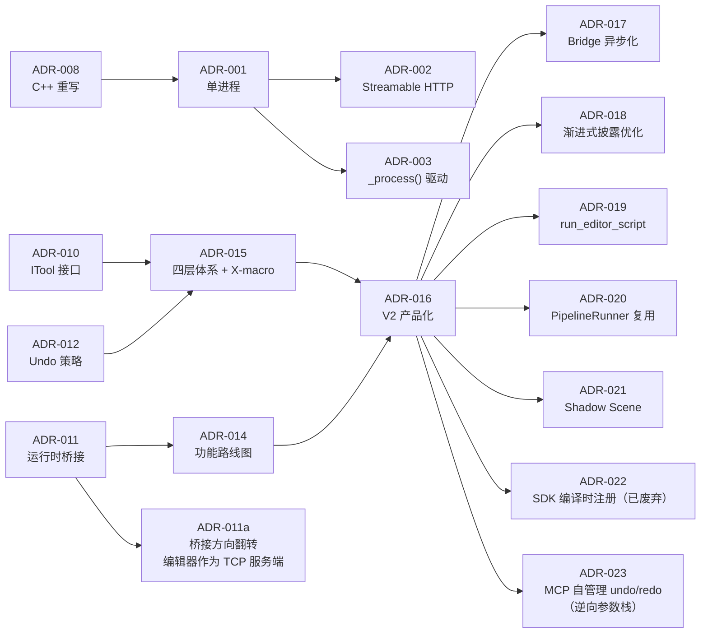

# 设计决策（ADR 摘要）

> ADR-001~ADR-018 已实施完成；ADR-019~ADR-023 为设计阶段计划（Phase 2~4），尚未实现。此处仅作历史记录。详细上下文可在 git 历史中追溯。

## 已接受决策

| ID | 日期 | 决策 | 要点 |
|----|------|------|------|
| 001 | 2026 | 单进程架构 | 移除 Python 服务器，仅 C++ GDExtension + MCP Streamable HTTP :9600 |
| 002 | 2026 | MCP Streamable HTTP 传输 | C++ 内实现 HttpServer + SSE + JSON-RPC 2.0 会话管理 |
| 003 | 2026-06 | `_process()` 重写驱动 | 替代 `process_frame` 信号，三合一：HTTP poll + 桥接连接 + 桥接 poll |
| 004 | 2026 | CMake 构建 | `godot-cpp` 通过 FetchContent 拉取，`main.py` 为便捷包装 |
| 005 | 2026 | C# Solution 直接生成 | 不启动第二 Godot 进程，直接生成 `.sln`/`.csproj` |
| 006 | 2026 | 直接 GDExtension 日志 | `UtilityFunctions::print`（24 行），无跨线程日志需求 |
| 007 | 2026 | `call_method` 用 `Object::call()` | 通用方法调用，主线程同步执行 |
| 008 | 2025-2026 | C++ 重写取代 Rust | 消除 `MainThreadDispatcher`/tokio/MPSC 日志通道等 ~50% 跨线程代码 |
| 009 | 2026 | C# 工具注册启用 | `register_script_cs` 已在注册流程中激活 |
| 010 | 2026-06 | 统一 ITool 接口 | 所有工具实现同一接口，`execute()` 模板方法 + `input_schema()` 自描述 |
| 011 | 2026-06 | 运行时桥接 | `GameBridgeNode`（游戏进程 TCP 客户端）+ `RuntimeBridgeServer`（编辑器侧 TCP 服务端 :9601） |
| 011a | 2026-06-20 | 桥接方向翻转 | 编辑器改为 TCP 服务端，游戏进程改为 TCP 客户端，支持多游戏实例连接（[LLD](01-lld-bridge-async.md)） |
| 012 | 2026-06-04 | 场景树分类 + Undo 策略 | 全部用 `EditorUndoRedoManager`；剪贴板用 `PackedScene`；脚本工具归入 `scene_tree` 分类 |
| 013 | 2026-06-08 | 移除 PCH | Unity Build 已覆盖优化价值，消除 ~100MB `.pch` + 管理复杂度 |
| 014 | 2026-06-08 | P0/P1/P2 功能路线图 | 7 运行时命令 + 14 脚本工具 + 13 P1 工具 + 24 P2 工具，全部完成 |
| 015 | 2026-06-11 | 四层工具体系 + 搜索引擎 + X-macro | 工具数 ~11791→~152；搜索引擎（4 阶段权重）；SDK 工具平权（IToolAdapter） |
| 016 | 2026-06-14 | V2 产品化 | 预编译分发 + 底部面板 UI + CORS/Session 安全 + 限流 + 客户端配置模板 |
| 017 | 2026-06-20 | Bridge 异步化 | `send_command_async()` 帧驱动轮询 + SSE 事件队列交付，消除编辑器冻结（[LLD](01-lld-bridge-async.md)） |
| 018 | 2026-06-20 | 渐进式披露优化 | 保留 `tools/list` 仅返回元工具（5 个 meta_tools），缓存+搜索引擎优化（[LLD](02-lld-tools-list.md)） |
| 019 | 2026-06-20 | `run_editor_script`（EditorScript） | 利用 Godot 内置 `EditorScript` 机制替代自建沙箱（[LLD](03-lld-run-editor-script.md)） |
| 020 | 2026-06-20 | Pipeline 三层继承体系 | `PipelineRunnerBase` 纯执行核心 → `TestRunner`（快照+断言）/ `WorkflowRunner`（JSON/YAML 工作流），`pipeline/` 独立为共享模块（[LLD](05-lld-yaml-workflow.md)） |
| 021 | 2026-06-20 | Shadow Scene 非破坏编辑 | `PackedScene` 快照 + 属性级 diff + UndoRedo apply，竞品中唯一（[LLD](06-lld-shadow-scene.md)） |
| 022 | 2026-06-20 | SDK 编译时注册（已废弃） | 运行时 `McpToolDefinition` SDK 已覆盖扩展需求，编译时方案不必要 |
| 023 | 2026-06-22 | MCP 自管理 undo/redo（逆向参数栈） | 放弃委托 Godot `EditorUndoRedoManager`，改用 MCP 独立双栈 + 逆向参数重放。缘由：Godot 明确警告稳定性风险 + 历史 7 次 bug 修复 + godot-cpp 绑定缺失 |

## 关键决策关联

## 已废弃决策

| 原 ADR | 原因 |
|--------|------|
| 双进程架构（Server + GDExtension） | 被 ADR-001（单进程）取代 |
| WebSocket IPC | 已移除，不再需要进程间通信 |
| 静态注册所有工具 Schema（Python 侧权威） | 被 ADR-010 + X-macro 编译时注册取代 |
