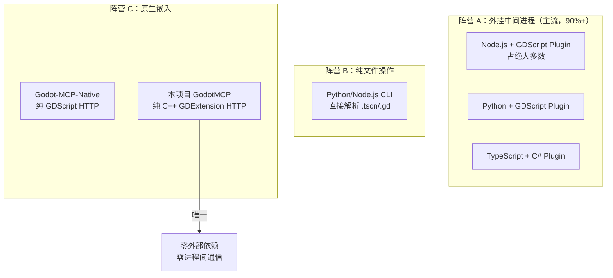

# 竞品深度分析

> 基于全网搜索的 20+ Godot MCP 项目技术分析。数据采集时间：2026-06-12。

## 一、市场格局

### 1.1 阵营划分

### 1.2 头部竞品详细信息

| 项目 | 技术栈 | 工具数 | 通信协议 | 依赖 | 价格 |
|------|--------|:------:|---------|------|------|
| **youichi-uda/godot-mcp-pro** | Node.js + GDScript | 172 | WebSocket:6505 | Node.js 18+ | $15 |
| **Farraskuy/Godot-MCP** | TypeScript + GDScript | 168 | WebSocket:6505 | Node.js 18+ | 免费 |
| **yurineko73/Godot-MCP-Native** | 纯 GDScript | 154 | HTTP:9080 | **无** | 免费 |
| **dreamer568/godot-mcp** | Node.js + GDScript | ~80 | WebSocket:6789 | Node.js 18+ | 免费 |
| **alexmeckes/godot-mcp** | Node.js + GDScript | 99 | WebSocket:6550 | Node.js 18+ | 免费 |
| **Sods2/godot-mcp** | Node.js + GDScript | 77 | TCP:6008 | Node.js 18+ | 免费 |
| **tomyud1/godot-mcp** | Node.js + GDScript | 42 | WebSocket:6505 | Node.js 18+ | 免费 |
| **satelliteoflove/godot-mcp** | Node.js + GDScript | ~12 | WebSocket:6550 | Node.js 20+ | 免费 |
| **xulek/godotmcp** | Python + GDScript | ~70 | WebSocket:49631 | Python 3.11+ | 免费 |
| **LeanderM99/GodotMCP** | TypeScript + C# Plugin | 45 | WebSocket:6550 | Node.js + .NET | 免费 |
| **fennaraOfficial/fennara-godot-mcp** | Node.js + GDScript | ~15 | stdio | Node.js + API Key | SaaS |
| **GodotMCP（本项目）** | **C++ GDExtension** | **~171** | **HTTP:9600** | **无** | **免费** |

---

## 二、竞品关键技术深度分析

### 2.1 godot-mcp-pro（youichi-uda）— 工具数量王者

**架构**：`AI Client ↔ Node.js Server (stdio) ↔ WebSocket:6505 ↔ GDScript EditorPlugin`

**优势**：
- 172 个工具覆盖 23 个分类，是工具数量绝对领先者
- 多模式适配（Full 172 / 3D 100 / Lite 81 / Minimal 35），解决不同 AI 客户端工具数限制问题
- Smart Type Parsing：`"Vector2(100,200)"` / `"#ff0000"` / `"Color(1,0,0)"` 自动转换为 Godot 类型
- 自动重连 + 指数退避（1s → 60s max）+ 10s 心跳保活
- UndoRedo 集成：所有节点/属性操作支持 Ctrl+Z
- 错误建议：结构化错误包含上下文提示

**劣势**：
- Node.js 运行时依赖，安装链路长
- GDScript 实现的编辑器插件，性能和内存管理受 GDScript 限制
- TypeScript 中间层增加延迟（三次序列化：JSON → WS → JSON → Godot API → JSON → WS → JSON）
- Server 代码闭源付费（$15 one-time），社区无法审查
- 一次性暴露 172 个工具给 AI 上下文，token 消耗巨大（无渐进式披露）

### 2.2 satelliteoflove/godot-mcp — 最成熟的开源方案

**架构**：`AI Client ↔ Node.js Server (npx) ↔ WebSocket:6550 ↔ GDScript Bridge Plugin`

**优势**：
- npm 一键安装：`npx @satelliteoflove/godot-mcp --install-addon /path`
- WSL2 原生支持（自动检测 Windows 网络配置，Bind Mode: Localhost/WSL/Custom）
- 编辑器底部面板 UI（MCP 状态指示器、端口配置、连接状态）
- `mcp_watch` 组 + `_mcp_state()` 允许游戏代码主动暴露状态给 AI
- 与 minimal-godot-mcp 互补设计（运行时控制 vs 静态分析）
- MCP Resources（项目数据读取）+ 完整文档站

**劣势**：
- 工具数量少（~12 个），覆盖面有限
- 无 3D 专用操作（无 Mesh/Light/Physics 工具）
- 无 UndoRedo 集成
- 仍需 Node.js 进程

### 2.3 Godot-MCP-Native（yurineko73）— 最接近本项目的竞品

**架构**：纯 GDScript，编辑器内 HTTP 服务器，零外部依赖

**优势**：
- 零外部依赖，开箱即用
- 154 个工具（30 核心 + 124 高级），数量与本项目接近
- 支持 HTTP 和 stdio 两种传输模式
- 66 个高级调试工具（断点、栈帧检查、性能分析、运行时探针）
- 导出预设管理（CRUD + 验证 + 执行）
- Auth Token 安全认证
- AssetLib 可安装

**劣势**：
- GDScript 实现的 HTTP 服务器性能远不如 C++
- 无运行时桥接（无 GameBridgeNode 等价物）
- 无 SDK 系统（不支持 GDScript 自定义工具注册）
- 无测试引擎
- 无重入保护（EditorProgress 场景下可能崩溃）
- 工具全量暴露，无渐进式披露
- 无搜索引擎

### 2.4 xulek/godotmcp — 安全模型标杆

**架构**：`AI Client ↔ Python FastMCP Server (stdio) ↔ WebSocket:49631 ↔ GDScript EditorPlugin`

**优势**：
- Guarded-action 确认流程（可配置白名单：`GODOT_MCP_BUILD_COMMAND_ALLOWLIST`）
- 工作流系统（agentic test loop、observe-and-verify、workflow checkpoints）
- Inspector 属性 patch/diff/preset
- 资源依赖图和孤儿检测
- 完善的安全文档（PROTOCOL.md、TOOLS.md、SECURITY.md）

**劣势**：
- Python 依赖链（`mcp >= 1.0.0`、`websockets >= 12.0`）
- 70 个工具数量中等
- Python WebSocket 在 Windows 上偶尔不稳定

### 2.5 Dreamer568/godot-mcp — 上下文感知设计

**架构**：`AI Client ↔ Node.js Server ↔ WebSocket:6789 ↔ GDScript Bridge Plugin`

**独特设计**：
- `state_broadcaster.gd` 每秒写 `godot_state.json`，AI 自动获取最新编辑器状态（场景树、错误、运行时日志），无需主动请求
- 文件操作故意不包含在 MCP 中——"Your IDE already does that natively and does it better"
- 专注编辑器内操作（live scene state, resource assignment, editor operations）

### 2.6 Fennara — SaaS 商业化产品

**架构**：CLI installer + 本地 MCP Server + 云端 API Key 鉴权

**优势**：
- 一键安装器（CLI installer 自动配置）
- SemanticSearch（语义搜索项目代码索引）
- Shader 搜索
- patch-and-rerun 工作流
- 场景验证

**劣势**：
- 需要账号 + API Key
- 闭源 SaaS
- 需要网络连接

---

## 三、竞品能力矩阵

### 3.1 核心能力对比

| 能力维度 | 本项目 | godot-mcp-pro | satelliteoflove | Godot-MCP-Native | xulek/godotmcp |
|---------|:------:|:------------:|:--------------:|:----------------:|:-------------:|
| 运行时依赖 | **零** | Node.js | Node.js | **零** | Python |
| 实现语言 | **C++ GDExtension** | GDScript + TS | GDScript + JS | GDScript | GDScript + Python |
| 工具数 | ~171 | 172 | ~12 | 154 | ~70 |
| 渐进式披露 | **唯一有** | 手动模式切换 | 无 | 无 | 无 |
| SDK 自定义工具 | **唯一有** | 无 | 无 | 无 | 无 |
| 运行时桥接 | 自动生命周期 | 有 | 有(mcp_watch) | 无 | 有 |
| 测试引擎 | **唯一有** | 无 | 无 | 无 | 有(workflow) |
| Undo 集成 | 自动包裹 | 有 | 无 | 无 | 有 |
| ClassDB 运行时查询 | **原生** | 无 | 无 | 无 | 无 |
| 搜索引擎 | **内置** | 无 | 无 | 无 | 无 |
| 编辑器 UI 面板 | **无** | 无 | 底部面板 | 无 | 无 |
| WSL2 支持 | 无 | 无 | **有** | 无 | 无 |
| 安全模型 | 基础 | 无 | 无 | Auth Token | **Guarded-action** |
| 安装便利性 | 需编译 | npm build | **npx 一行** | **AssetLib** | pip install |
| Godot 版本 | **4.6+** | 4.4+ | 4.5+ | 4.x | **4.6** |

### 3.2 工具覆盖面对比

| 工具领域 | 本项目 | godot-mcp-pro | Godot-MCP-Native |
|---------|:------:|:------------:|:----------------:|
| Scene Tree | 24 | ~14 | ~11 |
| Scripts | 11 | 8 | ~7 |
| Animation | 5 | 6 | — |
| **AnimationTree** | **0** | **8** | — |
| Debugger | 32 | ~2 | ~66 |
| FileSystem | 12 | ~4 | — |
| TileMap | 3 | 6 | — |
| **3D Physics** | **0 (仅2D)** | **6** | — |
| **Audio** | **0** | **6** | — |
| **Navigation** | **0** | **6** | — |
| **Particles** | **0** | **5** | — |
| Shader | 3 | 6 | — |
| Export | 2 | 3 | ~5 |
| **InputMap 写** | **0 (仅读)** | **有** | — |
| Settings | 4 | — | ~3 |

---

## 四、本项目 SWOT 分析

### Strengths（优势）

1. **架构碾压**：C++ 原生嵌入 → 零延迟、零依赖、零额外进程
2. **渐进式披露**：唯一实现工具按需加载的产品，天然适配工具数限制的客户端
3. **SDK 系统**：唯一允许 GDScript 开发者注册自定义 MCP 工具的产品
4. **YAML 测试引擎**：唯一内置自动化测试的 Godot MCP 产品
5. **ClassDB 运行时文档**：零维护成本，天然与引擎版本同步
6. **搜索引擎**：唯一内置工具搜索引擎（exact/prefix/fuzzy/fulltext + 频次排序）
7. **自动 Undo 包裹**：声明 `supports_undo=true` 即自动获得 Ctrl+Z 支持
8. **运行时桥接自动生命周期**：`is_playing_scene()` 感知游戏启停，无需手动连接

### Weaknesses（劣势）

1. **安装门槛高**：需 C++ 编译环境（CMake + MSVC/Clang + Python 3.14）
2. **无编辑器 UI**：零可视化状态展示，只能通过日志判断
3. **工具覆盖盲区**：AnimationTree/Audio/Navigation/Particles/3D Physics 完全缺失
4. **无 WSL2 支持**：Windows Godot + WSL2 AI Client 场景不可用
5. **Release 流水线缺陷**：预编译 zip 缺少配置文件，实际不可用
6. **安全模型不成熟**：`_confirm` 机制存在但未启用，无认证/限流/审计
7. **文档导向开发者**：缺少用户视角的快速上手指南

### Opportunities（机会）

1. **预编译分发**：修复 Release 流水线后，零依赖安装体验将成为最大卖点
2. **垂直领域工具**：SDK 系统允许社区贡献专业领域工具
3. **Godot 4.6 独占**：Godot 4.6 的新 API（如改进的 TileMapLayer）可提供竞品无法实现的能力
4. **单进程安全性**：无进程间通信 = 无网络暴露 = 天然安全边界

### Threats（威胁）

1. **Godot-MCP-Native**：同为零依赖，GDScript 方案可 AssetLib 安装，用户选择门槛低
2. **工具数量竞赛**：竞品以 150+ 工具为卖点，本项目在部分领域覆盖不足
3. **用户期望**：NPM 一行命令已成为 MCP 安装的行业标准，C++ 编译方案与之相反
