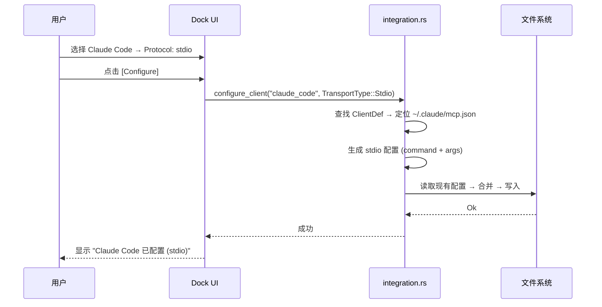
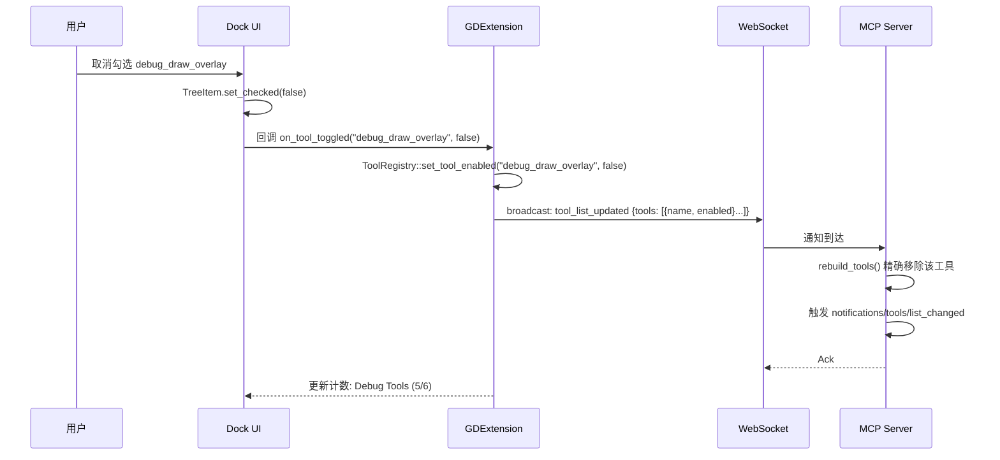

# Dock UI 面板设计

## 相关页面

- [架构概览](../overview/architecture.md) — EditorPlugin 与 Dock 的关系
- [Cargo Workspace 结构](../specification/workspace.md) — gdext crate 代码组织
- [工具清单与热切换](tools.md) — 工具管理面板的下游逻辑
- [IPC 桥接细节](ipc-bridge.md) — 面板操作通过 IPC 通知 Server

---

## 面板位置

使用 `EditorPlugin::add_control_to_dock(DockSlot::RIGHT_UL, control)` 将面板添加到编辑器右侧上方 Dock 槽位（与 FileSystem、Scene 同区域）。

## 面板布局

```
┌─ Godot MCP (Dock) ───────────────────────────────────────┐
│                                                            │
│  ● Status: Running                              [Stop]     │
│  ws://127.0.0.1:9500                                      │
│  http://127.0.0.1:8900/mcp                                │
│                                                            │
│  ── Clients ────────────────────────── 2 连接 ────────── │
│  Claude Code    ● Connected   [Disconnect]                 │
│  Cursor         ○ Idle                                     │
│                                                            │
│  ── Integration ──────────────────────────────────────── │
│  ┌──────────────────────────────────────────────────────┐ │
│  │ Client            Protocol      Actions               │ │
│  │──────────────────────────────────────────────────────│ │
│  │ Claude Code       [stdio ▼]   [Configure] [Copy]     │ │
│  │ Codex             [HTTP  ▼]   [Configure] [Copy]     │ │
│  │ Gemini CLI        [HTTP  ▼]   [Configure] [Copy]     │ │
│  │ OpenCode          [stdio ▼]   [Configure] [Copy]     │ │
│  │ Cursor            [HTTP  ▼]   [Configure] [Copy]     │ │
│  │ GitHub Copilot    [HTTP  ▼]   [Configure] [Copy]     │ │
│  │ Qwen Code         [HTTP  ▼]   [Configure] [Copy]     │ │
│  │ Trae              [HTTP  ▼]   [Configure] [Copy]     │ │
│  │ Trae CN           [HTTP  ▼]   [Configure] [Copy]     │ │
│  │ Qoder             [HTTP  ▼]   [Configure] [Copy]     │ │
│  │ Antigravity       [HTTP  ▼]   [Configure] [Copy]     │ │
│  │ CodeBuddy         [HTTP  ▼]   [Configure] [Copy]     │ │
│  └──────────────────────────────────────────────────────┘ │
│  [Configure All]  [Export All Configs]                     │
│                                                            │
│  ── Tools (48 tools, 42 enabled) ─────────────────────── │
│  ▼ Scene Management (10/10)                    [全选/全不选]│
│    ☑ get_scene_tree                                       │
│    ☑ create_node                                          │
│    ☑ delete_node                                          │
│    ☑ modify_node_property                                 │
│    ☑ get_node_properties                                  │
│    ☑ move_node                                            │
│    ☑ duplicate_node                                       │
│    ☑ rename_node                                          │
│    ☑ set_node_script                                      │
│    ☑ find_nodes                                           │
│  ▶ Script Management (8/8)                                │
│  ▶ Asset Management (6/6)                                 │
│  ▶ Editor Control (7/7)                                   │
│  ▶ Project Management (6/6)                               │
│  ▼ Debug Tools (0/6)                           [全选/全不选]│
│    ☐ game_screenshot                                      │
│    ☐ get_debug_output                                     │
│    ☐ get_performance_stats                                │
│    ☐ debug_draw_overlay                                   │
│    ☐ watch_property                                       │
│    ☐ send_input_event                                     │
│                                                            │
│  ── Advanced ─────────────────────────────────────────── │
│  WS Port: [9500]  HTTP Port: [8900]                       │
│  ☑ Auto-start server                                      │
│  ☐ Allow LAN connections                                  │
│  [Restart]  [Open Logs]  [Export Config]                  │
└────────────────────────────────────────────────────────────┘
```

### Integration 区域说明

- **Protocol 下拉**（`OptionButton`）：每客户端独立选择 `stdio` 或 `HTTP`
  - 选择 `stdio` → [Configure] 生成 `command` + `args` 格式配置
  - 选择 `HTTP` → [Configure] 生成 `url` / `httpUrl` / `serverUrl` 格式（按客户端适配）
- **[Configure]**：检测安装路径 → 写入对应配置文件
- **[Copy]**：将配置 JSON 复制到剪贴板
- **[Configure All]**：遍历 12 个客户端，已安装则写入，跳过未安装
- **[Export All Configs]**：导出所有客户端配置到文件

### Tools 区域说明

- **两级展开**：分类行可折叠，展开后显示个体工具 CheckBox
- **分类行 CheckBox**：一键全选/全不选该分类所有工具
- **分类行计数**：显示 `已启用/总数`（如 `Debug Tools (0/6)`）
- **个体工具 CheckBox**：精确控制单个工具的启停
- 变更后立即通过 IPC `tool_list_updated` 通知 Server

## UI 组件树

```mermaid
graph TD
    Dock["VBoxContainer (root)"] --> StatusBar["StatusBar (HBoxContainer)"]
    Dock --> ClientSection["ClientSection (PanelContainer)"]
    Dock --> Integration["Integration (PanelContainer)"]
    Dock --> ToolSection["ToolSection (PanelContainer)"]
    Dock --> AdvancedSection["AdvancedSection (PanelContainer)"]

    StatusBar --> Indicator["ColorRect (状态灯)"]
    StatusBar --> StatusLabel["Label (Running/Stopped)"]
    StatusBar --> UrlLabel["Label (URL 显示)"]
    StatusBar --> StartStopBtn["Button (Start/Stop)"]

    ClientSection --> ClientHeader["Label (标题)"]
    ClientSection --> ClientTree["Tree (3列: 名称/状态/操作)"]

    Integration --> IntHeader["Label (标题)"]
    Integration --> ClientGrid["GridContainer (12行×3列)"]
    ClientGrid --> ClientRows["ClientRow[] (每客户端一行)"]
    ClientRows --> ClientName["Label (客户端名)"]
    ClientRows --> ProtocolSelect["OptionButton (stdio/HTTP)"]
    ClientRows --> ConfigBtn["Button (Configure)"]
    ClientRows --> CopyBtn["Button (Copy)"]
    Integration --> IntActions["HBoxContainer"]
    IntActions --> ConfigAllBtn["Button (Configure All)"]
    IntActions --> ExportAllBtn["Button (Export All Configs)"]

    ToolSection --> ToolHeader["Label (标题 + 总计数)"]
    ToolSection --> ToolTree["Tree (两级: 分类+工具)"]

    AdvancedSection --> AdvHeader["Label (标题)"]
    AdvancedSection --> PortRow["HBoxContainer"]
    PortRow --> WsPort["LineEdit (9500)"]
    PortRow --> HttpPort["LineEdit (8900)"]
    AdvancedSection --> SwitchRow["HBoxContainer"]
    SwitchRow --> AutoStart["CheckBox (Auto-start)"]
    SwitchRow --> AllowLan["CheckBox (Allow LAN)"]
    AdvancedSection --> ActionRow["HBoxContainer"]
    ActionRow --> RestartBtn["Button (Restart)"]
    ActionRow --> LogsBtn["Button (Open Logs)"]
    ActionRow --> ExportBtn["Button (Export Config)"]
```



## Rust 代码结构

```rust
// crates/gdext/src/editor_plugin.rs
use godot::prelude::*;
use godot::engine::{EditorPlugin, IEditorPlugin, editor_plugin::DockSlot};

#[derive(GodotClass)]
#[class(tool, editor_plugin, base=EditorPlugin)]
pub struct McpEditorPlugin {
    #[base]
    base: Base<EditorPlugin>,

    pub main_dock: Option<Gd<VBoxContainer>>,
    pub status_indicator: Option<Gd<ColorRect>>,
    pub status_label: Option<Gd<Label>>,
    pub start_stop_btn: Option<Gd<Button>>,
    pub client_tree: Option<Gd<Tree>>,
    pub tool_tree: Option<Gd<Tree>>,
    pub ws_port_input: Option<Gd<LineEdit>>,
    pub http_port_input: Option<Gd<LineEdit>>,

    // Integration 区域：每客户端的协议选择下拉
    pub protocol_selects: HashMap<String, Gd<OptionButton>>,

    pub runtime: Option<tokio::runtime::Runtime>,
    pub ipc_server: Option<IpcWebSocketServer>,
}

#[godot_api]
impl IEditorPlugin for McpEditorPlugin {
    fn enter_tree(&mut self) {
        let dock = dock::main_dock::create(self);
        self.base_mut().add_control_to_dock(
            DockSlot::RIGHT_UL,
            dock.clone(),
        );
        self.main_dock = Some(dock);

        self.start_server();
    }

    fn exit_tree(&mut self) {
        self.stop_server();
        if let Some(dock) = self.main_dock.take() {
            self.base_mut().remove_control_from_docks(dock.clone());
            dock.queue_free();
        }
    }
}
```

## UI 模块文件结构

```
crates/gdext/src/dock/
├── mod.rs              # 模块导出 + 公共类型
├── main_dock.rs        # 主容器构建函数
├── status_bar.rs       # 状态栏组件
├── client_list.rs      # 客户端列表组件
├── integration.rs      # 12 客户端配置面板（协议下拉 + 配置/复制按钮）
├── tool_manager.rs     # 两级工具管理（分类+个体）+ 热切换逻辑
└── settings.rs         # 高级设置组件
```

## 关键功能交互

### 状态指示器

| 状态 | 颜色 | 文字 | 说明 |
|------|------|------|------|
| Running | 绿色 `#00cc00` | Server: Running | WebSocket 正常监听 |
| Stopped | 灰色 `#888888` | Server: Stopped | 服务未启动 |
| Error | 红色 `#cc0000` | Server: Error | WebSocket 绑定失败 |

### 客户端配置 — 协议选择流程



### 工具热切换 — 个体工具粒度


