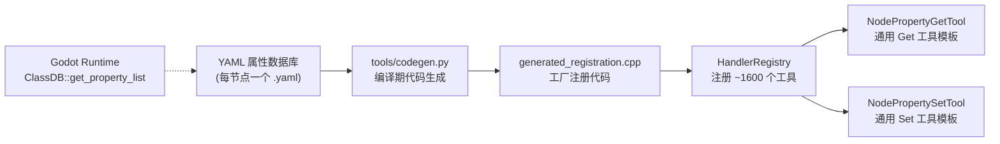

# 节点属性工具扩充系统

> 为 Godot 引擎中每个节点类型的每个独有属性创建专用化、颗粒化的 Get/Set 工具，通过 YAML 数据库 + 代码生成实现完全自动化注册，覆盖 100% 节点属性操作。

## 设计目标

| 目标 | 描述 |
|------|------|
| **100% 覆盖率** | 每个节点类型的每个独有属性都有对应的 `get/set_<node>_<prop>` 工具 |
| **继承去重** | 派生节点只注册自身新增的属性，不重复父类已有属性 |
| **别名系统** | 抽象基类（CanvasItem）的属性通过别名暴露给派生节点（Node2D、Control） |
| **零手工注册** | YAML 数据库 → codegen 自动生成注册代码，无需手动编写工具文件 |
| **无歧义命名** | 工具名精确到节点类型，如 `set_canvasitem_position` 而非 `set_node_position` |

## 架构总览



**核心设计**：不生成数千个独立的 `.hpp` 工具文件，而是使用两个通用 C++ 模板类 + YAML 数据驱动，通过编译期代码生成器统一注册。

## YAML 属性数据库

### 存储位置

```
extensions/src/built_in/tools/node_props/db/
  ├── Node.yaml          # 基类，~12 属性
  ├── CanvasItem.yaml    # ~25 属性，含别名声明
  ├── Node2D.yaml        # ~2 属性（仅自身新增）
  ├── Control.yaml       # ~30 属性
  ├── Node3D.yaml        # ~8 属性
  ├── Label.yaml         # ~10 属性
  ├── Sprite2D.yaml      # ~15 属性
  └── ...                # 约 100+ 个节点文件
```

### YAML Schema 定义

```yaml
# db/CanvasItem.yaml — 示例
class: CanvasItem
inherits: Node
description: "Base class for all 2D nodes."
aliases:
  - node_2d          # 所有 CanvasItem 属性额外注册为 get/set_node2d_*
  - control          # 所有 CanvasItem 属性额外注册为 get/set_control_*
properties:
  - name: position
    type: Vector2
    variant_type: TYPE_VECTOR2
    default: "(0, 0)"
    description: "Position of the node in 2D space."
  - name: rotation
    type: float
    variant_type: TYPE_FLOAT
    default: 0.0
    description: "Rotation in radians."
  - name: scale
    type: Vector2
    variant_type: TYPE_VECTOR2
    default: "(1, 1)"
  - name: visible
    type: bool
    variant_type: TYPE_BOOL
    default: true
  - name: modulate
    type: Color
    variant_type: TYPE_COLOR
    default: "(1, 1, 1, 1)"
  # ... 其他属性
```

### 属性类型 → JSON Schema 映射

codegen 根据 `variant_type` 自动生成 JSON Schema：

| Godot 类型 | JSON Schema | Set 参数示例 |
|---|---|---|
| `TYPE_INT` | `{type: integer}` | `{"value": 3}` |
| `TYPE_FLOAT` | `{type: number}` | `{"value": 1.5}` |
| `TYPE_BOOL` | `{type: boolean}` | `{"value": true}` |
| `TYPE_STRING` | `{type: string}` | `{"value": "hello"}` |
| `TYPE_VECTOR2` | `{x: number, y: number}` | `{"position": {"x": 100, "y": 200}}` |
| `TYPE_VECTOR3` | `{x, y, z: number}` | `{"position": {"x": 0, "y": 5, "z": -10}}` |
| `TYPE_COLOR` | `{r, g, b, a: number}` | `{"modulate": {"r": 1, "g": 0.5, "b": 0, "a": 1}}` |
| `TYPE_RECT2` | `{x, y, w, h: number}` | `{"rect": {"x": 0, "y": 0, "w": 100, "h": 50}}` |
| `TYPE_BOOL` (enum-like) | `{type: integer}` | `{"value": 1}` |

## 工具命名规范

### 主命名格式

```
<action>_<node_type_lower>_<property_name>
```

- **action**: `get` / `set`
- **node_type_lower**: 节点类名全小写，如 `node`、`canvasitem`、`node3d`、`label`
- **property_name**: 属性名小写蛇形，如 `process_mode`、`position`、`collision_layer`

### 别名规则

仅抽象基类注册别名，派生节点不递归：

| 基类 | 派生节点 | 别名 |
|------|---------|------|
| `CanvasItem` | `Node2D` | `get/set_node2d_<prop>` |
| `CanvasItem` | `Control` | `get/set_control_<prop>` |

**不递归**：`Label`（→ Control → CanvasItem）不会注册 `label_position` 别名。Label 只拥有自己的独有属性工具（如 `label_text`）。用户通过 `get_canvasitem_position` 或 `get_control_position` 访问继承的属性。

### 禁止的命名

| 禁止名 | 原因 |
|--------|------|
| `set_node_position` | `Node` 类本身没有 `position` 属性 |
| `get_node_process` | `process_mode` 不是 `process` |

### 命名示例

| 节点 | 属性 | Get 工具 | Set 工具 |
|------|------|---------|---------|
| Node | `process_mode` | `get_node_process_mode` | `set_node_process_mode` |
| Node | `editor_description` | `get_node_editor_description` | `set_node_editor_description` |
| CanvasItem | `position` | `get_canvasitem_position` | `set_canvasitem_position` |
| CanvasItem | `position` (alias) | `get_node2d_position` | `set_node2d_position` |
| CanvasItem | `position` (alias) | `get_control_position` | `set_control_position` |
| CanvasItem | `rotation` | `get_canvasitem_rotation` | `set_canvasitem_rotation` |
| Node2D | `y_sort_enabled` | `get_node2d_y_sort_enabled` | `set_node2d_y_sort_enabled` |
| Control | `anchor_left` | `get_control_anchor_left` | `set_control_anchor_left` |
| Control | `size` | `get_control_size` | `set_control_size` |
| Node3D | `position` | `get_node3d_position` | `set_node3d_position` |
| Node3D | `rotation` | `get_node3d_rotation` | `set_node3d_rotation` |
| Label | `text` | `get_label_text` | `set_label_text` |
| Sprite2D | `texture` | `get_sprite2d_texture` | `set_sprite2d_texture` |

## 通用工具模板（C++）

### NodePropertyGetTool

```cpp
// 文件：node_props/node_property_tool.hpp

class NodePropertyGetTool : public ITool {
    String name_;         // 工具名：如 "get_canvasitem_position"
    String category_;     // 分类路径：如 "node_prop/Node/CanvasItem"
    String brief_;        // 简短描述
    String node_type_;    // 期望节点类型：如 "CanvasItem"（用于 is_class 检查）
    String prop_name_;    // 属性名：如 "position"
    String cat_label_;    // 分类展示名：如 "CanvasItem"
    Dictionary schema_;   // 输入 Schema

public:
    NodePropertyGetTool(const String &name, const String &category,
                        const String &node_type, const String &prop_name);

    String name() const override { return name_; }
    String category() const override { return category_; }
    bool needs_scene() const override { return true; }
    bool needs_node() const override { return true; }

    Dictionary execute_impl(const ToolContext &ctx) override {
        // 类型安全检查：ctx.node 应继承自 node_type_（否则 get() 可能返回无效值）
        // 别名工具同样使用源 node_type_ 做检查（如 get_node2d_position 检查 CanvasItem）
        if (!ctx.node->is_class(node_type_) && !ctx.node->inherits_class(node_type_)) {
            return ToolResult::err("WRONG_NODE_TYPE",
                "Expected " + node_type_ + " or derived, got " + ctx.node->get_class());
        }
        Variant val = ctx.node->get(prop_name_);
        Dictionary data;
        data[prop_name_] = variant_to_json(val);
        return ToolResult::ok(data);
    }
};
```

### NodePropertySetTool

```cpp
class NodePropertySetTool : public ITool {
    // 同 GetTool 构造函数签名，额外维护属性类型元数据用于 JSON → Variant 转换

    Dictionary execute_impl(const ToolContext &ctx) override {
        // 类型安全检查：允许目标节点是 node_type_ 自身或其派生
        // 别名工具的 node_type_ 是源类型（如 CanvasItem），但别名挂在不同分类下
        Variant new_val = extract_value_from_args(ctx.args, prop_name_, variant_type_);
        undoable_set(ctx.node, prop_name_, new_val,
                     "Set " + prop_name_ + " for " + ctx.node->get_name());
        Variant actual = ctx.node->get(prop_name_);
        Dictionary data;
        data[prop_name_] = variant_to_json(actual);
        return ToolResult::ok(data);
    }
};
```

## 继承链去重

codegen 在生成注册代码时执行继承链去重：

```python
def collect_properties(node_class, all_nodes, visited=None):
    """沿继承链从基类向上收集属性，当前节点的独有属性 = 自身 - 父类集合。"""
    if visited is None:
        visited = set()
    node = all_nodes[node_class]
    own_props = {p["name"] for p in node.properties}

    if node.inherits == "Object":
        return own_props  # 停止回溯

    parent_props = collect_properties(node.inherits, all_nodes, visited)

    # 独有属性 = 自己定义的属性中不在父类中的部分
    unique = own_props - parent_props
    return parent_props | unique
```

**示例**（Node → CanvasItem → Control → Label）：

| 节点 | 自身定义属性 | 去重后注册工具数 |
|------|------------|:--------:|
| Node | process_mode, process_priority, editor_description... | ~12 |
| CanvasItem | position, rotation, scale, visible, modulate... | ~25 |
| Control | anchor_left, anchor_right, offset_left, size... | ~30 |
| Label | text, horizontal_alignment, vertical_alignment... | ~10 |

## 代码生成

### codegen.py 扩展

在 `tools/codegen.py` 中新增 `--node-props-db` 参数，生成逻辑：

1. 扫描 `db/*.yaml` 加载所有节点数据
2. 对每个节点，沿 `inherits` 链解析独有属性集合
3. 为每个 (node, property) 对生成 Get + Set 工具注册
4. 处理别名：若节点声明 `aliases`，为每个别名生成额外注册

```python
def build_inheritance_path(node_name, nodes_db):
    """构建继承链路径,如 Node/CanvasItem/Control/Label"""
    path = [node_name]
    current = nodes_db[node_name]
    while current.get("inherits") and current["inherits"] != "Object":
        current = nodes_db.get(current["inherits"])
        if not current:
            break
        path.insert(0, current["class"])
    return "/".join(path)

def generate_node_property_registration(nodes_db):
    """生成节点属性工具的注册代码。"""
    lines = []
    for node_name, node_data in nodes_db.items():
        unique_props = get_unique_properties(node_name, nodes_db)
        if not unique_props:
            continue

        # 分类路径 = node_prop/<继承链>, 如 node_prop/Node/CanvasItem/Control/Label
        cat_path = "node_prop/" + build_inheritance_path(node_name, nodes_db)

        for prop in unique_props:
            # Get 工具
            get_name = f"get_{node_name.lower()}_{prop.name}"
            lines.append(f'reg.register_tool(make_unique<NodePropertyGetTool>("{get_name}", "{cat_path}", ...));')
            # Set 工具
            set_name = f"set_{node_name.lower()}_{prop.name}"
            lines.append(f'reg.register_tool(make_unique<NodePropertySetTool>("{set_name}", "{cat_path}", ...));')

        # 别名注册（如 CanvasItem 的 node2d_* 和 control_*）
        for alias in node_data.get("aliases", []):
            alias_cat = f"node_prop/{node_data['aliases_parent']}/{alias}"
            for prop in unique_props:
                alias_get = f"get_{alias}_{prop.name}"
                lines.append(f'reg.register_tool(make_unique<NodePropertyGetTool>("{alias_get}", "{alias_cat}", ...));')
    return "\n".join(lines)
```

### 生成代码示例

```cpp
void register_node_property_tools(HandlerRegistry &reg) {
    // ── Node 属性（分类: node_prop/Node）──
    reg.register_tool(std::make_unique<NodePropertyGetTool>(
        "get_node_process_mode", "node_prop/Node", /* node_type: */ "Node", "process_mode"));
    reg.register_tool(std::make_unique<NodePropertySetTool>(
        "set_node_process_mode", "node_prop/Node", "Node", "process_mode"));
    // ... 共 ~12 个属性

    // ── CanvasItem 属性（分类: node_prop/Node/CanvasItem）──
    reg.register_tool(std::make_unique<NodePropertyGetTool>(
        "get_canvasitem_position", "node_prop/Node/CanvasItem", "CanvasItem", "position"));
    reg.register_tool(std::make_unique<NodePropertySetTool>(
        "set_canvasitem_position", "node_prop/Node/CanvasItem", "CanvasItem", "position"));
    // 别名：Node2D（分类: node_prop/Node/CanvasItem/Node2D）
    reg.register_tool(std::make_unique<NodePropertyGetTool>(
        "get_node2d_position", "node_prop/Node/CanvasItem/Node2D", "CanvasItem", "position"));
    reg.register_tool(std::make_unique<NodePropertySetTool>(
        "set_node2d_position", "node_prop/Node/CanvasItem/Node2D", "CanvasItem", "position"));
    // 别名：Control（分类: node_prop/Node/CanvasItem/Control）
    reg.register_tool(std::make_unique<NodePropertyGetTool>(
        "get_control_position", "node_prop/Node/CanvasItem/Control", "CanvasItem", "position"));
    reg.register_tool(std::make_unique<NodePropertySetTool>(
        "set_control_position", "node_prop/Node/CanvasItem/Control", "CanvasItem", "position"));
    // ... 共 ~25 个属性 × （1 主名 + 2 别名） = 75 个注册

    // ── Node3D 属性（分类: node_prop/Node/Node3D）──
    reg.register_tool(std::make_unique<NodePropertyGetTool>(
        "get_node3d_position", "node_prop/Node/Node3D", "Node3D", "position"));
    reg.register_tool(std::make_unique<NodePropertySetTool>(
        "set_node3d_position", "node_prop/Node/Node3D", "Node3D", "position"));
    // ... 共 ~8 个属性

    // ── Label 属性（分类: node_prop/Node/CanvasItem/Control/Label）──
    reg.register_tool(std::make_unique<NodePropertyGetTool>(
        "get_label_text", "node_prop/Node/CanvasItem/Control/Label", "Label", "text"));
    reg.register_tool(std::make_unique<NodePropertySetTool>(
        "set_label_text", "node_prop/Node/CanvasItem/Control/Label", "Label", "text"));
}
```

## 分类注册

### 设计原则

工具分类路径**直接映射 Godot 节点继承树**。每个工具的分类为 `node_prop/<继承链>`：

```
工具                                           分类路径
get_node_process_mode         →  node_prop/Node
set_node_process_mode         →  node_prop/Node
get_canvasitem_position       →  node_prop/Node/CanvasItem
get_node2d_position (别名)     →  node_prop/Node/CanvasItem/Node2D
get_control_position (别名)    →  node_prop/Node/CanvasItem/Control
get_label_text                →  node_prop/Node/CanvasItem/Control/Label
get_node3d_position           →  node_prop/Node/Node3D
get_camera3d_fov              →  node_prop/Node/Node3D/Camera3D
```

### Catch-all Category Remap

`handler_registry.cpp` 的 `category_remap()` 中现有的 17 个显式映射不变。新增 catcatch-all 逻辑——任何以 `node_prop/` 开头的分类路径自动映射到 `node/property/` 前缀下：

```cpp
// 在 get_categories() 和 get_tools_in_category() 的 remap 逻辑中
const String *remapped_cat = category_remap().getptr(orig_cat);
String cat;
if (remapped_cat) {
    cat = *remapped_cat;                         // 显式映射（现有 17 个）
} else if (orig_cat.begins_with("node_prop/")) {
    cat = "node/property/" + orig_cat.substr(    // 动态映射
        String("node_prop/").length());
} else {
    cat = orig_cat;                              // 未映射
}
```

这样，`node_prop/Node/CanvasItem/Control/Label` → `node/property/Node/CanvasItem/Control/Label`，无需为每个节点类型添加显式映射。

### 分类树结构

生成的树状结构完全与 Godot 4.6 节点继承关系一致：

```
node/                              ← 顶级分类（top_level_meta 提供 label/desc）
  └── property/                    ← "Property"（自动 prettify）
      ├── Node/                    ← Node 自身属性工具（~12 个）
      │   ├── CanvasItem/          ← CanvasItem 自身属性工具（~25 个）
      │   │   ├── Node2D/          ← Node2D 自身属性工具（~2 个，仅新增的）
      │   │   │   ├── Sprite2D/    ← Sprite2D 属性工具（~15 个）
      │   │   │   ├── AnimatedSprite2D/ ...
      │   │   │   ├── Area2D/ ...
      │   │   │   └── ...（所有 Node2D 派生节点）
      │   │   └── Control/         ← Control 自身属性工具（~30 个）
      │   │       ├── Label/       ← Label 属性工具（~10 个）
      │   │       ├── Button/      ← Button 属性工具（~8 个）
      │   │       ├── Container/ ...
      │   │       └── ...（所有 Control 派生节点）
      │   └── Node3D/              ← Node3D 自身属性工具（~8 个）
      │       ├── Camera3D/        ← Camera3D 属性工具（~10 个）
      │       ├── Light3D/ ...
      │       ├── MeshInstance3D/ ...
      │       └── ...（所有 Node3D 派生节点）
      ├── Timer/                   ← Timer 自身属性工具
      ├── AudioStreamPlayer/ ...
      └── ...（其他直接派生自 Node 的类型）
```

**层级规则**：
- 每个节点类型是一个子分类，包含该节点**自身独有属性**的 get/set 工具
- 内部子分类 = 其直接派生节点类型（递归）
- `direct` 计数 = 该节点自身属性工具数
- `total` 计数 = 自身 + 所有后代属性工具总数
- 由于 `/` 分割自动建树，**不需在 handler_registry 中硬编码任何节点分类**

### 客户端查询示例

```json
// 浏览分类树
{"method": "tools/call", "params": {"name": "list_tool_categories", "arguments": {}}}
→ 返回 node/scene/editor/script/settings/other 顶级

// 展开 node → property → Node → Node3D
{"name": "list_tools_in_category", "arguments": {"category": "node/property/Node/Node3D"}}
→ 返回 Node3D 的独有属性工具（position, rotation, scale, top_level, visible...）

// 展开 node → property → Node → CanvasItem
{"name": "list_tools_in_category", "arguments": {"category": "node/property/Node/CanvasItem"}}
→ 返回 CanvasItem 的独有属性工具（position, rotation, scale, modulate...）

// 查看 Label 所有工具（含继承的）
{"name": "list_tools_in_category", "arguments": {"category": "node/property/Node/CanvasItem/Control/Label"}}
→ 仅返回 Label 独有工具（text, horizontal_alignment...）
// 继承的属性通过父级分类访问：canvasitem 或 control
```

## 旧工具迁移

### 删除内容

| 路径 | 文件数 | 说明 |
|------|:------:|------|
| `extensions/src/built_in/tools/property/` | 22 | 旧 2D 属性 get/set 工具 |
| `extensions/src/built_in/tools/property_3d/` | 6 | 旧 3D 属性 get/set 工具 |
| `extensions/src/built_in/tools/prop_*` | 84 | 空占位目录 |

### 旧工具 → 新工具映射

| 旧工具名 | 新工具名（主） | 别名 |
|---------|--------------|------|
| `get/set_node_position` | `get/set_canvasitem_position` | `node2d_*`, `control_*` |
| `get/set_node_rotation` | `get/set_canvasitem_rotation` | `node2d_*`, `control_*` |
| `get/set_node_scale` | `get/set_canvasitem_scale` | `node2d_*`, `control_*` |
| `get/set_node_visible` | `get/set_canvasitem_visible` | `node2d_*`, `control_*` |
| `get/set_node_modulate` | `get/set_canvasitem_modulate` | `node2d_*`, `control_*` |
| `get/set_node_z_index` | `get/set_canvasitem_z_index` | `node2d_*`, `control_*` |
| `get/set_node_collision_layer` | `get/set_collisionobject2d_collision_layer` | — |
| `get/set_node_collision_mask` | `get/set_collisionobject2d_collision_mask` | — |
| `set_node_unique_name` | `get/set_node_unique_name_in_owner` | — |
| `get/set_node_text` | `get/set_label_text` | — |
| `get/set_node_texture` | `get/set_sprite2d_texture` | — |
| `get/set_node_position_3d` | `get/set_node3d_position` | — |
| `get/set_node_rotation_3d` | `get/set_node3d_rotation` | — |
| `get/set_node_scale_3d` | `get/set_node3d_scale` | — |

### 参数格式变化

| 方面 | 旧格式 | 新格式 |
|------|--------|--------|
| 位置 | `node_path + x + y` 平面参数 | `node_path + position: {x, y}` 对象参数 |
| 颜色 | 无统一格式 | `modulate: {r, g, b, a}` |
| 3D 旋转 | `node_path + x + y + z` 平面参数 | `rotation_degrees: {x, y, z}` 对象参数 |
| 枚举值 | `value: integer` | `value: integer`（不变） |

## 构建集成

### CMakeLists.txt 修改

```cmake
# YAML 属性数据库依赖追踪
file(GLOB_RECURSE NODE_PROP_YAMLS
    "${CMAKE_CURRENT_SOURCE_DIR}/src/built_in/tools/node_props/db/*.yaml")

# codegen 命令添加 --node-props-db 参数
add_custom_command(
    OUTPUT ${CODEGEN_OUTPUT}
    COMMAND ${Python3_EXECUTABLE} ${CODEGEN_SCRIPT}
        --source-dir "${CMAKE_CURRENT_SOURCE_DIR}/src/built_in/tools"
        --node-props-db "${CMAKE_CURRENT_SOURCE_DIR}/src/built_in/tools/node_props/db"
        --output "${CODEGEN_OUTPUT}"
    DEPENDS ${CODEGEN_SCRIPT} ${TOOL_HEADERS} ${NODE_PROP_YAMLS}
)
```

## 实现计划

### 阶段 1：核心基础设施

| # | 任务 | 预计 |
|---|------|:----:|
| 1.1 | 实现通用工具模板 `node_property_tool.hpp`（Get/Set 两个类） | 小 |
| 1.2 | 手动编写核心 20 个节点 YAML 文件 | 中 |
| 1.3 | 修改 codegen.py 支持 `--node-props-db` 参数和 YAML 解析 | 中 |
| 1.4 | 修改 CMakeLists.txt 添加 YAML 依赖追踪 | 小 |
| 1.5 | 修改 `handler_registry.cpp` 添加 `node_prop/*` 分类映射 | 小 |

### 阶段 2：系统切换

| # | 任务 | 预计 |
|---|------|:----:|
| 2.1 | 删除旧 property/ + property_3d/ 工具 | 中 |
| 2.2 | 删除 84 个空 prop_* 目录 | 小 |
| 2.3 | 编译验证、修复问题 | 中 |

### 阶段 3：数据全覆盖

| # | 任务 | 预计 |
|---|------|:----:|
| 3.1 | 编写 `tools/collect_node_props.py` 数据收集脚本 | 大 |
| 3.2 | 通过 Godot 运行时 API 扩展至全部 ~100+ 节点 | 大 |
| 3.3 | 验证覆盖率（与 Godot ClassDB 对比） | 中 |

### 阶段 4：测试与文档

| # | 任务 | 预计 |
|---|------|:----:|
| 4.1 | 更新 YAML 测试用例 | 中 |
| 4.2 | 更新 tools-catalog.md | 中 |
| 4.3 | 迁移指南（旧名 → 新名） | 小 |

## 规模估算

| 指标 | 估算 |
|------|:----:|
| 节点类型数 | ~130（Godot 4.6） |
| 平均每节点独有属性 | ~8 |
| 总属性数（去重后） | ~1000 |
| Get/Set 工具主名 | ~2000 |
| 别名工具（CanvasItem 的别名） | ~150 |
| **注册工具总计** | **~2150** |
| 生成文件数 | 1（`generated_registration.cpp` 追加） |
| 手工编写代码 | 0（全部自动生成） |

## 与现有工具的交互

- **通用属性工具** `set_property`（`node/operation`）：保留，用于脚本化设置任意未知属性
- **批量设置工具** `batch_set_property`：保留，用于一次设置多个属性
- **获取属性列表** `get_property_list`：保留，用于枚举节点所有可用属性
- **旧专用属性工具**（property/2d, property/3d）：删除，由本系统完全替代
