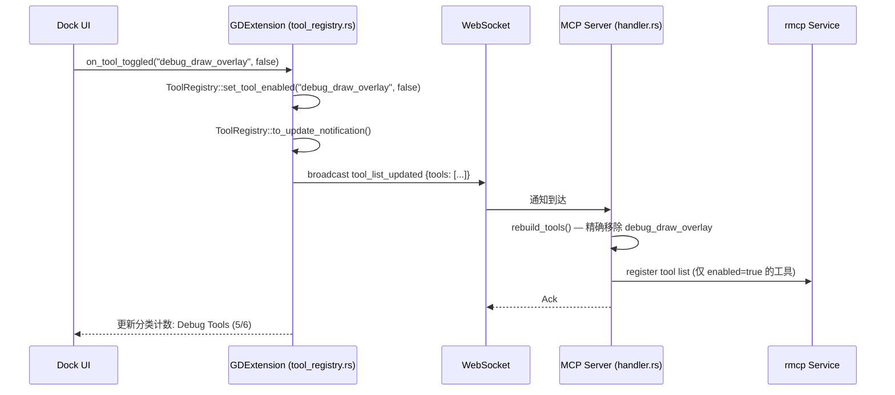

# 工具清单与热切换

## 相关页面

- [IPC 与 MCP 协议](../specification/protocol.md) — 工具调用的协议细节
- [Dock UI 面板](dock-ui.md) — 工具管理 UI
- [IPC 桥接细节](ipc-bridge.md) — 工具调用在桥接层的路由

---

## 工具分组概览（48 工具，6 分组）

| 分组 | 数量 | 描述 | 默认状态 |
|------|------|------|----------|
| Scene Management | 10 | 场景/节点操作 | ✅ 全部启用 |
| Script Management | 8 | 脚本读写编辑 | ✅ 全部启用 |
| Asset Management | 6 | 资源搜索创建 | ✅ 全部启用 |
| Editor Control | 7 | 编辑器运行控制 | ✅ 全部启用 |
| Project Management | 6 | 项目设置查询 | ✅ 全部启用 |
| Debug Tools | 6 | 运行时调试分析 | ❌ 全部关闭 |

## 完整工具列表

### Scene Management（10）

| 工具 | 描述 | 参数 |
|------|------|------|
| `get_scene_tree` | 获取当前场景节点树 | `max_depth?: usize` |
| `create_node` | 创建新节点 | `parent_path`, `node_type`, `name`, `position?`, `rotation?` |
| `delete_node` | 删除节点 | `node_path` |
| `modify_node_property` | 修改节点属性 | `node_path`, `property`, `value` |
| `get_node_properties` | 获取节点所有属性 | `node_path` |
| `move_node` | 更改节点父子关系 | `node_path`, `new_parent_path`, `position_index?` |
| `duplicate_node` | 复制节点 | `node_path` |
| `rename_node` | 重命名节点 | `node_path`, `new_name` |
| `set_node_script` | 附加脚本到节点 | `node_path`, `script_path` |
| `find_nodes` | 按条件搜索节点 | `query`, `search_method?` |

### Script Management（8）

| 工具 | 描述 | 参数 |
|------|------|------|
| `create_script` | 创建新脚本文件 | `path`, `content`, `script_type?` |
| `read_script` | 读取脚本内容 | `path` |
| `edit_script` | 编辑脚本 | `path`, `edits` |
| `validate_script` | 验证脚本语法 | `path` |
| `list_scripts` | 列出项目所有脚本 | `path?`, `recursive?` |
| `find_in_file` | 在文件中搜索文本 | `pattern`, `path?`, `regex?` |
| `search_project` | 搜索项目文件 | `pattern`, `file_types?` |
| `eval_expression` | 运行时求值 GDScript | `expression` |

### Asset Management（6）

| 工具 | 描述 | 参数 |
|------|------|------|
| `search_assets` | 搜索项目资源 | `pattern`, `filter_type?`, `page_size?` |
| `import_asset` | 导入外部文件到项目 | `source_path`, `destination_path` |
| `create_asset` | 创建新资源 | `path`, `resource_type`, `properties?` |
| `get_asset_info` | 获取资源元数据 | `path` |
| `delete_asset` | 删除资源 | `path` |
| `move_asset` | 移动/重命名资源 | `source_path`, `destination_path` |

### Editor Control（7）

| 工具 | 描述 | 参数 |
|------|------|------|
| `play` | 启动当前场景 | — |
| `pause` | 暂停运行 | — |
| `stop` | 停止运行 | — |
| `get_console` | 获取控制台输出 | `count?`, `filter_text?`, `types?` |
| `clear_console` | 清空控制台 | — |
| `refresh_project` | 刷新项目文件系统 | — |
| `execute_menu_item` | 执行编辑器菜单项 | `menu_path` |

### Project Management（6）

| 工具 | 描述 | 参数 |
|------|------|------|
| `get_project_settings` | 获取项目设置 | `sections?` |
| `update_project_settings` | 更新项目设置 | `settings` |
| `get_input_map` | 获取输入映射 | — |
| `configure_input_map` | 配置输入动作 | `action`, `bindings` |
| `list_scenes` | 列出所有场景文件 | — |
| `run_tests` | 运行编辑器测试 | `test_path?`, `mode?` |

### Debug Tools（6，默认全部关闭）

| 工具 | 描述 | 参数 |
|------|------|------|
| `game_screenshot` | 运行中游戏截图 | `width?`, `height?` |
| `get_debug_output` | 获取调试输出 | — |
| `get_performance_stats` | 获取性能统计 | `counters?` |
| `debug_draw_overlay` | 绘制调试覆盖层 | `shapes`, `duration?` |
| `watch_property` | 实时监控属性变化 | `node_path`, `property` |
| `send_input_event` | 发送模拟输入 | `event_type`, `params` |

## 工具热切换机制

### 设计原则

工具热切换支持**个体工具粒度**：每个工具可独立启用/禁用，不受分类约束。UI 层面的分类 CheckBox 仅作为批量操作的快捷入口。

### 数据结构

```rust
// crates/core/src/tool_manifest.rs
#[derive(Debug, Clone, Serialize, Deserialize)]
pub struct ToolManifest {
    pub categories: Vec<ToolCategory>,
}

#[derive(Debug, Clone, Serialize, Deserialize)]
pub struct ToolCategory {
    pub name: String,
    pub display_name: String,
    pub tools: Vec<ToolInfo>,
}

#[derive(Debug, Clone, Serialize, Deserialize)]
pub struct ToolInfo {
    pub name: String,
    pub description: String,
    pub input_schema: Value,
    #[serde(default = "default_enabled")]
    pub enabled: bool,
}

fn default_enabled() -> bool { true }

// IPC 通知载荷
#[derive(Debug, Clone, Serialize, Deserialize)]
pub struct ToolListUpdate {
    pub tools: Vec<ToolState>,
}

#[derive(Debug, Clone, Serialize, Deserialize)]
pub struct ToolState {
    pub name: String,
    pub enabled: bool,
}
```

### ToolRegistry — 运行时状态管理

```rust
// crates/gdext/src/tool_registry.rs
pub struct ToolRegistry {
    tools: DashMap<String, bool>,
}

impl ToolRegistry {
    pub fn new(manifest: &ToolManifest) -> Self {
        let tools = DashMap::new();
        for cat in &manifest.categories {
            for tool in &cat.tools {
                tools.insert(tool.name.clone(), tool.enabled);
            }
        }
        Self { tools }
    }

    pub fn set_tool_enabled(&self, tool_name: &str, enabled: bool) -> bool {
        if let Some(mut state) = self.tools.get_mut(tool_name) {
            *state = enabled;
            true
        } else {
            false
        }
    }

    pub fn set_category_enabled(&self, manifest: &ToolManifest, category: &str, enabled: bool) {
        for cat in &manifest.categories {
            if cat.name == category {
                for tool in &cat.tools {
                    self.set_tool_enabled(&tool.name, enabled);
                }
                return;
            }
        }
    }

    pub fn get_enabled_tools(&self) -> Vec<String> {
        self.tools
            .iter()
            .filter(|e| *e.value())
            .map(|e| e.key().clone())
            .collect()
    }

    pub fn to_update_notification(&self) -> ToolListUpdate {
        ToolListUpdate {
            tools: self
                .tools
                .iter()
                .map(|e| ToolState {
                    name: e.key().clone(),
                    enabled: *e.value(),
                })
                .collect(),
        }
    }
}
```

### 切换流程 — 个体工具粒度



### Server 端工具重建

```rust
// crates/server/src/handler.rs
impl GodotMcpHandler {
    pub fn rebuild_tools(&self, update: &ToolListUpdate) {
        let mut enabled = HashMap::new();
        for tool in &update.tools {
            enabled.insert(tool.name.clone(), tool.enabled);
        }
        self.enabled_tools.store(enabled);

        // rmcp 需要重建工具路由
        self.tool_router_needs_rebuild.store(true, Ordering::SeqCst);
    }

    pub fn is_tool_enabled(&self, tool_name: &str) -> bool {
        self.enabled_tools
            .load()
            .get(tool_name)
            .copied()
            .unwrap_or(false)
    }
}
```

### 工具注册 — 精确粒度

```rust
// crates/server/src/tools/mod.rs
pub fn register_tools(handler: &GodotMcpHandler) {
    let all_tools: &[(&str, fn(&GodotMcpHandler))] = &[
        // Scene Management
        ("get_scene_tree", register_get_scene_tree),
        ("create_node", register_create_node),
        ("delete_node", register_delete_node),
        ("modify_node_property", register_modify_node_property),
        ("get_node_properties", register_get_node_properties),
        ("move_node", register_move_node),
        ("duplicate_node", register_duplicate_node),
        ("rename_node", register_rename_node),
        ("set_node_script", register_set_node_script),
        ("find_nodes", register_find_nodes),
        // Script Management
        ("create_script", register_create_script),
        ("read_script", register_read_script),
        ("edit_script", register_edit_script),
        ("validate_script", register_validate_script),
        ("list_scripts", register_list_scripts),
        ("find_in_file", register_find_in_file),
        ("search_project", register_search_project),
        ("eval_expression", register_eval_expression),
        // Asset Management
        ("search_assets", register_search_assets),
        ("import_asset", register_import_asset),
        ("create_asset", register_create_asset),
        ("get_asset_info", register_get_asset_info),
        ("delete_asset", register_delete_asset),
        ("move_asset", register_move_asset),
        // Editor Control
        ("play", register_play),
        ("pause", register_pause),
        ("stop", register_stop),
        ("get_console", register_get_console),
        ("clear_console", register_clear_console),
        ("refresh_project", register_refresh_project),
        ("execute_menu_item", register_execute_menu_item),
        // Project Management
        ("get_project_settings", register_get_project_settings),
        ("update_project_settings", register_update_project_settings),
        ("get_input_map", register_get_input_map),
        ("configure_input_map", register_configure_input_map),
        ("list_scenes", register_list_scenes),
        ("run_tests", register_run_tests),
        // Debug Tools
        ("game_screenshot", register_game_screenshot),
        ("get_debug_output", register_get_debug_output),
        ("get_performance_stats", register_get_performance_stats),
        ("debug_draw_overlay", register_debug_draw_overlay),
        ("watch_property", register_watch_property),
        ("send_input_event", register_send_input_event),
    ];

    for (tool_name, register_fn) in all_tools {
        if handler.is_tool_enabled(tool_name) {
            register_fn(handler);
        }
    }
}
```
