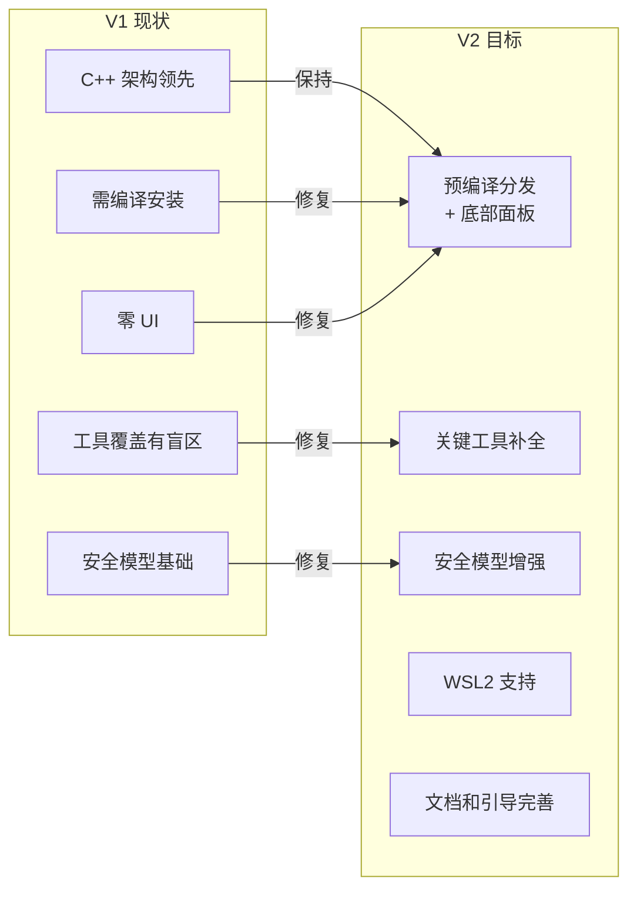

# V2 优化方案 — 从架构领先到产品领先

> 基于竞品深度分析（[competitive-analysis.md](competitive-analysis.md)）制定的 V2 优化总方案。
> ADR-016 统一记录全部 12 项子决策（见 [decisions.md](decisions.md)）。

## 一、优化目标

将 GodotMCP 从"架构最先进但用户触达困难的技术产品"转变为"安装即用、功能全面、体验一流的产品"。



## 二、优先级分层

| 层级 | 定义 | 包含内容 | 预计工期 |
|------|------|---------|---------|
| **P0** | 阻断性：不修复则产品不可用/不可分发 | Release 流水线修复、CI 跨平台、GameBridge 安全 | 1-2 天 |
| **P1** | 竞争力：不做则在竞品中明显落后 | 编辑器 UI、关键工具补全、WSL2、CORS/Session | 2-3 周 |
| **P2** | 差异化：建立护城河 | 安全增强、客户端模板、限流、CI 测试 | 1-2 周 |

## 三、Phase 总览

```
Phase 0 (P0, 1-2 天)
  ├─ P0-1: 修复 release.yml — 预编译 zip 实际可用
  ├─ P0-2: CI 跨平台编译验证
  └─ P0-3: GameBridge 绑定地址修复

Phase 1 (P1, 2-3 周)
  ├─ P1-1: 编辑器底部面板 UI
  ├─ P1-2a: 第一批工具（3D Collision + AnimationTree + Audio）
  ├─ P1-2b: 第二批工具（Navigation + 3D + Shader + Export + InputMap）
  ├─ P1-3: WSL2 支持
  └─ P1-4: CORS 安全加固 + Session 生命周期

Phase 2 (P2, 1-2 周)
  ├─ P2-1: 安全模型增强（Guarded-Action + 工具白名单 + Token）
  ├─ P2-2: 客户端配置模板一键生成
  ├─ P2-3: 请求限流
  └─ P2-4: CI Smoke Test
```

## 四、各 Phase 与 ADR 对应关系

| Phase | 任务 | ADR-016 子决策 |
|-------|------|---------|
| P0-1 | Release 流水线修复 | 决策 1 |
| P0-3 | GameBridge 安全 | 决策 3 |
| P1-1 | 编辑器底部面板 | 决策 4 |
| P1-2 | 关键工具补全 | 决策 5 |
| P1-3 | WSL2 支持 | 决策 6 |
| P1-4 + P2-1 | 安全模型 | 决策 7 + 决策 8 |
| P2-2 | 客户端配置 | 决策 9 |

## 五、不做什么

基于做减法原则，以下方向在竞品分析中被提及但**不建议在 V2 投入**：

| 方向 | 原因 |
|------|------|
| Godot AssetLib 注册 | C++ GDExtension 的 AssetLib 分发体验不如纯 GDScript 方案；P0-1 修复后 GitHub Release 足够 |
| 付费模式 | 当前用户基数不足以支撑付费；开源竞品全部免费 |
| Python 3.14 降级 | `build.py` 对终端用户不可见（使用预编译二进制），降级无实际收益 |
| 粒子预设库 | 硬编码参数可通过 SDK 系统由 GDScript 补充 |
| SaaS 云服务 | 本地开发工具不需要云依赖 |
| 浏览器可视化器 | tomyud1 方案的 force-directed graph 可通过 SDK 扩展 |
