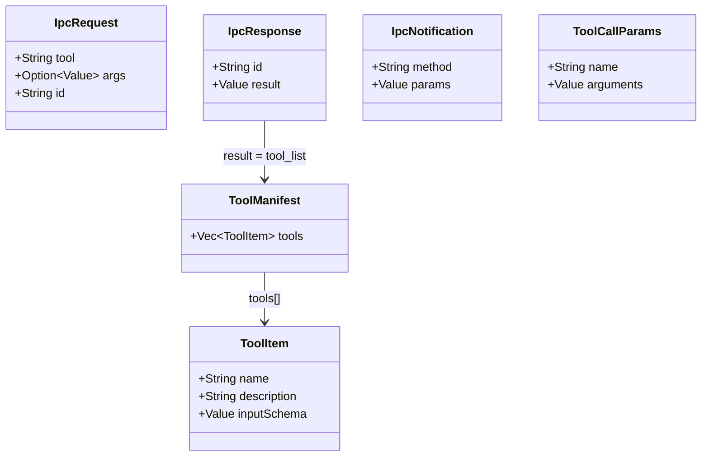

# `crates/core` — Shared Protocol Types

> Referenced by both `crates/server` and `crates/gdext`. Contains no Godot or MCP runtime dependencies.

## Files

### `protocol.rs`

- `IpcRequest { tool: String, args: Option<Value>, id: String }` — tool call request from server to gdext
- `IpcResponse { id: String, result: Value }` — response from gdext
- `IpcNotification { method: String, params: Value }` — notification from gdext to server (e.g. `mcp_log_message`)
- `ToolCallParams { name: String, arguments: Value }` — standard MCP tool call format

### `tool_manifest.rs`

- `ToolManifest { tools: Vec<ToolItem> }` — complete tool list response
- `ToolItem { name, description, input_schema }` — per-tool Schema description

### Why a `core` Crate

Both sides communicate via WebSocket using serde JSON. Shared types ensure wire format consistency.
