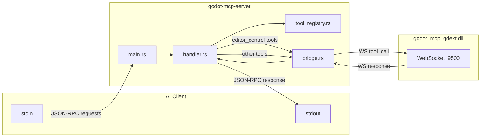

# `crates/server` — MCP Server

> A standard Rust binary using the `rmcp` crate to implement the MCP protocol over stdio.



## Files

### `main.rs`

- Parses CLI args with `clap`: `--port` (WebSocket port, default 9500)
- Creates `GodotMcpHandler` instance
- Calls `serve_stdio(GodotMcpHandler)` to start MCP server
- No tokio runtime management — handled by `rmcp`

### `handler.rs`

`GodotMcpHandler` implements `ServerHandler` trait (provided by `rmcp`):

```
handle_request(request) → Result
  ├─ match: list_request_tools → return full tool_registry list
  ├─ match: call_tool(name, args)
  │   ├─ prefix "godot_editor_" → handle directly (no WebSocket)
  │   └─ else → forward_tool_call(name, args) → WebSocket → gdext
  └─ match: other → default implementation
```

**Test assertion**: `assert_eq!(total, 99)`

### `bridge.rs`

`GodotBridge` — WebSocket client implementation:

```
connect(url) → WebSocket connection
  └─ send(&[u8]) → serde_json serialized IpcRequest
  └─ read() → serde_json deserialized IpcResponse
  └─ call_later(duration, f) → async delayed execution
```

- Gets Godot editor path from `GODOT_PATH` env var
- `launch_editor()` spawns Godot process and waits for WebSocket connection
- On editor close (WebSocket disconnect), marks connection as dead

### `tool_registry.rs`

```
ToolRegistry {
    tools: Vec<McpSchema::Tool>,
    total: AtomicUsize,
}

impl ToolRegistry {
    register(tool) → add tool
    register_defaults() → register all tools (including 3 server-side)
    get_all() → return Vec of all tools
}
```

`register_defaults()` registers 99 tool schemas:

- 3 server-side tools (`godot_editor_open`, `godot_editor_close`, `godot_editor_restart`)
- 96 tools forwarded via WebSocket to gdext

## Tool Groups (in Tool Registry)

Tools are grouped by `CommandHandler`, each with `tool_names()`, `can_handle(name)`, `handle(args)`. Server-side tools are registered as individual `McpSchema::Tool`.

## Key Details

- **Does not validate** whether a tool exists on gdext side — unknown tools return errors from gdext
- `GODOT_PATH` env var **must** be set in MCP client `env` config (stdio servers don't inherit shell env)
- `project_path` defaults to `godot/` (test project). Relative paths resolve from CWD.
