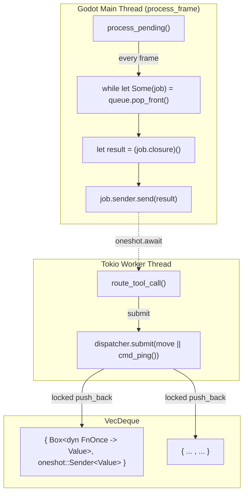

# Dispatcher (`MainThreadDispatcher`)

> The critical infrastructure that allows tokio worker threads to safely call Godot APIs.

## Design



## Structure

```rust
pub struct MainThreadDispatcher {
    queue: Mutex<VecDeque<DispatcherJob>>,
}

type DispatcherJob = (
    Box<dyn FnOnce() -> Value + Send>,
    oneshot::Sender<Value>,
);
```

- `queue` is `Mutex<VecDeque<...>>` — tokio workers write, main thread reads
- Each job contains a closure and a `oneshot::Sender`
- `submit()` returns `tokio::sync::oneshot::Receiver<Value>`, worker threads `.await` it

## Call Flow

1. **Worker thread**: `dispatcher.submit(move || cmd_something(args)).await`
2. `submit()` pushes closure to `queue`, returns `Receiver`
3. **Main thread** (`process_frame` handler): calls `dispatcher.process_pending()`
4. `process_pending()` locks queue, drains all jobs, releases lock, executes closures sequentially
5. Each closure sends result via `Sender` after execution
6. **Worker thread**: `Receiver` gets result, continues

## Why Not Channels

- Single consumer (main thread) — no need for multi-producer/multi-consumer complexity
- `VecDeque` + `Mutex` is sufficient and doesn't require async channel infrastructure
- Closures are more natural than message passing — Godot API calls are fully synchronous

## Key Details

- **Closures must be `Send`** — `DispatcherJob` contains `Box<dyn FnOnce() -> Value + Send>`
- Closures **should capture values** via `move`, not share state via references
- Uses `process_frame` signal (not `EditorPlugin::_process()`) to pump queue — avoids `bind_mut` deadlock
- All Godot API calls must be inside the closure, running on the main thread
