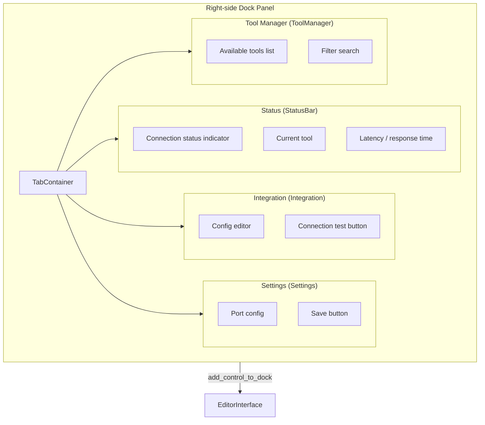

# Dock UI

> Godot editor right-side panel.

## Implementation

Dock UI is partially implemented with some **markers still TODO**.

### `main_dock.rs`

- Creates `VBoxContainer` as root control
- Instantiates 4 sub-panels

### Sub-panels

| File | Status |
|------|--------|
| `status_bar.rs` | Implemented: connection status, last tool call, latency |
| `integration.rs` | Implemented: config validation + test button |
| `settings.rs` | Implemented: WebSocket port config + persistence |
| `tool_manager.rs` | Marked TODO |

## Connections

- Dock UI references `PluginState::global().editor_interface` for `EditorInterface`
- Settings persisted via `ProjectSettings`

## Future Plans

- `tool_manager.rs` will display available MCP tools (calls `list_request_tools` on server)
- Tool search and filtering
- Test tool calls directly from UI with JSON response display
