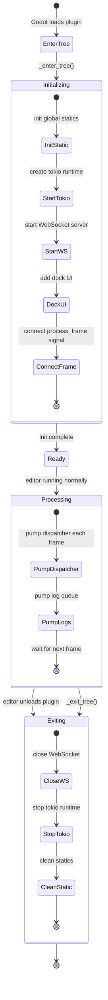

# Editor Plugin (`McpEditorPlugin`)

> Lifecycle management for `godot_mcp_gdext.dll`.

## Lifecycle



## `_enter_tree()` Initialization

```rust
fn _enter_tree(&mut self) {
    // 1. Initialize global PluginState
    let state = PluginState::new();
    
    // 2. Start tokio runtime if not running
    if TOKIO_RUNTIME.is_none() {
        TOKIO_RUNTIME = Some(tokio::runtime::Runtime::new().unwrap());
    }
    
    // 3. Create and start WebSocket server
    let ws_server = IpcWebSocketServer::new("0.0.0.0:9500");
    let dispatcher = MainThreadDispatcher::new();
    ws_server.start(dispatcher.clone());
    
    // 4. Set up dock UI
    setup_dock(editor_interface);
    
    // 5. Connect process_frame signal
    let tree = editor_interface.get_base_control().get_tree();
    tree.connect("process_frame", Callable::from_fn("pump", |_| {
        dispatcher.process_pending();
        LOG.drain_to_console();
        Variant::nil()
    }));
}
```

## `_exit_tree()` Cleanup

```rust
fn _exit_tree(&mut self) {
    // 1. Close WebSocket
    ws_server.stop();
    
    // 2. Stop tokio runtime
    if let Some(rt) = TOKIO_RUNTIME.take() {
        rt.shutdown_background();
    }
    
    // 3. Clear statics
    PluginState::clear();
}
```

## `_process()` — Intentionally Empty

This is the key mitigation for the `bind_mut` trap (see [Threading Model](overview/threading-model.md)).

The `process_frame` signal is connected to `SceneTree` without any reference to `McpEditorPlugin`, so no `bind_mut` deadlock can occur. **Do not** move this logic back to `_process()`.

## Startup Order

```
EditorPlugin::_enter_tree()
  → EditorPlugin::_ready()
  → process_frame (called every frame from first frame onward)
  → EditorPlugin::_process()  ← empty
  → EditorPlugin::_physics_process()  ← unused
  → EditorPlugin::_exit_tree()
```

## Static State (`PluginState`)

`PluginState` holds global singletons:

| Field | Type | Description |
|-------|------|-------------|
| `ws_server` | `Option<Arc<Mutex<IpcWebSocketServer>>>` | Listening |
| `dispatcher` | `Option<MainThreadDispatcher>` | Queuing |
| `connected` | `AtomicBool` | Client connected |
| `editor_interface` | `Option<Gd<EditorInterface>>` | Editor handle |

Accessed via `PluginState::global()` backed by a static `OnceLock`.
