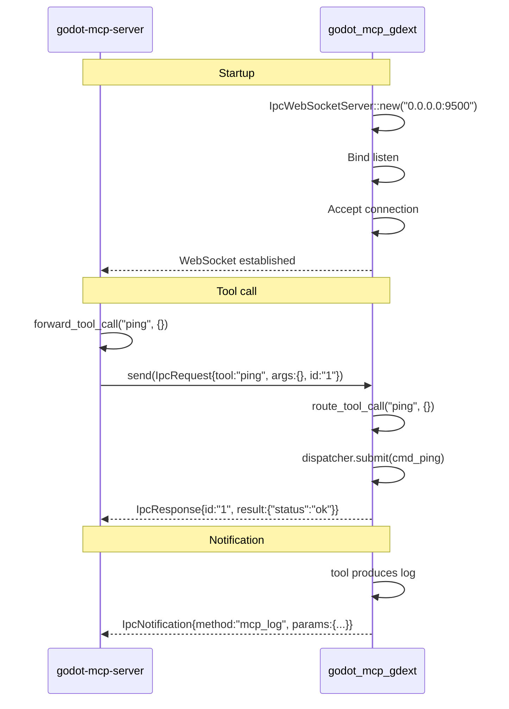

# IPC Bridge (WebSocket)

> The communication bridge connecting `godot-mcp-server` and `godot_mcp_gdext`.



## Wire Format

### Request (Server → GDExt)

```json
{
    "tool": "get_node_position",
    "args": {"node_path": "Player"},
    "id": "req-001"
}
```

### Response (GDExt → Server)

```json
{
    "id": "req-001",
    "result": {"x": 100.0, "y": 200.0}
}
```

Error response:
```json
{
    "id": "req-001",
    "result": {"error": "Node 'MissingNode' not found"}
}
```

### Notification (GDExt → Server)

```json
{
    "method": "mcp_log_message",
    "params": {"level": "info", "tool": "ping", "message": "Ping received"}
}
```

## Protocol Details

- Uses `serde_json::to_vec` / `from_slice` for serialization
- Messages separated by `\n` (JSON Lines style)
- `IpcWebSocketServer` held via `PluginState` static throughout Godot lifecycle
- Accepts only one connection (rejects additional clients)
- Auto-exits event loop on connection drop
- `bridge.rs` auto-reconnects on disconnect
