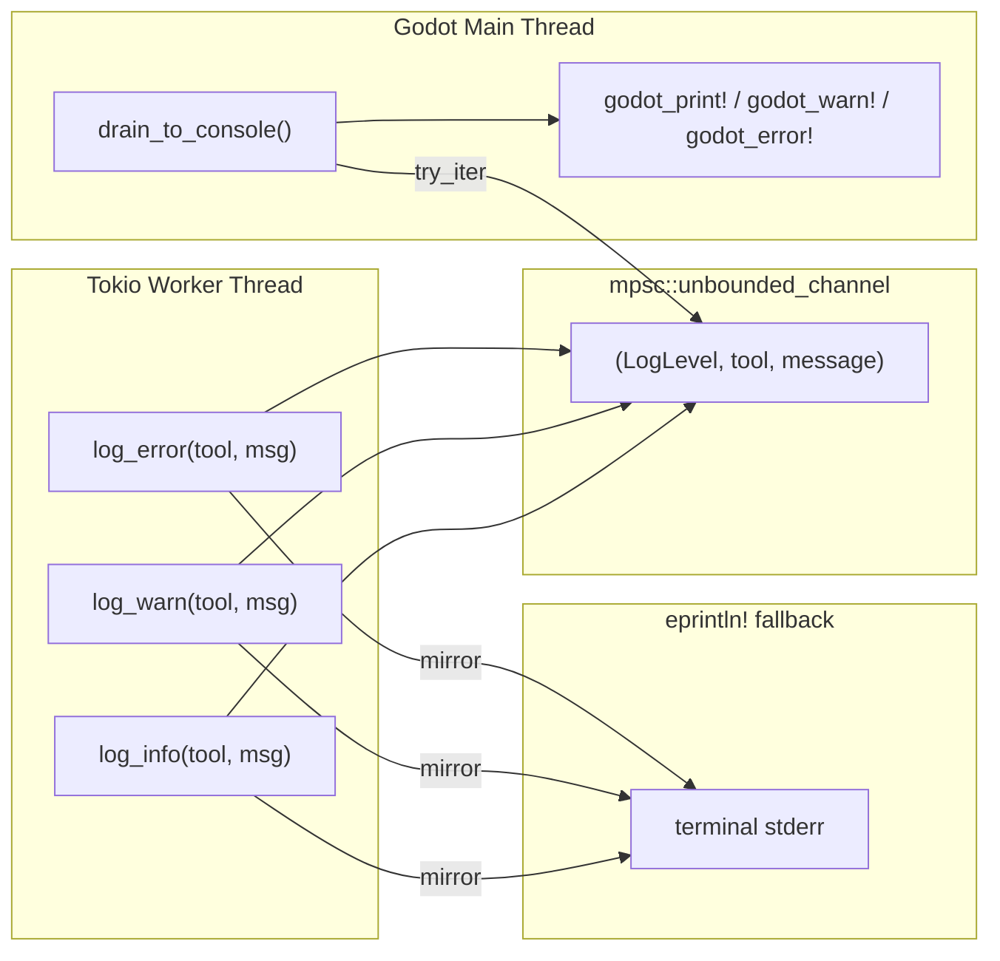

# Logging (Cross-Thread)

> Godot's `godot_print!` macro crashes if called from a tokio worker thread, so logs go through an mpsc channel.



## Interface

```rust
pub fn log_info(tool_name: &str, msg: &str);
pub fn log_warn(tool_name: &str, msg: &str);
pub fn log_error(tool_name: &str, msg: &str);
```

All three functions:
1. Send `(LogLevel, tool_name, message)` to the global mpsc channel
2. Also `eprintln!` to terminal (immediate, frame-independent)

## Main Thread Pump

```rust
pub fn drain_to_console() {
    while let Some((level, tool, msg)) = CHANNEL.try_iter().next() {
        match level {
            LogLevel::Info => godot_print!("[{tool}] {msg}"),
            LogLevel::Warn => godot_warn!("[{tool}] {msg}"),
            LogLevel::Error => godot_error!("[{tool}] {msg}"),
        }
    }
}
```

Called in the `process_frame` handler alongside `dispatcher.process_pending()`.

## Why Two Output Paths

- **mpsc + godot_print!**: logs appear in the Godot editor output console
- **eprintln!**: immediately writes to stderr — if the MCP client captures stderr, logs appear in the client terminal

If the channel is full or the main thread can't keep up, stderr output ensures messages aren't completely lost.

## Log Level Usage

| Level | Scenario |
|-------|----------|
| `info` | Normal operations (tool call, scene open) |
| `warn` | Recoverable issues (setting failed but fallback available) |
| `error` | Operation failed (node not found, file load failed) |

All tools should call `log_info` on success and `log_error` on failure.
