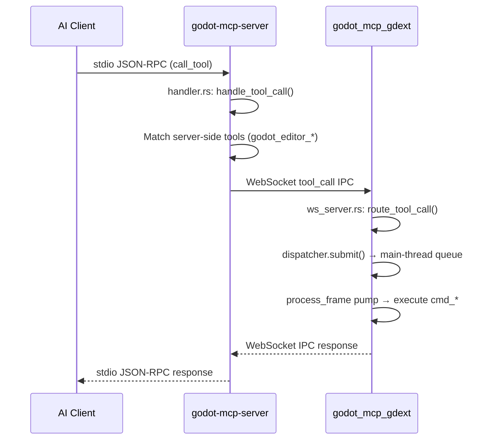

# Architecture

## Dual-Process, Three-Crate Design

```
┌─────────────────────────────────────────────────────────────────────┐
│ AI Client (Claude Code / OpenCode / Cursor / Copilot / Codex / …)   │
│ Standard I/O (stdio) JSON-RPC (MCP Protocol)                         │
└───────────────┬─────────────────────────────────────────────────────┘
                │ stdio
                ▼
┌──────────────────────────────────────────────────────────────────────┐
│ godot-mcp-server.exe              ┌─────────────────────────────┐   │
│ (crates/server, binary)           │ ToolRegistry                │   │
│                                    │ 99 tool JSON Schemas       │   │
│ ┌────────┐  ┌─────────┐  ┌──────┐ │                             │   │
│ │ main.rs│→│handler.rs│→│bridge│ └─────────────────────────────┘   │
│ │(clap)  │  │(rmcp)   │  │(WS)  │                                  │
│ └────────┘  └─────────┘  └──┬───┘                                  │
└──────────────────────────────┼──────────────────────────────────────┘
                               │ WebSocket ws://127.0.0.1:9500
                               │ tool_call IPC requests
                               ▼
┌──────────────────────────────────────────────────────────────────────┐
│ godot_mcp_gdext.dll            (crates/gdext, cdylib)               │
│                                                                     │
│ ┌──────────┐  ┌────────────┐  ┌───────────────────────────────┐    │
│ │lib.rs    │→│editor_plugin│→│IpcWebSocketServer              │    │
│ │(#![gdext])│  │McpEditorPlugin│  (crates/gdext/src/ipc/)      │    │
│ └──────────┘  └────────────┘  └───────────────┬───────────────┘    │
│                                               │                     │
│                        ┌──────────────────────▼──────────────┐      │
│                        │ route_tool_call (ws_server.rs)       │      │
│                        │ 13 handler groups chained            │      │
│                        └──────────┬───────────┬──────────────┘      │
│                                   │           │                     │
│                          ┌────────▼───┐ ┌─────▼─────────┐          │
│                          │dispatcher  │ │logging (mpsc) │          │
│                          │submit()    │ │log_info/warn  │          │
│                          │process_pend│ │drain_to_consol│          │
│                          └───────┬────┘ └───────┬────────┘          │
│                                  │               │                  │
│                          ┌───────▼───────────────▼────────┐         │
│                          │ process_frame (SceneTree signal)│         │
│                          │ Main-thread pump (NOT plugin)  │         │
│                          └────────────────────────────────┘         │
│                                                                     │
│                          Godot EditorInterface / Node / Scene API   │
└──────────────────────────────────────────────────────────────────────┘
```

## Data Flow



## Key Properties

- **stdio is the only** enabled MCP transport. `transport-streamable-http-server` is in deps but unwired.
- **IPC wire format**: JSON-RPC-style `IpcRequest`/`IpcResponse`/`IpcNotification`, types in `crates/core/src/protocol.rs`
- **99 tools**: 96 via gdext execution, 3 server-side (editor_control) intercepted in `handler.rs`, never reaching WebSocket
- **Tool registry**: maintained in both `crates/server/src/tool_registry.rs` (MCP server) and `crates/gdext/src/commands/mod.rs` (via `CommandHandler` trait)
- **Test assertions**: `tool_registry.rs` and `handler.rs` both have `assert_eq!(total, 99)`

## Directory Layout

```
crates/
├── core/          # Shared types: protocol.rs, tool_manifest.rs
├── server/        # MCP server binary
│   └── src/
│       ├── main.rs          # clap CLI → GodotMcpHandler
│       ├── handler.rs       # rmcp ServerHandler implementation
│       ├── bridge.rs        # WebSocket client (GodotBridge)
│       └── tool_registry.rs # Tool registration & Schema
└── gdext/         # GDExtension cdylib
    └── src/
        ├── lib.rs           # gdextension entry point
        ├── editor_plugin.rs # McpEditorPlugin lifecycle
        ├── dispatcher.rs    # MainThreadDispatcher
        ├── logging.rs       # Cross-thread logging
        ├── commands/        # 13 command handler modules
        │   ├── mod.rs       # CommandHandler trait + shared utilities
        │   ├── meta.rs      # ping, engine/plugin version
        │   ├── node.rs      # Node CRUD + scene tree traversal
        │   ├── property.rs  # 2D property get/set
        │   ├── property_3d.rs # 3D property get/set
        │   ├── scene.rs     # Scene file + editor tab operations
        │   ├── collision.rs # Collision shape addition
        │   ├── find.rs      # Node search
        │   ├── script_helpers.rs # call_method, get/set_variable
        │   ├── project_settings.rs # Project settings read/write
        │   ├── script_gd.rs # GDScript file ops + LSP validation
        │   ├── script_cs.rs # C# file ops + Solution generation
        │   ├── search.rs    # find_in_file, search_project, find_and_replace
        │   └── undo.rs      # Undo/redo
        ├── ipc/             # WebSocket server
        │   ├── ws_server.rs # IpcWebSocketServer + route_tool_call
        │   └── plugin_state.rs
        ├── lsp/             # GDScript LSP client
        │   ├── client.rs    # validate_via_lsp
        │   └── protocol.rs  # LSP protocol types
        └── dock/            # Editor right-dock UI
            ├── main_dock.rs
            ├── status_bar.rs
            ├── integration.rs
            ├── settings.rs
            └── tool_manager.rs
```
