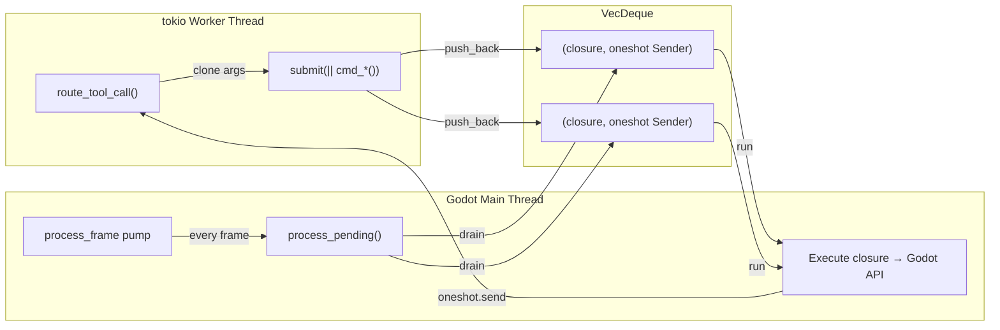
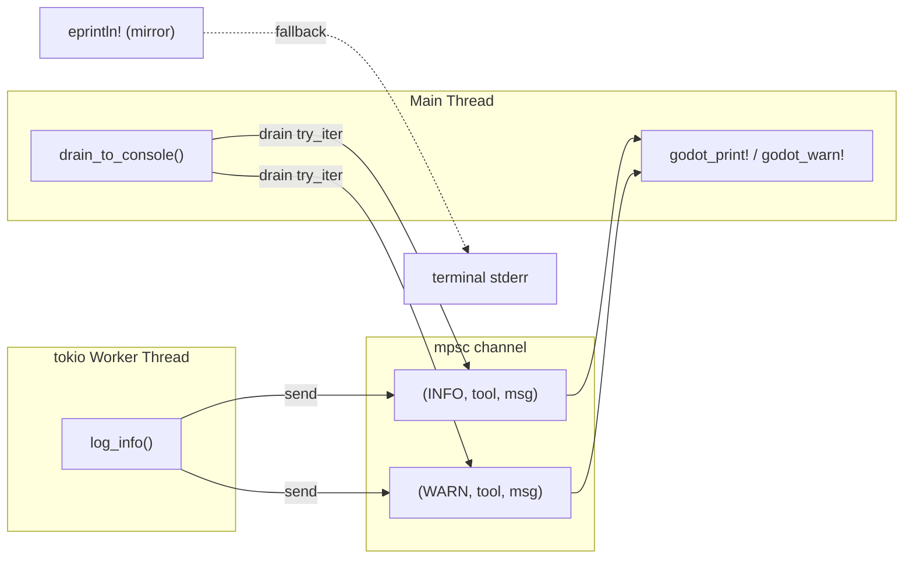

# Threading Model

> **Must read before touching gdext.** This is the single most error-prone part of the project.

## Core Problem

Tool routing runs on tokio worker threads. **Almost every Godot API panics if called off the main thread.**

The project has two mechanisms to handle this — and why `EditorPlugin::process()` can't be used directly.

## Mechanism 1: MainThreadDispatcher



- Worker thread calls `dispatcher.submit(move || { /* Godot API */ })`, gets back a `oneshot` future
- Submitted as `Box<dyn FnOnce() -> Value + Send>` closure, pushed to `VecDeque`
- Main thread calls `process_pending()` to pop and execute all queued closures
- All `cmd_*` functions go through this, without exception

## Mechanism 2: Cross-Thread Logging



- Worker calls `log_info/log_warn/log_error` → message enters mpsc channel + `eprintln!` mirror
- Main thread calls `drain_to_console()` → forwards to `godot_print!`/`godot_warn!`/`godot_error!`
- **Never call `godot_print!` from a tokio worker thread.**

## Why Not `EditorPlugin::process()` (bind_mut Trap)

```
EditorPlugin::process(&mut self)  ← holds exclusive borrow (bind_mut)
  └─ calls some Godot API
      └─ that API synchronously triggers a signal
          └─ signal callback tries to access the editor plugin
              └─ Gd<T>::bind_mut() crashes: "already bound"
```

Both queues are pumped via `Callable::from_fn` connected to `SceneTree::process_frame`:

```rust
// editor_plugin.rs (simplified)
let callable = Callable::from_fn("godot_mcp_pump", move |_args| {
    dispatcher.process_pending();
    logging::drain_to_console();
    Variant::nil()
});
tree.connect("process_frame", &callable);
```

This operates outside any `McpEditorPlugin` borrow, so Godot API calls are safely re-entrant.

## Adding a New Tool: Rules

1. Add routing branch in `ws_server.rs::route_tool_call`
2. That branch calls `d.submit(move || cmd_your_tool(&a)).await`
3. Actual `cmd_your_tool` runs on main thread via dispatcher
4. Wrap return with `pipe()`: `pipe(d.submit(...).await)` converts `json!({"error": "..."})` to `Err`
