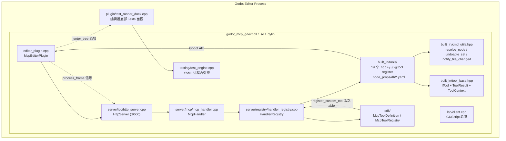

# `extensions/src` — GDExtension C++ 实现（当前活跃）

> 加载到 Godot 编辑器内的本机插件。使用 `godot-cpp 10.0.0-rc1` 构建。**这是项目唯一的 GDExtension 实现**。

## 组件图



## 文件结构

```
extensions/src/
├── register_types.cpp              # GDExtension 入口：gdext_mcp_init
├── editor_plugin.cpp/.hpp          # McpEditorPlugin 生命周期 + process_frame 泵
├── pch.hpp                         # 预编译头（STL + Godot 核心类型）
├── logging.hpp                     # log_info/warn/error（28 行）
├── built_in/
│   ├── tool_base.hpp/.cpp          # ITool + ToolResult + ToolContext
│   ├── cmd_utils.hpp/.cpp          # 共享工具（resolve_node、undoable_set、notify_file_changed）
│   ├── cmd_utils_json.cpp          # JSON↔Variant 递归转换
│   └── tools/                      # 所有 ITool 子类（CMake GLOB 自动编译）
│       ├── meta/                   #   get_info / get_categories / get_tools / get_tool_detail / call_tool
│       ├── node_tools/             #   node_resource_tool（模板）
│       │   └── general/            #   load/clear/new/duplicate/save/get_resource_info
│       ├── group/                  #   add_to_group / remove_from_group / get_nodes_in_group / get_node_groups
│       ├── signal/                 #   connect_signal / disconnect_signal / list_signals / get_signal_connections
│       ├── node_resource/          #   YAML 数据库（419 资源类型属性）
│       │   └── db/
│       ├── node_props/             #   YAML 数据库（283 节点类型属性）+ 模板
│       │   ├── node_property_tool.hpp
│       │   └── db/
│       ├── editor_tools/
│       │   ├── scene_tree/         #   25+ 场景树 CRUD 工具 + utils
│       │   ├── workspace/          #   24 个工作区工具
│       │   ├── filesystem/         #   14 个文件系统工具
│       │   ├── scripts/            #   12 个脚本读写验证工具
│       │   └── settings/           #   4 个兜底工具 + 24 YAML 数据库
│       └── runtime_tools/
│           ├── bridge/             #   6 个运行时桥接工具
│           └── lifecycle/          #   5 个游戏生命周期工具
├── server/
│   ├── ipc/
│   │   └── http_server.cpp/.hpp        # MCP Streamable HTTP 服务器（:9600）
│   ├── mcp/
│   │   └── mcp_handler.cpp/.hpp        # MCP JSON-RPC 2.0 会话管理
│   └── registry/
│       └── handler_registry.cpp/.hpp   # ITool 主表 + CommandFn 后备表 + top_level_meta
├── runtime/
│   ├── bridge.hpp/.cpp                # RuntimeBridge：编辑器侧 TCP 客户端（→9601）
│   └── game_bridge.hpp/.cpp           # GameBridgeNode：游戏进程 TCP 服务端（:9601）
├── sdk/
│   ├── mcp_tool_definition.hpp/.cpp    # GDScript/C# 可继承的 RefCounted 基类
│   └── mcp_tool_registry.hpp/.cpp      # 单例注册表
├── lsp/
│   └── client.cpp/.hpp                # GDScript LSP 验证（StreamPeerTCP）
├── testing/
│   ├── test_engine.cpp/.hpp           # 进程内 YAML 测试引擎
│   ├── yaml_parser.hpp                # ryml → Godot Variant 解析
│   ├── test_assertions.hpp            # 断言引擎（status/has_keys/field_checks/error_contains）
│   ├── godot_file_verifier.hpp        # .tscn/project.godot 磁盘验证
│   └── type_utils.hpp                 # 类型规范化辅助
└── plugin/
    └── test_runner_dock.cpp/.hpp      # 编辑器底部面板
```

## 工具注册（ITool + codegen）

`editor_plugin.cpp:48` 直接调用 `register_itools(registry_)`。**`tools/codegen.py`** 扫描：

1. `extensions/src/built_in/tools/**/*.hpp` —— 查找 `// @tool register` 注释，提取类名 → 生成 `register_itools()` 函数体
2. `extensions/src/built_in/tools/node_props/db/*.yaml` —— 每个 YAML 数据库文件生成 `NodePropertyGetTool` / `NodePropertySetTool` 注册代码
3. `extensions/src/built_in/tools/node_resource/db/*.yaml` —— 资源属性工具

生成代码写入 `build/generated/generated_registration.cpp`，CMake 自定义命令在依赖变化时自动重跑。

**添加新内置工具的完整流程**：

1. 在 `extensions/src/built_in/tools/<category>/` 创建 `<name>.hpp`
2. 文件首行加 `// @tool register`
3. 实现继承 `ITool` 的类（`name()` / `category()` / `brief()` / `input_schema()` / `is_meta()` / `needs_scene()` / `needs_node()` / `execute_impl()`）
4. 编译 —— CMake 自动 GLOB `tools/**/*.cpp` + codegen 自动注册

**无需**手动修改 `extensions/CMakeLists.txt` 或 `handler_registry.cpp`。

## 顶级分类

`HandlerRegistry::top_level_meta()`（`handler_registry.cpp`）硬编码四个顶级分类：

| category | label | description |
|----------|-------|-------------|
| `meta_tools` | Meta Tools | 元工具与系统信息查询 |
| `node_tools` | Node Tools | 节点/资源属性读取与修改工具，按 Godot 类型分类组织 |
| `editor_tools` | Editor Tools | 编辑器操作工具：场景树 CRUD、剪贴板、脚本等 |
| `runtime_tools` | Runtime Tools | 游戏运行时桥接：属性读写、方法调用、截图、输入模拟 |

新增顶级分类需同步修改 `top_level_meta()`：加 `String::utf8("标签")` + 描述。

## `cmd_utils.hpp` 共享工具函数（`extensions/src/built_in/cmd_utils.hpp`）

| 函数 | 行号 | 签名 | 说明 |
|------|:----:|------|------|
| `resolve_node` | L51 | `(Node *root, String path) -> Node*` | 节点路径解析：接受 `""`, `"."`, `"/"`, `"/root"`, 根节点名, `"Root/Child"` |
| `get_root` | L39 | `() -> Node*` | 获取当前编辑场景根节点 |
| `get_root_or_error` | L43 | `(Dictionary &out_error) -> Node*` | 同上，失败时填 `{"error": "no scene open"}` |
| `get_undo_redo` | L55 | `() -> EditorUndoRedoManager*` | 编辑器 UndoRedo 管理器 |
| `undoable_set` | L84 | `(Node*, String prop, Variant val, String action)` | "立即应用 + 注册撤销"惯用模式 |
| `mark_scene_dirty` | L91 | `()` | 标记当前场景未保存 |
| `notify_file_changed` | L95 | `(String path)` | 通知 EditorFileSystem 文件变更 |
| `save_version_marker` | L99 | `(Node *root)` | 记录当前 undo 版本作为已保存标记 |
| `collect_owner_warnings` | L103 | `(Node *root) -> Array` | 收集无 owner 的节点警告 |
| `relative_path` | L111 | `(Node *root, Node *node) -> String` | 编辑器路径 → 场景相对路径 |
| `globalize_path` | L115 | `(String path) -> String` | res:// → 绝对磁盘路径 |
| `ensure_parent_dir` | L119 | `(String path) -> bool` | 创建 res:// 路径的父目录 |
| `args_string` | L126 | `(args, key, default)` | 类型安全的 String 参数读取 |
| `args_int` | L131 | `(args, key, default)` | int64 参数 |
| `args_float` | L136 | `(args, key, default)` | double 参数 |
| `args_bool` | L141 | `(args, key, default)` | bool 参数 |
| `variant_to_json` | L64 | `(Variant) -> Variant` | Variant → JSON 递归展开（Vector2/3/4、Color、Rect2、Quaternion） |
| `json_to_variant` | L76 | `(Variant) -> Variant` | JSON → Godot Variant 还原 |
| `json_stringify_safe` | L149 | `(Variant) -> String` | `JSON::stringify` 透传 + 非 ASCII 安全 |
| `collect_nodes_by` | L155 | `(Node*, predicate, Array&, max, root)` | 通用树遍历（lambda 谓词） |
| `walk_project_dir` | L178 | `(dir, extensions, include_addons, max, out)` | 通用目录遍历（参数化扩展名） |

## 构建关键（`extensions/CMakeLists.txt`）

| 行 | 内容 |
|:--:|------|
| L15 | `set(GODOTCPP_API_VERSION "4.6")` |
| L17-21 | `FetchContent` 拉取 `godot-cpp 10.0.0-rc1` |
| L30-42 | `FetchContent` 拉取 `rapidyaml v0.7.0`（GIT_SUBMODULES 包含 c4core） |
| L48-80 | `GODOT_MCP_SOURCES`（含 register_types / editor_plugin / server / sdk / lsp / testing / plugin） |
| L85 | `file(GLOB_RECURSE TOOL_SOURCES "src/built_in/tools/*.cpp")` — 自动收集 ITool 实现 |
| L91-116 | `codegen.py` 自定义命令（依赖 .hpp + YAML 数据库）→ 生成 `build/generated/generated_registration.cpp` |
| L118 | `add_library(godot_mcp_gdext SHARED ...)` |
| L130-135 | 编译定义 `GODOT_MCP_PLUGIN_VERSION`（来自根 `CMakeLists.txt:22`） |
| L140-170 | Unity Build ON（自动 CPU 核数）、PCH(MSVC)、lld-link 自动检测 |
| L208-213 | MSVC: `/utf-8 /bigobj /W3 /wd4244 /wd4267`；其他: `-Wall -Wno-unused-parameter` |
