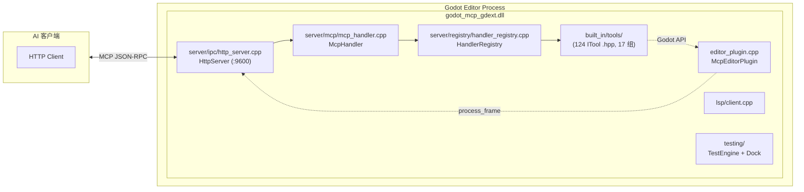

# `extensions/src` — GDExtension C++ 实现（当前活跃）

> 加载到 Godot 编辑器内的本机插件。使用 godot-cpp 10.0.0-rc1 构建。**这是项目唯一的 GDExtension 实现**。



## 文件结构

```
src/
├── register_types.cpp              # GDExtension 入口：gdext_rust_init（遗留名称）
├── editor_plugin.cpp/.hpp          # McpEditorPlugin 生命周期 + process_frame 泵
├── built_in/
│   ├── tool_base.hpp/.cpp          # ITool 接口 + ToolResult/ToolContext
│   ├── cmd_utils.hpp/.cpp          # 共享工具函数（resolve_node, args 解析等）
│   ├── cmd_utils_json.cpp          # JSON↔Variant 转换 (j2v/v2j)
│   └── tools/                      # 124 个 ITool .hpp 文件，按分类组织
│       ├── meta/ (5)               # 元工具：list_tool_categories, list_tools, call_tool, get_tool_schema, godot_info
│       ├── node/ (21)              # 节点 CRUD
│       ├── property/ (21)          # 2D 属性 get/set
│       ├── property_3d/ (6)        # 3D 属性 get/set
│       ├── collision/ (2)          # 碰撞体添加
│       ├── find/ (4)               # 节点搜索
│       ├── scene/ (16)             # 场景文件/标签操作
│       ├── editor_control/ (7)     # play/stop/refresh/restart/get_editor_info
│       ├── search/ (3)             # 文件搜索与替换
│       ├── script_gd/ (5)          # GDScript 文件操作
│       ├── script_cs/ (6)          # C# 文件操作
│       ├── script_helpers/ (3)     # call_method, get/set_variable
│       ├── project_settings/ (7)   # 项目设置 + autoload + 场景列表
│       ├── project_settings_ext/ (10) # 显示/物理/渲染/层名/项目信息
│       ├── input_map/ (4)          # 输入动作管理
│       ├── plugin_management/ (2)  # 列出/启用/禁用插件
│       └── undo/ (2)               # 撤销/重做
├── server/
│   ├── registry/
│   │   └── handler_registry.cpp/.hpp   # 注册表 + category remap
│   ├── ipc/
│   │   └── http_server.cpp/.hpp        # MCP Streamable HTTP 服务器 (:9600)
│   └── mcp/
│       └── mcp_handler.cpp/.hpp        # MCP JSON-RPC 2.0 会话管理
├── sdk/
│   ├── mcp_tool_definition.hpp/.cpp    # GDScript/C# 可继承的 RefCounted 基类
│   └── mcp_tool_registry.hpp/.cpp      # 单例注册表
├── lsp/
│   └── client.cpp/.hpp                # GDScript LSP 验证 (StreamPeerTCP)
├── testing/
│   ├── test_engine.hpp/.cpp           # C++ YAML 测试引擎
│   ├── yaml_parser.hpp                # ryml 解析器
│   ├── test_assertions.hpp            # 断言引擎
│   └── godot_file_verifier.hpp        # 磁盘文件校验
├── plugin/
│   └── test_runner_dock.hpp/.cpp      # 编辑器底部面板
└── logging.hpp                        # 日志 inline 函数（print/push_warning/push_error）
```

## 工具注册（ITool + codegen）

不再手动调用 17 个 `register_<group>()` 函数。`editor_plugin.cpp` 直接调用 `register_itools(registry_)`，由 `tools/codegen.py` 自动生成：

- 递归扫描 `built_in/tools/` 下所有 `.hpp` 文件
- 查找 `// @tool register` 注释标记的类
- 生成 `generated_registration.cpp`，包含所有 `#include` 和 `register_itools()` 函数体
- **添加新工具只需创建 `.hpp` 文件 + `// @tool register` 注释**，无需手动注册

17 组 ITool 分类及工具数：

| # | 原始 category | 映射后路径 | 工具数 | 目录 |
|---|--------------|-----------|:------:|------|
| 1 | `meta` | `other/meta` | 5 | `tools/meta/` |
| 2 | `node` | `node/operation` | 21 | `tools/node/` |
| 3 | `property/2d` | `node/property/2d` | 21 | `tools/property/` |
| 4 | `property/3d` | `node/property/3d` | 6 | `tools/property_3d/` |
| 5 | `collision` | `node/collision` | 2 | `tools/collision/` |
| 6 | `find` | `node/find` | 4 | `tools/find/` |
| 7 | `scene` | `scene` | 16 | `tools/scene/` |
| 8 | `script_gd` | `script/gdscript` | 5 | `tools/script_gd/` |
| 9 | `script/csharp` | `script/csharp` | 6 | `tools/script_cs/` |
| 10 | `script_helpers` | `script/helpers` | 3 | `tools/script_helpers/` |
| 11 | `settings/core` | `settings/project` | 7 | `tools/project_settings/` |
| 12 | `settings/extended` | `settings/extended` | 10 | `tools/project_settings_ext/` |
| 13 | `editor_control` | `editor/general` | 7 | `tools/editor_control/` |
| 14 | `input_map` | `settings/input_map` | 4 | `tools/input_map/` |
| 15 | `plugin_management` | `other/plugin_management` | 2 | `tools/plugin_management/` |
| 16 | `undo` | `other/undo` | 2 | `tools/undo/` |
| 17 | `search` | `editor/search` | 3 | `tools/search/` |
| **总计** | | | **124** | |

## `cmd_utils.hpp` 共享工具函数

| 函数 | 签名 | 说明 |
|------|------|------|
| `resolve_node` | `(Node *root, String path) -> Node*` | 节点路径解析：接受 `""`, `"."`, `"/"`, `"/root"`, 根节点名, `"Root/Child"` |
| `variant_to_json` / `json_to_variant` | `(Variant) -> Dictionary` | Variant ↔ JSON 递归转换 |
| `get_root` | `() -> Node*` | 获取当前编辑场景根节点 |
| `mark_dirty` | `()` | 标记当前场景为未保存 |
| `ensure_parent_dir` | `(String path) -> bool` | 创建 `res://` 路径的父目录 |
| `undoable_set` | `(Node*, String prop, Variant val, String action)` | 通过 UndoRedo 设置属性 |
| `args_string/int/float/bool` | `(args, key, default)` | 类型安全的参数读取 |
| `notify_file_changed` | `(String path)` | 通知 EditorFileSystem 文件变更 |

## 构建关键

`extensions/CMakeLists.txt`：
- `FetchContent` 下载 godot-cpp 10.0.0-rc1
- 目标 Godot API 版本 4.6
- C++17，`POSITION_INDEPENDENT_CODE ON`
- MSVC: `/W3 /wd4244 /wd4267 /utf-8`；GCC/Clang: `-Wall -Wno-unused-parameter`
- 编译定义 `GODOT_MCP_PLUGIN_VERSION`（来自根 CMakeLists.txt 的 `PROJECT_VERSION`）
- Unity Build（batch_size 8）已启用
