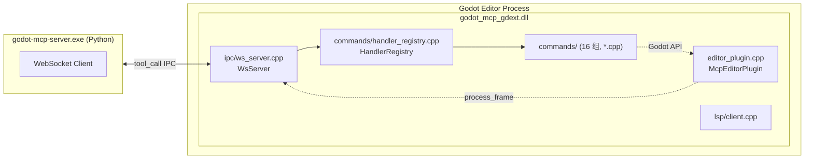

# `extensions/gdext` — GDExtension C++ 实现（当前活跃）

> 加载到 Godot 编辑器内的本机插件。使用 godot-cpp 10.0.0-rc1 构建。**这是项目唯一的 GDExtension 实现**。



## 文件结构

```
src/
├── register_types.cpp     # GDExtension 入口：gdext_rust_init（遗留名称）
├── editor_plugin.cpp      # McpEditorPlugin 生命周期 + process_frame 泵
├── editor_plugin.hpp
├── commands/
│   ├── handler_registry.cpp/.hpp   # 注册表 + 16 组 register_* 声明
│   ├── cmd_utils.cpp/.hpp          # 共享工具函数（resolve_node, j2v/v2j 等）
│   ├── cmd_utils_json.cpp          # JSON↔Variant 转换
│   ├── meta.cpp                    # ping, get_engine_version, get_plugin_version
│   ├── property.cpp                # 2D 属性 get/set
│   ├── property_3d.cpp             # 3D 属性 get/set
│   ├── node.cpp                    # 节点 CRUD
│   ├── scene.cpp                   # 场景文件/标签操作
│   ├── collision.cpp               # 碰撞体添加
│   ├── find.cpp                    # 节点搜索
│   ├── script_helpers.cpp          # call_method, get/set_variable
│   ├── script_gd.cpp               # GDScript 文件操作
│   ├── script_cs.cpp               # C# 文件操作 + Solution 生成
│   ├── search.cpp                  # 文件搜索与替换
│   ├── undo.cpp                    # 撤销/重做
│   ├── editor_control.cpp          # play/stop/refresh/get_editor_info
│   ├── project_settings.cpp        # 项目设置读写
│   ├── project_settings_ext.cpp    # 显示/物理/渲染/层名/项目信息
│   ├── input_map.cpp               # 输入动作管理
│   └── plugin_management.cpp       # 列出/启用/禁用插件
├── ipc/
│   ├── ws_server.cpp               # 同步 WebSocket 服务器
│   └── ws_server.hpp
├── protocol/
│   └── ipc_types.hpp               # IPC 协议格式常量 + 构造辅助
├── lsp/
│   └── client.cpp                  # GDScript LSP 验证
└── logging.hpp                     # 日志 inline 函数（print/push_warning/push_error）
```

## 工具注册

16 组处理器，全部在 `handler_registry.cpp` 的 `register_all_tools()` 中注册：

| # | 组名 | register_ 函数 | 文件 | 工具数 |
|---|------|---------------|------|--------|
| 1 | meta | `register_meta` | `meta.cpp` | 3 |
| 2 | node | `register_node` | `node.cpp` | 17 |
| 3 | property | `register_property` | `property.cpp` | 19 |
| 4 | property_3d | `register_property_3d` | `property_3d.cpp` | 6 |
| 5 | collision | `register_collision` | `collision.cpp` | 2 |
| 6 | find | `register_find` | `find.cpp` | 4 |
| 7 | scene | `register_scene` | `scene.cpp` | 15 |
| 8 | script_gd | `register_script_gd` | `script_gd.cpp` | 5 |
| 9 | script_cs | `register_script_cs` | `script_cs.cpp` | 6 |
| 10 | script_helpers | `register_script_helpers` | `script_helpers.cpp` | 3 |
| 11 | project_settings | `register_project_settings` | `project_settings.cpp` | 7 |
| 12 | project_settings_ext | `register_project_settings_ext` | `project_settings_ext.cpp` | 10 |
| 13 | editor_control | `register_editor_control` | `editor_control.cpp` | 6 |
| 14 | input_map | `register_input_map` | `input_map.cpp` | 4 |
| 15 | plugin_management | `register_plugin_management` | `plugin_management.cpp` | 2 |
| 16 | undo | `register_undo` | `undo.cpp` | 2 |
| 17 | search | `register_search` | `search.cpp` | 3 |

**总计：121 个 gdext 工具 + 4 个服务器端工具 = 125**

> 注：`list_autoloads`、`add_autoload`、`remove_autoload`、`list_scenes` 4 个工具实现在 `node.cpp` 中，因注册时按功能归类在 `register_node()` 内。

## `cmd_utils.hpp` 共享工具函数

| 函数 | 签名 | 说明 |
|------|------|------|
| `resolve_node` | `(Node *root, String path) -> Node*` | 节点路径解析：接受 `""`, `"."`, `"/"`, `"/root"`, 根节点名, `"Root/Child"` |
| `j2v` | `(Dictionary d) -> Variant` | Dictionary → Variant（自动处理 Vector2/3, Color, Rect2, Resource） |
| `v2j` | `(Variant v) -> Dictionary` | Variant → Dictionary |
| `s` | `(Dictionary args, String key) -> String` | 从 args 读取字符串字段（默认空串） |
| `get_root` | `() -> Node*` | 获取当前编辑场景根节点 |
| `mark_dirty` | `()` | 标记当前场景为未保存 |
| `ensure_parent_dir` | `(String path) -> bool` | 创建 `res://` 路径的父目录 |
| `undoable_set` | `(Node*, String prop, Variant val, String action)` | 通过 UndoRedo 设置属性 |

## 构建

`extensions/gdext/CMakeLists.txt` 被根 `CMakeLists.txt` 通过 `add_subdirectory(extensions/gdext)` 引用。使用 `FetchContent` 下载 godot-cpp 10.0.0-rc1。

```cmake
# 在 extensions/gdext/CMakeLists.txt 中
FetchContent_Declare(godot-cpp URL https://ghproxy.net/.../10.0.0-rc1.zip)
add_library(godot_mcp_gdext SHARED ${GODOT_MCP_SOURCES})
target_link_libraries(godot_mcp_gdext PRIVATE godot-cpp)
```

关键的编译定义：`GODOT_MCP_PLUGIN_VERSION="${PROJECT_VERSION}"`（由根 CMakeLists.txt 设置）。
