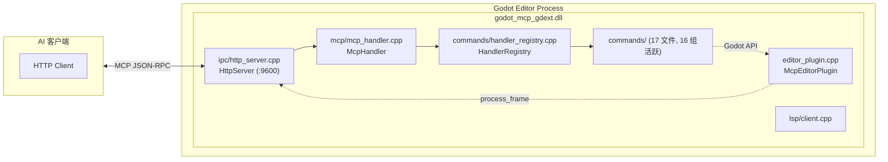

# `extensions/gdext` — GDExtension C++ 实现（当前活跃）

> 加载到 Godot 编辑器内的本机插件。使用 godot-cpp 10.0.0-rc1 构建。**这是项目唯一的 GDExtension实现**。



## 文件结构

```
src/
├── register_types.cpp     # GDExtension 入口：gdext_rust_init（遗留名称）
├── editor_plugin.cpp/.hpp # McpEditorPlugin 生命周期 + process_frame 泵
├── commands/
│   ├── handler_registry.cpp/.hpp   # 注册表 + register_all_tools()
│   ├── cmd_utils.cpp/.hpp          # 共享工具函数（resolve_node, args 解析等）
│   ├── cmd_utils_json.cpp          # JSON↔Variant 转换 (j2v/v2j)
│   ├── meta.cpp                    # ping, get_engine_version, get_plugin_version (3)
│   ├── property.cpp                # 2D 属性 get/set (21)
│   ├── property_3d.cpp             # 3D 属性 get/set (6)
│   ├── node.cpp                    # 节点 CRUD (21)
│   ├── scene.cpp                   # 场景文件/标签操作 (16)
│   ├── collision.cpp               # 碰撞体添加 (2)
│   ├── find.cpp                    # 节点搜索 (4)
│   ├── script_helpers.cpp          # call_method, get/set_variable (3)
│   ├── script_gd.cpp               # GDScript 文件操作 (5)
│   ├── script_cs.cpp               # C# 文件操作 (6, 未注册)
│   ├── search.cpp                  # 文件搜索与替换 (3)
│   ├── undo.cpp                    # 撤销/重做 (2)
│   ├── editor_control.cpp          # play/stop/refresh/get_editor_info (6)
│   ├── project_settings.cpp        # 项目设置 + autoload + 场景列表 (7)
│   ├── project_settings_ext.cpp    # 显示/物理/渲染/层名/项目信息 (10)
│   ├── input_map.cpp               # 输入动作管理 (4)
│   └── plugin_management.cpp       # 列出/启用/禁用插件 (2)
├── ipc/
│   └── http_server.cpp/.hpp        # MCP Streamable HTTP 服务器 (:9600)
├── mcp/
│   └── mcp_handler.cpp/.hpp        # MCP JSON-RPC 2.0 会话管理
├── protocol/
│       └── ipc_types.hpp               # 错误码常量
├── lsp/
│   └── client.cpp/.hpp             # GDScript LSP 验证 (StreamPeerTCP)
└── logging.hpp                     # 日志 inline 函数（print/push_warning/push_error）
```

## 工具注册

17 个处理器文件，16 个在 `handler_registry.cpp` 的 `register_all_tools()` 中活跃注册：

| # | 组名 | register_ 函数 | 文件 | 状态 | 工具数 |
|---|------|---------------|------|------|--------|
| 1 | meta | `register_meta` | `meta.cpp` | 活跃 | 3 |
| 2 | node | `register_node` | `node.cpp` | 活跃 | 21 |
| 3 | property | `register_property` | `property.cpp` | 活跃 | 21 |
| 4 | property_3d | `register_property_3d` | `property_3d.cpp` | 活跃 | 6 |
| 5 | collision | `register_collision` | `collision.cpp` | 活跃 | 2 |
| 6 | find | `register_find` | `find.cpp` | 活跃 | 4 |
| 7 | scene | `register_scene` | `scene.cpp` | 活跃 | 16 |
| 8 | script_gd | `register_script_gd` | `script_gd.cpp` | 活跃 | 5 |
| 9 | script_cs | `register_script_cs` | `script_cs.cpp` | **未调用** | 6 |
| 10 | script_helpers | `register_script_helpers` | `script_helpers.cpp` | 活跃 | 3 |
| 11 | project_settings | `register_project_settings` | `project_settings.cpp` | 活跃 | 7 |
| 12 | project_settings_ext | `register_project_settings_ext` | `project_settings_ext.cpp` | 活跃 | 10 |
| 13 | editor_control | `register_editor_control` | `editor_control.cpp` | 活跃 | 6 |
| 14 | input_map | `register_input_map` | `input_map.cpp` | 活跃 | 4 |
| 15 | plugin_management | `register_plugin_management` | `plugin_management.cpp` | 活跃 | 2 |
| 16 | undo | `register_undo` | `undo.cpp` | 活跃 | 2 |
| 17 | search | `register_search` | `search.cpp` | 活跃 | 3 |

**总计**：17 个文件定义 121 个工具。16 组活跃注册共 115 个工具。`register_script_cs`（6 个 C# 工具）在 `handler_registry.cpp` 中已声明但未在 `register_all_tools()` 中调用。

## `cmd_utils.hpp` 共享工具函数

| 函数 | 签名 | 说明 |
|------|------|------|
| `resolve_node` | `(Node *root, String path) -> Node*` | 节点路径解析：接受 `""`, `"."`, `"/"`, `"/root"`, 根节点名, `"Root/Child"` |
| `j2v` | `(Dictionary d) -> Variant` | Dictionary → Variant（自动处理 Vector2/3, Color, Rect2, Resource） |
| `v2j` | `(Variant v) -> Dictionary` | Variant → Dictionary |
| `get_root` | `() -> Node*` | 获取当前编辑场景根节点 |
| `mark_dirty` | `()` | 标记当前场景为未保存 |
| `ensure_parent_dir` | `(String path) -> bool` | 创建 `res://` 路径的父目录 |
| `undoable_set` | `(Node*, String prop, Variant val, String action)` | 通过 UndoRedo 设置属性 |
| `args_string/int/float/bool` | `(args, key, default)` | 类型安全的参数读取 |

## 构建关键

`extensions/gdext/CMakeLists.txt`：
- `FetchContent` 下载 godot-cpp 10.0.0-rc1
- 目标 Godot API 版本 4.6
- C++17，`POSITION_INDEPENDENT_CODE ON`
- MSVC: `/W3 /wd4244 /wd4267`；GCC/Clang: `-Wall -Wno-unused-parameter`
- 编译定义 `GODOT_MCP_PLUGIN_VERSION`（来自根 CMakeLists.txt 的 `PROJECT_VERSION`）
