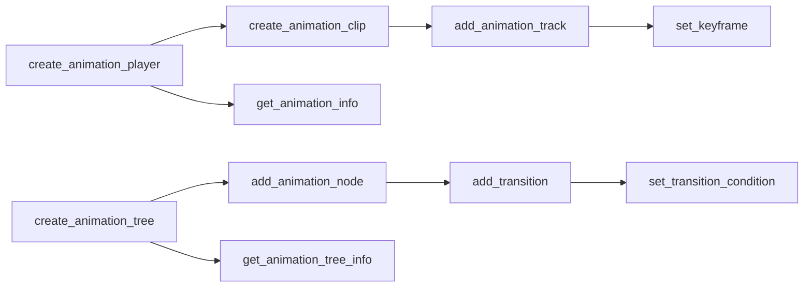

# 动画工具

> 10 个工具，位于 `extensions/src/built_in/tools/editor_tools/animation/`。分两组：AnimationPlayer 管线（5 工具）和 AnimationTree 管线（4 工具），加 1 个查询工具。

## 工具列表

| 工具 | 文件 | 功能 | Undo |
|------|------|------|:----:|
| `create_animation_player` | `create_animation_player.hpp` | 在目标父节点下创建 AnimationPlayer 节点，可选同时创建 AnimationLibrary | ✅ |
| `create_animation_clip` | `create_animation_clip.hpp` | 在指定 AnimationPlayer 的某个 Library 中创建命名 Animation 资源 | ✅ |
| `add_animation_track` | `add_animation_track.hpp` | 向已存在的动画剪辑添加轨道（value/position/rotation/scale/blend_shape/method/bezier/audio/animation） | ✅ |
| `set_keyframe` | `set_keyframe.hpp` | 在轨道上插入、修改或删除关键帧，支持三种操作模式 | ✅ |
| `get_animation_info` | `get_animation_info.hpp` | 只读查询：libraries、animations、tracks、player 状态 | ❌ |
| `create_animation_tree` | `create_animation_tree.hpp` | 创建 AnimationTree 节点，连接 AnimationPlayer，生成根 AnimationNodeStateMachine | ✅ |
| `get_animation_tree_info` | `get_animation_tree_info.hpp` | 只读查询：states、transitions、parameters 列表 | ❌ |
| `add_animation_node` | `add_animation_node.hpp` | 向 AnimationTree 的状态机/混合空间添加子节点（animation/blend2/blend3/blend_tree/one_shot/time_seek/transition） | ✅ |
| `add_transition` | `add_transition.hpp` | 在状态机两个状态间添加过渡，配置 crossfade 时间和 switch_mode | ✅ |
| `set_transition_condition` | `set_transition_condition.hpp` | 设置或清除状态机过渡的 advance_condition | ✅ |

## 依赖关系

## 注册

所有 10 个工具通过 X-macro 注册（`register/register_existing.hpp:48-57`），category 均为 `editor_tools/animation`。所有工具 `is_destructive = false`（通过 UndoRedoManager 回滚）。

## AnimationPlayer 管线

### `create_animation_player`
`register_existing.hpp:48` — `extensions/src/built_in/tools/editor_tools/animation/create_animation_player.hpp`

- **needs_scene**: true
- **参数**: `parent_path`（空=场景根）、`node_name`（默认"AnimationPlayer"）、`library_name`（可选）
- 通过 `ClassDB::instantiate("AnimationPlayer")` 创建，经 `EditorUndoRedoManager` 提交到场景树
- 若传入 `library_name`，同时创建 `AnimationLibrary` 并 `add_animation_library`
- 无 UndoRedoManager 时直接 `add_child` + 标记场景脏

### `create_animation_clip`
`register_existing.hpp:49` — `extensions/src/built_in/tools/editor_tools/animation/create_animation_clip.hpp`

- **参数**: `anim_player_path`、`library_name`（空=自动找第一个）、`clip_name`、`length`（默认 1.0）
- 自动查找第一个 AnimationLibrary 的逻辑：`player->get_animation_library_list()` 取 index 0
- 使用 `EditorUndoRedoManager`：undo 为 `remove_animation`

### `add_animation_track`
`register_existing.hpp:50` — `extensions/src/built_in/tools/editor_tools/animation/add_animation_track.hpp`

- **参数**: `anim_player_path`、`library_name`、`clip_name`、`track_type`、`target_path`、`interpolation`
- 内建 `_parse_track_type()` 映射字符串→`Animation::TrackType`（9 种类型）
- 内建 `_parse_interpolation()` 映射 `nearest/linear/cubic`
- undo：`remove_track(track_idx)`

### `set_keyframe`
`register_existing.hpp:51` — `extensions/src/built_in/tools/editor_tools/animation/set_keyframe.hpp`

- **三种操作**：
  - `insert`：插入新关键帧。如果时间点已有关键帧，undo 恢复原值而非删除（防止丢失已有数据）。区别逻辑：`had_key = track_find_key(..., FIND_MODE_APPROX) >= 0`
  - `delete`：删除关键帧。undo 还原（捕获 exact_time + old_value）
  - `set_value`：修改已有关键帧值。undo 恢复 old_value
- **值规范化**：string 类型值通过 `str_to_var()` 解析；POSITION/ROTATION/SCALE 轨道的 Vector2 自动提升为 Vector3
- 半精度 `AnimationResource` 引用在所有分支路径中通过 `anim_player_path` → `resolve_node` → `Object::cast_to<AnimationPlayer>` → `get_animation_library` → `get_animation` 解析

### `get_animation_info`
`register_existing.hpp:52` — `extensions/src/built_in/tools/editor_tools/animation/get_animation_info.hpp`

- **needs_scene**: true，只读
- `anim_player_path` 为空时自动递归查找场景中第一个 AnimationPlayer（`_find_first_animation_player` 递归搜索）
- 返回：`libraries` 数组（含 `animations` 数组，每个含 `tracks` 数组）、`current_animation`、`is_playing`、`speed_scale`
- track 信息中使用 `String::num_int64()` 表示 track_type

## AnimationTree 管线

### `create_animation_tree`
`register_existing.hpp:53` — `extensions/src/built_in/tools/editor_tools/animation/create_animation_tree.hpp`

- **参数**: `parent_path`、`anim_player_path`、`node_name`（默认"AnimationTree"）、`root_type`（仅支持"state_machine"）
- 创建流程：`ClassDB::instantiate("AnimationTree")` → `set_animation_player(path_to(player))` → `AnimationNodeStateMachine` → `set_tree_root(sm)`
- 先检查 `parent->has_node("./" + node_name)` 防止重名
- 创建后自动选中新节点（`EditorSelection::add_node`）

### `get_animation_tree_info`
`register_existing.hpp:54` — `extensions/src/built_in/tools/editor_tools/animation/get_animation_tree_info.hpp`

- 返回：`tree_root_type`、`states`（名称、node_type、position）、`transitions`（from/to/xfade_time/switch_mode/advance_condition/advance_mode）、`parameters`（通过 `_get_parameter_list()` 动态调用）
- 遍历 `sm->get_node_list()` 和 `sm->get_transition_count()`

### `add_animation_node`
`register_existing.hpp:55` — `extensions/src/built_in/tools/editor_tools/animation/add_animation_node.hpp`

- **参数**: `tree_path`、`node_type`（7 种）、`name`（兼容 `node_name` 后备）、`position`、`animation_name`
- **兼容性**：`name` 参数为空时后备为 `args_string(ctx.args, "node_name")`（AGENTS.md 已记录）
- node_type → ClassDB class name 映射表：
  - `animation` → `AnimationNodeAnimation`（可选设置 `set_animation()`）
  - `blend2` → `AnimationNodeBlend2`
  - `blend3` → `AnimationNodeBlend3`
  - `blend_tree` → `AnimationNodeBlendTree`
  - `one_shot` → `AnimationNodeOneShot`
  - `time_seek` → `AnimationNodeTimeSeek`
  - `transition` → `AnimationNodeTransition`

### `add_transition`
`register_existing.hpp:56` — `extensions/src/built_in/tools/editor_tools/animation/add_transition.hpp`

- **参数**: `tree_path`、`from`、`to`、`xfade_time`、`switch_mode`（immediate/sync/at_end）
- 验证源/目标状态存在后创建 `AnimationNodeStateMachineTransition`
- undo：`remove_transition(from, to)`

### `set_transition_condition`
`register_existing.hpp:57` — `extensions/src/built_in/tools/editor_tools/animation/set_transition_condition.hpp`

- **参数**: `tree_path`、`from`、`to`、`condition`、`value`
- 查找过渡的方式：遍历 `get_transition_count()` 匹配 `from`+`to`
- undo 保存 `old_advance_condition`
- `value=false` 时清除条件（`set_advance_condition(StringName())`）

## 注意事项

- 所有修改工具使用 `EditorUndoRedoManager`（`tool_base.hpp` 提供的 `get_undo_redo()`）
- AnimationPlayer 工具中 `library_name` 为空时自动查找第一个 Library（`get_animation_library_list()[0]`）
- `set_keyframe` 的 undo 逻辑是特殊设计的：已有关键帧时 undo 恢复原值而非删除 — 参见 `set_keyframe.hpp:150-182` 勘误注释
- 所有工具的主线程同步执行（`_process()` 轮询 `HttpServer::poll()`）
