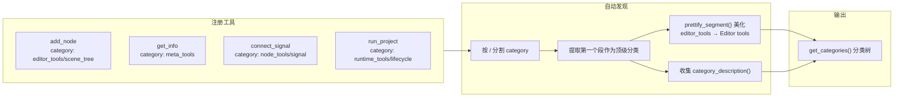

# 分类自动发现

> 替代硬编码 `top_level_meta()` 的顶级分类自动发现系统。顶级分类从工具 `category()` 的第一个 `/` 前段自动提取，label 和 description 从工具虚函数自动收集。

## 设计



## 实现

### `prettify_segment()` 静态函数

```cpp
String prettify_segment(const String &seg) {
    if (seg.is_empty()) return seg;
    String result = seg.replace("_", " ");
    // 跳过前导数字字符，找到第一个字母字符再大写（如 "3d" → "3D"）
    int first_letter = 0;
    while (first_letter < result.length() && result[first_letter] >= '0' && result[first_letter] <= '9') {
        first_letter++;
    }
    // 找到第一个非空格的字母字符
    for (int i = first_letter; i < result.length(); i++) {
        if (result[i] != ' ') {
            String upper(1, result[i].to_upper());
            result = result.substr(0, i) + upper + result.substr(i + 1);
            break;
        }
    }
    return result;
}
```

### 自动发现循环（`handler_registry.cpp`）

在 `get_categories()` 中，遍历 `tool_info_` 为每个顶级分类收集：

- **label**：留空由 `prettify_segment()` 兜底（如 `editor_tools` → `Editor tools`）
- **description**：使用该分类内第一个非空 `category_description()`

### 设置顶级分类描述

在任意工具上覆盖 `category_description()`：

```cpp
String category_description() const override {
    return "Editor operation tools: scene tree CRUD, clipboard, script, workspace switching, etc.";
}
```

当前已设置的工具：

| 顶级分类 | 描述来源 | 描述内容 |
|---------|---------|---------|
| `meta_tools` | `call_tool.hpp` | Meta tools and system information queries |
| `editor_tools` | `add_node.hpp` | Editor operation tools: scene tree CRUD, clipboard, script, workspace switching, console, debugger, performance monitors, etc. |
| `node_tools` | `connect_signal.hpp` | Node property read and modify tools, organized by Godot node type |
| `runtime_tools` | `get_game_scene_tree.hpp` | Game runtime bridge tools: scene tree queries, property read/write, script execution, input simulation, screenshot, UI discovery, etc. |

## 数据结构

`CatNode` 局部结构体：

```cpp
struct CatNode {
    String name;        // 段名（如 "scene_tree"）
    String description; // 分类描述
    int direct = 0;     // 直接挂载数
    int total = 0;      // 累加数（含子分类）
    HashMap<String, CatNode> children;
};
```

## 注意事项

- 新增顶级分类无需修改代码——注册新工具时 `category()` 的第一个段自动成为顶级节点
- label 自动美化（`my_tools` → `My tools`）
- description 从该分类内工具的 `category_description()` 获取，第一个非空值胜出
