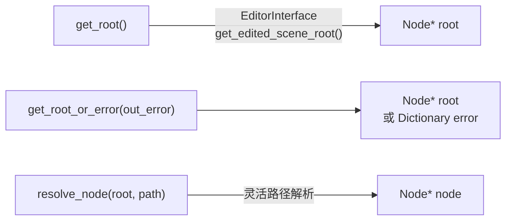
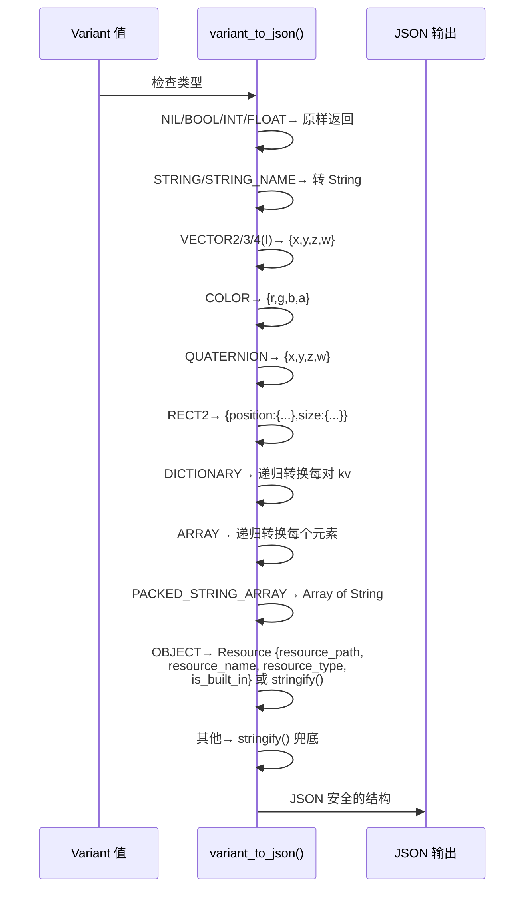
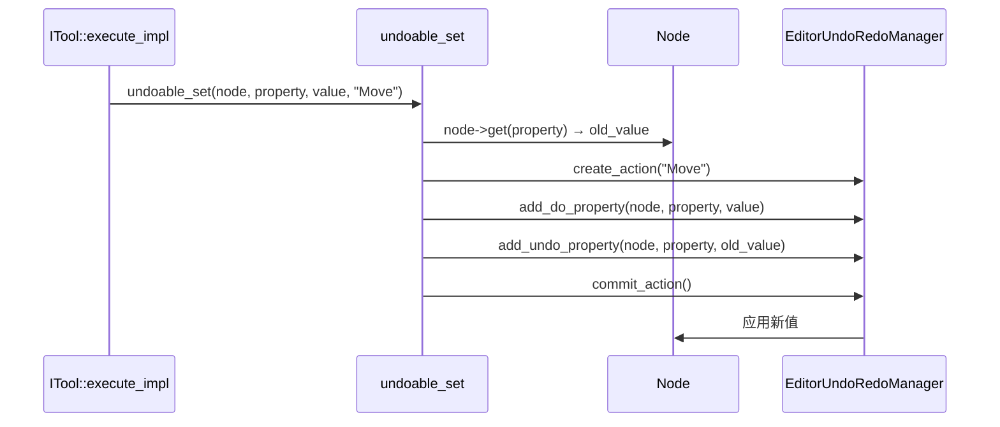
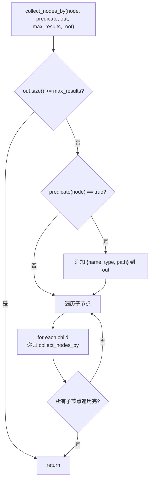

# 共享工具函数

> `extensions/src/built_in/cmd_utils.hpp` 和 `cmd_utils_json.cpp` 中定义的共享辅助函数，为所有 `ITool` 实现提供场景访问、JSON 转换、编辑器操作、路径解析、参数读取和树遍历能力。所有函数**必须在主线程调用**（`cmd_utils.hpp:16`）。

## 场景辅助函数

`cmd_utils.hpp:33-55`：



| 函数 | 文件:行 | 返回 | 说明 |
|------|---------|------|------|
| `get_root()` | `cmd_utils.hpp:39` | `Node*` | 当前编辑场景根节点 | 
| `get_root_or_error(out_error)` | `cmd_utils.hpp:43` | `Node*` | 失败时写入 `{"error": "no scene open"}` 字典 |
| `resolve_node(root, path)` | `cmd_utils.hpp:51` | `Node*` | 灵活路径解析（见下） |

### `resolve_node()` 路径解析策略（`cmd_utils.hpp:46-51`）

| 输入 `path` | 行为 |
|------------|------|
| `""`、`"."`、`"/"`、`"/root"` | 返回 root 本身 |
| `<root_name>`（场景根名） | 返回 root |
| `"/root/<root_name>/Child"` | 自动剥离前缀，`root->get_node("Child")` |
| `<root_name>/Child` | 自动剥离 `<root_name>/`，`root->get_node("Child")` |
| 其他标准 NodePath | `root->get_node_or_null(path)` |
| 深度保护 | `depth >= kMaxResolveDepth(1024)` 时返回 nullptr |

`resolve_node` 的 `depth` 参数 `cmd_utils.hpp:51` 用于递归保护，防止循环引用导致栈溢出。

### `get_undo_redo()`（`cmd_utils.hpp:55`）

返回 `EditorUndoRedoManager` 单例，通过 `EditorInterface::get_editor_undo_redo_manager()` 获取（编辑器外返回 nullptr）。

## JSON ↔ Variant 转换

`cmd_utils_json.cpp:30-311`。

### `variant_to_json()`（`:36-177`）

将 Godot 原生 Variant 递归转换为 JSON 安全的 Dictionary/Array：



深度限制 `kMaxJsonDepth = 64`（`cmd_utils_json.cpp:30`），超限时返回 `v.stringify()` 字符串。

### `json_to_variant()`（`:250-311`）

将 JSON 解析后的 Variant 还原为上帝类型。支持**类型推断**：

| JSON 模式 | 目标类型 | 文件:行 |
|-----------|----------|---------|
| `{x, y}` | `Vector2` | `cmd_utils_json.cpp:198-200` |
| `{x, y, z}` | `Vector3` | `:201-203` |
| `{x, y, z, w}` | `Vector4` | `:204-206` |
| `{r, g, b}` | `Color(a=1.0)` | `:207-209` |
| `{r, g, b, a}` | `Color` | `:207-209` |
| `{position, size}` | `Rect2`（递归解析子 Vector2） | `:211-224` |
| `{resource_path: "res://..."}` | `ResourceLoader::load()` | `:225-234` |
| `{path: "res://..."}` | `ResourceLoader::load()`（仅无 x/r/position 时） | `:235-244` |
| `"res://..."` 或 `"user://..."` 字符串 | `ResourceLoader::load()` | `:257-264` |
| `[a, b]` 全数值 | `Vector2` | `:291-293` |
| `[a, b, c]` 全数值 | `Vector3` | `:294-296` |
| `[a, b, c, d]` 全数值 | `Color` | `:297-299` |
| 无匹配的 Dictionary | 递归转换所有 value | `:271-278` |
| 无匹配的 Array | 递归转换所有元素 | `:301-306` |
| 基本类型（nil/bool/int/float） | 原样通过 | `:308-310` |

类型推断由 `dict_to_specific_type()`（`:189-246`）完成，优先尝试 `{x,y}` / `{x,y,z}` / `{x,y,z,w}` → `{r,g,b,a}` → `{position,size}` → `{resource_path}` → `{path}` 的顺序。匿名命名空间函数，仅限 `json_to_variant()` 内部调用。

两次转换均受 `kMaxJsonDepth = 64` 深度保护（`cmd_utils_json.cpp:30`），防止恶意嵌套 JSON 耗尽栈空间。

## 编辑器操作辅助

`cmd_utils.hpp:80-95`：

| 函数 | 文件:行 | 说明 |
|------|---------|------|
| `undoable_set(node, property, value, action_name)` | `cmd_utils.hpp:84-87` | 立即设置属性 + 注册撤销操作（"apply now + register undo" 惯用模式） |
| `mark_scene_dirty()` | `cmd_utils.hpp:91` | 标记当前场景为"未保存"状态 |
| `notify_file_changed(path)` | `cmd_utils.hpp:95` | 通知 `EditorFileSystem` 文件已变化 |

### `undoable_set` 流程



## 路径辅助函数

`cmd_utils.hpp:98-111`：

| 函数 | 文件:行 | 返回值示例 | 说明 |
|------|---------|------------|------|
| `relative_path(root, node)` | `cmd_utils.hpp:103` | `"Pong/Ball"` | root 下的相对路径（node==root 返回 `""`） |
| `globalize_path("res://...")` | `cmd_utils.hpp:107` | `"C:/project/..."` | 通过 `ProjectSettings::globalize_path()` 转换 |
| `ensure_parent_dir("res://a/b.tscn")` | `cmd_utils.hpp:111` | `true/false` | 创建 `res://a/` 目录（目录已存在时不报错） |

## 参数解析

`cmd_utils.hpp:114-135`，四个安全读取函数，提供了默认值兜底：

| 函数 | 返回类型 | 默认值 |
|------|----------|--------|
| `args_string(args, key, default)` | `String` | `""` |
| `args_int(args, key, default)` | `int64_t` | `0` |
| `args_float(args, key, default)` | `double` | `0.0` |
| `args_bool(args, key, default)` | `bool` | `false` |

使用方式：
```cpp
String path = args_string(ctx.args, "node_path");
int limit = args_int(ctx.args, "limit", 20);
```

类型不安全时会自动转换为目标类型（Godot Variant 隐式转换版本）。所有函数在 key 缺失时返回默认值，不会抛出异常。

## 树遍历

### `collect_nodes_by()` — 递归 DFS

`cmd_utils.hpp:147-163`（内联函数）：



- 结果格式：`{name, type, path}`（`:154-156`）
- `path` 通过 `relative_path(root, node)` 计算（相对于场景根）
- `max_results` 前置检查避免不必要的递归

### `walk_project_dir()` — 递归目录遍历

`cmd_utils.hpp:169-191`（内联函数）：

| 参数 | 类型 | 说明 |
|------|------|------|
| `dir` | `String` | 起始目录（如 `"res://"`） |
| `extensions` | `Array` | 扩展名过滤（如 `[".tscn", ".gd"]`），空数组不过滤 |
| `include_addons` | `bool` | `false` 时跳过 `addons/`、`.godot/`、`.import/` |
| `max_results` | `int64` | 最大返回数 |
| `out` | `Array&` | 输出结果（`String` 路径列表） |

遍历策略：
1. 跳过 `.` 和 `..`（`:178`）
2. 目录：`include_addons=false` 时跳过 `addons/.godot/.import`（`:181`），否则递归进入子目录
3. 文件：扩展名匹配后追加完整路径到 `out`（`:184-188`）
4. `max_results` 前置检查（`:171`），到达上限后提前终止遍历

## 序列化辅助

`cmd_utils.hpp:141`：

| 函数 | 文件:行 | 说明 |
|------|---------|------|
| `json_stringify_safe(v)` | `cmd_utils_json.cpp:317-319` | 调用 `JSON::stringify(v)` 序列化 |

## 新增模板工具（`cmd_utils/` 目录）

`extensions/src/built_in/cmd_utils/` 下七个独立头文件，提供编译期构造的运行时工具：

### `dispatch_map.hpp` — 编译期构造的静态映射表

```cpp
// 工厂函数
static const auto map = make_dispatch_map<String, String>(
    Pair{"key1", "val1"},
    Pair{"key2", "val2"}
);
// 查询 — 返回 const V* 或 nullptr
const auto *v = map.find(key);
// 调试验证 — 断言无重复 key
map.validate(); // assert 重复时崩溃
```

`DispatchMap<K,V,N>` 是编译期 `constexpr` 构造的线性查找表（`std::array` 存储），无动态分配。`find()` 返回 `const V*`（nullptr 表示未命中）。用于替代 if/else 链或 `HashMap` 的**只读静态映射**场景。

字符串键支持 `const char*` 隐式转换到 `String` 的比较，避免临时 `String` 分配。

### `undo_helpers.hpp` — 统一撤销/重做辅助

| 函数 | 说明 |
|------|------|
| `commit_add_child_undo(ur, action_name, parent, child, scene_root, index=-1, clear_owner=true)` | 注册原子化撤销操作：do = 添加子节点，undo = 移出子节点 |
| `select_single_node(node)` | 选中单个节点（清除其他选中） |

`commit_add_child_undo` 封装了 `EditorUndoRedoManager` 的 `add_do_method` / `add_undo_method` 调用对，确保撤销时子节点被正确移除。`index` 参数控制插入位置（默认追加末尾），`clear_owner` 控制撤销时是否清除 owner（默认 true）。

`select_single_node` 通过 `EditorSelection::clear()` + `add_node()` 实现。

### `args_get_typed<T>()` — 类型安全参数提取

```cpp
// 声明（cmd_utils/args_get_typed.hpp）
template <typename T>
T args_get_typed(const Dictionary &args, const String &key, const T &default_);

// 用法
auto pos = args_get_typed<Vector2>(ctx.args, "position", Vector2());
auto color = args_get_typed<Color>(ctx.args, "color", Color(1,1,1,1));
auto val = args_get_typed<int>(ctx.args, "count", 0);
```

支持的特化类型：

| 类型 | 说明 |
|------|------|
| `String` | 直接 Variant → String |
| `Dictionary` | 直接返回 `Dictionary`（无需转换） |
| `Array` | 直接返回 `Array` |
| `Vector2` / `Vector3` | 等 |
| `Color` | Struct 类型 |
| `bool` | 布尔值 |
| 整型（`int`/`int64_t`/`int32_t`） | 统一 `Variant::operator int64_t()` |
| 浮点（`double`/`float`） | 统一 `Variant::operator double()` |

所有特化均使用一次 `has()` + `operator[]` 模式（不调用 `ptr()`）。

### `error_codes.hpp` — 错误码常量

命名空间 `error_codes` 内的 `inline constexpr const char*` 常量，统一工具返回的错误码：

| 常量 | 类别 |
|------|------|
| `MISSING_REQUIRED_PARAM` | 参数错误 |
| `INVALID_PARAM_TYPE` | 参数错误 |
| `NODE_NOT_FOUND` | 资源错误 |
| `SCENE_NOT_OPEN` | 资源错误 |
| `RESOURCE_NOT_FOUND` | 资源错误 |
| `PERMISSION_DENIED` | 权限错误 |
| `INTERNAL_ERROR` | 运行时错误 |
| `NOT_IMPLEMENTED` | 运行时错误 |
| `TIMEOUT` | 运行时错误 |
| `BRIDGE_ERROR` | 桥接错误 |
| `BRIDGE_DISCONNECTED` | 桥接错误 |
| `BRIDGE_TIMEOUT` | 桥接错误 |

### `memdelete_guard.hpp` — RAII 内存释放守卫

```cpp
template <typename T>
struct MemdeleteGuard {
    T *ptr;
    explicit MemdeleteGuard(T *p);
    ~MemdeleteGuard();       // 自动 memdelete(ptr)
    void dismiss();          // 放弃所有权（不释放）
    T *get() const;
    // 支持 move，禁止 copy
};
```

用于确保 Godot `memnew` 分配的对象在异常路径或提前返回时也能被正确释放。调用 `dismiss()` 表示所有权已转移（如节点已加入场景树）。

### `schema_builder.hpp` — JSON Schema 构建器

```cpp
SchemaBuilder builder;
auto schema = builder
    .prop("name", "string", "The node name")
    .prop("count", "integer", "Repeat count", Variant(1))
    .required({"name"})
    .build();
// → {"type":"object","properties":{...},"required":["name"]}
```

流式 API 构造 MCP `inputSchema` 字典。`prop()` 支持可选默认值参数。`empty()` 静态方法返回无参数的空 schema。

### `tracked_settings.hpp` — 设置覆盖追踪

```cpp
HashMap<String, Variant> &overrides = get_setting_overrides();
```

全局单例 `HashMap`，记录 `set_setting` 工具修改前的原始值。`reset_setting` 从此 map 读取原始值恢复，避免调用 `ProjectSettings::clear()`（后者会从内存和磁盘同时删除 key）。

## `walk_project_dir()` 改用 `std::filesystem`

`cmd_utils.hpp:169-191` 的 `walk_project_dir()` 已从 `DirAccess` 迁移至 `std::filesystem::recursive_directory_iterator`：

- 使用 `std::filesystem::recursive_directory_iterator` 配合 `skip_permission_denied` 选项
- 性能提升约 **10x**（大量文件/目录场景）
- 外部行为完全一致：`extensions` 过滤、`include_addons`、`max_results` 上限等参数语义不变
- path 仍通过 `String(path_str)` 转换为 Godot `String`

## `args_get<T>()` 基础模板（`cmd_utils.hpp`）

`cmd_utils.hpp` 自身也提供了一个基础版本的 `args_get<T>()` 模板（与 `args_get_typed.hpp` 的完整实现互补）：

```cpp
template <typename T>
T args_get(const Dictionary &args, const String &key, const T &default_);
```

实现遵循 `has(key)` + `operator[]` 模式（不使用 `Dictionary::ptr()`），key 缺失时返回默认值。类型安全通过模板特化保证。

## 注意：`Dictionary::ptr()` 不存在

`godot-cpp 10.0.0-rc1` 中 **`Dictionary::ptr()` 方法不存在**。不能使用 `*args.ptr(key)` 这种模式。所有参数读取统一使用：

```cpp
if (args.has(key)) {
    Variant val = args[key];
    // ...
}
```

新的 `args_get<T>` 和 `args_get_typed<T>` 已自动遵循此约束。
