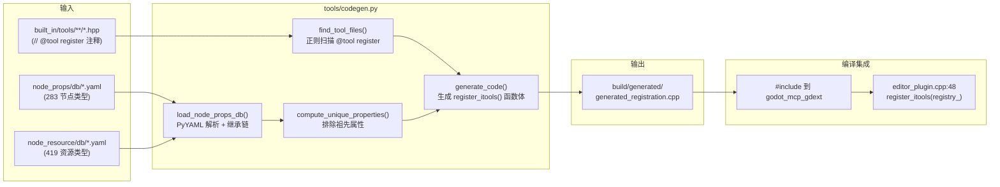
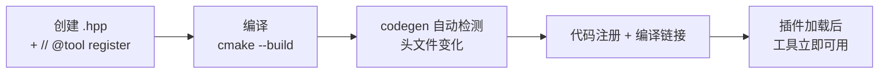

# 代码生成流水线

> `tools/codegen.py` 扫描 `// @tool register` 注释 + YAML 属性数据库，自动生成 `generated_registration.cpp`，实现零手工注册。

## 架构



## 触发机制

CMake 自定义命令（`extensions/CMakeLists.txt:91-116`）在以下依赖变化时自动重跑：

```
依赖: codegen.py 脚本本身
      所有 .hpp 头文件（tool_headers）
      node_props/db/*.yaml + *.yml
      node_resource/db/*.yaml + *.yml
输出: build/generated/generated_registration.cpp
```

## 处理流程

### 1. 扫描工具头文件 (`find_tool_files`)

遍历 `--source-dir`（`extensions/src/built_in/tools/`）下所有 `.hpp`，用正则 `// @tool register` 定位标记：

```python
TOOL_RE = re.compile(r'//\s*@tool\s+register')
CLASS_RE = re.compile(r'class\s+(\w+)\s*:\s*public\s+(ITool\b)')
```

匹配模式：注释后紧跟（跳过空白/注释）的 `class Xxx : public ITool` 声明。提取类名。

### 2. 加载 YAML 属性数据库 (`load_node_props_db`)

递归扫描 YAML 目录，对每个 `.yaml`/`.yml` 文件：

- 读取 `class_name`、`inherits`、`properties` 列表
- 构建继承链 `build_inheritance_chain(node_props_map, class_name)`
- 去重 `compute_unique_properties()`：排除祖先链中已定义的属性
- 生成 `NodePropertyGetTool<ClassName>` / `NodePropertySetTool<ClassName>` 注册代码

YAML 格式：

```yaml
class_name: Node2D
inherits: CanvasItem
properties:
  - name: position
    type: Vector2
    default: Vector2(0, 0)
    setter: set_position
    getter: get_position
  - name: rotation
    type: float
    default: 0.0
```

### 3. 资源属性数据库

与节点属性流程相同，输入 `--resource-props-db`，生成 `NodeResourceGetTool<ResType>` / `NodeResourceSetTool<ResType>`。

### 4. 代码生成 (`generate_code`)

输出 `generated_registration.cpp`，包含三部分：

**部分 A：@tool register 工具的注册**

```cpp
// 自动生成 — 不要手动修改
#include "built_in/tools/meta/get_info.hpp"
#include "built_in/tools/meta/get_tools.hpp"
// ... 所有找到的 head 文件的 include ...
#include "built_in/tools/signal/connect_signal.hpp"
#include "built_in/tools/signal/disconnect_signal.hpp"

void register_itools(HandlerRegistry &registry) {
    // @tool register 标记的工具
    registry.register_tool(std::make_unique<GetInfoTool>());
    registry.register_tool(std::make_unique<GetToolsTool>());
    // ...
    registry.register_tool(std::make_unique<ConnectSignalTool>());
    registry.register_tool(std::make_unique<DisconnectSignalTool>());

    // 节点属性工具（283 个类型）
    registry.register_tool(std::make_unique<NodePropertyGetTool<"Node2D">>());
    registry.register_tool(std::make_unique<NodePropertySetTool<"Node2D">>());
    // ...

    // 资源属性工具（419 个类型）
    registry.register_tool(std::make_unique<NodeResourceGetTool<"Resource">>());
    registry.register_tool(std::make_unique<NodeResourceSetTool<"Resource">>());
    // ...
}
```

## 辅助工具：`collect_node_props.py`

通过 Godot `--headless` 模式运行 GDScript，从 ClassDB 提取节点/资源属性，生成 YAML 数据库：

```bash
uv run python tools/collect_node_props.py --godot /path/to/godot
```

需要 Godot 4.6+ 可执行文件。输出写入 `node_props/db/` 和 `node_resource/db/`。

## 添加新工具流程



零手动注册步骤：无需修改 `CMakeLists.txt`、`handler_registry.cpp`、或其他文件。
