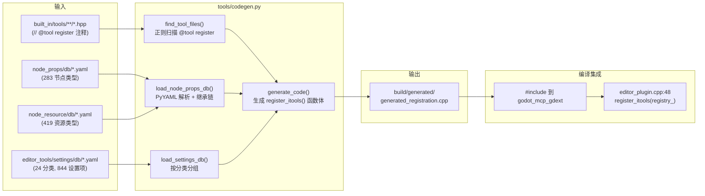
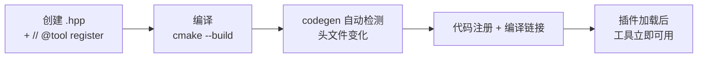

# 代码生成流水线

> `tools/codegen.py` 扫描 `// @tool register` 注释 + YAML 属性数据库，自动生成 `generated_registration.cpp`，实现零手工注册。

## 架构



## 触发机制

CMake 自定义命令（`extensions/CMakeLists.txt`）在以下依赖变化时自动重跑：

```
依赖: codegen.py 脚本本身
      所有 .hpp 头文件（tool_headers）
      node_props/db/*.yaml + *.yml
      node_resource/db/*.yaml + *.yml
      editor_tools/settings/db/*.yaml + *.yml
输出: build/generated/generated_registration.cpp
```

## 处理流程

### 1. 扫描工具头文件 (`find_tool_files`)

遍历 `--source-dir`（`extensions/src/built_in/tools/`）下所有 `.hpp`，用正则 `// @tool register` 定位标记。提取类名和相对 `src/` 的 include 路径。

### 2. 加载节点/资源属性 YAML 数据库 (`load_node_props_db`)

递归扫描 YAML 目录，对每个 `.yaml`/`.yml` 文件：

- 读取 `class_name`、`inherits`、`properties` 列表
- 构建继承链 `build_inheritance_chain()`
- 去重 `compute_unique_properties()`：排除祖先链中已定义的属性
- 生成 `NodePropertyGetTool` / `NodePropertySetTool` 注册代码

YAML 格式：

```yaml
class: Node
inherits: Object
properties:
  - name: unique_name_in_owner
    type: 1
    type_name: bool
  - name: process_mode
    type: 2
    type_name: int
description: Base class for all scene tree nodes.
aliases: []
```

### 3. 加载设置 YAML 数据库 (`load_settings_db`)

扫描设置目录，每个文件对应一个顶级分类（如 `display.yaml`），包含该分类下所有设置项：

```yaml
category: display
settings:
  - name: display/window/size/viewport_width
    type: 2
    type_name: int
    hint: 1
    hint_string: 1,7680,1,or_greater
    basic: false
    restart: false
  - name: display/window/size/viewport_width.android
    type: 2
    type_name: int
    hint: 1
    hint_string: 1,7680,1,or_greater
    basic: false
    restart: false
```

设置名中的 `/` 和 `.` 在工具名中替换为 `_`，例如 `display/window/size/viewport_width.android` → `get_display_window_size_viewport_width_android`。

### 4. 代码生成 (`generate_code`)

输出 `generated_registration.cpp`，包含四部分：

- **A**：`@tool register` 工具的注册（84 个）
- **B**：节点属性工具（283 类型 × 2 = 566）
- **C**：资源属性工具（419 类型 × 2 = 838）
- **D**：项目设置工具（844 设置项 × 2 = 1688）

## 辅助工具

### `collect_node_props.py`

通过 Godot `--headless` 运行 GDScript，从 ClassDB 提取节点/资源属性：

```bash
uv run python tools/collect_node_props.py --godot /path/to/godot
```

### `collect_settings.py`

通过 Godot `--headless` 调用 `ProjectSettings.get_property_list()`，提取所有可见设置项：

```bash
uv run python tools/collect_settings.py --godot /path/to/godot
```

## 添加新工具流程



零手动注册步骤：无需修改 `CMakeLists.txt`、`handler_registry.cpp`、或其他文件。

## 注意事项

- **UTF-8 BOM 会导致 codegen 无法识别 `// @tool register`**。PowerShell `Set-Content` 默认带 BOM，必须用 `$PSDefaultParameterValues['Out-File:Encoding']='utf8'` 或 Python 写入。
- 无 PyYAML 时跳过所有 YAML 数据库生成。
- CMake 自动在 `extensions/CMakeLists.txt` 中驱动 codegen 作为自定义命令。
