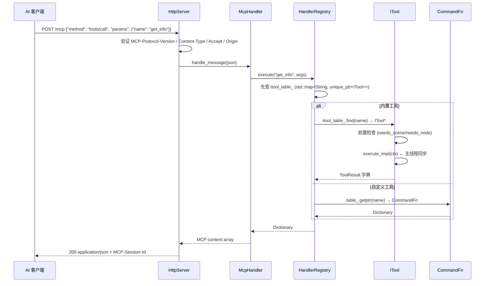
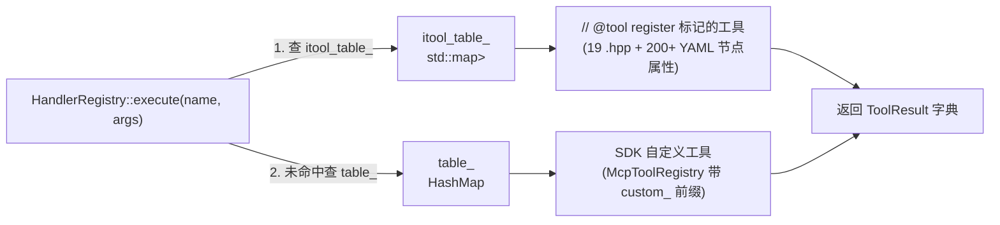

# 命令路由

## 完整的调用链路



## HandlerRegistry 调度



| 步骤 | 文件:行 | 行为 |
|------|---------|------|
| 1 | `handler_registry.cpp:50` | `register_tool(unique_ptr<ITool>)` 存入 `itool_table_` |
| 2 | `handler_registry.cpp:17` | `register_custom_tool(name, ...)` 存入 `table_`（CommandFn 后备表） |
| 3 | `editor_plugin.cpp:48` | `_enter_tree()` 调 `register_itools(registry_)` —— codegen 自动生成 |
| 4 | execute | 先查 `itool_table_` → 未命中查 `table_` |

## 顶级分类

`top_level_meta()` 硬编码于 `handler_registry.cpp:182-189`：

| 原始 category | 顶级路径 | 顶级 label | 顶级 description |
|--------------|---------|-----------|------------------|
| `meta_tools` | `meta_tools` | Meta Tools | 元工具与系统信息查询 |
| `node_tools` | `node_tools` | Node Tools | 节点属性读取与修改工具，按 Godot 节点类型分类组织 |

**注意**：旧的 17 组 category → 6 顶级 remap 已被简化。`get_categories()` (`handler_registry.cpp:220-302`) 直接按 `category()` 返回值的 `/` 分割自动建树，叶子节点的 `description` 由工具的 `category_description()` 填入。

## ITool 接口契约（`extensions/src/built_in/tool_base.hpp:48-55`）

```cpp
class ITool {
public:
    virtual String name() const = 0;             // 注册名
    virtual String category() const = 0;         // 顶级分类
    virtual String brief() const = 0;
    virtual String description() const = 0;
    virtual Dictionary input_schema() const = 0;
    virtual bool is_meta() const { return false; }    // 渐进式披露
    virtual bool needs_scene() const { return false; }// 触发 ctx.root 注入
    virtual bool needs_node() const { return false; } // 触发 ctx.node 注入

    Dictionary execute(const Dictionary &args);   // 模板方法：前置检查 + 注入 ctx + 调 execute_impl

protected:
    virtual Dictionary execute_impl(const ToolContext &ctx) = 0;
};
```

`execute()` 的标准流程：

```
1. is_editor_hint() 校验（仅编辑器模式）
2. if needs_scene → get_root() 失败返回 err
3. if needs_node  → resolve_node() 失败返回 err
4. execute_impl(ctx)  ← 业务逻辑
5. ensure_envelope(result)  ← 统一 ToolResult 信封
```

## 两轴分类系统

| 维度 | 字段 | 用途 |
|------|------|------|
| 可见性 | `is_meta()` | meta 工具始终在 `tools/list` 可见；非 meta 工具需通过 `get_categories` → `get_tools` 二级发现（渐进式披露） |
| 分组 | `category()` | 顶级分类；多级用 `/` 分割（如 `node_tools` / `node_tools/group`） |

## 注意事项

- 所有命令在 Godot 主线程同步执行（`EditorPlugin::_on_process_frame()` 驱动 `HttpServer::poll()`）
- 添加新内置工具仅需创建 `.hpp` + `// @tool register` 注释，运行 codegen 自动注册
- SDK 自定义工具通过 `McpToolRegistry` 注册，**自动加 `custom_` 前缀**（`mcp_tool_registry.cpp:113-160`）
- 顶级 `top_level_meta` 当前只有 `meta_tools` + `node_tools`；新增顶级需同步加 meta + `String::utf8("标签")` + 描述
