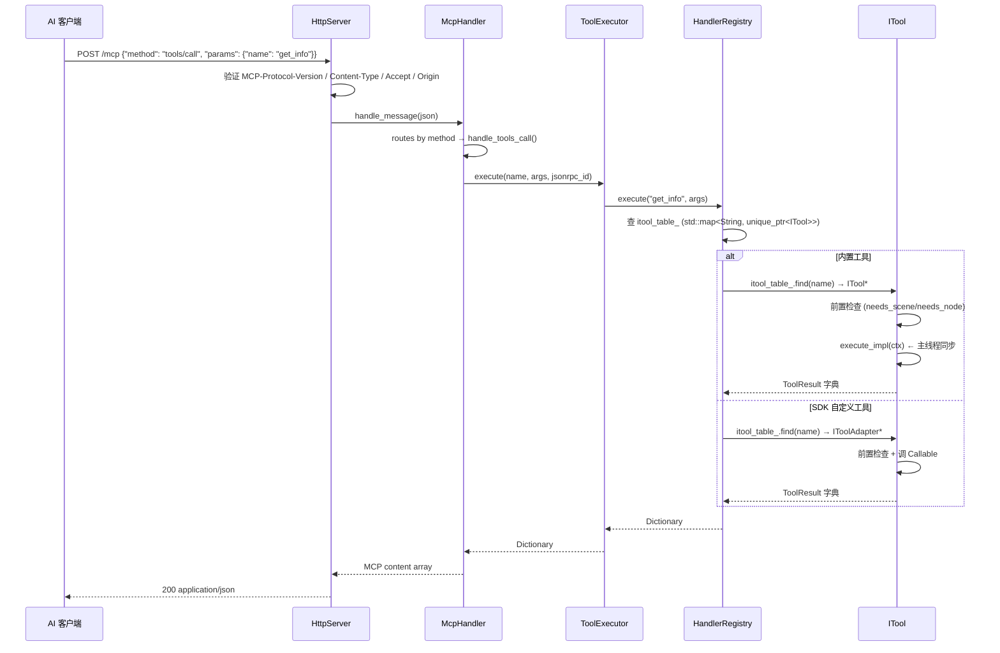
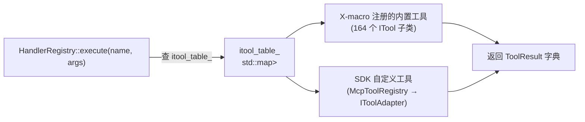

# 命令路由

## 完整的调用链路



## HandlerRegistry 调度



| 步骤 | 文件 | 行为 |
|------|------|------|
| 1 | `handler_registry.cpp` | `register_tool(unique_ptr<ITool>, bool is_custom)` 存入 `itool_table_` |
| 2 | `handler_registry.cpp` | SDK 自定义工具通过 `register_tool(IToolAdapter, true)` 存入同一张表 |
| 3 | `editor_plugin.cpp` | `_enter_tree()` → `register_itools(registry_)` — X-macro 注册所有内置工具 |
| 4 | `mcp_handler.cpp` / `tool_executor.cpp` | `McpHandler::handle_tools_call()` → `ToolExecutor::execute()` — 权限检查/计时/MCP 格式化 |
| 5 | `handler_registry.cpp` | `HandlerRegistry::execute(name, args)` → 查 `itool_table_` 调用 `ITool::execute()` |

## 顶级分类自动发现

`get_categories()`（`handler_registry.cpp:205`）按 `category()` 返回值的 `/` 分割自动建树。顶级分类从第一个 `/` 前的段自动提取，label 通过 `prettify_segment()` 美化（`editor_tools` → `Editor Tools`），description 从该分类内工具的 `category_description()` 自动收集。

详见 [category-discovery.md](category-discovery.md)。

## ITool 接口契约（`extensions/src/built_in/tool_base.hpp`）

```cpp
class ITool {
public:
    virtual ~ITool() = default;

    // ── 元数据 ──
    virtual String name() const = 0;
    virtual String brief() const = 0;
    virtual String description() const { return brief(); }
    Dictionary input_schema() const;
    virtual String category() const = 0;
    virtual String category_description() const { return {}; }

    // is_meta() 控制 tools/list 可见性
    //   true  → 始终可见（发现工具：list_tools/list_tool_categories 等）
    //   false → 渐进式披露（通过 list_tool_categories 发现后再调用 list_tools 展开）
    virtual bool is_meta() const { return false; }

    // ── 能力声明（组合优于继承）──
    virtual bool needs_scene() const { return false; }
    virtual bool needs_node() const { return false; }
    virtual bool supports_undo() const { return false; }
    virtual bool is_destructive() const { return is_destructive_; }
    void set_is_destructive(bool v) { is_destructive_ = v; }

    // ── 依赖注入 ──
    virtual void set_registry(HandlerRegistry *reg) {}

    // ── 统一入口（模板方法）──
    Dictionary execute(const Dictionary &args);

protected:
    virtual Dictionary build_input_schema() const = 0;
    virtual Dictionary execute_impl(const ToolContext &ctx) = 0;
    bool is_destructive_ = false;
};
```

`execute()` 的标准流程：

```
1. Input Schema 校验（required 参数 + 类型检查）
2. if needs_scene → get_root() 失败返回 err
3. if needs_node  → resolve_node() 失败返回 err
4. execute_impl(ctx)  ← 业务逻辑
5. ensure_envelope(result)  ← 统一 ToolResult 信封
```

## 两轴分类系统

| 维度 | 字段 | 用途 |
|------|------|------|
| 可见性 | `is_meta()` | meta 工具始终在 `tools/list` 可见；非 meta 工具需通过 `get_categories` → `get_tools` 二级发现（渐进式披露） |
| 分组 | `category()` | 顶级分类；多级用 `/` 分割（如 `editor_tools/scene_tree`） |

## 注意事项

- 所有命令在 Godot 主线程同步执行（`McpEditorPlugin::_process()` 驱动 `HttpServer::poll()`）
- 添加新内置工具：创建 `.hpp` + 在 `register/*.hpp` 加 `GODOT_MCP_TOOL` 行 + 在 `register_itools.cpp` 加 `#include`
- SDK 自定义工具通过 `McpToolRegistry` 注册，自动加 `custom_` 前缀，通过 `IToolAdapter` 包装为 `ITool` 存入 `itool_table_`
- 顶级分类自动发现，无需手动维护 `top_level_meta()`
