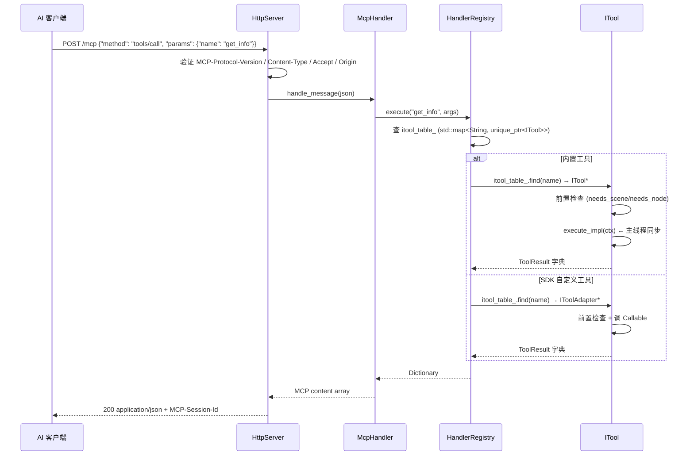

# 命令路由

## 完整的调用链路



## HandlerRegistry 调度


| 步骤 | 文件:行 | 行为 |
|------|---------|------|
| 1 | `handler_registry.cpp:72` | `register_tool(unique_ptr<ITool>)` 存入 `itool_table_` |
| 2 | `handler_registry.cpp:20` | `register_custom_tool(name, ...)` 创建 IToolAdapter 存入 `itool_table_` |
| 3 | `editor_plugin.cpp:43` | `_enter_tree()` 调 `register_itools(registry_)` — X-macro 注册所有内置工具 |
| 4 | execute | 查 `itool_table_`（内置和 SDK 工具同表） |

## 顶级分类自动发现

`get_categories()` (`handler_registry.cpp:286`) 按 `category()` 返回值的 `/` 分割自动建树。顶级分类从第一个 `/` 前的段自动提取，label 通过 `prettify_segment()` 美化（`editor_tools` → `Editor tools`），description 从该分类内工具的 `category_description()` 自动收集。

详见 [category-discovery.md](category-discovery.md)。

## ITool 接口契约（`extensions/src/built_in/tool_base.hpp:33-74`）

```cpp
class ITool {
public:
    virtual String name() const = 0;             // 注册名
    virtual String category() const = 0;         // 分类路径（如 "editor_tools/scene_tree"）
    virtual String brief() const = 0;
    virtual String description() const = 0;
    virtual String category_label() const { return category(); }
    virtual String category_description() const { return {}; }
    virtual Dictionary input_schema() const = 0;
    virtual bool is_meta() const { return false; }    // 渐进式披露
    virtual bool needs_scene() const { return false; } // 触发 ctx.root 注入
    virtual bool needs_node() const { return false; }  // 触发 ctx.node 注入

    Dictionary execute(const Dictionary &args);   // 模板方法：前置检查 + 注入 ctx + 调 execute_impl

protected:
    virtual Dictionary execute_impl(const ToolContext &ctx) = 0;
};
```

`execute()` 的标准流程：

```
1. Input Schema 校验（required 参数 + 类型检查）
2. if needs_scene → get_root() 失败返回 err
3. if needs_node  → resolve_node() 失败返回 err
4. execute_impl(ctx)  ← 业务逻辑
5. ensure_envelope(result)  ← 统一 ToolResult 信封
```

## 两轴分类系统

| 维度 | 字段 | 用途 |
|------|------|------|
| 可见性 | `is_meta()` | meta 工具始终在 `tools/list` 可见；非 meta 工具需通过 `get_categories` → `get_tools` 二级发现（渐进式披露） |
| 分组 | `category()` | 顶级分类；多级用 `/` 分割（如 `editor_tools/scene_tree`） |

## 注意事项

- 所有命令在 Godot 主线程同步执行（`McpEditorPlugin::_process()` 驱动 `HttpServer::poll()`）
- 添加新内置工具：创建 `.hpp` + 在 `register/*.hpp` 加 `GODOT_MCP_TOOL` 行 + 在 `register_itools.cpp` 加 `#include`
- SDK 自定义工具通过 `McpToolRegistry` 注册，自动加 `custom_` 前缀，通过 `IToolAdapter` 包装为 `ITool` 存入 `itool_table_`
- 顶级分类自动发现，无需手动维护 `top_level_meta()`
