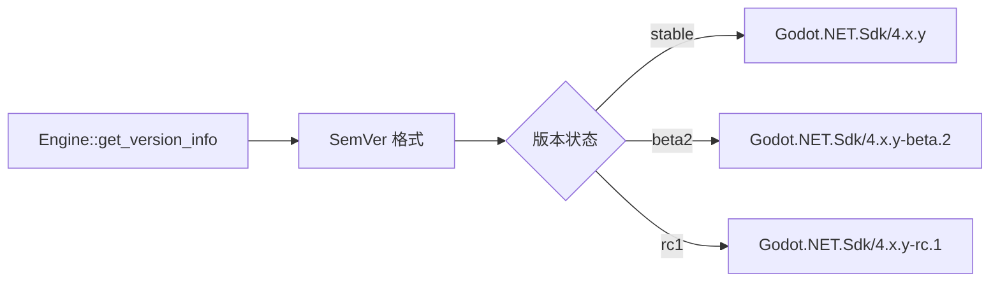

# C# 解决方案生成

> 直接在 GDExtension 进程中生成 `.sln` + `.csproj` 文件，无需启动第二个 Godot 进程。**当前实现位置**：`extensions/src/built_in/tools/` 下的 ITool。
>
> **历史路径**：`extensions/gdext/src/commands/script_cs.cpp`（已删除，参见 commit `c4318ee`）。

## 文件结构

```
res://
├── project_name.sln          # Visual Studio Solution（UTF-8 with BOM）
└── project_name.csproj       # C# Project（UTF-8 without BOM）
```

## 版本推导



- 基础版本：`{major}.{minor}.{patch}`
- 状态处理：SemVer 2.0 要求 pre-release 标签使用点分隔，如 `"beta2"` → `"beta.2"`

## 项目名选择

```
1. ProjectSettings "dotnet/project/assembly_name" 值
2. 或 "application/config/name" 值
3. 或 项目文件夹名（兜底）
```

## 文件生成

### `.csproj`（UTF-8 无 BOM）

```xml
<Project Sdk="Godot.NET.Sdk/4.6.0">
  <PropertyGroup>
    <TargetFramework>net8.0</TargetFramework>
    <RootNamespace>ProjectName</RootNamespace>
    <AssemblyName>ProjectName</AssemblyName>
    <EnableDynamicLoading>true</EnableDynamicLoading>
  </PropertyGroup>
</Project>
```

### `.sln`（UTF-8 有 BOM）

标准 Visual Studio Solution 文件格式，包含项目引用和全局配置。

## 工具列表

| 工具 | 说明 |
|------|------|
| `csharp_create_solution` | 生成 `.sln` + `.csproj`（可启用 NativeAOT） |
| `csharp_build` | 调用 `dotnet build` 编译 C# 项目 |
| `create_csharp_script` | 基于模板创建 C# 脚本文件 |
| `read_csharp_script` | 读取 C# 脚本源码 |
| `edit_csharp_script` | 修改 C# 脚本源码 |
| `list_csharp_scripts` | 列出项目中的 C# 脚本文件 |

## 注意事项

- `csharp_build` 调用 `dotnet build`——编辑器持有程序集文件锁时无法运行
- `csharp_create_solution` 必须在创建 C# 脚本前执行
- `.csproj` 使用 UTF-8 **无** BOM；`.sln` 使用 UTF-8 **有** BOM（VS 要求）
- NativeAOT 支持通过 `enable_nativeaot` 参数启用（实验性）
