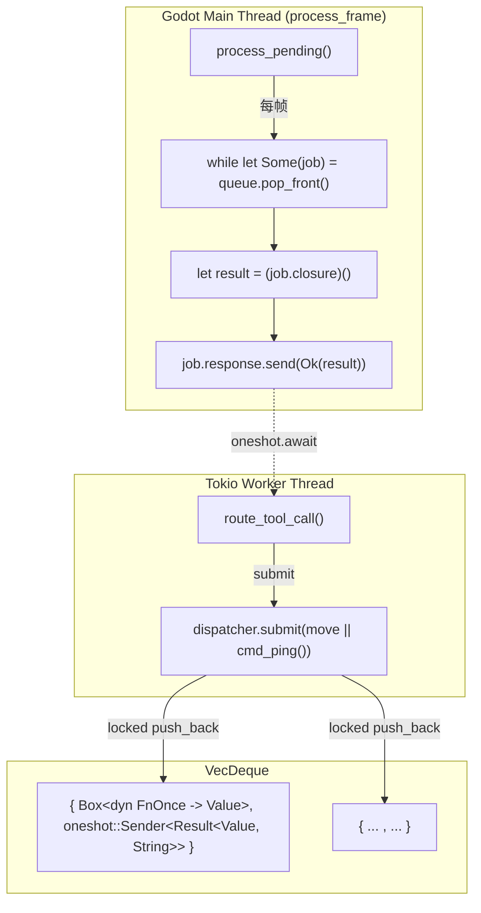

# Dispatcher（`MainThreadDispatcher`）

> 使 tokio 工作线程能够安全地调用 Godot API 的关键基础设施。

## 设计



## 结构

```rust
struct DispatcherJob {
    closure: Box<dyn FnOnce() -> Value + Send>,
    response: oneshot::Sender<Result<Value, String>>,
}

pub struct MainThreadDispatcher {
    queue: Arc<Mutex<VecDeque<DispatcherJob>>>,
}
```

- `queue` 是 `Mutex<VecDeque<...>>` —— tokio 工作线程写，主线程读
- 每个 job 包含一个闭包和一个 `oneshot::Sender<Result<Value, String>>`
- `submit()` 返回 `impl Future<Output = Result<Value, String>>`，工作线程可以 `.await` 它

## 调用流程

1. **工作线程**：`dispatcher.submit(move || cmd_something(args)).await`
2. `submit()` 将闭包推送到 `queue`，返回 `oneshot::Receiver`
3. **主线程**（`process_frame` 处理函数）：调用 `dispatcher.process_pending()`
4. `process_pending()` 锁住 queue，取出所有 jobs，释放锁，然后依次执行闭包
5. 每个闭包执行完后通过 `Sender` 发送 `Ok(result)`
6. **工作线程**：`Receiver` 收到结果，继续执行

## 响应类型

`submit()` 返回 `Result<Value, String>`：
- `Ok(value)` — 闭包在主线程正常执行完毕并返回 JSON value
- `Err(msg)` — oneshot 被丢弃（主线程 panic 或插件卸载）

## 关键细节

- **闭包必须 `Send`**——`DispatcherJob` 包含 `Box<dyn FnOnce() -> Value + Send>`
- 闭包**应该捕获需要的值**（通过 `move`），而不是捕获引用来共享状态
- `process_pending()` 先取出所有 jobs 再逐一执行（锁不持续保持）
- 使用 `process_frame` 信号而非 `EditorPlugin::_process()` 来泵队列——避免 `bind_mut` 死锁
- 所有 Godot API 调用必须在闭包内部进行，闭包运行在主线程上

## 与旧的差异

旧版 `MainThreadDispatcher` 使用 `oneshot::Sender<Value>`，新版改为 `oneshot::Sender<Result<Value, String>>`，使主线程错误能通过 `Err` 传播回工作线程。