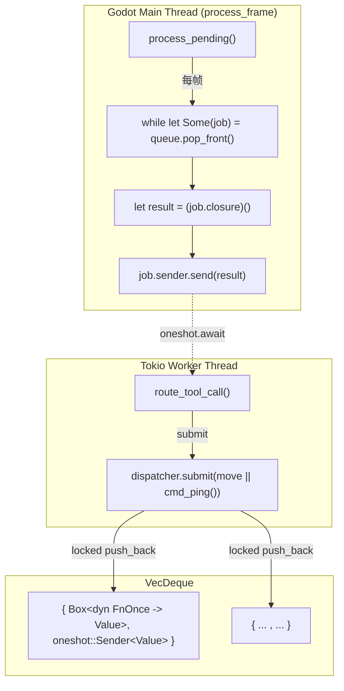

# Dispatcher（`MainThreadDispatcher`）

> 使 tokio 工作线程能够安全地调用 Godot API 的关键基础设施。

## 设计



## 结构

```rust
pub struct MainThreadDispatcher {
    queue: Mutex<VecDeque<DispatcherJob>>,
}

type DispatcherJob = (
    Box<dyn FnOnce() -> Value + Send>,
    oneshot::Sender<Value>,
);
```

- `queue` 是 `Mutex<VecDeque<...>>` —— tokio 工作线程写，主线程读
- 每个 job 包含一个闭包和一个 `oneshot::Sender`
- `submit()` 返回 `tokio::sync::oneshot::Receiver<Value>`，工作线程可以 `.await` 它

## 调用流程

1. **工作线程**：`dispatcher.submit(move || cmd_something(args)).await`
2. `submit()` 将闭包推送到 `queue`，返回 `Receiver`
3. **主线程**（`process_frame` 处理函数）：调用 `dispatcher.process_pending()`
4. `process_pending()` 锁住 queue，取出所有 jobs，释放锁，然后依次执行闭包
5. 每个闭包执行完后通过 `Sender` 发送结果
6. **工作线程**：`Receiver` 收到结果，继续执行

## 为什么不用 channel

- 主线程是唯一的消费者，不需要多生产者/多消费者的复杂性
- `VecDeque` + `Mutex` 已足够，且不需要异步信道基础设施
- 闭包比消息传递更自然——Godot API 的调用模式是完全同步的

## 关键细节

- **闭包必须 `Send`**——`DispatcherJob` 包含 `Box<dyn FnOnce() -> Value + Send>`
- 闭包**应该捕获需要的值**（通过 `move`），而不是捕获引用来共享状态
- 使用 `process_frame` 信号而非 `EditorPlugin::_process()` 来泵队列——避免 `bind_mut` 死锁
- 所有 Godot API 调用必须在闭包内部进行，闭包运行在主线程上