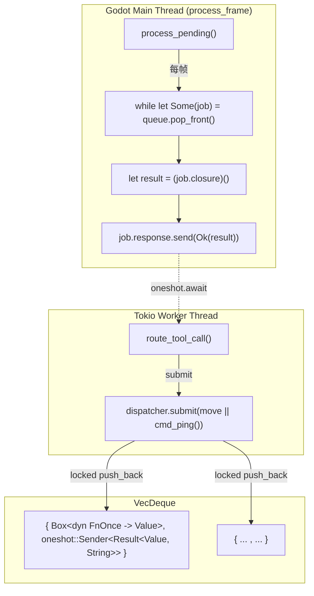

# Dispatcher（`MainThreadDispatcher`）

> **⚠️ 仅 Rust 遗留版本需要。** C++ 版本不存在跨线程问题，无需 dispatcher。

## 为什么 C++ 版本不需要

C++ 版本的 `extensions/gdext/` 在 Godot 主线程上运行所有代码——`_on_process_frame()` 通过 `process_frame` 信号每帧被调用，在此上下文中执行 `WsServer::poll()`，后者同步处理 WebSocket 消息并执行 `CommandFn`。没有工作线程，没有跨线程通信，没有 dispatcher。

## Rust 遗留版本的设计

[Rust 版本]使 tokio 工作线程能够安全地调用 Godot API 的关键基础设施。



## 结构

```rust
struct DispatcherJob {
    closure: Box<dyn FnOnce() -> Value + Send>,
    response: oneshot::Sender<Result<Value, String>>,
}
pub struct MainThreadDispatcher {
    queue: Arc<Mutex<VecDeque<DispatcherJob>>>,
}
```

## 调用流程

1. **工作线程**：`dispatcher.submit(move || cmd_something(args)).await`
2. `submit()` 将闭包推送到 `queue`，返回 `oneshot::Receiver`
3. **主线程**（`process_frame` 处理函数）：调用 `dispatcher.process_pending()`
4. `process_pending()` 锁住 queue，取出所有 jobs，释放锁，然后依次执行闭包
5. 每个闭包执行完后通过 `Sender` 发送 `Ok(result)`
6. **工作线程**：`Receiver` 收到结果，继续执行

## 注意事项

- **闭包必须 `Send`**
- 闭包**必须 `move` 捕获值**，不能捕获引用
- `process_pending()` 先取出所有 jobs 再逐一执行（锁不持续保持）
- 使用 `process_frame` 信号而非 `EditorPlugin::_process()`——避免 `bind_mut` 死锁
- 所有 Godot API 调用**必须在闭包内部进行**，闭包运行在主线程上
