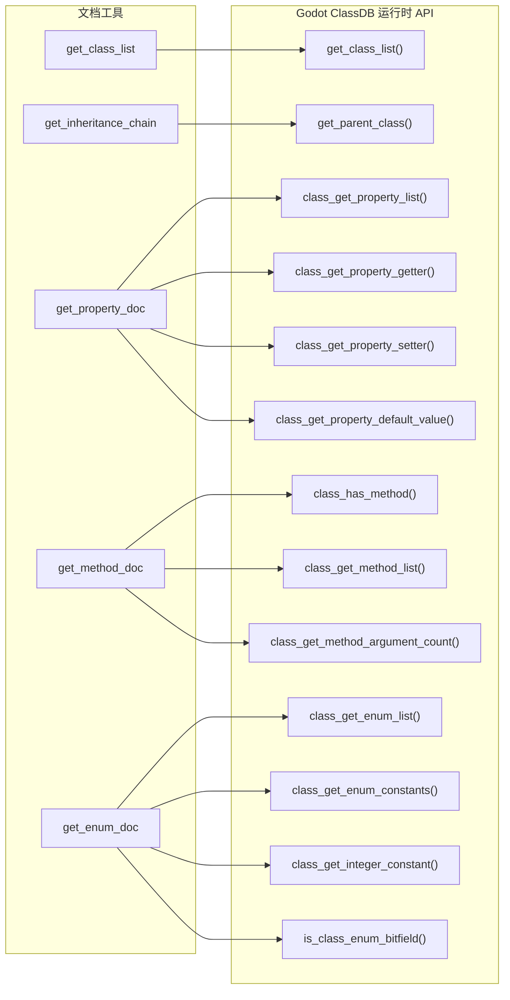

# 文档查询工具（Layer 3）

> 四层工具体系的最高层。通过 Godot ClassDB 运行时 API 提供类、属性、方法、枚举的查询能力，无需 YAML 数据库或 `EditorHelp::get_doc_data()`。

## 工具列表

| 工具 | 功能 | 依赖 |
|------|------|------|
| `search_docs` | 搜索 Godot 文档（通过 ClassDB 手动遍历全部类和方法） | `ClassDB::get_class_list()` + `class_get_method_list()` |
| `get_class_info` | 实例化类并返回方法/属性/信号列表 | `ClassDB::instantiate()` |
| `get_best_practices` | 返回 Godot 最佳实践指南 | 内置数据 |
| `get_class_list` | 列出所有注册类，可选 `inherit` 过滤 | `ClassDB::get_class_list()` |
| `get_inheritance_chain` | 遍历继承链直到 Object/RefCounted | `ClassDB::get_parent_class()` |
| `get_property_doc` | 属性详情：类型、getter/setter、默认值 | `ClassDB::class_get_property_list()` |
| `get_method_doc` | 方法详情：参数、返回类型、flags | `ClassDB::class_get_method_list()` |
| `get_enum_doc` | 枚举详情：常量名/值、bitfield 标记 | `ClassDB::class_get_enum_list()` |

## 使用的 ClassDB API

## 与旧 YAML 数据库方案的对比

| 维度 | 旧方案（YAML 数据库） | 新方案（ClassDB 运行时） |
|------|---------------------|------------------------|
| 数据源 | 手动收集的 YAML 文件（5,575 项） | Godot 引擎 ClassDB（始终最新） |
| 同步 | 需手动运行 `collect_node_props.py` | 零维护 |
| 引擎升级 | YAML 需重新收集 | 自动适配新版本 |
| 查询能力 | 仅属性名/类型 | 属性 + 方法 + 枚举 + 继承链 |
| 性能 | 编译期静态 | 运行时查询（毫秒级） |
