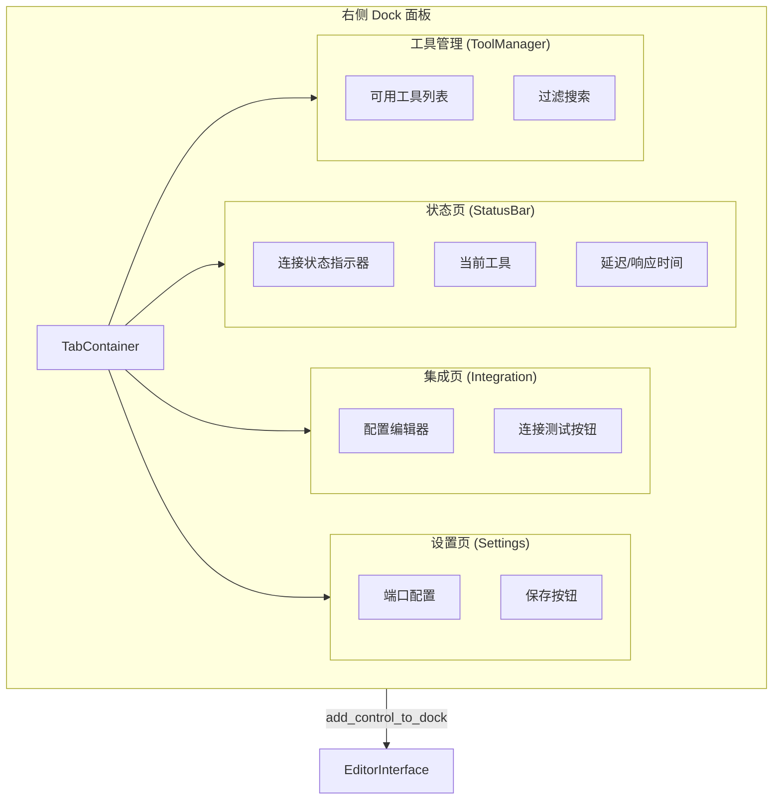

# Dock UI

> Godot 编辑器右侧面板。

## 实现

Dock UI 在当前代码中已部分实现但**仍有标记为 TODO 的部分**。

### `main_dock.rs`

- 创建 `VBoxContainer` 作为根控件
- 实例化 4 个子面板

### 子面板

| 文件 | 状态 |
|------|------|
| `status_bar.rs` | 已实现：显示连接状态、最后工具调用、延迟 |
| `integration.rs` | 已实现：配置校验 + 测试按钮 |
| `settings.rs` | 已实现：WebSocket 端口配置 + 持久化 |
| `tool_manager.rs` | 标记为 TODO |

## 连接

- Dock UI 引用 `PluginState::global().editor_interface` 来获取 `EditorInterface`
- 设置通过 `ProjectSettings` 持久化

## 未来计划

- `tool_manager.rs` 将显示可用的 MCP 工具列表（调用 server 的 `list_request_tools`）
- 支持搜索和过滤工具
- 支持从 UI 直接测试工具调用并查看 JSON 响应
