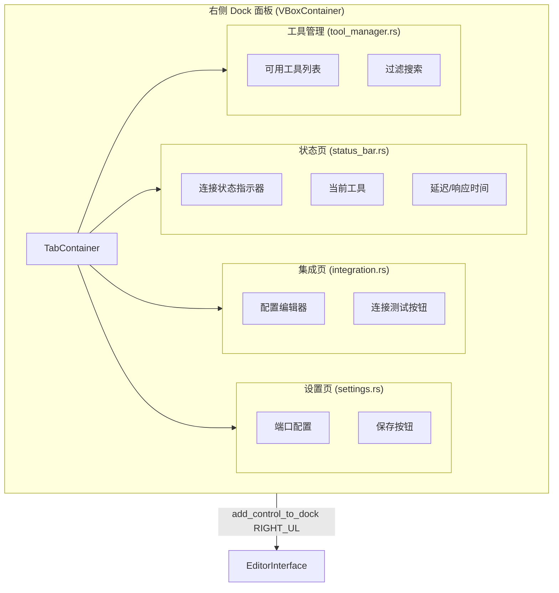

# Dock UI

> Godot 编辑器右侧面板（DockSlot::RIGHT_UL）。



## 实现

`main_dock.rs` 创建 `VBoxContainer` 根控件并包含 4 个子面板。

### `main_dock.rs`

```rust
pub fn create_dock(broadcast_tx: broadcast::Sender<String>) -> Gd<VBoxContainer>
```

- 创建 `VBoxContainer` 根控件
- 实例化 4 个子面板
- 接收 `broadcast_tx` 用于监听工具更新通知

### 子面板

| 文件 | 状态 | 功能 |
|------|------|------|
| `status_bar.rs` | 已实现 | 显示连接状态、最后工具调用、延迟 |
| `integration.rs` | 已实现 | 配置校验 + 测试按钮 |
| `settings.rs` | 已实现 | WebSocket 端口配置 + 持久化 |
| `tool_manager.rs` | **标记为 TODO** | 工具列表、过滤搜索 |

## 启动

Dock 在 `editor_plugin.rs` 的 `enter_tree()` 中创建：

```rust
let dock = dock::main_dock::create_dock(tx.clone());
self.base_mut().add_control_to_dock(DockSlot::RIGHT_UL, &dock);
self.main_dock = Some(dock);
```

## 清理

Dock 在 `exit_tree()` 中移除：

```rust
if let Some(dock) = self.main_dock.take() {
    self.base_mut().remove_control_from_docks(&dock);
    dock.free();
}
```

## 未来计划

- `tool_manager.rs` 将显示可用的 125 个 MCP 工具列表（通过 broadcast 通知更新）
- 支持搜索和过滤工具
- 支持从 UI 直接测试工具调用并查看 JSON 响应