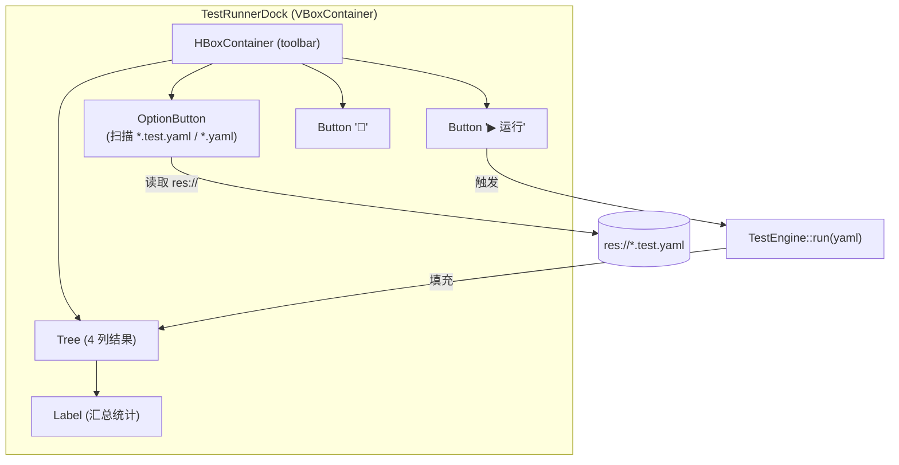

# Dock UI —— TestRunnerDock

> `extensions/src/plugin/test_runner_dock.cpp` + `.hpp`。编辑器底部 "Tests" 面板，供手工加载并运行 YAML 测试套件。**已实现并默认添加**。

## 添加位置

`McpEditorPlugin::_enter_tree()`（`editor_plugin.cpp:69-79`）在 `started_ = true` 之前向底部面板注入：

```cpp
test_dock_ = memnew(TestRunnerDock);
test_dock_->set_test_engine(&test_engine_);
// godot-cpp 10.0.0-rc1 未绑定 add_control_to_bottom_panel，call() 兜底
if (has_method("add_control_to_bottom_panel")) {
    call("add_control_to_bottom_panel", test_dock_, "Tests");
} else {
    log_warn("plugin", "add_control_to_bottom_panel not bound — adding dock as child");
    add_child(test_dock_);
}
```

清理路径在 `_exit_tree()`（`editor_plugin.cpp:98-105`）：先尝试 `remove_control_from_bottom_panel`，否则从父节点 `remove_child`。

## 组件构成



## 与 C++ TestEngine 的连接

| 职责 | 实现 |
|------|------|
| YAML 加载 | `OptionButton` 扫描 `tests/yaml_tests/*.test.yaml` 和 `*.yaml` |
| 执行 | `Button "▶ 运行"` → `TestRunnerDock::on_run_pressed()` → `TestEngine::run(yaml_content)` |
| 结果展示 | `Tree` 4 列：Test Name / Tool / Status / Detail（FAIL 可展开） |
| 汇总 | `Label`：`✅ N/M passed  (K failed)  耗时 Xs` |

## 历史

旧版本 `docs/plan/phase-3-dock-ui.md` 计划实现自定义右侧 Dock UI（用于编辑器内可视化测试进度与日志），与 `TestRunnerDock`（底部面板）不同。当前只实现了底部 `TestRunnerDock`；右侧 Dock UI 仍为待办。
