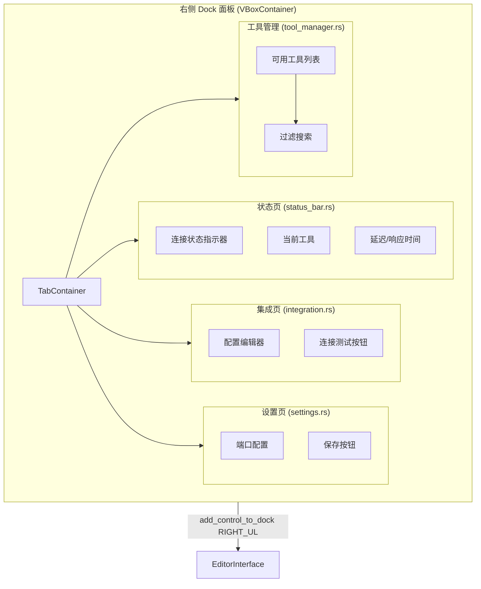

# Dock UI

> Godot 编辑器右侧面板。**C++ 版本（当前）未实现自定义 Dock UI。** Rust 遗留版本有一个 4 面板 Dock。

## C++（当前）

当前 C++ 版本的 `McpEditorPlugin` 不添加任何 Dock UI。`_enter_tree()` 仅启动 WebSocket 服务器并连接 `process_frame` 信号。后续版本计划添加 Dock UI（见 `docs/plan/phase-3-dock-ui.md`）。

## Rust（遗留）

Rust 版本在 `editor_plugin.rs::enter_tree()` 中通过 `add_control_to_dock(DockSlot::RIGHT_UL, &dock)` 添加 Dock UI：



| 面板 | 状态 | 功能 |
|------|------|------|
| `status_bar.rs` | 已实现 | 显示连接状态、最后工具调用、延迟 |
| `integration.rs` | 已实现 | 配置校验 + 测试按钮 |
| `settings.rs` | 已实现 | WebSocket 端口配置 + 持久化 |
| `tool_manager.rs` | **标记为 TODO** | 工具列表、过滤搜索 |

Dock 在 `exit_tree()` 中移除：

```rust
self.base_mut().remove_control_from_docks(&dock);
dock.free();
```
