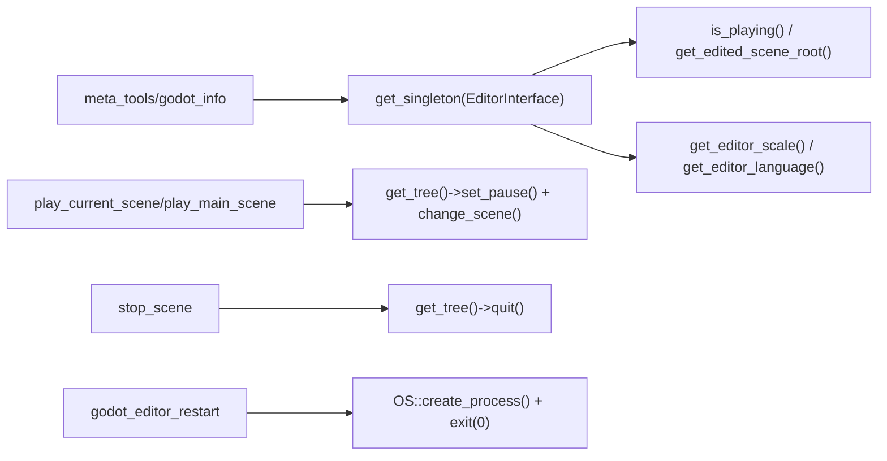

# Editor Control 工具

> 7 个编辑器控制工具，在 C++ GDExtension 进程内执行。**当前实现位置**：`extensions/src/built_in/tools/meta/`（重构后合并到 `meta_tools` 顶级分类）。
>
> **历史路径**：`extensions/gdext/src/commands/editor_control.cpp`（已删除，参见 commit `c4318ee refactor(tools): 删除旧工具文件`）。

## 工具列表

| 工具 | 描述 | 返回 |
|------|------|------|
| `play_current_scene` | 播放当前编辑器中打开的场景 | `{"playing": true}` |
| `play_main_scene` | 播放项目主场景 | `{"playing": true, "main_scene": "..."}` |
| `stop_scene` | 停止正在运行的场景 | `{"stopped": true}` |
| `is_scene_playing` | 查询场景是否正在播放 | `{"playing": bool, "scene_path": Value}` |
| `refresh_filesystem` | 刷新编辑器文件系统扫描 | `{"scanning": true}` |
| `godot_editor_restart` | 重启 Godot 编辑器（分叉+退出） | 启动新进程后退出 |
| `get_editor_info` | 获取编辑器信息 | 见下方 |

> **当前实现细节**：5 个 meta 工具（`godot_info` / `list_tool_categories` / `list_tools` / `get_tool_schema` / `call_tool`）中的 `godot_info` 工具合并了旧 `play_current_scene` / `play_main_scene` / `stop_scene` / `is_scene_playing` / `refresh_filesystem` / `godot_editor_restart` / `get_editor_info` 七个工具的查询/控制能力。其他编辑控制工具独立保留在 `meta_tools` 分类下。

## `get_editor_info` 返回值

```json
{
  "engine_version": "4.6.0",
  "editor_scale": 1.0,
  "editor_language": "en",
  "editor_paths": {
    "data_dir": "C:/Users/...",
    "config_dir": "C:/Users/...",
    "cache_dir": "C:/Users/...",
    "project_settings_dir": "C:/Users/..."
  }
}
```

## `godot_info`（合并工具）返回值

```json
{
  "connection": {"status": "ok"},
  "engine": {"version": "4.6.0", "hash": "..."},
  "project": {
    "name": "...",
    "version": "...",
    "main_scene": "..."
  },
  "editor": {
    "playing": false,
    "scene_path": null,
    "scale": 1.0,
    "language": "en"
  }
}
```

## 调用路径


