# 编辑器插件（`McpEditorPlugin`）

> `godot_mcp_gdext.dll` 的生命周期管理。

### 生命周期

```mermaid
stateDiagram-v2
    [*] --> EnterTree: Godot 加载插件
    
    EnterTree --> Initializing: _enter_tree()
    
    state Initializing {
        [*] --> ReadVersion: 读取引擎版本 + 插件版本
        ReadVersion --> RegisterTools: register_itools(registry_) via X-macro
        RegisterTools --> InitSDK: 初始化 McpToolRegistry 单例
        InitSDK --> ReadPort: 读取端口环境变量
        ReadPort --> StartServer: http_server_.start()
        StartServer --> Ready: started_ = true
        Ready --> [*]
    }
    
    Initializing --> Running: 插件就绪
    
    Running --> Processing: _process(delta) 每帧调用
    
    state Processing {
        [*] --> PollHTTP: http_server_.poll()
        PollHTTP --> TryBridge: _try_bridge_connect()
        TryBridge --> PollBridge: runtime_bridge_.poll()
        PollBridge --> [*]
    }
    
    Processing --> Exiting: 编辑器卸载 / _exit_tree()
    
    state Exiting {
        [*] --> DisconnectBridge: runtime_bridge_.disconnect()
        DisconnectBridge --> StopServer: http_server_.stop()
        StopServer --> [*]
    }
    
    Exiting --> [*]
```



### `_enter_tree()` 初始化

```cpp
void McpEditorPlugin::_enter_tree() {
    if (!Engine::get_singleton()->is_editor_hint()) return;
    
    registry_.set_engine_version(Engine::get_singleton()->get_version_info().get("string", ""));
    registry_.set_plugin_version(String(GODOT_MCP_PLUGIN_VERSION));

    register_itools(registry_);            // X-macro 注册所有内置 ITool
    
    // 初始化 SDK 单例
    McpToolRegistry *sdk_reg = McpToolRegistry::get_singleton();
    sdk_reg->set_handler_registry(&registry_);
    sdk_reg->set_mcp_handler(&mcp_handler_);
    
    int http_port = read_port_from_env("GODOT_MCP_HTTP_PORT", 9600);
    if (!http_server_.start(http_port, &mcp_handler_)) return;
    
    started_ = true;
}
```

### `_process()` 每帧执行

```cpp
void McpEditorPlugin::_process(double delta) {
    if (!started_) return;
    http_server_.poll();           // MCP HTTP: 解析 HTTP 请求 + 会话管理 + SSE 刷新
    _try_bridge_connect();         // 检测游戏启停，自动连接/断开 RuntimeBridge
    runtime_bridge_.poll();        // 驱动桥接连接状态
}
```

### `_exit_tree()` 清理

```cpp
void McpEditorPlugin::_exit_tree() {
    if (!started_) return;
    runtime_bridge_.disconnect();  // 断开运行时桥接
    http_server_.stop();           // 停止 HTTP 服务器
    started_ = false;
}
```

### 关键设计

- **HTTP 服务器**: HttpServer (`:9600`, MCP Streamable HTTP)
- **端口**：通过 `GODOT_MCP_HTTP_PORT`（默认 9600）/ `GODOT_MCP_BRIDGE_PORT`（默认 9601）环境变量覆盖
- **`_process()` 驱动轮询**：非 `_on_process_frame` 信号。`EditorPlugin::_process()` 在场景播放时停止触发，但 McpEditorPlugin 通过 `ei->is_playing_scene()` 检测游戏运行状态，在游戏运行时仍能正确维护桥接连接
- **运行时桥接**：`_try_bridge_connect()` 每帧检测 `ei->is_playing_scene()`，自动管理 `RuntimeBridge` 连接生命周期。`RuntimeBridge` 通过 TCP :9601 与游戏进程内的 `GameBridgeNode` 通信
- **启动条件**：`_enter_tree()` 首先检查 `Engine::get_singleton()->is_editor_hint()`——非编辑器模式直接返回
- **重入保护**：`HttpServer::polling_` 标志防止 `EditorProgress` → `Main::iteration()` 递归重入
- **Schema 自描述**: 每个 ITool 通过 `input_schema()` 提供自身 JSON Schema，无需外部配置文件
- **SDK 初始化**: `McpToolRegistry` 单例在初始化时注入 `HandlerRegistry` 和 `McpHandler` 指针，供 GDScript 自定义工具使用

### 组合成员

| 成员 | 类型 | 用途 |
|---|---|---|
| `registry_` | `HandlerRegistry` | 工具注册表 |
| `mcp_handler_` | `McpHandler` | MCP 协议处理 |
| `http_server_` | `HttpServer` | HTTP 传输层 |
| `test_engine_` | `TestEngine` | YAML 测试引擎 |
| `runtime_bridge_` | `RuntimeBridge` | 运行时桥接客户端 |
